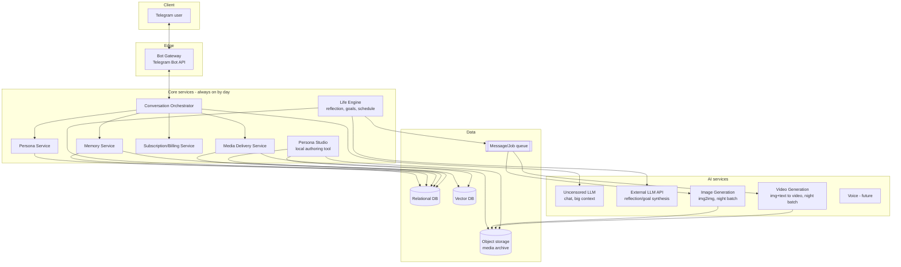
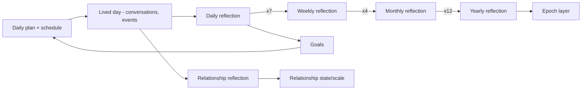
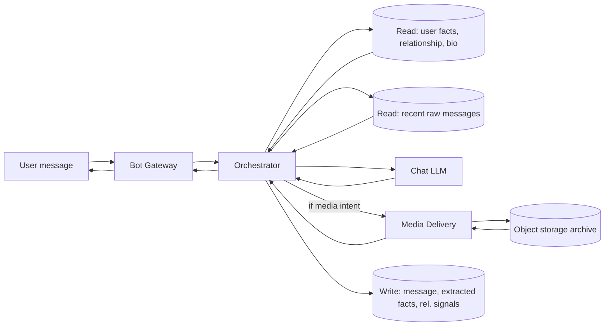
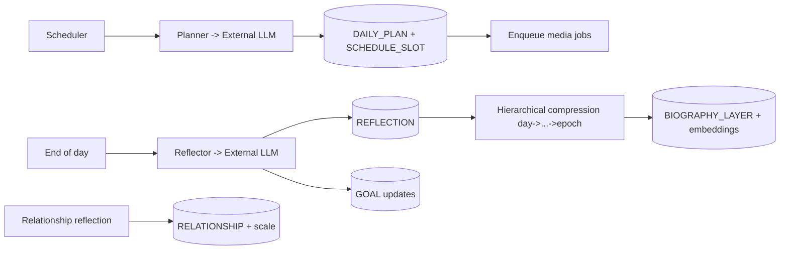
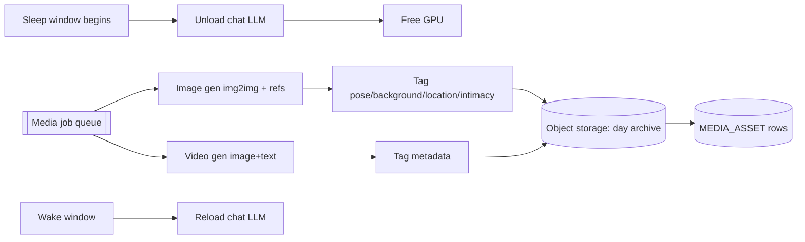

# Architecture — NeuroLady

This document describes the architecture of NeuroLady on six levels:

1. **Interface (UX)** — how the product looks and behaves for the end user (Telegram).
2. **API** — how the backend is exposed.
3. **Services** — the backend services, their logic and internal architecture.
4. **AI services** — the models, prompts, and everything that can change or be trained.
5. **Data** — entity-relationship model (ERD) and data-flow diagrams (DFD).
6. **Infrastructure** — deployment, runtime, CI/CD.

The guiding principles: **modularity** (text, image, and video concerns live in clearly
separated modules and directories), **persona-agnostic core** ("Alina" is just one instance of a
configurable persona), **hyper-realism** (per `user_metrics.md` and `Project Concept.md`), and
**self-hosted** heavy models with a day/night compute schedule.

> Terminology: **Alina** is used throughout as the running example of a *persona*. A persona is
> not hard-coded — the platform can create and run many personas from configuration.

---

## 0. System overview



**Day/night compute model:** during the persona's "awake" hours the always-on **chat LLM** is
served for real-time conversation. During "sleep" hours the chat LLM is unloaded and the GPU is
handed to the **image/video generation** batch jobs that pre-produce the next day's media archive
according to the persona's schedule. This is orchestrated by the Life Engine + job queue (see §3,
§6).

---

## 1. Interface (UX) — Telegram

The end-user product is a **Telegram bot**. Design goal: extremely simple, intuitive, button-
driven; the user should barely need to type commands — inline/reply keyboards do the navigation.

### 1.1 Screens & flow

```mermaid
flowchart TD
    START[/start] --> WELCOME[Welcome message + brand intro]
    WELCOME --> GALLERY[Persona gallery: choose a woman]
    GALLERY --> INTRO[Selected persona sends a video-note<br/>Telegram 'circle' intro]
    INTRO --> CHAT[Conversation screen]
    CHAT -->|inline keyboard| ACTIONS{In-chat actions}
    ACTIONS -->|Ask for photo| PHOTO[Media Delivery -> photo]
    ACTIONS -->|Ask for video| VIDEO[Media Delivery -> video]
    ACTIONS -->|Switch woman| GALLERY
    ACTIONS -->|Main menu| MENU[Main menu]
    MENU -->|Subscription| SUBS[Subscription status / upgrade]
    MENU -->|Switch persona| GALLERY
    MENU -->|Resume chat| CHAT
    CHAT -->|End chat| MENU
```

### 1.2 UX building blocks
- **Welcome message:** short brand greeting ("Привет, это NeuroLady…") + a call to choose a
  companion.
- **Persona gallery:** an inline keyboard / carousel of available women (avatar + name + one-line
  teaser). Selecting one is a callback query.
- **Video-note intro:** on selection, the persona sends a Telegram **video note (circle)** as her
  intro — a first hit of "she's a real person."
- **Conversation screen:** the default state. The user just types; she replies. Rich media
  (photos, videos, video notes, voice later) are sent inline.
- **Keyboards — two kinds, used by situation:**
  - **Reply keyboard** (replaces the typing keyboard) for persistent, session-level operations:
    `⬅️ Main menu`, `🔚 End chat`.
  - **Inline keyboard** (attached to a message) for in-context actions: `🔄 Switch woman`,
    `📸 Ask for a photo`, `💳 Subscription`, etc.
- **Main menu:** end the current chat and return here to check subscription, switch persona, or
  resume. Simple, few options, always reachable.
- **Subscription screen:** current tier, what's unlocked, upgrade CTA (ties into Billing, §3).

> Screenshots to be supplied by the product owner; this section is the behavioral spec the bot
> must implement. Actual keyboard layouts are refined per-screen during feature work
> (`developer files/features/`).

### 1.3 UX principles
- Minimize free-text commands; prefer taps.
- Every screen has an obvious way back to the main menu.
- Media requests are one tap and feel instant (media is pre-generated — see §4.3).
- The persona never breaks character in UI copy that "belongs" to her (her messages), while
  system/menu copy is neutral brand voice.

---

## 2. API

Two API surfaces:

### 2.1 External ingress — Telegram
- The **Bot Gateway** receives updates from the Telegram Bot API via **webhook** (preferred in
  prod) or long-polling (dev). It is a thin translation layer: Telegram update → internal command
  → Orchestrator; internal response → Telegram send call.
- No business logic in the gateway; it authenticates the webhook, validates/normalizes updates,
  and applies rate limiting.

### 2.2 Internal API — service-to-service
Services talk over a well-defined internal API (HTTP/REST or gRPC; async work via the queue).
Representative endpoints (illustrative, not exhaustive — finalized per feature):

**Conversation Orchestrator**
- `POST /conversation/message` — inbound user message → returns persona reply (text and/or media
  refs).
- `POST /conversation/session/start` — begin/resume a session for (user, persona).
- `POST /conversation/session/end` — end session, return to menu state.

**Persona Service**
- `GET /persona` / `GET /persona/{id}` — list / fetch persona metadata (name, avatar, teaser,
  intro video-note ref, status).
- `POST /persona` — create a persona (used by Persona Studio, §4.4).
- `GET /persona/{id}/biography?scope=childhood|youth|current|year|month|week|day` — layered bio.

**Memory Service**
- `POST /memory/user-fact` — store a categorized fact the user revealed.
- `POST /memory/query` — retrieve relevant context (semantic + structured) for a reply.
- `GET /memory/relationship/{userId}/{personaId}` — relationship state/summary.

**Life Engine**
- `POST /life/plan/day` — generate today's plan for a persona.
- `POST /life/reflect` — trigger a reflection (day/week/month/…); internal/scheduled.
- `GET /life/schedule/{personaId}?date=` — the persona's schedule for a day (drives media).

**Media Delivery Service**
- `POST /media/request` — `{userId, personaId, type: photo|video, intimate: bool}` → returns a
  media item consistent with the persona's *current* schedule slot, plus its metadata (pose,
  background, location) for sexting continuity.
- `GET /media/archive/{personaId}?date=` — list the day's pre-generated archive (internal).

**Subscription/Billing**
- `GET /subscription/{userId}` — tier & entitlements.
- `POST /subscription/checkout` — start an upgrade.
- webhook `POST /billing/callback` — payment provider callback.

### 2.3 Cross-cutting API concerns
- **AuthN/Z:** internal mTLS or signed service tokens; per-user entitlement checks on gated
  actions (intimate media requires an adult-verified, entitled user).
- **Idempotency:** message and media-request endpoints accept an idempotency key (double-tap
  safe).
- **Contracts:** every endpoint has a versioned schema; contract tests live in `tests/` (see the
  TDD guide).

---

## 3. Services (logic & architecture)

All services are **modular and independently deployable**. Text, image, and video concerns are
separated at the service *and* directory level.

### 3.1 Bot Gateway
- Telegram I/O only (webhook intake, send API, keyboards, video notes).
- Stateless; scales horizontally.

### 3.2 Conversation Orchestrator (the heart of chat)
Owns a single user turn end-to-end:
1. Receive normalized user message.
2. Load session + relationship state (Memory).
3. **Assemble the LLM context** (this is critical, see §4.2): persona system prompt + relevant
   biography layers + retrieved user facts + relationship summary + **the recent raw message
   history (several last messages of the live conversation)**.
4. Call the **chat LLM** (§4.1).
5. Post-process (safety/consistency checks, media-intent detection).
6. If the user asked for media, call **Media Delivery**; otherwise return text.
7. Persist the exchange (Memory) and update relationship signals.
- Handles media-intent detection ("send me a pic") and routes to Media Delivery with the intimate
  flag + entitlement check.

### 3.3 Persona Service
- Source of truth for persona definitions: identity, layered biography, appearance references,
  intro video-note, voice (future), tunable communication settings.
- Serves biography *layers* (see §4.5) and persona metadata to the Orchestrator and the gallery.
- Backed by relational DB (structured) + vector DB (semantic biography) + object storage
  (reference images, intro note).

### 3.4 Memory Service
- **Structured memory (SQL):** categorized user facts (e.g. `family`, `work`, `preferences`,
  `complaints`), relationship state, session logs.
- **Semantic memory (Vector DB):** embeddings of user statements and of persona biography, for
  "she remembers what you said months ago" retrieval.
- Provides `query` that fuses structured + semantic recall into the context bundle for a reply.
- Categorization pipeline: incoming user messages are classified and salient facts extracted &
  stored (so context can be re-injected later).

### 3.5 Life Engine (persona "living" — highest-value subsystem)
Runs the persona's simulated life on a schedule. Components:
- **Planner:** at a set time (e.g. early morning) sends a system prompt to the reflection LLM
  ("You are Alina, characteristics …, plan your day") → produces a **daily plan** + **schedule**
  (time slots with location/activity), stored in SQL. The schedule drives media generation.
- **Reflector:** at end of day, prompts the LLM to **reflect** on the day given today's plan +
  events + prior lore → stores a **daily reflection**. Reflections **compress hierarchically**:
  7 daily → 1 weekly; ~4 weekly → 1 monthly; 12 monthly → 1 yearly; years → **epochs**
  (childhood, youth, current era). This is the biography's time pyramid (§4.5).
- **Goal system:** the persona maintains **goals**; reflections and planning move her toward them,
  so she isn't only reactive — she has direction. Goals are stored, revisited, and updated.
- **Relationship reflection:** per (user, persona), periodic reflection on how the relationship is
  developing, updating a **relationship state/scale** (see §4.6) that colors future replies.
- Emits jobs to the queue (e.g. "generate tomorrow's media for schedule X").



### 3.6 Media Delivery Service
- Serves pre-generated media matching the persona's **current schedule slot** (gym selfie during
  the gym slot, office selfie during the office slot, etc.).
- Enforces entitlement + adult verification for intimate content.
- Returns the media **plus its metadata** (pose, background, location, intimacy level) so the
  Orchestrator/LLM can **sext consistently** ("knows what she sent").
- Never generates on the hot path — only reads the day's archive from object storage.

### 3.7 Subscription/Billing Service
- Tiers/entitlements, payment provider integration, gating (esp. intimate media).

### 3.8 Persona Studio (local authoring tool)
- A local interface to **create and assemble personas** (see §4.4): questionnaire-driven bio
  authoring, reference-image upload for appearance consistency, artifact assembly, and one-click
  publish so the new woman appears in the bot's gallery.

### 3.9 Media generation services (batch, night)
- **Image Generation Service** and **Video Generation Service** are separate modules, each with
  its own prompts, models, and directory. They consume jobs from the queue during sleep hours and
  write archives to object storage (details in §4.3).

---

## 4. AI services (models, prompts, trainable/changeable parts)

Everything here is designed to **change, be tuned, or be swapped**. Prompts are versioned assets
stored per-module, never inlined ad hoc.

### 4.1 Chat LLM (real-time conversation)
- **Uncensored, high-capacity model** (e.g. a larger Qwen-class model) chosen for **large context
  window** and natural, adequate conversation.
- Self-hosted; **loaded during awake hours**, unloaded at night to free GPU for media.
- Configurable decoding (temperature, etc.) exposed as persona/communication settings.

### 4.2 Context assembly (critical)
For each reply the Orchestrator builds the prompt from:
- **Persona system prompt** (identity, current-era characteristics, communication style,
  today's plan/mood).
- **Biography layers** relevant to the query (semantic retrieval from vector DB — e.g. protests
  she "attended" → she can answer).
- **User memory:** categorized structured facts + semantically retrieved past statements.
- **Relationship state** summary.
- **Recent raw conversation history — several of the latest messages passed through as-is** (a
  hard requirement: the live dialogue must be in-context, not only summarized).
- Assembled to fit the model's context budget with a clear priority order.

### 4.3 Image & video generation (night batch, self-hosted)
- **Images:** **img2img** from the persona's **reference images** to keep appearance consistent.
  For each schedule slot, generate a set of **SFW** shots (selfie at gym, photo at office, …) and
  a set of **intimate** shots, per the day's schedule → an archive.
- **Video:** **image + text description → video**; fewer than photos, but ideally one per schedule
  slot/location; mostly intimate at varying intensity.
- Each generated asset is stored **with metadata** (slot, location, pose, background, intimacy
  level) so Media Delivery can serve context-appropriate media and support sexting continuity.
- Prompts, model choices, and pipelines live **inside the respective module's directory**
  (`image/prompts/…`, `video/prompts/…`). Model selection is a research task with existing
  candidates; the interface is fixed so models can be swapped.

### 4.4 Persona construction (template + questionnaire + assembly)
- A **biography template** defines the schema of a persona (identity, epochs, appearance refs,
  goals seed, communication settings, voice later).
- **Persona Studio** turns the template into a **questionnaire-style authoring UI**: fill in the
  story, upload appearance references (used by img2img), and the tool **auto-assembles** the
  artifacts into the right places (SQL rows, vector embeddings, reference images in object
  storage) and **publishes** the persona into the Telegram bot gallery.
- Goal: maximally flexible, no-code persona creation, runnable locally first.

### 4.5 Biography as a time pyramid (persona memory of *herself*)
- Layers from coarse to fine: **epochs** (childhood/youth/current) → **years** → **months** →
  **weeks** → **days**. Fine layers are generated live (plan + reflection) and **compressed
  upward** over time (§3.5). This gives a consistent, evolving, queryable life story.

### 4.6 Reflection & goal prompts (external LLM)
- **Planning, reflection, goal synthesis, and relationship reflection** are generated by calling
  an **external LLM API** (e.g. ChatGPT) with a system prompt describing the persona + prior lore
  + the day's plan/events. Outputs are stored as the reflections/goals/relationship updates above.
- The **relationship scale** (a designed metric — e.g. trust/closeness dimensions with events
  that move them) is proposed and maintained here; exact scale is a design deliverable, kept
  configurable.
- All these prompts are versioned assets under the Life Engine's prompt directory.

### 4.7 Voice (future)
- A voice module can be added later behind the same modular boundary (persona voice profile →
  TTS/voice cloning). Out of scope for the first build, but the architecture leaves room.

### 4.8 Prompt & model management
- Prompts are first-class, **versioned** files organized **per module** (chat, image, video,
  life/reflection). No prompt is hard-coded in service logic.
- Models are pluggable behind service interfaces so any model can be researched/swapped without
  touching callers.

---

## 5. Data

Primarily **relational (SQL)** for structured state, **vector DB** for semantic recall, and
**object storage** for media.

### 5.1 Entity-Relationship Diagram (ERD)

```mermaid
erDiagram
    USER ||--o{ SESSION : has
    PERSONA ||--o{ SESSION : hosts
    USER ||--o{ USER_FACT : reveals
    USER ||--o{ SUBSCRIPTION : holds
    SESSION ||--o{ MESSAGE : contains
    PERSONA ||--o{ BIOGRAPHY_LAYER : has
    PERSONA ||--o{ DAILY_PLAN : has
    PERSONA ||--o{ REFLECTION : has
    PERSONA ||--o{ GOAL : pursues
    PERSONA ||--o{ SCHEDULE_SLOT : has
    PERSONA ||--o{ MEDIA_ASSET : owns
    SCHEDULE_SLOT ||--o{ MEDIA_ASSET : "produces context for"
    USER ||--o{ RELATIONSHIP : in
    PERSONA ||--o{ RELATIONSHIP : in
    RELATIONSHIP ||--o{ RELATIONSHIP_REFLECTION : logs

    USER {
        id PK
        telegram_id
        locale
        adult_verified
        created_at
    }
    PERSONA {
        id PK
        name
        status
        avatar_ref
        intro_videonote_ref
        comm_settings_json
        created_at
    }
    SESSION {
        id PK
        user_id FK
        persona_id FK
        state
        started_at
        ended_at
    }
    MESSAGE {
        id PK
        session_id FK
        sender  "user|persona"
        text
        media_asset_id FK "nullable"
        created_at
    }
    USER_FACT {
        id PK
        user_id FK
        category "family|work|preferences|complaints|..."
        content
        embedding_ref "vector DB"
        created_at
    }
    BIOGRAPHY_LAYER {
        id PK
        persona_id FK
        scope "epoch|year|month|week|day"
        period_key
        content
        embedding_ref "vector DB"
    }
    DAILY_PLAN {
        id PK
        persona_id FK
        date
        plan_text
    }
    SCHEDULE_SLOT {
        id PK
        persona_id FK
        date
        start_time
        end_time
        location
        activity
    }
    REFLECTION {
        id PK
        persona_id FK
        scope "day|week|month|year"
        period_key
        content
    }
    GOAL {
        id PK
        persona_id FK
        description
        status
        priority
        updated_at
    }
    RELATIONSHIP {
        id PK
        user_id FK
        persona_id FK
        scale_json "trust/closeness/..."
        summary
        updated_at
    }
    RELATIONSHIP_REFLECTION {
        id PK
        relationship_id FK
        period_key
        content
    }
    MEDIA_ASSET {
        id PK
        persona_id FK
        schedule_slot_id FK "nullable"
        kind "photo|video|videonote"
        intimate  bool
        intimacy_level
        storage_ref "object storage"
        meta_json "pose|background|location"
        created_at
    }
    SUBSCRIPTION {
        id PK
        user_id FK
        tier
        entitlements_json
        status
        renews_at
    }
```

- **Vector DB** stores embeddings referenced by `USER_FACT.embedding_ref` and
  `BIOGRAPHY_LAYER.embedding_ref` for semantic retrieval.
- **Object storage** holds the actual media binaries referenced by `MEDIA_ASSET.storage_ref`
  (and persona reference images / intro notes).

### 5.2 Data-Flow Diagrams (DFD)

**DFD-1 — Conversation turn (real-time, day):**


**DFD-2 — Life cycle (scheduled):**


**DFD-3 — Night media generation:**


---

## 6. Infrastructure (deploy, run, CI/CD)

### 6.1 Runtime & topology
- **Self-hosted GPU server(s)** host the heavy models (chat LLM, image, video). Core services
  (gateway, orchestrator, persona, memory, life, media, billing) run as containers.
- **Containerized** (Docker) services; orchestrated with **docker-compose** for the local/single-
  server setup first, with a clear path to **Kubernetes** for scale-out.
- **Day/night GPU scheduler** (the decisive infra piece): a scheduler (cron/systemd timers +
  queue) that, at sleep time, drains chat traffic, **unloads the chat LLM**, and starts the
  **image/video batch workers**; at wake time reverses it. Media jobs are queued so the night
  window processes the next day's archive.

### 6.2 Data stores
- **Relational DB** (e.g. PostgreSQL) for structured entities (§5.1).
- **Vector DB** (e.g. pgvector/Qdrant-class) for embeddings.
- **Object storage** (e.g. S3-compatible/MinIO self-hosted) for media archives + references.
- **Queue** (e.g. Redis/RabbitMQ-class) for media jobs and async work.

### 6.3 Repository & module layout (modularity on disk)
Text, image, and video each live in their own top-level module, with their **own prompts**:
```
services/
  bot_gateway/
  orchestrator/
  persona/
  memory/
  life_engine/         # planning, reflection, goals, relationship + prompts/
  media_delivery/
  billing/
image/                 # image generation module
  prompts/
  models/
video/                 # video generation module
  prompts/
  models/
chat/                  # chat LLM serving + prompts/
persona_studio/        # local persona authoring interface
infra/                 # compose/k8s, schedulers, CI/CD
tests/                 # runnable tests (gates merges) - see TDD guide
```
(Exact names finalized during implementation; the principle is strict separation of text/image/
video and per-module prompt storage.)

### 6.4 CI/CD
- **CI:** on every push/PR — lint, unit + integration tests, contract tests; build images.
- **Merge gate:** a feature branch merges to `master` **only after all tests in `tests/` pass**
  (per `CLAUDE.md`).
- **CD:** on merge to `master` — build & publish images, run migrations, deploy to the server;
  media/GPU workers deployed with the day/night scheduler config.
- **Environments:** local (compose, single GPU) → staging → production.
- **Observability:** logs/metrics/traces per service; GPU/queue depth dashboards for the night
  batch; alerting on failed reflections or empty media archives (a persona must never wake up
  with no media for the day).

### 6.5 Security, privacy, compliance
- Adult verification + entitlement gating for intimate media; jurisdiction rules honored.
- Encrypted secrets, least-privilege service tokens, encrypted media at rest.
- Per-user data export/delete to satisfy privacy expectations (and the academic/ethics framing in
  `Project Concept.md`).

---

## 7. Modularity summary (why this shape)
- **Persona-agnostic core:** all persona specifics come from config/data; the engine runs any
  number of personas (supports the B2B "engine" audience in `Audience.md`).
- **Separated media modules:** image and video are independent, swappable, night-batch services
  with their own prompts/models.
- **Life Engine is the differentiator:** the plan → reflect → compress → goals → relationship loop
  is where hyper-real "aliveness" is produced; it gets the most design attention.
- **Prompts & models are assets, not code:** versioned, per-module, swappable — everything that
  "can change or be trained" is isolated in the AI-services layer.
