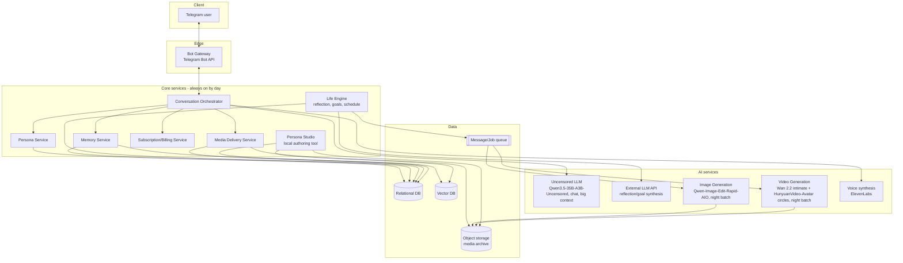
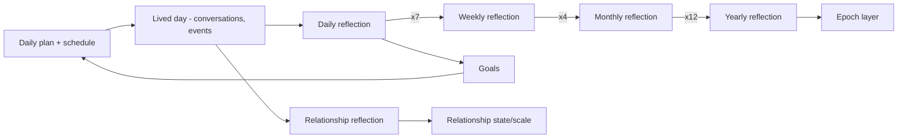
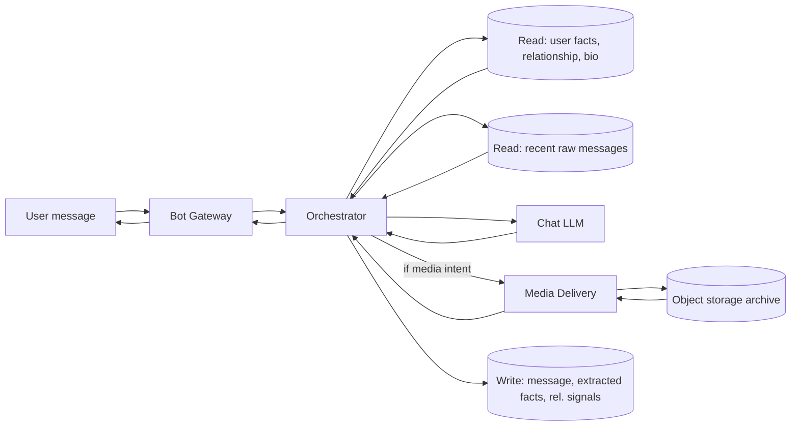
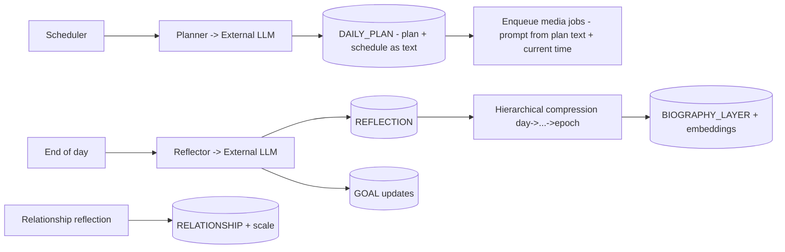
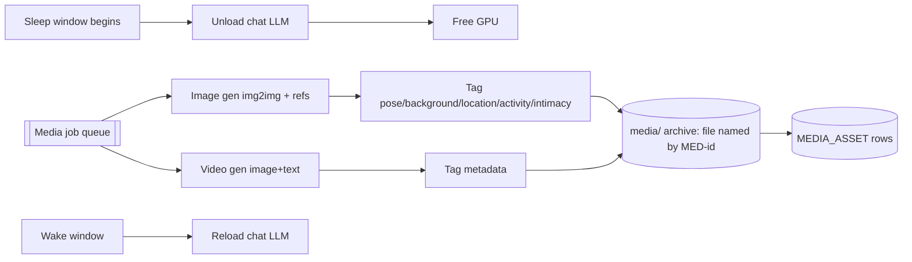

# Architecture — NeuroLady

This document describes the architecture of NeuroLady on six levels:

1. **Interface (UX)** — how the product looks and behaves for the end user (Telegram).
2. **API** — how the backend is exposed.
3. **Services** — the backend services, their logic and internal architecture.
4. **AI services** — the models, prompts, and everything that can change or be trained.
5. **Data** — entity-relationship model (ERD) and data-flow diagrams (DFD).
6. **Infrastructure** — deployment, runtime, CI/CD.

The guiding principles: **modularity** (text, image, and video concerns live in clearly
separated modules and directories), **persona-agnostic core** ("Alina" is just one instance of a
configurable persona), **hyper-realism** (per `user_metrics.md` and `Project Concept.md`), and
**self-hosted** heavy models with a day/night compute schedule.

> Terminology: **Alina** is used throughout as the running example of a *persona* — concretely, a
> Moscow-based psychologist and fitness enthusiast. A persona is not hard-coded — the platform can
> create and run many personas from configuration. The initial roster is **10 personas: 5
> Russian-speaking and 5 English-speaking**.

---

## The Pygmalion Framework (conceptual model)

The engine is packaged as a framework called **Pygmalion** (intended to be open-sourced — see
§8 Roadmap). It organizes each persona into three conceptual components, which map onto the
services described below:

- **Digital Persona** — *who she is.* A **dynamic daily prompt** assembled from:
  - **Fixed elements:** name, core values, **Big Five personality traits**.
  - **Variable elements:** age, interests, goals.
  - **Biographical context layers:** history summaries + current-period detail.
  - **Future projections:** weekly through lifetime scenarios.
  - → realized by the **Persona Service** + **Life Engine** (§3.3, §3.5) and the biography
    time-pyramid (§4.5).
- **Digital Human** — *how she manifests.* Text generation with style-tuning, **voice
  synthesis**, **consistent imagery**, and **talking-head video**.
  - → realized by the Chat LLM (Qwen3.5-35B-A3B-Uncensored), Voice (ElevenLabs), Image
    (Qwen-Image-Edit-Rapid-AIO), and Video (Wan 2.2 + HunyuanVideo-Avatar) AI services (§4).
- **Digital Self** — *what she remembers.* **Vector storage (Qdrant)** of daily events and
  conversation histories enabling hyper-personalization.
  - → realized by the Memory Service semantic store (§3.4) + the reflection pyramid (§3.5).

---

## 0. System overview



**Day/night compute model:** during the persona's "awake" hours the always-on **chat LLM** is
served for real-time conversation. During "sleep" hours the chat LLM is unloaded and the GPU is
handed to the **image/video generation** batch jobs that pre-produce the next day's media archive
according to the persona's schedule. This is orchestrated by the Life Engine + job queue (see §3,
§6).

---

## 1. Interface (UX) — Telegram

The end-user product is a **Telegram bot**. Design goal: extremely simple, intuitive, button-
driven; the user should barely need to type commands — inline/reply keyboards do the navigation.

### 1.1 Screens & flow

```mermaid
flowchart TD
    START[/start] --> WELCOME[Welcome screen: header 'NeuroLady AI'<br/>+ flirty welcome copy + 'Start' inline button]
    WELCOME -->|tap Start| GALLERY[Choose Lady: intro message +<br/>persona card carousel]
    GALLERY -->|◀ / ▶ paginate '1/6'| GALLERY
    GALLERY -->|tap 'Start Chat'| INTRO[Selected persona sends a video-note<br/>Telegram 'circle' intro]
    INTRO --> CHAT[Conversation screen]
    CHAT -->|reply keyboard '💋 Choose Lady'| GALLERY
    CHAT -->|reply keyboard menu ≡| MENU[Main menu]
    CHAT -->|ask for photo/video| MEDIA[Media Delivery -> photo/video]
    MENU -->|Subscription| SUBS[Subscription status / upgrade]
    MENU -->|Choose Lady| GALLERY
    MENU -->|Resume chat| CHAT
```

### 1.2 UX building blocks
> Grounded in the reference design (Figma "🧠 AIT"). Copy is English/adult-flirty in tone; the
> Russian-language personas use equivalent Russian copy.

- **Header:** standard Telegram chat header — `‹ Chats` back link, title **"NeuroLady AI"**, and
  the persona/brand avatar (top-right).
- **Welcome screen (Start):** a flirty welcome message (e.g. "Step into a realm of pleasure and
  desire… Select the woman who captivates you… Tap **Start** to dive in!") followed by a single
  full-width **`Start`** inline button.
- **Choose Lady (persona gallery) — a paginated card carousel:**
  - An intro message ("Choose the lady you'd like to chat with… Each one is unique…").
  - A **persona card** per view: large **photo**, then **Name**, **Profession**, **Age**, and a
    first-person **Description** teaser (e.g. Olivia, Psychologist, 30).
  - **Pagination controls**: `◀` / `▶` with a `1/6`-style position counter to browse personas
    (one card per view).
  - A **`Start Chat`** inline button under the card to begin talking to the shown persona.
- **Video-note intro:** on **Start Chat**, the persona sends a Telegram **video note (circle)** as
  her intro — a first hit of "she's a real person."
- **Daily video circles:** subscribers receive **proactive daily video notes** of the persona
  sharing stories from her day (a recurring "she's alive" touchpoint, not just the intro). These
  are talking-head circles driven by the schedule/Life Engine (§4.3, §3.5).
- **Conversation screen:** the default state. The user just types; she replies. Replies can be
  **text or personalized voice messages** (voice synthesis, §4.7), and rich media (photos,
  videos, video notes) is sent inline.
- **Free vs paid:** **5 free messages per day**; beyond that, and for erotic photo/video access,
  the user needs a subscription (metered by Billing, §3.7). Photo access can be bought separately
  (daily/weekly/monthly) or via a tier.
- **Keyboards — two kinds, used by situation:**
  - **Reply keyboard** (replaces the typing keyboard) for persistent, session-level operations,
    per the design: a **`💋 Choose Lady`** button (return to persona selection) and a **menu (≡)**
    button; add `Subscription` / `End chat` as needed.
  - **Inline keyboard** (attached to a message) for in-context actions: `Start`, `◀`/`▶`,
    `Start Chat`, and in-chat `📸 photo` / `💳 Subscription`.
- **Main menu:** reachable from the reply-keyboard menu; check subscription, choose another lady,
  or resume. Simple, few options, always reachable.
- **Subscription screen:** current tier, what's unlocked, upgrade CTA (ties into Billing, §3).

> Reference design: Figma "🧠 AIT". This section is the behavioral spec the bot must implement;
> exact copy and keyboard layouts are refined per-screen during feature work
> (`developer files/features/`).

### 1.3 UX principles
- Minimize free-text commands; prefer taps.
- Every screen has an obvious way back to the main menu.
- Media requests are one tap and feel instant (media is pre-generated — see §4.3).
- The persona never breaks character in UI copy that "belongs" to her (her messages), while
  system/menu copy is neutral brand voice.

---

## 2. API

Two API surfaces:

### 2.1 External ingress — Telegram
- The **Bot Gateway** receives updates from the Telegram Bot API via **webhook** (preferred in
  prod) or long-polling (dev). It is a thin translation layer: Telegram update → internal command
  → Orchestrator; internal response → Telegram send call.
- No business logic in the gateway; it authenticates the webhook, validates/normalizes updates,
  and applies rate limiting.

### 2.2 Internal API — service-to-service
Services talk over a well-defined internal API (HTTP/REST or gRPC; async work via the queue).
Representative endpoints (illustrative, not exhaustive — finalized per feature):

**Conversation Orchestrator**
- `POST /conversation/message` — inbound user message → returns persona reply (text and/or media
  refs).
- `POST /conversation/session/start` — begin/resume a session for (user, persona).
- `POST /conversation/session/end` — end session, return to menu state.

**Persona Service**
- `GET /persona` / `GET /persona/{id}` — list / fetch persona metadata (name, avatar, teaser,
  intro video-note ref, status).
- `POST /persona` — create a persona (used by Persona Studio, §4.4).
- `GET /persona/{id}/biography?scope=childhood|youth|current|year|month|week|day` — layered bio.

**Memory Service**
- `POST /memory/user-fact` — store a categorized fact the user revealed.
- `POST /memory/query` — retrieve relevant context (semantic + structured) for a reply.
- `GET /memory/relationship/{userId}/{personaId}` — relationship state/summary.

**Life Engine**
- `POST /life/plan/day` — generate today's plan for a persona.
- `POST /life/reflect` — trigger a reflection (day/week/month/…); internal/scheduled.
- `GET /life/plan/{personaId}?date=` — the persona's day plan (schedule as free text; drives media).

**Media Delivery Service**
- `POST /media/request` — `{userId, personaId, type: photo|video, intimate: bool}` → returns a
  media item consistent with the persona's *current activity* (derived from her day plan + current
  time), plus its metadata (pose, background, location, activity) for sexting continuity.
- `GET /media/archive/{personaId}?date=` — list the day's pre-generated archive (internal).

**Subscription/Billing**
- `GET /subscription/{userId}` — tier & entitlements.
- `POST /subscription/checkout` — start an upgrade.
- webhook `POST /billing/callback` — payment provider callback.

### 2.3 Cross-cutting API concerns
- **AuthN/Z:** internal mTLS or signed service tokens; per-user entitlement checks on gated
  actions (intimate media requires an adult-verified, entitled user).
- **Idempotency:** message and media-request endpoints accept an idempotency key (double-tap
  safe).
- **Contracts:** every endpoint has a versioned schema; contract tests live in `tests/` (see the
  TDD guide).

---

## 3. Services (logic & architecture)

All services are **modular and independently deployable**. Text, image, and video concerns are
separated at the service *and* directory level.

### 3.1 Bot Gateway
- Telegram I/O only (webhook intake, send API, keyboards, video notes).
- Stateless; scales horizontally.

### 3.2 Conversation Orchestrator (the heart of chat)
Owns a single user turn end-to-end:
1. Receive normalized user message.
2. Load session + relationship state (Memory).
3. **Assemble the LLM context** (this is critical, see §4.2): persona system prompt + relevant
   biography layers + retrieved user facts + relationship summary + **the recent raw message
   history (several last messages of the live conversation)**.
4. Call the **chat LLM** (§4.1).
5. Post-process (safety/consistency checks, media-intent detection).
6. If the user asked for media, call **Media Delivery**; otherwise return text.
7. Persist the exchange (Memory) and update relationship signals.
- Handles media-intent detection ("send me a pic") and routes to Media Delivery with the intimate
  flag + entitlement check.

### 3.3 Persona Service
- Source of truth for persona definitions: identity (name, core values, **Big Five personality
  traits**), variable traits (age, interests, goals), layered biography, appearance references,
  intro video-note, **voice profile**, tunable communication settings.
- Manages the **roster of 10 personas (5 Russian-speaking + 5 English-speaking)**; `locale`/
  language is part of persona metadata and drives the gallery and prompts.
- Provides the **gallery card** data used by the "Choose Lady" carousel: name, profession, age,
  first-person description teaser, and gallery photo (per the reference design).
- Serves biography *layers* (see §4.5) and persona metadata to the Orchestrator and the gallery.
- Backed by relational DB (structured) + vector DB — **Qdrant** (semantic biography) + object
  storage (reference images, intro note).

### 3.4 Memory Service
- **Structured memory (SQL):** categorized user facts (e.g. `family`, `work`, `preferences`,
  `complaints`), relationship state, session logs.
- **Semantic memory (Vector DB):** embeddings of user statements and of persona biography, for
  "she remembers what you said months ago" retrieval.
- Provides `query` that fuses structured + semantic recall into the context bundle for a reply.
- Categorization pipeline: incoming user messages are classified and salient facts extracted &
  stored (so context can be re-injected later).

### 3.5 Life Engine (persona "living" — highest-value subsystem)
Runs the persona's simulated life on a schedule. Components:
- **Planner:** at a set time (e.g. early morning) sends a system prompt to the reflection LLM
  ("You are Alina, characteristics …, plan your day") → produces a **daily plan with a schedule
  written as free text** (activities across the day with rough times/locations), stored in
  `DAILY_PLAN.plan_text`. There is **no structured slot table**: when media is generated, the
  external LLM is handed this schedule text + the persona's **current time** (from
  `PERSONA.timezone`) and asked to write a generation prompt for the setting matching her current
  activity (§4.3).
- **Reflector:** at end of day, prompts the LLM to **reflect** on the day given today's plan +
  events + prior lore → stores a **daily reflection**. Reflections **compress hierarchically**:
  7 daily → 1 weekly; ~4 weekly → 1 monthly; 12 monthly → 1 yearly; years → **epochs**
  (childhood, youth, current era). This is the biography's time pyramid (§4.5).
- **Goal system:** the persona maintains **goals**; reflections and planning move her toward them,
  so she isn't only reactive — she has direction. Goals are stored, revisited, and updated.
- **Relationship reflection:** per (user, persona), periodic reflection on how the relationship is
  developing, updating a **relationship state/scale** (see §4.6) that colors future replies.
- Emits jobs to the queue (e.g. "generate tomorrow's media from the day plan") and schedules the
  **proactive daily video circle** (a talking-head "story from her day" pushed to users).



### 3.6 Media Delivery Service
- Serves pre-generated media matching the persona's **current activity**, derived from the current
  time (per `PERSONA.timezone`) against the `DAILY_PLAN.plan_text` schedule (gym selfie around her
  gym time, office selfie during work, etc.).
- Enforces **adult verification** for intimate content.
- Returns the media **plus its metadata** (pose, background, location, intimacy level) so the
  Orchestrator/LLM can **sext consistently** ("knows what she sent").
- Never generates on the hot path — only reads the day's archive from object storage.

### 3.7 Subscription/Billing Service (deferred — not in current scope)
> **Monetization is parked for now.** There are no subscription/usage tables in §5.1 and nothing
> here is being built yet. This subsection is kept as the intended *future* design so it isn't lost.
- **Free-message metering:** enforces **5 free messages/day** per user (per persona), resetting
  daily; beyond the quota requires a subscription.
- **Photo/video access:** erotic photo access sold as **daily / weekly / monthly** subscriptions,
  purchasable separately or bundled into a tier.
- Payment provider integration; entitlement checks; gating of intimate media (with adult
  verification, §6.5).

### 3.8 Persona Studio (local authoring tool)
- A local interface to **create and assemble personas** (see §4.4): questionnaire-driven bio
  authoring, reference-image upload for appearance consistency, artifact assembly, and one-click
  publish so the new woman appears in the bot's gallery.

### 3.9 Media generation services (batch, night)
- **Image Generation Service** and **Video Generation Service** are separate modules, each with
  its own prompts, models, and directory. They consume jobs from the queue during sleep hours and
  write archives to object storage (details in §4.3).

---

## 4. AI services (models, prompts, trainable/changeable parts)

Everything here is designed to **change, be tuned, or be swapped**. Prompts are versioned assets
stored per-module, never inlined ad hoc.

### 4.1 Chat LLM (real-time conversation)
- **Selected model:** **`Qwen3.5-35B-A3B-Uncensored` (HauhauCS "Aggressive" variant)** — an
  uncensored MoE model with **35B total / ~3B active** parameters (cheap to serve, large-model
  quality), a **262K native context** (extendable to 1M via YaRN), reported **0/465 refusals**,
  under **Apache 2.0**. The large context comfortably fits the §4.2 bundle (persona prompt +
  biography layers + user memory + relationship state + recent raw messages).
- **Why this over the earlier candidates:** it supersedes the previously-listed Llama 3.1 /
  Wizard-Vicuna class candidates — newer, uncensored out of the box, MoE-efficient for the
  day/night self-hosted schedule, and permissively licensed.
- Served **self-hosted** at an FP8/quantized precision sized to the GPU (the repo ships
  quantizations from ~11 GB IQ2 up to ~69 GB BF16). Loaded during awake hours, unloaded at night
  to free the GPU for media (§6.1).
- Style-tuning per persona (voice/register); configurable decoding (temperature, etc.) exposed as
  persona/communication settings. The serving interface is fixed so the model can still be swapped
  after evaluation.
- Style-tuning per persona (voice/register), so text matches the persona's character.
- Self-hosted; **loaded during awake hours**, unloaded at night to free GPU for media.
- Configurable decoding (temperature, etc.) exposed as persona/communication settings.

### 4.2 Context assembly (critical)
For each reply the Orchestrator builds the prompt from:
- **Persona system prompt** (identity, current-era characteristics, communication style,
  today's plan/mood).
- **Biography layers** relevant to the query (semantic retrieval from vector DB — e.g. protests
  she "attended" → she can answer).
- **User memory:** categorized structured facts + semantically retrieved past statements.
- **Relationship state** summary.
- **Recent raw conversation history — several of the latest messages passed through as-is** (a
  hard requirement: the live dialogue must be in-context, not only summarized).
- Assembled to fit the model's context budget with a clear priority order.

### 4.3 Image & video generation (night batch)
All media models are **self-hosted** and accelerated with **LightX2V** — an inference framework
(not a model) that provides 4-step distilled checkpoints + FP8/INT8 quantization for the image and
video models below, so the night batch fits the sleep window on our own GPU.

- **Images — `Qwen-Image-Edit-Rapid-AIO` v23 (NSFW variant):** an All-In-One, distilled +
  FP8-quantized build on top of **Qwen-Image-Edit-2511** (accelerator + VAE + CLIP merged into one
  ~28 GB checkpoint), running at **4–8 steps**. The NSFW branch has community LoRAs (`snofs`,
  `qwen4play`, …) baked in. Conditioned on each persona's **reference images** to keep appearance
  identity-consistent (Qwen-Image-Edit-2511 is tuned specifically for character consistency across
  edits). Guided by the day plan + current time (the external LLM writes the generation prompt for
  her current activity/setting, §3.5), it produces **SFW** shots (gym selfie, office photo, …) and
  **intimate** shots → the day's archive.
- **Video — two separate models for two jobs:**
  - **Intimate / no-speech video → `Wan 2.2` (distilled).** Best-in-class body anatomy and motion
    realism; image+text → video, self-hosted night batch, accelerated by LightX2V's Wan 4-step
    distillation. Ideally one per planned activity/location, at varying intimacy.
  - **Talking-head video circles → `HunyuanVideo-Avatar`.** Drives the intro note and the
    **proactive daily story circles** from a persona image + voice/script. Chosen for its
    audio-driven emotion (Audio Emotion Module) and face-aware audio adapter, giving lifelike
    expression on the "circle" — and it shares the Hunyuan family with our video stack. This
    **replaces the earlier external Hedra candidate**, so all video is now self-hosted.
- Each generated asset is stored **with metadata** (slot, location, pose, background, intimacy
  level) so Media Delivery can serve context-appropriate media and support sexting continuity.
- Prompts, model choices, and pipelines live **inside the respective module's directory**
  (`image/prompts/…`, `video/models/wan22/`, `video/models/hunyuan_avatar/`). The interfaces are
  fixed so models can still be swapped after evaluation.

### 4.4 Persona construction (template + questionnaire + assembly)
- A **biography template** defines the schema of a persona (the Digital Persona of §"Pygmalion
  Framework"): fixed identity (name, core values, **Big Five traits**), variable traits (age,
  interests, goals), **gallery card fields (profession, age, first-person description, photo)**,
  epochs/biographical layers, future projections (weekly→lifetime), appearance references,
  **voice profile**, and communication settings.
- **Persona Studio** turns the template into a **questionnaire-style authoring UI**: fill in the
  story, upload appearance references (used by img2img), and the tool **auto-assembles** the
  artifacts into the right places (SQL rows, vector embeddings, reference images in object
  storage) and **publishes** the persona into the Telegram bot gallery.
- Goal: maximally flexible, no-code persona creation, runnable locally first.

### 4.5 Biography as a time pyramid (persona memory of *herself*)
- Layers from coarse to fine: **epochs** (childhood/youth/current) → **years** → **months** →
  **weeks** → **days**. Fine layers are generated live (plan + reflection) and **compressed
  upward** over time (§3.5). This gives a consistent, evolving, queryable life story.

### 4.6 Reflection & goal prompts (external LLM)
- **Planning, reflection, goal synthesis, and relationship reflection** are generated by calling
  an **external LLM API** (e.g. ChatGPT) with a system prompt describing the persona + prior lore
  + the day's plan/events. Outputs are stored as the reflections/goals/relationship updates above.
- The **relationship scale** (a designed metric — e.g. trust/closeness dimensions with events
  that move them) is proposed and maintained here; exact scale is a design deliverable, kept
  configurable.
- All these prompts are versioned assets under the Life Engine's prompt directory.

### 4.7 Voice (in scope)
- The persona replies with **personalized voice messages** (the first 5 daily messages are free,
  matching the free-message quota). Voice synthesis via **ElevenLabs (11labs)** as the current
  candidate — the **one remaining external/cloud model** in the stack — behind a modular boundary
  so it can be swapped or **self-hosted later** (open-weight candidates for a full-server stack:
  F5-TTS, XTTS-v2, CosyVoice). Whether to bring voice in-house is an open decision.
- Each persona has a **voice profile** (part of the persona definition, §3.3) so her voice is
  consistent and in-character.

### 4.8 Prompt & model management
- Prompts are first-class, **versioned** files organized **per module** (chat, image, video,
  life/reflection). No prompt is hard-coded in service logic.
- Models are pluggable behind service interfaces so any model can be researched/swapped without
  touching callers.

---

## 5. Data

Primarily **relational (SQL)** for structured state, **vector DB** for semantic recall, and
**object storage** for media.

### 5.1 Entity-Relationship Diagram (ERD)

```mermaid
erDiagram
    USER ||--o{ SESSION : has
    PERSONA ||--o{ SESSION : hosts
    USER ||--o{ USER_FACT : reveals
    SESSION ||--o{ MESSAGE : contains
    PERSONA ||--o{ BIOGRAPHY_LAYER : has
    PERSONA ||--o{ DAILY_PLAN : has
    PERSONA ||--o{ REFLECTION : has
    PERSONA ||--o{ GOAL : pursues
    PERSONA ||--o{ MEDIA_ASSET : owns
    USER ||--o{ RELATIONSHIP : in
    PERSONA ||--o{ RELATIONSHIP : in
    RELATIONSHIP ||--o{ RELATIONSHIP_REFLECTION : logs

    USER {
        id PK
        telegram_id
        locale
        adult_verified
        created_at
    }
    PERSONA {
        id PK
        name
        profession
        age
        timezone "IANA tz, e.g. Europe/Moscow — defines her current time"
        card_description "first-person gallery teaser"
        language "ru|en"
        status
        big_five "plain-text description of the Big Five traits (not JSON)"
        comm_settings_json
        face_ref "media path: face reference photo"
        fullbody_ref "media path: full-body reference photo"
        avatar_ref "media path"
        gallery_photo_ref "media path"
        intro_videonote_ref "media path"
        voice_profile_ref "media path"
        created_at
    }
    SESSION {
        id PK
        user_id FK
        persona_id FK
        state
        started_at
        ended_at
    }
    MESSAGE {
        id PK
        session_id FK
        sender  "user|persona"
        text
        media_asset_id FK "nullable"
        created_at
    }
    USER_FACT {
        id PK
        user_id FK
        category "family|work|preferences|complaints|..."
        content
        embedding_ref "vector DB"
        created_at
    }
    BIOGRAPHY_LAYER {
        id PK
        persona_id FK
        scope "epoch|year|month|week|day"
        period_key
        content
        embedding_ref "vector DB"
    }
    DAILY_PLAN {
        id PK
        persona_id FK
        date
        plan_text
    }
    REFLECTION {
        id PK
        persona_id FK
        scope "day|week|month|year"
        period_key
        content
    }
    GOAL {
        id PK
        persona_id FK
        description
        status
        priority
        updated_at
    }
    RELATIONSHIP {
        id PK
        user_id FK
        persona_id FK
        scale_json "trust/closeness/..."
        summary
        updated_at
    }
    RELATIONSHIP_REFLECTION {
        id PK
        relationship_id FK
        period_key
        content
    }
    MEDIA_ASSET {
        id PK "MED-<persona>-<nnnnn>; also the file name"
        persona_id FK
        kind "photo|video|videonote"
        intimate  bool
        intimacy_level
        storage_ref "media path under media/<persona>/..."
        meta_json "pose|background|location|activity|time_of_day"
        created_at
    }
```

- **All persona `*_ref` fields and `MEDIA_ASSET.storage_ref` are relative paths** into the external
  **`media/`** library (§6.3): `media/<persona_slug>/…`. Every generated media file is named by its
  `MEDIA_ASSET.id` (scheme **`MED-<persona>-<nnnnn>`**), so a DB row and its file map **1:1** and IDs
  stay uniform across the project.
- **Vector DB (Qdrant)** stores embeddings referenced by `USER_FACT.embedding_ref` and
  `BIOGRAPHY_LAYER.embedding_ref` for semantic retrieval (the "Digital Self").
- The persona's **daily schedule is kept as free text inside `DAILY_PLAN.plan_text`** — there is no
  structured slot table. Media-generation prompts are synthesized on demand by giving the external
  LLM the schedule text + the persona's **current time** (from `PERSONA.timezone`) and asking for a
  prompt matching her current activity (§3.5, §4.3).
- **Monetization is deferred:** subscription/usage tables (and the 5-free-messages quota) are
  intentionally **out of the current data model** and will be added when billing is implemented
  (§3.7).

### 5.2 Data-Flow Diagrams (DFD)

**DFD-1 — Conversation turn (real-time, day):**


**DFD-2 — Life cycle (scheduled):**


**DFD-3 — Night media generation:**


---

## 6. Infrastructure (deploy, run, CI/CD)

### 6.1 Runtime & topology
- **Self-hosted GPU server(s)** host the heavy models (chat LLM, image, video). Core services
  (gateway, orchestrator, persona, memory, life, media, billing) run as containers.
- **Containerized** (Docker) services; orchestrated with **docker-compose** for the local/single-
  server setup first, with a clear path to **Kubernetes** for scale-out.
- **Day/night GPU scheduler** (the decisive infra piece): a scheduler (cron/systemd timers +
  queue) that, at sleep time, drains chat traffic, **unloads the chat LLM**, and starts the
  **image/video batch workers**; at wake time reverses it. Media jobs are queued so the night
  window processes the next day's archive.

### 6.2 Data stores
- **Relational DB** (e.g. PostgreSQL) for structured entities (§5.1).
- **Vector DB — Qdrant** for embeddings (the Digital Self).
- **Object storage** (e.g. S3-compatible/MinIO self-hosted) for media archives + references.
- **Queue** (e.g. Redis/RabbitMQ-class) for media jobs and async work.

### 6.2b Model services: self-hosted vs external
The design keeps **all heavy generative models self-hosted on our GPU**, with only two
external/cloud dependencies remaining:
- **Self-hosted (on our GPU, day/night scheduled), all accelerated by LightX2V where applicable:**
  - **Chat LLM** — `Qwen3.5-35B-A3B-Uncensored` (HauhauCS Aggressive), MoE 35B/3B-active.
  - **Image gen/edit** — `Qwen-Image-Edit-Rapid-AIO` v23 NSFW (distilled, FP8, on Qwen-Image-Edit-2511).
  - **Intimate video** — `Wan 2.2` (distilled), image+text→video.
  - **Talking-head circles** — `HunyuanVideo-Avatar` (replaces the former Hedra dependency).
- **External/cloud (only two left):** **ElevenLabs** (voice — candidate to self-host later, §4.7)
  and an **external LLM API** (e.g. ChatGPT) for planning/reflection/goal/relationship synthesis.
- **LightX2V** is an inference framework (not a model) providing 4-step distilled checkpoints and
  INT8/FP8/NVFP4 quantization for the image + video models, so the night batch fits the GPU/time
  budget.
- Each sits behind a modular interface, so any service can later be swapped or brought in-house
  without touching callers.

### 6.3 Repository & module layout (modularity on disk)
Text, image, and video each live in their own top-level module, with their **own prompts**:
```
services/
  bot_gateway/
  orchestrator/
  persona/
  memory/
  life_engine/         # planning, reflection, goals, relationship + prompts/
  media_delivery/
  billing/             # DEFERRED - monetization parked (§3.7), no tables yet
image/                 # image generation module
  prompts/
  models/              # Qwen-Image-Edit-Rapid-AIO (v23 NSFW) + LightX2V accel
video/                 # video generation module (two separate pipelines)
  prompts/
  models/
    wan22/             # intimate / no-speech video (Wan 2.2 distilled)
    hunyuan_avatar/    # talking-head circles (HunyuanVideo-Avatar)
voice/                 # voice synthesis module (ElevenLabs adapter + voice profiles)
chat/                  # chat LLM serving (Qwen3.5-35B-A3B-Uncensored) + prompts/
persona_studio/        # local persona authoring interface
infra/                 # compose/k8s, schedulers, CI/CD
tests/                 # runnable tests (gates merges) - see TDD guide

media/                 # EXTERNAL media library - one folder per persona; paths stored in DB
  <persona_slug>/      # e.g. alina/
    reference/         # identity anchors that condition image/video gen
      face.png         # PERSONA.face_ref
      fullbody.png     # PERSONA.fullbody_ref
    gallery/           # "Choose Lady" card image(s)  -> PERSONA.gallery_photo_ref
    avatar/            # chat-header avatar            -> PERSONA.avatar_ref
    intro/             # intro video note (circle)     -> PERSONA.intro_videonote_ref
    voice/             # voice profile sample(s)        -> PERSONA.voice_profile_ref
    photos/            # generated photo archive - files named <MED-id>.png
    videos/            # generated video archive - files named <MED-id>.mp4
```
Every persona keeps all her material under `media/<persona_slug>/`. Generated files are named by
their `MEDIA_ASSET.id` (`MED-<persona>-<nnnnn>`), so DB rows and files map 1:1 and IDs are uniform.
In production this `media/` tree is backed by object storage (MinIO/S3, §6.2); the layout above is
the logical structure. (Exact names finalized during implementation; the principle is strict
separation of text/image/video and per-module prompt storage.)

### 6.4 CI/CD
- **CI:** on every push/PR — lint, unit + integration tests, contract tests; build images.
- **Merge gate:** a feature branch merges to `master` **only after all tests in `tests/` pass**
  (per `CLAUDE.md`).
- **CD:** on merge to `master` — build & publish images, run migrations, deploy to the server;
  media/GPU workers deployed with the day/night scheduler config.
- **Environments:** local (compose, single GPU) → staging → production.
- **Observability:** logs/metrics/traces per service; GPU/queue depth dashboards for the night
  batch; alerting on failed reflections or empty media archives (a persona must never wake up
  with no media for the day).

### 6.5 Security, privacy, compliance
- Adult verification for intimate media; jurisdiction rules honored. (Entitlement/paywall gating is
  deferred together with billing, §3.7.)
- Encrypted secrets, least-privilege service tokens, encrypted media at rest.
- Per-user data export/delete to satisfy privacy expectations (and the academic/ethics framing in
  `Project Concept.md`).

---

## 7. Modularity summary (why this shape)
- **Persona-agnostic core:** all persona specifics come from config/data; the engine runs any
  number of personas (supports the B2B "engine" audience in `Audience.md`).
- **Separated media modules:** image and video are independent, swappable, night-batch services
  with their own prompts/models.
- **Life Engine is the differentiator:** the plan → reflect → compress → goals → relationship loop
  is where hyper-real "aliveness" is produced; it gets the most design attention.
- **Prompts & models are assets, not code:** versioned, per-module, swappable — everything that
  "can change or be trained" is isolated in the AI-services layer.

---

## 8. Implementation roadmap

Phased delivery (from the product doc), building the Pygmalion framework incrementally:

1. **Telegram bot with uncensored conversation** — the Chat LLM + Orchestrator + Memory, the
   5-free-messages/day model, basic persona(s).
2. **Daily video circles with generated photo content** — talking-head daily circles
   (HunyuanVideo-Avatar) + the night-batch image pipeline (Qwen-Image-Edit-Rapid-AIO) feeding
   scheduled media.
3. **Adult photo generation and data storage** — intimate photo/video archives per schedule, the
   metadata model for sexting continuity, and photo-access subscriptions.
4. **Open-source Pygmalion packaging** — package the persona engine (Digital Persona / Digital
   Human / Digital Self) as the open-source **Pygmalion** framework for the B2B/engine and
   academic audiences in `Audience.md`.

Voice (ElevenLabs) and the full Persona Studio authoring flow are layered in across these phases;
the initial roster target is **10 personas (5 RU + 5 EN)**.
