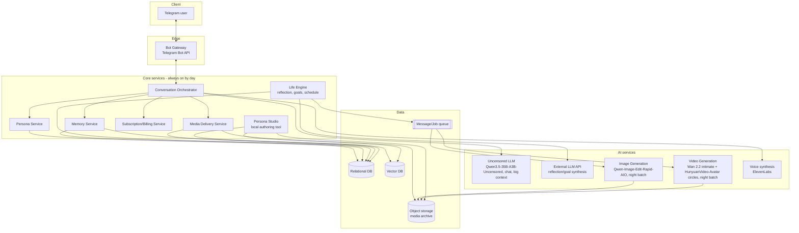
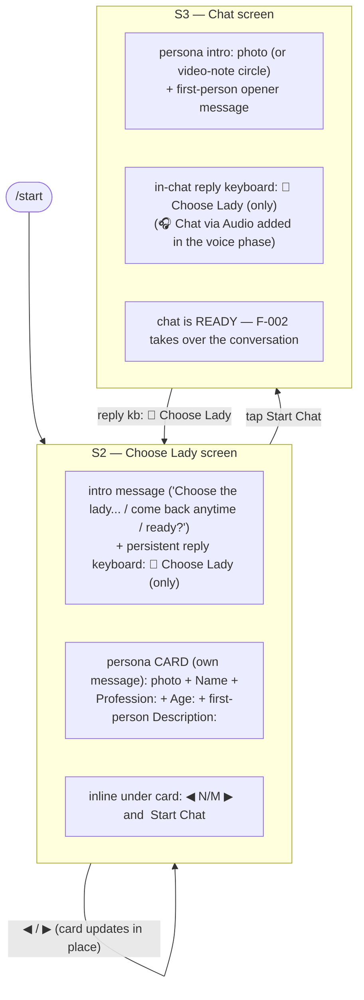
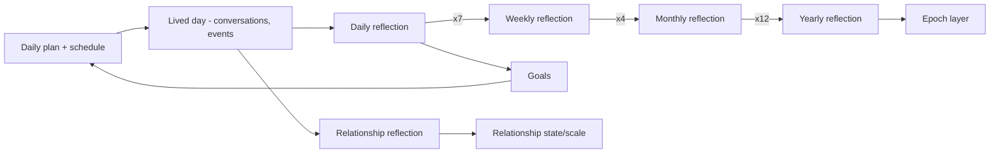
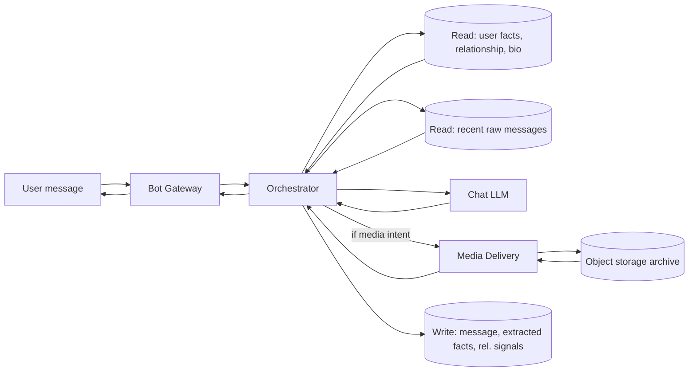
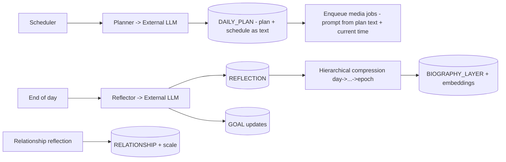
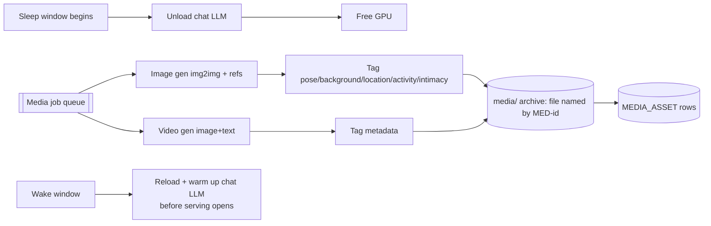
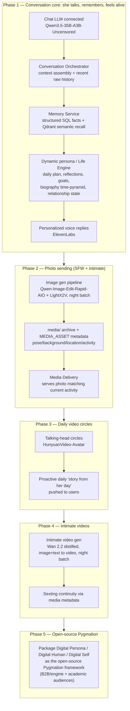

# Architecture — NeuroLady

This document describes the architecture of NeuroLady on six levels:

1. **Interface (UX)** — how the product looks and behaves for the end user (Telegram).
2. **API** — how the backend is exposed.
3. **Services** — the backend services, their logic and internal architecture.
4. **AI services** — the models, prompts, and everything that can change or be trained.
5. **Data** — entity-relationship model (ERD) and data-flow diagrams (DFD).
6. **Infrastructure** — deployment, runtime, CI/CD.

The guiding principles: **modularity** (text, image, and video concerns live in clearly
separated modules and directories), **persona-agnostic core** ("Alina" is just one instance of a
configurable persona), **hyper-realism** (per `user_metrics.md` and `Project Concept.md`), and
**self-hosted** heavy models with a day/night compute schedule.

> Terminology: **Alina** is used throughout as the running example of a *persona* — concretely, a
> Moscow-based psychologist and fitness enthusiast. A persona is not hard-coded — the platform can
> create and run many personas from configuration. The initial roster is **10 personas: 5
> Russian-speaking and 5 English-speaking**.

---

## The Pygmalion Framework (conceptual model)

The engine is packaged as a framework called **Pygmalion** (intended to be open-sourced — see
§8 Roadmap). It organizes each persona into three conceptual components, which map onto the
services described below:

- **Digital Persona** — *who she is.* A **dynamic daily prompt** assembled from:
  - **Fixed elements:** name, core values, **Big Five personality traits**.
  - **Variable elements:** age, interests, goals.
  - **Biographical context layers:** history summaries + current-period detail.
  - **Future projections:** weekly through lifetime scenarios.
  - → realized by the **Persona Service** + **Life Engine** (§3.3, §3.5) and the biography
    time-pyramid (§4.5).
- **Digital Human** — *how she manifests.* Text generation with style-tuning, **voice
  synthesis**, **consistent imagery**, and **talking-head video**.
  - → realized by the Chat LLM (Qwen3.5-35B-A3B-Uncensored), Voice (ElevenLabs), Image
    (Qwen-Image-Edit-Rapid-AIO), and Video (Wan 2.2 + HunyuanVideo-Avatar) AI services (§4).
- **Digital Self** — *what she remembers.* **Vector storage (Qdrant)** of daily events and
  conversation histories enabling hyper-personalization.
  - → realized by the Memory Service semantic store (§3.4) + the reflection pyramid (§3.5).

---

## 0. System overview



**Day/night compute model:** during the persona's "awake" hours the always-on **chat LLM** is
served for real-time conversation. During "sleep" hours the chat LLM is unloaded and the GPU is
handed to the **image/video generation** batch jobs that pre-produce the next day's media archive
according to the persona's schedule. This is orchestrated by the Life Engine + job queue (see §3,
§6).

---

## 1. Interface (UX) — Telegram

The end-user product is a **Telegram bot**. Design goal: extremely simple, intuitive, button-
driven; the user should barely need to type commands — inline/reply keyboards do the navigation.

### 1.1 Screens & flow

**Canonical screen order (this is the exact reference flow — always follow it).** Each screen flows
from a single specific action on the previous one:

1. **`/start` → Choose Lady screen (S2), directly, for everyone** — a brand-new user (a `USER`
   record is created) and a returning user alike land straight on S2; there is **no separate
   Welcome/Start screen and no intermediate "Start" tap** (removed by explicit product decision — a
   welcome/CTA screen ahead of the gallery was pure friction with nothing the gallery intro doesn't
   already say). `/start` is a "home" action — even **mid-chat** it takes the user to Choose Lady,
   never resume-locking them into the conversation (the active session is preserved: picking the
   same persona again on S2 just continues that chat).
2. **S2, `◀` / `▶` → S2** (the same screen; the persona card updates in place, one persona per view).
3. **S2, tap `Start Chat` → Chat screen (S3).**
4. **S3, reply-keyboard `💋 Choose Lady` → S2** (re-open the gallery). **There is no main menu
   screen and no `≡ Menu` button** — the reply keyboard carries this single action only.



### 1.2 UX building blocks
> Grounded in the reference design (Figma "🧠 AIT"). Copy is English/adult-flirty in tone; the
> Russian-language personas use equivalent Russian copy.

- **Header:** standard Telegram chat header — `‹ Chats` back link, title **"NeuroLady AI"**, and
  the persona/brand avatar (top-right).
- **S2 — Choose Lady (persona gallery):** reached **directly on `/start`** — for a brand-new user
  and a returning user alike; there is no separate Welcome/Start screen ahead of it. It is **two
  messages**:
  1. An **intro message** — a short multi-line invite ("Choose the lady you'd like to chat with from
     the list below. Each one is unique, with her own personality and passions. You can always come
     back and pick another… Ready for some exciting conversations?"). The **persistent reply
     keyboard appears here** (a single **💋 Choose Lady** button — no menu) and stays for the rest of
     the session.
  2. A **persona card** (its own message): large **photo** on top, then the card body —
     **`{Name}`**, **`Profession: {…}`**, **`Age: {…} years`**, and a first-person
     **`Description: {…}`** (multi-line, her voice). If a persona has no photo yet, the card degrades
     to a text-only card (same fields). Under the card: an inline row **`◀`  `N/M`  `▶`** and a
     full-width **`Start Chat`** button.
  - **Pagination** (`◀` / `▶`) moves one persona per view and **updates the card message in place**
    (the counter and card content change; a new card is not appended).
- **S3 — Chat screen (persona intro):** reached by tapping `Start Chat` on S2. On the transition the
  **persona-card message is deleted** (F-001 FR-001-21) so the stale gallery card doesn't linger.
  The selected persona greets with her **intro** — her **photo** (or a Telegram **video note /
  circle** when available) **plus a first-person opener message** in her voice (e.g. "Hey there 😊
  I'm Olivia… what's on your mind tonight? 💋"; the photo carries the opener as its caption). The
  intro carries the reply keyboard; **no separate "ready to chat" message is sent** (the opener
  already invites a reply — F-001 FR-001-12). Photos also appear on the **S2 card** (the "choose a
  girl" moment); both are `PERSONA.gallery_photo_ref` media (§5.1/§6.3), degrading to text-only until
  real images exist. After this the chat is ready and **F-002** owns the conversation.
- **Daily video circles:** subscribers receive **proactive daily video notes** of the persona
  sharing stories from her day (a recurring "she's alive" touchpoint, not just the intro). These
  are talking-head circles driven by the schedule/Life Engine (§4.3, §3.5).
- **Conversation screen:** the default state. The user just types; she replies. Replies can be
  **text or personalized voice messages** (voice synthesis, §4.7), and rich media (photos,
  videos, video notes) is sent inline.
- **Free vs paid:** **5 free messages per day**; beyond that, and for erotic photo/video access,
  the user needs a subscription (metered by Billing, §3.7). Photo access can be bought separately
  (daily/weekly/monthly) or via a tier.
- **Keyboards — two kinds, used by situation:**
  - **Reply keyboard** (replaces the typing keyboard) for the one persistent, session-level action:
    a **`💋 Choose Lady`** button (return to persona selection) — **that is the only button on it**.
    There is **no main menu and no `≡ Menu` button** — deliberately removed to keep the chat feeling
    like a real conversation, not an app with a settings screen. It first appears on **S2** (the
    Choose Lady screen) and persists through the chat. On the chat screen a **`🎧 Chat via Audio`**
    button is added once the **voice phase** ships (§4.7); it is not part of F-001.
  - **Inline keyboard** (attached to a message) for in-context actions: `Start`, `◀`/`▶`,
    `Start Chat`, and in-chat `📸 photo` / `💳 Subscription`.
- **Subscription screen:** current tier, what's unlocked, upgrade CTA (ties into Billing, §3) —
  reached from a persona's own in-chat `💳 Subscription` prompt, not from any menu (there is none).

> Reference design: Figma "🧠 AIT". This section is the behavioral spec the bot must implement;
> exact copy and keyboard layouts are refined per-screen during feature work
> (`developer files/features/`).

### 1.3 UX principles
- Minimize free-text commands; prefer taps.
- **No main menu.** There is deliberately no menu screen and no `≡ Menu` button — one reply-keyboard
  action only (`💋 Choose Lady`). Every screen's one-tap "way back" is Choose Lady, not a menu.
- Media requests are one tap and feel instant (media is pre-generated — see §4.3).
- The persona never breaks character in UI copy that "belongs" to her (her messages), while
  system/menu copy is neutral brand voice.
- **Hide the "bot chrome" — the user should forget they're in a Telegram bot.** Transient,
  utility messages are **deleted once they have served their purpose**: the user's own slash
  commands (`/start`, …), their reply-keyboard button taps (their **`💋 Choose Lady`** text), the
  gallery **intro message**, and the stale persona **card** on entering the chat. The chat should
  read like a conversation with a person, not a scrolling log of menus and commands.
  **Hard rule — send-before-delete, always:** whenever a screen transition both *sends new content*
  and *deletes old content*, the new content must be **sent (and the send must succeed) before**
  the old content is deleted — never the reverse, and never delete-then-send. Concretely: a user's
  command/message is only deleted **after** the bot's response to it has been sent; a stale
  screen's messages (card, intro) are only deleted **after** the next screen's message has actually
  landed. If sending the replacement fails, the old content is **left in place** — the chat must
  never be silently left blank/orphaned by a delete that outran (or substituted for) a failed send.
  **Corollary — Start Chat is never mute:** entering a chat from the gallery always ends with a
  message from the persona. A brand-new/switched session gets the full S3 opener; a **resumed**
  same-persona session gets a short in-character **resume opener** (rapid duplicate taps are
  deduplicated instead of silently skipped — skipping the send while still deleting S2 left an
  empty chat, ISS-001). This matters because the bot cannot see a user deleting the chat
  client-side: what looks "empty" to the user may be an active session to the bot.
  Only her real content (persona messages, media) and the current screen persist long-term.

---

## 2. API

Two API surfaces:

### 2.1 External ingress — Telegram
- The **Bot Gateway** receives updates from the Telegram Bot API via **webhook** (preferred in
  prod) or long-polling (dev). It is a thin translation layer: Telegram update → internal command
  → Orchestrator; internal response → Telegram send call.
- No business logic in the gateway; it authenticates the webhook, validates/normalizes updates,
  and applies rate limiting.

### 2.2 Internal API — service-to-service
Services talk over a well-defined internal API (HTTP/REST or gRPC; async work via the queue).
Representative endpoints (illustrative, not exhaustive — finalized per feature):

**Conversation Orchestrator**
- `POST /conversation/message` — inbound user message → returns persona reply (text and/or media
  refs).
- `POST /conversation/session/start` — begin/resume a session for (user, persona).
- `POST /conversation/session/end` — end session, return to menu state.

**Persona Service**
- `GET /persona` / `GET /persona/{id}` — list / fetch persona metadata (name, avatar, teaser,
  intro video-note ref, status).
- `POST /persona` — create a persona (used by Persona Studio, §4.4).
- `GET /persona/{id}/biography?scope=epoch|year|month|week|day[&period_key=]` — layered bio.
  `scope` is the pyramid **level** only; the epoch names **`childhood|youth|current`** are
  `period_key` values under `scope=epoch` (not scope values) — see §4.5 / §5.1.

**Memory Service**
- `POST /memory/user-fact` — store a categorized fact the user revealed.
- `POST /memory/query` — retrieve relevant context (semantic + structured + biography) for a reply.
- `GET /memory/relationship/{userId}/{personaId}` — relationship state/summary.
- `POST /memory/biography-layer` — **write/index a persona `BIOGRAPHY_LAYER`** (upsert its row +
  (re)embed it). Called by the **Life Engine** after it authors/compresses a layer (§3.5); Memory
  only stores/indexes/serves, it does not author (see §3.4, F-004).
- `GET /memory/user-data/{userId}` — export all of a user's stored memory (facts, messages,
  relationship state) for the privacy export requirement (§6.5).
- `DELETE /memory/user-data/{userId}` — delete a user's memory from **both** the relational store
  and the vector store (right-to-erasure; §6.5).

**Life Engine**
- `POST /life/plan/day` — generate today's plan for a persona.
- `POST /life/reflect` — trigger a reflection (day/week/month/…); internal/scheduled.
- `GET /life/plan/{personaId}?date=` — the persona's day plan (schedule as free text; drives media).

**Media Delivery Service**
- `POST /media/request` — `{userId, personaId, type: photo|video, intimate: bool}` → returns a
  media item consistent with the persona's *current activity* (derived from her day plan + current
  time), plus its metadata (pose, background, location, activity) for sexting continuity.
- `GET /media/archive/{personaId}?date=` — list the day's pre-generated archive (internal).

**Subscription/Billing**
- `GET /subscription/{userId}` — tier & entitlements.
- `POST /subscription/checkout` — start an upgrade.
- webhook `POST /billing/callback` — payment provider callback.

### 2.3 Cross-cutting API concerns
- **AuthN/Z:** internal mTLS or signed service tokens; per-user entitlement checks on gated
  actions (intimate media requires an adult-verified, entitled user).
- **Idempotency:** message and media-request endpoints accept an idempotency key (double-tap
  safe).
- **Contracts:** every endpoint has a versioned schema; contract tests live in `tests/` (see the
  TDD guide).

---

## 3. Services (logic & architecture)

All services are **modular and independently deployable**. Text, image, and video concerns are
separated at the service *and* directory level.

### 3.1 Bot Gateway
- Telegram I/O only (webhook intake, send API, keyboards, video notes).
- Stateless; scales horizontally.

### 3.2 Conversation Orchestrator (the heart of chat)
Owns a single user turn end-to-end:
1. Receive normalized user message.
2. Load session + relationship state (Memory).
3. **Assemble the LLM context** (this is critical, see §4.2): persona system prompt + relevant
   biography layers + retrieved user facts + relationship summary + **the descriptors of the media
   she recently sent this user** (bounded — see §4.2) + **the recent raw message
   history (several last messages of the live conversation)**.
4. Call the **chat LLM** (§4.1).
5. Post-process (safety/consistency checks, media-intent detection) and apply the **human-likeness
   layer (feature `F-003`)**: style the reply per the persona's `comm_settings_json` (register,
   emoji, slang, variability) and the `USER.interaction_style_json` overlay, then deliver it with
   deliberate human **pacing** (a "typing…" indicator + a bounded, length-scaled delay *added on top
   of* the fast compute) and, when long, **split into several shorter messages**. Styling/pacing
   never change the reply's content or correctness (that stays owned by this loop / §4.2).
   **The conversational intimacy gate (`F-019`) runs here, on the generated reply**, *before*
   styling/pacing — see §3.2a.
6. If the user asked for media, call **Media Delivery**; otherwise return text.
7. Persist the exchange (Memory) and update relationship signals.

#### 3.2a Intimacy gating is enforced on OUTPUT, not requested in the prompt

**Prompt steering is not enforcement.** F-005 injects a per-stage behaviour line (`STAGE_BEHAVIOR`,
e.g. *"you just met him — reserved, not intimate"*), but it is a *request* to a deliberately
**uncensored** chat model (§4.1) and is routinely overridden — measured live: a brand-new `Stranger`
user could steer the conversation explicit from the first message, while the very same content was
correctly refused as a *photo*. A soft prompt line and a hard media gate cannot be the same policy.

Therefore intimacy is gated **on the produced reply**:

- the **policy core is F-014's** (hard safety scan, stage→level mapping, per-persona ceiling clamp,
  `GATE_DECISION` audit) — **one policy, two channels**: media (`F-014`/`F-015`) and text (`F-019`);
- the text gate is a **local deterministic check** (no extra LLM round-trip, so no latency cost);
- a withheld reply is replaced by an **in-character deflection**, never a system/assistant message —
  the illusion (§1) must survive a refusal;
- ordinary warmth, flirting within the unlocked stage and emotional intimacy pass through
  **unmodified** — over-blocking is treated as a defect, not as safety.

`STAGE_BEHAVIOR` remains as *proactive steering* (it makes the model produce the right thing most of
the time); F-019 is the *enforcement* that makes the guarantee real.

- Handles media-intent detection ("send me a pic") and routes to Media Delivery with the intimate
  flag + entitlement check.

### 3.3 Persona Service
- Source of truth for persona definitions: identity (name, core values, **Big Five personality
  traits**), variable traits (age, interests, goals), layered biography, appearance references,
  intro video-note, **voice profile**, tunable communication settings.
- **`comm_settings_json` — the per-persona human-likeness style knobs** (source of truth for the
  communication-style / "she texts like a real person" layer, feature `F-003`). It configures, by
  data (no code changes), at least:
  - `pacing_style` / `typing_speed` — her default reply tempo (the deliberate, variable pre-send
    delay added *on top of* fast compute; bounded by an upper cap — F-003 FR-003-04..08, NFR-003-01).
  - `verbosity` / `chunking` — how terse vs chatty she is, and how a long reply is split into
    several short consecutive messages (FR-003-09..15).
  - `emoji_frequency` — how sparingly she uses emoji (some personas almost none; FR-003-16..20).
  - `register` / `slang_level` / `typo_rate` — informality: lowercase, contractions, slang, the rare
    human typo, localized to her language (FR-003-21..25).
  - `variability_strength` — anti-repetition of greetings/openings/catchphrases (FR-003-26..28).
  - `mood_expressiveness` — how much she teases/sulks/goes quiet vs uniform cheer (FR-003-30..31).
  - `followup_policy` — whether/how she sends one in-exchange short follow-up if the user goes
    briefly quiet (FR-003-32; never cross-session — that is the Life Engine).
  A **per-user overlay** (`USER.interaction_style_json`, e.g. low-emoji / more-literal for
  neurodivergent or low-tech-comfort users, F-003 FR-003-37) is applied on top of these persona
  defaults at reply-styling time.
- Manages the **roster of 10 personas (5 Russian-speaking + 5 English-speaking)**; `locale`/
  language is part of persona metadata and drives the gallery and prompts.
- Provides the **gallery card** data used by the "Choose Lady" carousel: name, profession, age,
  first-person description teaser, and gallery photo (per the reference design).
- Serves biography *layers* (see §4.5) and persona metadata to the Orchestrator and the gallery.
- Backed by relational DB (structured) + vector DB — **Qdrant** (semantic biography) + object
  storage (reference images, intro note).

### 3.4 Memory Service
The dual-store memory subsystem (full behavioral spec: feature **`F-004`**). It **stores, indexes,
retrieves, and serves** memory; it does **not** author biography/reflections (that is the Life
Engine, §3.5) — the Life Engine hands produced layers to Memory via `POST /memory/biography-layer`.
- **Structured memory (SQL):** categorized user facts (e.g. `family`, `work`, `preferences`,
  `complaints`), relationship state, session logs. User facts carry **`status` (active|superseded)**,
  **`superseded_by`**, and **`confidence`**: when the user reveals something that contradicts an
  earlier fact, the old row is soft-**superseded** (kept for history) and the new one becomes active
  (F-004).
- **Semantic memory (Vector DB, Qdrant):** embeddings of user statements and of persona biography,
  for "she remembers what you said months ago" retrieval.
  - **Point-payload contract (isolation):** every vector point carries owner scope keys in its
    payload — **`user_id`** for user facts, **`persona_id`** for biography layers — plus the source
    row id. All semantic queries are **filtered by these keys**, so a user's facts can never surface
    in another user's recall (enforces `NFR-002-07` / F-004 isolation). `embedding_ref` on the SQL
    row and the point's source-id form the two-way link.
- Provides **`query`** (`POST /memory/query`) that **fuses** structured recall (facts by category,
  active only) + semantic recall (top-k, filtered by owner) + the relevant **biography layers**
  (by scope, §4.5) into the context bundle for a reply, **ranked by relevance/recency/confidence** so
  irrelevant facts don't dominate.
- **Categorization & write pipeline:** incoming user messages are classified and salient facts
  extracted, categorized, stored in SQL, and embedded (async, off the hot path). Fact updates
  **re-embed** so the vector store stays in sync with SQL.
- **Store reconciliation / repair:** a background job detects and heals inconsistencies between the
  two stores — orphan embeddings (vector point with no live SQL row), missing embeddings (active
  SQL row with no point), and drift — and emits drift/coverage metrics (see §6.4). This keeps the
  `embedding_ref` ↔ point mapping trustworthy over time (F-004).
- **Privacy:** supports per-user **export** and **delete** across *both* stores
  (`GET`/`DELETE /memory/user-data/{userId}`, §6.5). Persona biography is shared config; user facts
  are private and per-user isolated.

### 3.5 Life Engine (persona "living" — highest-value subsystem)
Runs the persona's simulated life on a schedule. **Full spec: feature `F-006`** (daily plan,
self-reflection, biography compression, goals); the per-user **relationship reflection** below is
**`F-005`**. Components:
- **Planner:** at a set time (e.g. early morning) sends a system prompt to the reflection LLM
  ("You are Alina, characteristics …, plan your day") → produces a **daily plan with a schedule
  written as free text** (activities across the day with rough times/locations), stored in
  `DAILY_PLAN.plan_text`. There is **no structured slot table**: when media is generated, the
  external LLM is handed this schedule text + the persona's **current time** (from
  `PERSONA.timezone`) and asked to write a generation prompt for the setting matching her current
  activity (§4.3).
- **Reflector:** at end of day, prompts the LLM to **reflect** on the day given today's plan +
  events + prior lore → stores a **daily reflection**. Reflections **compress hierarchically**:
  7 daily → 1 weekly; ~4 weekly → 1 monthly; 12 monthly → 1 yearly; years → **epochs**
  (childhood, youth, current era). This is the biography's time pyramid (§4.5).
- **Goal system:** the persona maintains **goals**; reflections and planning move her toward them,
  so she isn't only reactive — she has direction. Goals are stored, revisited, and updated.
- **Relationship reflection:** per (user, persona), periodic reflection on how the relationship is
  developing — the external LLM judges the recent interaction + hard signals and returns bounded
  deltas that update the **Closeness / Trust / Attraction** dimensions and re-derive the **stage**
  (§4.6), which colors future replies. Full design + guardrails: feature **`F-005`**. (The
  persona's *own* self-reflection, biography compression, goals, and daily plan above are the Life
  Engine's other reflections; F-005 is the relationship one specifically.)
- Emits jobs to the queue (e.g. "generate tomorrow's media from the day plan") and schedules the
  **proactive daily video circle** (a talking-head "story from her day" pushed to users).



### 3.6 Media Delivery Service
- Serves pre-generated media matching the persona's **current activity**, derived from the current
  time (per `PERSONA.timezone`) against the `DAILY_PLAN.plan_text` schedule (gym selfie around her
  gym time, office selfie during work, etc.).
- Enforces **adult verification** for intimate content.
- Returns the media **plus its metadata** (pose, background, location, intimacy level) so the
  Orchestrator/LLM can **sext consistently** ("knows what she sent"). The Orchestrator **must consume
  it**: recently-sent descriptors are a bounded block of the assembled context (§4.2, F-002
  FR-002-25/26) — a returned-but-unread metadata payload is the ISS-006 defect.
- Never generates on the hot path — only reads the day's archive from object storage.

### 3.7 Subscription/Billing Service (deferred — not in current scope)
> **Monetization is parked for now.** There are no subscription/usage tables in §5.1 and nothing
> here is being built yet. This subsection is kept as the intended *future* design so it isn't lost.
- **Free-message metering:** enforces **5 free messages/day** per user (per persona), resetting
  daily; beyond the quota requires a subscription.
- **Photo/video access:** erotic photo access sold as **daily / weekly / monthly** subscriptions,
  purchasable separately or bundled into a tier.
- Payment provider integration; entitlement checks; gating of intimate media (with adult
  verification, §6.5).

### 3.8 Persona Studio (local authoring tool)
- A local interface to **create and assemble personas** (see §4.4): questionnaire-driven bio
  authoring, reference-image upload for appearance consistency, artifact assembly, and one-click
  publish so the new woman appears in the bot's gallery.

### 3.9 Media generation services (batch, night)
- **Image Generation Service** and **Video Generation Service** are separate modules, each with
  its own prompts, models, and directory. They consume jobs from the queue during sleep hours and
  write archives to object storage (details in §4.3).

---

## 4. AI services (models, prompts, trainable/changeable parts)

Everything here is designed to **change, be tuned, or be swapped**. Prompts are versioned assets
stored per-module, never inlined ad hoc.

### 4.1 Chat LLM (real-time conversation)
- **Selected model:** **`Qwen3.5-35B-A3B-Uncensored` (HauhauCS "Aggressive" variant)** — an
  uncensored MoE model with **35B total / ~3B active** parameters (cheap to serve, large-model
  quality), a **262K native context** (extendable to 1M via YaRN), reported **0/465 refusals**,
  under **Apache 2.0**. The large context comfortably fits the §4.2 bundle (persona prompt +
  biography layers + user memory + relationship state + recent raw messages).
- **Why this over the earlier candidates:** it supersedes the previously-listed Llama 3.1 /
  Wizard-Vicuna class candidates — newer, uncensored out of the box, MoE-efficient for the
  day/night self-hosted schedule, and permissively licensed.
- Served **self-hosted** at an FP8/quantized precision sized to the GPU (the repo ships
  quantizations from ~11 GB IQ2 up to ~69 GB BF16). Loaded during awake hours, unloaded at night
  to free the GPU for media (§6.1).
- **Model-load ("cold-start") latency is a first-class concern.** Loading a multi-GB model onto the
  GPU and warming it up takes real time; if a user's message hits a **cold** model (first request
  after startup, after the night unload, or after a model swap), the naive reply time can be tens of
  seconds — unacceptable for a "she feels like a real person" product. The design therefore requires:
  - **Pre-warming:** the serving layer **pre-loads and warms the chat LLM before the awake/serving
    window opens** (a warm-up inference on boot and right after the night→day reload), so a user
    never pays the cold-start cost. See the day/night scheduler in §6.1.
  - **Keep-warm:** during awake hours the model stays **resident/pinned** on the GPU — it is not
    lazily unloaded between messages — so steady-state replies hit a warm model.
  - **Graceful cold path:** if a message does arrive while the model is still loading (unavoidable
    edge, e.g. a request during the reload window), the user must be **immediately acknowledged**
    (Telegram "typing…" indicator and/or a short in-character "one sec…" line) rather than left with
    a frozen chat, and the real reply delivered once the model is ready, within a bounded worst case.
  - This warm-vs-cold distinction is reflected in the reply-latency requirements of the conversation
    feature (`features/F-002-*`).
- Style-tuning per persona (voice/register); configurable decoding (temperature, etc.) exposed as
  persona/communication settings. The serving interface is fixed so the model can still be swapped
  after evaluation.
- Style-tuning per persona (voice/register), so text matches the persona's character.
- Self-hosted; **loaded during awake hours**, unloaded at night to free GPU for media.
- Configurable decoding (temperature, etc.) exposed as persona/communication settings.
- **Reasoning ("thinking") mode is ON — and it works for humanness (F-003 FR-003-41).** This model
  family opens a private `<think>` block before answering. Originally reasoning was disabled at the
  runner (it burned the whole token budget on visible chain-of-thought and broke the flat <5 s
  budget). The decision is now **reversed, deliberately**: the system prompt instructs the model to
  use its private reasoning as a **pre-send self-check** against the texting constraints (reply-
  volume budget, emoji budget, register, no assistant formatting, in-character consistency), and
  the reasoning's real compute time **fills the natural "she's typing" gap** — the pause the
  product wants anyway is spent on work that raises reply quality instead of a pure sleep.
  Guardrails: the think block is **stripped before delivery** (Orchestrator post-process); a reply
  whose think block never closed (token-truncated) **degrades to the in-character fallback** rather
  than leaking raw reasoning; the generation token ceiling is sized for reasoning + a compliant
  short reply (FR-003-39 — never mid-sentence truncation); latency governed by the revised
  F-002 `NFR-002-01` (typing indicator immediate; generation ≤ 30 s p95 warm — measured 22-30 s live with reasoning) plus F-003's
  typing-speed pacing caps (NFR-003-01: ≤ 15 s/chunk, ≤ 30 s total).
  **Status for the current model build — reasoning OFF at the runner (live finding, 2026-07-16):**
  the HauhauCS "Aggressive" finetune has **broken thinking-format discipline** — it unpredictably
  emits its CoT as **tagless plain text** ("Thinking Process: …", no `<think>`/`</think>` markers,
  `finish_reason: stop`), immune to `/no_think`, explicit no-reasoning instructions, and role
  restructuring (all probed live). A tagless CoT cannot be reliably separated from the answer, so
  the choice is leaking raw CoT to users or dropping whole outputs (both were observed — a raw CoT
  was stored inside a generated daily plan; every plan step then failed "empty completion"). Until
  a model build with disciplined think-tagging is deployed, `CHAT_ENABLE_THINKING` defaults to off;
  the FR-003-41 self-check directive (applied without visible CoT), `strip_reasoning` in the
  ChatClient, and all leak guards remain active as defense in depth. The natural response gap is
  provided by F-003's typing-speed pacing (FR-003-40).

### 4.2 Context assembly (critical)
For each reply the Orchestrator builds the prompt from:
- **Persona-time identity prompt** (the "Digital Persona", §4.4 / Pygmalion) — recomputed for the
  **current local date** so it is naturally **daily-versioned**: fixed anchors (name, **birthdate**,
  core **values/motivation**, **Big Five**) + evolving persona-time fields (**age derived from
  birthdate**, e.g. "28 years and 3 days"; current **interests**; current **goal**) + communication
  style + today's plan/mood. Fixed anchors are used verbatim and must never be contradicted (F-006).
- **Biography (graded by recency + semantic):** her own life is fed into every reply, not just when
  asked. A compact **graded block** always carries the coarse-to-fine recent shape — current-**epoch**
  gist → this **year** → last **month** → last **week** → recent **days** — and, on top of that,
  **semantically-retrieved deep layers** relevant to the message (e.g. a childhood question pulls the
  childhood epoch), so she answers about her past **consistently** instead of confabulating. Served by
  Memory (F-004) by scope + vector search; authored/seeded by the Life Engine (F-006).
- **Future-self projections** (week / month / year / next epoch / lifetime) so she can speak about
  where she's heading, consistent with her goals and biography (F-006).
- **User memory:** categorized structured facts + semantically retrieved past statements.
- **Relationship state** summary.
- **Recently-sent media descriptors (what she showed him):** for the last few photos/videos delivered
  to *this* user (§3.6, F-012), their stored `MEDIA_ASSET.meta_json` slot fields — **background,
  location, activity, pose, time-of-day** — plus roughly when each was sent. This closes the Media
  Delivery contract of §2/§3.6 ("returns the media **plus its metadata** so the Orchestrator/LLM can
  sext consistently — *knows what she sent*") on the **consuming** side: the metadata is only useful
  if it re-enters the prompt. The block is **bounded and config-driven** (a max count within a recency
  window, default 3 sends / 48 h) and built from one cheap `MEDIA_SEND ⋈ MEDIA_ASSET` query — no LLM
  call, nothing generated on the hot path; generation provenance (`prompt`, `seed`) is never included.
  > **ISS-006:** this block was specified in §2/§3.6/§5.1 and implemented only on the *write* side —
  > sends were recorded and metadata stored, but the Orchestrator read none of it, so when the user
  > asked what was behind her in a photo she had just sent, she invented a scene out of her biography
  > (the only scene material the prompt carried). **Storing metadata without consuming it is the
  > defect**; F-002 FR-002-25/26 + F-012 FR-012-14/15 now require both halves.
- **Recent raw conversation history — several of the latest messages passed through as-is** (a
  hard requirement: the live dialogue must be in-context, not only summarized).
- Assembled to fit the model's context budget with a clear priority order; the biography block is
  **length-bounded** (graded summaries, not the whole life) so it never blows the token/latency
  budget. *(The F-002 thin slice originally shipped identity + memory + relationship only; the
  biography/persona-time/future-self layers here are added by the F-006 biography extension.)*

### 4.3 Image & video generation (night batch)
All media models are **self-hosted**, run as **4-step distilled checkpoints on a low step count**,
and are quantized to fit our GPU, so the night batch fits the sleep window.

> **Acceleration stack — LightX2V dropped on our GPU (decision, 2026-07; see §4.3a).** The docs
> originally named **LightX2V** as the accelerator. Its headline value is **FP8** distilled
> checkpoints — and **FP8 is unavailable on our Turing (sm_75) Quadro RTX 8000** (FP8 needs Ada/
> Hopper, sm_89+). This was proven twice: the **image A/B** disqualified the LightX2V-native
> candidate (bf16 wouldn't fit; only sequential CPU-offload ran → 424 s/img, blank frames) and the
> winner is the **Phr00t AIO served on headless ComfyUI** (4 steps, ~117 s/img). So the actual
> acceleration pattern is **"community 4-step distilled + GGUF/INT8 quantization, served through
> ComfyUI"** — GGUF has **no FP8 dependency**, so it runs on Turing. The **4-step distill LoRAs
> themselves (e.g. Wan2.2-Lightning)** are still used — only the LightX2V *framework* is dropped.

- **Images — `Qwen-Image-Edit-Rapid-AIO` v23 (NSFW variant):** an All-In-One, distilled +
  FP8-quantized build on top of **Qwen-Image-Edit-2511** (accelerator + VAE + CLIP merged into one
  ~28 GB checkpoint), running at **4–8 steps**. The NSFW branch has community LoRAs (`snofs`,
  `qwen4play`, …) baked in. Conditioned on each persona's **reference images** to keep appearance
  identity-consistent (Qwen-Image-Edit-2511 is tuned specifically for character consistency across
  edits). Guided by the day plan + current time (the external LLM writes the generation prompt for
  her current activity/setting, §3.5), it produces **SFW** shots (gym selfie, office photo, …) and
  **intimate** shots → the day's archive.

#### 4.3b Reference-conditioning contract (identity preservation) — binding

How the reference images and the text prompt must be combined. Both halves are mandatory: dropping
either one is what makes a generated photo stop being *her*.

- **Multi-reference input — up to 3 images.** The serving node
  (`TextEncodeQwenImageEditPlus`, ComfyUI) accepts **`image1`, `image2`, `image3`** and injects them
  ahead of the text as `Picture 1:  Picture 2:  …`. The runner must therefore feed **all
  the anchors the identity policy selects (F-009), not just the first**:
  - **Picture 1 = the face anchor** (`PERSONA.face_ref`) — carries facial identity;
  - **Picture 2 = the full-body anchor** (`PERSONA.fullbody_ref`) — carries body proportions/
    anatomy, which a face crop cannot convey;
  - a third slot stays free for future use (e.g. an outfit/scene anchor).
- **The prompt MUST open with an explicit identity-preservation directive** that binds the output to
  those pictures **before** any scene content — e.g. *"Preserve the exact face, facial features and
  body proportions of the person in Picture 1 and Picture 2. Place this same person in …"*. A prompt
  that merely says "a woman" invites the model to drift off the reference and is a defect.
- **Preserve ≠ describe.** The prompt still must not *describe* her appearance (hair colour, eye
  colour, body type) — the pictures carry that. The directive asserts *preservation of the person in
  the input pictures*; the scene text then varies setting/pose/outfit/lighting only. The
  banned-identity-vocabulary guard (F-010) applies to descriptions and must explicitly **exempt** the
  preservation directive.
- Owner split: **F-009** owns *which* anchors and the directive's content (it is an identity
  guarantee); **F-010** emits the directive as the prompt's opening; **F-008** feeds every supplied
  reference into the model's image slots.

##### Anchor framing constraints — measured on the serving node (2026-07-20)

Three defects observed on the first live runs traced back to *how the anchors are framed*, not to
the prompt. These are binding constraints on reference authoring:

- **The vision encoder sees each anchor at only ~384×384 total pixels.**
  `TextEncodeQwenImageEditPlus` rescales every input to `total = 384*384` before the VL encoder
  (the VAE `reference_latents` path uses `1024*1024`). Therefore **whatever fraction of the anchor
  the subject occupies is the fraction of identity signal the model receives.** A face filling ~35 %
  of the frame (the rest being a raised arm, hair and wall) leaves ≈230×230 px of face — enough for
  "same type of person", not for *the same person*. **Face anchors must be tightly cropped to the
  head**, which roughly triples the effective face area.
- **A body anchor that is a complete styled photo leaks its whole look.** When Picture 2 is a full
  figure with pose, outfit and a visible head, the model copies the outfit into every scene
  (overriding the prompt's outfit) and sometimes renders the person **twice** in one frame (once as
  the subject, once as a second figure wearing the anchor's clothes). **Body anchors must be
  head-cropped torso/figure crops** carrying anatomy only.
- **Two visible faces at different scales muddy identity.** If the body anchor also shows the face,
  the model receives two competing facial signals (different size, angle, lighting) and blends them.
  The face must appear in **exactly one** anchor.

##### Output validity — distilled checkpoints occasionally emit NaN (measured 2026-07-22)

The **Rapid-AIO v23** distilled checkpoint intermittently produces a **NaN latent → an all-black
frame**, and the serving backend still reports the run as **success** (the failure is numerical, not
a workflow error). It is **not** caused by the prompt, the anchors, the seed range, the reference
count, or the step count — the same inputs re-run fine (verified by a 4-case A/B). It is transient
checkpoint flakiness. Two engine rules follow (owned by **F-008**, FR-008-17/18):

- the runner must **validate the produced image** and treat an all-black/NaN frame as a *retryable*
  failure — **never store a black frame** as a MEDIA_ASSET ("model success" ≠ "usable image");
- because a black frame can be **seed-deterministic**, each **retry uses a jittered seed** so a bad
  seed self-heals rather than looping to give-up. This is the general posture for any self-hosted
  distilled media model, image or video.
- **Video — three content streams, one shared engine philosophy (fast, low-res, Telegram-sized):**
  - **(1) Intimate clips → `Wan 2.2` i2v (feature `F-016`), silent.** Best-in-class body anatomy
    and motion realism; **image+text → video** (conditioned on the persona's reference/keyframe
    still, F-009/F-015). Served on **headless ComfyUI + City96 ComfyUI-GGUF** (the same runtime as
    images), with the **Wan2.2-Lightning 4-step distill LoRA** and **GGUF-quantized** weights so it
    runs on our Turing GPU without FP8 (§4.3a). **Speed is the product requirement, not
    resolution:** a short clip (~4 s at 16 fps ≈ 65 frames) at ≈480×480 / 512×384, generated in
    **≈90 s on the RTX 8000**. Model tier (**TI2V-5B** dense vs **A14B** MoE) and GGUF quant are
    **chosen by the `video/` bench** against that budget, same as the image A/B.
    **Content tier v1 (product decision, 2026-07): solo, hand-focused intimate acts only** — the
    clip catalog starts narrow and widens deliberately (F-016 FR-016-14); the F-014 hard gate
    applies unconditionally.
  - **(2) Daily-life ("civilian") SFW clips → the same `Wan 2.2` runner (feature `F-017`),
    silent.** Short slice-of-life clips of her day (gym set, coffee pour, walk, cooking) generated
    from the **Life Engine's day plan slots** (F-006) + an SFW archive photo/reference as the
    conditioning still — the video sibling of the F-011 daily photo batch. Same engine, same job
    API, same speed budget; only the prompt tier and gating differ (SFW — no F-014 clearance
    needed, but the same identity conditioning, F-009).
  - **(3) Talking-head voice circles (feature `F-018`) — persona image + voice → Telegram video
    note.** The intro note + **proactive daily story circles** ("говорящая голова" telling her
    day's story, engaging the user back into chat). **Voice: ElevenLabs** (per-persona
    `voice_profile_ref`, external API — no GPU). **Animation: audio-driven avatar model, chosen by
    bench between two candidates:** **(A) `Wan2.2-S2V` (speech-to-video)** — audio-driven
    talking-human generation in the SAME Wan family/runtime we already serve (GGUF workflows
    exist), which would avoid installing a second model family and a fourth GPU slot; **(B)
    `HunyuanVideo-Avatar`** — audio-driven emotion (Audio Emotion Module) + face-aware audio
    adapter, the fallback if S2V lip-sync quality disappoints. (Replaces the earlier external
    Hedra candidate — all video stays self-hosted.) **Circles are per-persona-per-day, shared
    across all users** (not per-user personalization), so one nightly render serves everyone.
  - **Night GPU rotation (§6.1):** the sleep window is now shared by **image batch → Wan clip
    batch (intimate + daily-life) → circle batch** — the scheduler owns the rotation order and
    ensures each runner loads once, drains its queue, and releases VRAM before the next
    (chat reloads before the awake window).
- Each generated asset is stored **with metadata** (slot, location, pose, background, intimacy
  level) so Media Delivery can serve context-appropriate media and support sexting continuity.
- Prompts, model choices, and pipelines live **inside the respective module's directory**
  (`image/prompts/…`, `video/models/wan22/`, `video/models/hunyuan_avatar/`). The interfaces are
  fixed so models can still be swapped after evaluation.

### 4.4 Persona construction (template + questionnaire + assembly)
- A **biography template** defines the schema of a persona (the Digital Persona of §"Pygmalion
  Framework"): fixed identity (name, core values, **Big Five traits**), variable traits (age,
  interests, goals), **gallery card fields (profession, age, first-person description, photo)**,
  epochs/biographical layers, future projections (weekly→lifetime), appearance references,
  **voice profile**, and communication settings.
- **Persona Studio** turns the template into a **questionnaire-style authoring UI**: fill in the
  story, upload appearance references (used by img2img), and the tool **auto-assembles** the
  artifacts into the right places (SQL rows, vector embeddings, reference images in object
  storage) and **publishes** the persona into the Telegram bot gallery.
- Goal: maximally flexible, no-code persona creation, runnable locally first.

### 4.5 Biography as a time pyramid (persona memory of *herself*)
> Authored by the Life Engine (feature **`F-006`**); stored/served by Memory (`F-004`).
- Layers from coarse to fine: **epochs** (childhood/youth/current) → **years** → **months** →
  **weeks** → **days**. Fine layers are generated live (plan + reflection) and **compressed
  upward** over time (§3.5). This gives a consistent, evolving, queryable life story.
- In the data model (§5.1), the pyramid **level** is `BIOGRAPHY_LAYER.scope`
  (`epoch|year|month|week|day`) and the specific period is `period_key`; the epoch names
  **`childhood|youth|current` are `period_key` values under `scope=epoch`**, not scope values.
  The Life Engine authors/compresses these layers; the **Memory Service stores, indexes, and serves**
  them (by scope, and semantically) — F-004.
- **Seeded initial biography (day one).** A persona does **not** start life-less. Each persona ships
  with an **authored initial biography** — the fixed epoch anchors (childhood/youth) plus a recent
  descent (current epoch → recent years → recent months → last weeks → recent days) — **imported into
  `BIOGRAPHY_LAYER` at provisioning** and embedded. The Life Engine then only *continues* the story
  forward (plan → reflect → compress). This is what lets her answer about her childhood coherently
  from the very first message instead of confabulating.
- **Persona-time (daily-versioned identity).** Her identity prompt is regenerated per local day: the
  **age is derived from `birthdate`** ("27 years and 1 day"), and the **evolving** fields (interests,
  current goal, current-era colour) reflect the latest state — while the **fixed anchors** (name,
  birthdate, core values/motivation, Big Five) are immutable. Same date + same stored state ⇒ same
  identity prompt (versioned by date).
- **Future-self projections.** Alongside the backward pyramid she carries **forward** projections at
  horizons **week / month / year / next epoch / lifetime** (`FUTURE_PROJECTION`, §5.1), authored by
  the Life Engine and consistent with her goals + biography, so she can talk about where she's headed.

### 4.6 Reflection & goal prompts (external LLM)
- **Planning, reflection, goal synthesis, and relationship reflection** are generated by calling
  an **external LLM API** (e.g. ChatGPT) with a system prompt describing the persona + prior lore
  + the day's plan/events. Outputs are stored as the reflections/goals/relationship updates above.
- The **relationship scale is now designed** (feature **`F-005`**): per `(user, persona)`, three
  configurable dimensions **Closeness / Trust / Attraction** (0–100) plus a **derived stage**
  (`Stranger → Acquaintance → Friend → Flirting → Romance → Love → Devoted`, highest gate met, with
  hysteresis). The **relationship reflection** hands the external LLM the current state + recent
  conversation + hard signals (days since contact, message frequency, warmth) and asks for a bounded
  per-dimension delta + a rewritten summary; the result is clamped (0–100), capped per reflection
  (gradual, no jumps), the stage re-derived, and a `RELATIONSHIP_REFLECTION` log written. Dynamics:
  neglect decay, asymmetric trust, and a pacing/consent guard (pushing fast at low trust doesn't
  escalate and can lower trust). The state is fed into every reply's context (§4.2) and **gates the
  persona's openness/flirtiness/intimacy by stage**. Gates/caps/decay/cadence are all config. See
  `features/F-005-relationship-system.md`.
- All these prompts are versioned assets under the Life Engine's prompt directory
  (`plan_day`, `reflect_day`, `compress`, `update_goals`, `update_future`).
- **The loop is actually driven by the Life Engine Scheduler (feature `F-007`).** F-006 defines each
  step; F-007 is the **driver + scheduler** that runs the *due* steps per persona on a cadence
  (morning ⇒ plan; end-of-day ⇒ reflect → compress cascade → update goals → re-author future-self),
  timezone-correct, idempotent per period, off the reply hot path, degrading per persona without
  stopping the loop. Locally it runs as an **in-process async background task** alongside the bot
  (shares the DB + embedded vector store); in prod the same per-persona **tick** runs as a separate
  scheduled worker in the night/off-peak window (§6.1). An **on-demand** "run this persona now"
  entrypoint exists for ops/testing. See `features/F-007-life-engine-scheduler.md`.

### 4.7 Voice (in scope)
- The persona replies with **personalized voice messages** (the first 5 daily messages are free,
  matching the free-message quota). Voice synthesis via **ElevenLabs (11labs)** as the current
  candidate — the **one remaining external/cloud model** in the stack — behind a modular boundary
  so it can be swapped or **self-hosted later** (open-weight candidates for a full-server stack:
  F5-TTS, XTTS-v2, CosyVoice). Whether to bring voice in-house is an open decision.
- Each persona has a **voice profile** (part of the persona definition, §3.3) so her voice is
  consistent and in-character.

### 4.8 Prompt & model management
- Prompts are first-class, **versioned** files organized **per module** (chat, image, video,
  life/reflection). No prompt is hard-coded in service logic.
- Models are pluggable behind service interfaces so any model can be researched/swapped without
  touching callers.
- **Media archive retention (F-021)** is configuration, not code: `IMAGE_RETENTION_ENABLED`,
  `IMAGE_RETENTION_CAP` (per-persona frame count), `IMAGE_RETENTION_FLOOR`,
  `IMAGE_RETENTION_GRACE_HOURS`, plus per-persona cap overrides; selection's freshness knobs
  (`freshness_bonus`, `freshness_decay_per_day`) live on `MediaDeliveryConfig`. **Storage is cheap
  and generation is not**, so the archive expires by **count, never by age**, and every protection
  (floor → grace → context-recency) outranks the cap: when they collide, the cap is left exceeded
  and reported rather than destroying un-consumed GPU work. An invalid config degrades to the
  documented defaults — a broken value must never mean "delete everything".

---

## 5. Data

Primarily **relational (SQL)** for structured state, **vector DB** for semantic recall, and
**object storage** for media.

### 5.1 Entity-Relationship Diagram (ERD)

```mermaid
erDiagram
    USER ||--o{ SESSION : has
    PERSONA ||--o{ SESSION : hosts
    USER ||--o{ USER_FACT : reveals
    SESSION ||--o{ MESSAGE : contains
    PERSONA ||--o{ BIOGRAPHY_LAYER : has
    PERSONA ||--o{ FUTURE_PROJECTION : envisions
    PERSONA ||--o{ DAILY_PLAN : has
    PERSONA ||--o{ REFLECTION : has
    PERSONA ||--o{ GOAL : pursues
    PERSONA ||--o{ MEDIA_ASSET : owns
    USER ||--o{ RELATIONSHIP : in
    PERSONA ||--o{ RELATIONSHIP : in
    RELATIONSHIP ||--o{ RELATIONSHIP_REFLECTION : logs

    USER {
        id PK
        telegram_id
        locale
        adult_verified
        interaction_style_json "per-user comm overlay: low_emoji|literal|... (F-003 FR-003-37)"
        created_at
    }
    PERSONA {
        id PK
        name
        profession
        age "display fallback; her real age is DERIVED from birthdate (F-006 persona-time)"
        birthdate "date; FIXED anchor — drives daily-versioned age (F-006)"
        core_values "text; FIXED anchor — values she lives by (F-006)"
        motivation "text; FIXED anchor — what drives her (F-006)"
        interests "text; EVOLVING persona-time field, fed into identity (F-006)"
        timezone "IANA tz, e.g. Europe/Moscow — defines her current time"
        card_description "first-person gallery teaser"
        language "ru|en"
        status
        big_five "plain-text description of the Big Five traits (not JSON)"
        comm_settings_json "human-likeness style knobs — see §3.3 (F-003)"
        face_ref "media path: face reference photo"
        fullbody_ref "media path: full-body reference photo"
        avatar_ref "media path"
        gallery_photo_ref "media path"
        intro_videonote_ref "media path"
        voice_profile_ref "media path"
        created_at
    }
    SESSION {
        id PK
        user_id FK
        persona_id FK
        state
        started_at
        ended_at
    }
    MESSAGE {
        id PK
        session_id FK
        sender  "user|persona"
        text
        media_asset_id FK "nullable"
        created_at
    }
    USER_FACT {
        id PK
        user_id FK
        category "family|work|preferences|complaints|..."
        content
        status "active|superseded (F-004)"
        superseded_by FK "nullable -> USER_FACT.id (F-004)"
        confidence "0..1, recency/certainty (F-004)"
        embedding_ref "vector DB"
        created_at
        updated_at
    }
    BIOGRAPHY_LAYER {
        id PK
        persona_id FK
        scope "level only: epoch|year|month|week|day"
        period_key "e.g. childhood|youth|current for scope=epoch; 2026|2026-07|... otherwise"
        content
        embedding_ref "vector DB"
    }
    FUTURE_PROJECTION {
        id PK
        persona_id FK
        horizon "week|month|year|epoch|lifetime (F-006)"
        content "first-person 'future me' at this horizon"
        prompt_version "audit"
        created_at
    }
    DAILY_PLAN {
        id PK
        persona_id FK
        date
        plan_text
    }
    REFLECTION {
        id PK
        persona_id FK
        scope "day|week|month|year"
        period_key
        content
    }
    GOAL {
        id PK
        persona_id FK
        description
        status "active|done|dropped (F-006)"
        priority
        horizon "short|long-term (F-006)"
        created_at
        updated_at
    }
    RELATIONSHIP {
        id PK
        user_id FK
        persona_id FK
        stage "derived: stranger|acquaintance|friend|flirting|romance|love|devoted (F-005)"
        closeness "0..100 (F-005)"
        trust "0..100 (F-005)"
        attraction "0..100 (F-005)"
        summary "one-paragraph, her view of where they stand"
        last_interaction_at
        updated_at
    }
    RELATIONSHIP_REFLECTION {
        id PK
        relationship_id FK
        period_key
        content
    }
    MEDIA_ASSET {
        id PK "MED-<persona>-<nnnnn>; also the file name"
        persona_id FK
        kind "photo|video|videonote"
        intimate  bool
        intimacy_level
        storage_ref "media path under media/<persona>/..."
        meta_json "pose|background|location|activity|time_of_day"
        created_at
    }
```

- **All persona `*_ref` fields and `MEDIA_ASSET.storage_ref` are relative paths** into the external
  **`media/`** library (§6.3): `media/<persona_slug>/…`. Every generated media file is named by its
  `MEDIA_ASSET.id` (scheme **`MED-<persona>-<nnnnn>`**), so a DB row and its file map **1:1** and IDs
  stay uniform across the project.
- **Vector DB (Qdrant)** stores embeddings referenced by `USER_FACT.embedding_ref` and
  `BIOGRAPHY_LAYER.embedding_ref` for semantic retrieval (the "Digital Self").
- The persona's **daily schedule is kept as free text inside `DAILY_PLAN.plan_text`** — there is no
  structured slot table. Media-generation prompts are synthesized on demand by giving the external
  LLM the schedule text + the persona's **current time** (from `PERSONA.timezone`) and asking for a
  prompt matching her current activity (§3.5, §4.3).
- **Monetization is deferred:** subscription/usage tables (and the 5-free-messages quota) are
  intentionally **out of the current data model** and will be added when billing is implemented
  (§3.7).

### 5.2 Data-Flow Diagrams (DFD)

**DFD-1 — Conversation turn (real-time, day):**


**DFD-2 — Life cycle (scheduled):**


**DFD-3 — Night media generation:**


---

## 6. Infrastructure (deploy, run, CI/CD)

### 6.1 Runtime & topology
- **Self-hosted GPU server(s)** host the heavy models (chat LLM, image, video). Core services
  (gateway, orchestrator, persona, memory, life, media, billing) run as containers.
- **Containerized** (Docker) services; orchestrated with **docker-compose** for the local/single-
  server setup first, with a clear path to **Kubernetes** for scale-out.
- **Day/night GPU scheduler** (the decisive infra piece): a scheduler (cron/systemd timers +
  queue) that, at sleep time, drains chat traffic, **unloads the chat LLM**, and starts the
  **image/video batch workers**; at wake time reverses it. Media jobs are queued so the night
  window processes the next day's archive.
- **Warm-up before serving (cold-start mitigation):** the night→day transition must **finish
  reloading *and* warming up the chat LLM (a warm-up inference) before the awake/serving window
  opens** — users must never eat the model-load latency (§4.1). The scheduler treats "model warm"
  (not merely "process started") as the readiness gate for accepting chat traffic; the awake window
  is only declared open once a warm-up inference has succeeded. If a message somehow arrives while
  the model is still loading, the Bot Gateway/Orchestrator immediately sends a "typing…" indicator
  (and/or a short in-character holding line) and delivers the reply once ready. Observability
  (§6.4) alerts if the model is not warm at the start of the serving window.
- **Bot Gateway resilience to network blips (Telegram connectivity):** the Bot Gateway process must
  **not crash and exit** on a transient network failure to `api.telegram.org` (DNS hiccup, dropped
  connection, local network flap) — this includes the very first connectivity check at startup
  (`getMe`), not just steady-state polling. On such a failure the process must **retry with capped
  exponential backoff indefinitely** (never give up and die) and log each attempt, so it self-heals
  the moment connectivity returns, without requiring a manual restart. This generalizes F-001's
  NFR-001-06 (retry a single send) to the **process level**.

### 6.2 Data stores
- **Relational DB** (e.g. PostgreSQL) for structured entities (§5.1).
- **Vector DB — Qdrant** for embeddings (the Digital Self).
- **Object storage** (e.g. S3-compatible/MinIO self-hosted) for media archives + references.
- **Queue** (e.g. Redis/RabbitMQ-class) for media jobs and async work.

### 6.2b Model services: self-hosted vs external
The design keeps **all heavy generative models self-hosted on our GPU**, with only two
external/cloud dependencies remaining:
- **Self-hosted (on our GPU, day/night scheduled), all accelerated by LightX2V where applicable:**
  - **Chat LLM** — `Qwen3.5-35B-A3B-Uncensored` (HauhauCS Aggressive), MoE 35B/3B-active.
  - **Image gen/edit** — `Qwen-Image-Edit-Rapid-AIO` v23 NSFW (distilled, FP8, on Qwen-Image-Edit-2511).
  - **Intimate video** — `Wan 2.2` (distilled), image+text→video.
  - **Talking-head circles** — `HunyuanVideo-Avatar` (replaces the former Hedra dependency).
- **External/cloud (only two left):** **ElevenLabs** (voice — candidate to self-host later, §4.7)
  and an **external LLM API** (e.g. ChatGPT) for planning/reflection/goal/relationship synthesis.
- **LightX2V** is an inference framework (not a model) providing 4-step distilled checkpoints and
  INT8/FP8/NVFP4 quantization for the image + video models, so the night batch fits the GPU/time
  budget.
- Each sits behind a modular interface, so any service can later be swapped or brought in-house
  without touching callers.

### 6.2c Dependency isolation & model-runner environments

Each self-hosted model has **different, mutually conflicting dependencies** (different torch /
CUDA / diffusers / vLLM / llama.cpp / LightX2V builds, custom kernels, etc.). Forcing them into one
environment would be unresolvable. The rule:

> **Each model is its own isolated runner, in its own environment, behind a fixed network API.**
> Callers (Orchestrator, media pipeline) never import model code — they talk to the runner over
> localhost. Dependency conflicts are impossible because no two model stacks share an environment.

- **Local / single-GPU dev:** one environment **per model runner**, created with `uv` (fast,
  reproducible, pinned Python). Each runner folder is self-contained:
  `chat/.venv`, `image/.venv`, `video/models/wan22/.venv`, `video/models/hunyuan_avatar/.venv`.
  Weights live in that runner's `models/` dir. Both `.venv/` and weight files are **git-ignored**
  (never committed — they are huge).
- **Production:** each runner is its **own Docker image** (its own CUDA base + pinned deps),
  orchestrated by compose/k8s. Same fixed API as local. Containers are the strong isolation
  boundary; `uv` envs are the lightweight local equivalent.
- **Fixed contracts:** the chat runner exposes an **OpenAI-compatible HTTP** endpoint; the media
  runners expose a **job API** (enqueue → generate → write archive). Swapping a model = rebuilding
  one runner; callers are untouched.
- **GPU ownership via the day/night scheduler (§6.1):** only one heavy runner owns the GPU at a
  time. The scheduler **starts/stops** runners — chat resident and warm by day; image/video runners
  brought up for the night batch, then torn down. Because each runner is a separate process/env,
  starting one never disturbs another's dependencies.
- **Prompts** stay versioned inside each runner's `prompts/` dir (never shared across runners).

This is why the layout below is one self-contained folder per runner rather than a shared package.

### 6.3 Repository & module layout (modularity on disk)
Text, image, and video each live in their own top-level module, with their **own prompts**:
```
services/
  bot_gateway/
  orchestrator/
  persona/
  memory/
  life_engine/         # planning, reflection, goals, relationship + prompts/
  media_delivery/
  billing/             # DEFERRED - monetization parked (§3.7), no tables yet
image/                 # image generation module
  prompts/
  models/              # Qwen-Image-Edit-Rapid-AIO (v23 NSFW) + LightX2V accel
video/                 # video generation module (two separate pipelines)
  prompts/
  models/
    wan22/             # intimate / no-speech video (Wan 2.2 distilled)
    hunyuan_avatar/    # talking-head circles (HunyuanVideo-Avatar)
voice/                 # voice synthesis module (ElevenLabs adapter + voice profiles)
chat/                  # chat LLM serving (Qwen3.5-35B-A3B-Uncensored) + prompts/
persona_studio/        # local persona authoring interface
infra/                 # compose/k8s, schedulers, CI/CD
tests/                 # runnable tests (gates merges) - see TDD guide

media/                 # EXTERNAL media library - one folder per persona; paths stored in DB
  <persona_slug>/      # e.g. alina/
    reference/         # identity anchors that condition image/video gen
      face.png         # PERSONA.face_ref
      fullbody.png     # PERSONA.fullbody_ref
    gallery/           # "Choose Lady" card image(s)  -> PERSONA.gallery_photo_ref
    avatar/            # chat-header avatar            -> PERSONA.avatar_ref
    intro/             # intro video note (circle)     -> PERSONA.intro_videonote_ref
    voice/             # voice profile sample(s)        -> PERSONA.voice_profile_ref
    photos/            # generated photo archive - files named <MED-id>.png
    videos/            # generated video archive - files named <MED-id>.mp4
```
Every persona keeps all her material under `media/<persona_slug>/`. Generated files are named by
their `MEDIA_ASSET.id` (`MED-<persona>-<nnnnn>`), so DB rows and files map 1:1 and IDs are uniform.
In production this `media/` tree is backed by object storage (MinIO/S3, §6.2); the layout above is
the logical structure. (Exact names finalized during implementation; the principle is strict
separation of text/image/video and per-module prompt storage.)

### 6.4 CI/CD
- **CI:** on every push/PR — lint, unit + integration tests, contract tests; build images.
- **Merge gate:** a feature branch merges to `master` **only after all tests in `tests/` pass**
  (per `CLAUDE.md`).
- **CD:** on merge to `master` — build & publish images, run migrations, deploy to the server;
  media/GPU workers deployed with the day/night scheduler config.
- **Environments:** local (compose, single GPU) → staging → production.
- **Media retention metrics (F-021 FR-021-12):** every retention run reports, per persona,
  `kept` / `evicted` / `evicted_sent` / `evicted_unsent` / `archive_size` / `cap_exceeded`, plus any
  repairs and per-victim failures — and it reports them for **no-op runs too** ("nothing happened"
  must be an explicit signal). `evicted_unsent > 0` is the operator's cue to raise the cap: it counts
  frames that were paid for and never seen. Retention can never be the cause of the empty-archive
  alert, since the floor guarantees at least one surviving frame under every configuration.
- **Observability:** logs/metrics/traces per service; GPU/queue depth dashboards for the night
  batch; **chat-LLM readiness/warm-up metrics** (load time, warm-vs-cold reply latency);
  **memory-store consistency metrics** (SQL↔vector drift: orphan/missing embeddings, embedding
  backlog depth, reconciliation repairs — §3.4, F-004); alerting on failed reflections, empty media
  archives (a persona must never wake up with no media for the day), **the chat LLM not being warm at
  the start of a serving window** (cold-start would leak to users), or **memory drift crossing a
  threshold** (recall would silently degrade).

### 6.5 Security, privacy, compliance
- Adult verification for intimate media; jurisdiction rules honored. (Entitlement/paywall gating is
  deferred together with billing, §3.7.)
- Encrypted secrets, least-privilege service tokens, encrypted media at rest.
- Per-user data export/delete to satisfy privacy expectations (and the academic/ethics framing in
  `Project Concept.md`) — realized by the Memory Service `GET`/`DELETE /memory/user-data/{userId}`
  endpoints, which erase a user's facts + messages + relationship state from **both** the relational
  and the vector store (§3.4, §2.2, F-004).

---

## 7. Modularity summary (why this shape)
- **Persona-agnostic core:** all persona specifics come from config/data; the engine runs any
  number of personas (supports the B2B "engine" audience in `Audience.md`).
- **Separated media modules:** image and video are independent, swappable, night-batch services
  with their own prompts/models.
- **Life Engine is the differentiator:** the plan → reflect → compress → goals → relationship loop
  is where hyper-real "aliveness" is produced; it gets the most design attention.
- **Prompts & models are assets, not code:** versioned, per-module, swappable — everything that
  "can change or be trained" is isolated in the AI-services layer.

---

## 8. Implementation roadmap

Phased delivery, building the Pygmalion framework incrementally. Each phase depends on the previous
one; monetization/billing is **out of scope** for this roadmap (deferred, §3.7).



- **Phase 1** is the heart: everything user-facing about *communication* — from wiring the chat LLM
  through to a fully realized memory system and a dynamic, "living" persona (Life Engine). Voice
  replies (ElevenLabs) are part of communication and land here.
- **Phase 2** adds photo sending (both SFW and intimate) via the night-batch image pipeline and the
  `media/` archive.
- **Phase 3** adds proactive **daily talking-head circles**.
- **Phase 4** adds **intimate video**.
- **Phase 5** packages the engine as the open-source **Pygmalion** framework.

The full Persona Studio authoring flow is layered in across these phases; the initial roster target
is **10 personas (5 RU + 5 EN)**.
