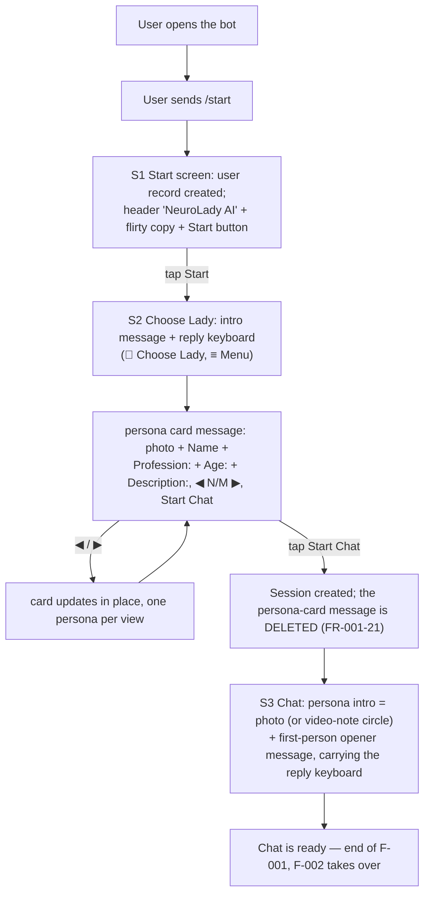
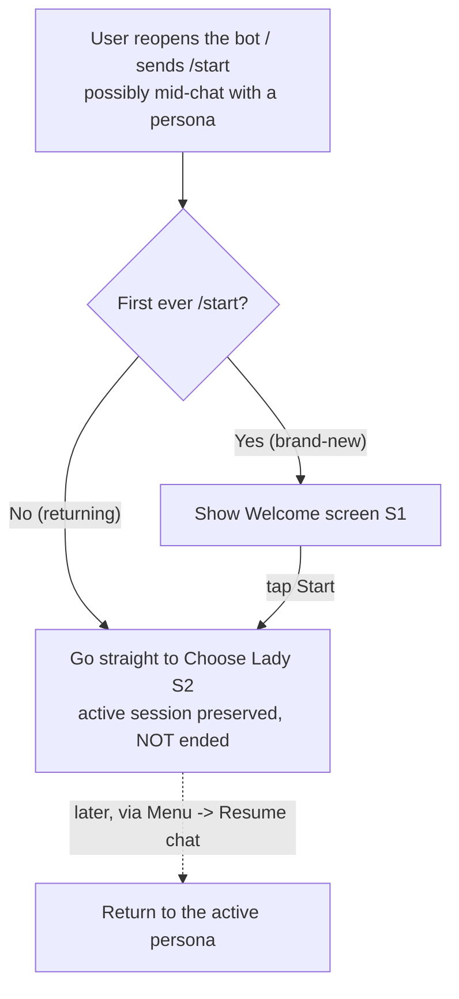
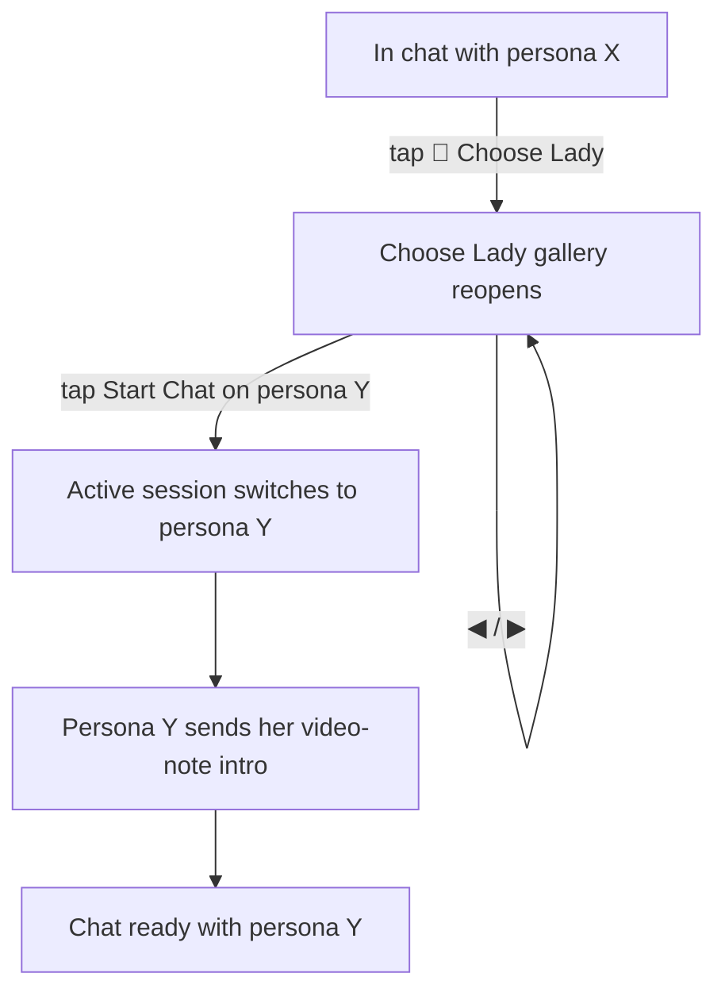

# F-001 — Onboarding & Persona Selection ("Choose Lady")

- **Status:** Draft
- **Summary:** A new user opens the Telegram bot, sees a welcome screen, browses the "Choose Lady"
  persona card carousel, picks a persona, receives her video-note ("circle") intro, and lands in a
  ready-to-use chat — entirely button-driven, with almost no typing. This feature covers everything
  up to the point the chat is ready; the actual message ↔ reply conversation loop and long-term
  memory are **out of scope** (see F-002).

> **Scope boundary.** F-001 ends the moment the chat session is open, the reply keyboard is shown,
> and the persona's intro video note has been delivered — i.e. the user is *ready* to talk. Sending
> a message and getting an in-character LLM reply (with memory/context assembly) is **F-002**.
> Monetization (free-message quota, subscriptions) is deferred and not part of this feature
> (architecture.md §3.7). Adult/age-consent gating belongs to the intimate-content feature, not
> onboarding — F-001 follows the plain reference flow `/start → Welcome → Choose Lady → chat`
> (architecture.md §1.1).

---

## 1. User stories

- **US-001-01** — As an **A1 Russian-speaking Gen-Z user**, I want to **start and get to a real-
  feeling girl with almost no setup** so that **I reach the fun part immediately and it's worth
  screenshotting**.
  _Narrative:_ he opens the bot, taps **Start**, swipes through a few distinct girls, taps
  **Start Chat** on the one he likes, and within seconds she sends a video circle that already looks
  like a real person filmed it.

- **US-001-02** — As an **A2 lonely user**, I want the **first contact to feel warm and personal**
  so that **it feels like meeting someone, not launching an app**.
  _Narrative:_ he taps Start, is greeted in a warm, inviting tone, picks a girl, and her video-note
  intro feels like she's actually saying hi to him.

- **US-001-03** — As an **A7 older user re-entering dating (low tech comfort)**, I want
  **onboarding to be dead simple with no commands to learn** so that **I'm not intimidated**.
  _Narrative:_ he presses Start, taps the arrows to look at a couple of women, taps Start Chat, and
  he's in — never typing a command beyond opening the bot.

- **US-001-04** — As an **A8 novelty / skeptic user**, I want to **see a roster of distinct,
  believable personas and immediately test realism** so that **I can judge "can it fool me?"**.
  _Narrative:_ he browses the carousel reading each girl's name/profession/age/description, notices
  they're genuinely different people, picks one, and scrutinizes her video-note intro for artifacts.

- **US-001-05** — As a **returning user**, I want to **come back and resume with the same girl
  without redoing setup** so that **it feels continuous, like a relationship I left and returned to**.
  _Narrative:_ he reopens the bot the next day, and he's back with the same persona and her keyboard,
  not thrown into onboarding again.

- **US-001-06** — As **any B2C user**, I want to **switch to a different girl at any time from the
  chat** so that **I stay in control of who I'm talking to**.
  _Narrative:_ mid-chat he taps **💋 Choose Lady**, the gallery reopens, he picks another persona,
  and the active chat switches to her.

---

## 2. User flows

### First-time user


### Returning user


### Switching persona from chat


---

## 3. Use cases (Gherkin)

```gherkin
Feature: F-001 Onboarding & Persona Selection

  Scenario: UC-001-01 First-time user starts the bot and sees the welcome screen
    Given a user has never used the bot before
    When the user sends the /start command
    Then a user record is created with their Telegram id and locale
    And the Welcome screen is shown with the "NeuroLady AI" header, flirty welcome copy,
        and a single "Start" inline button

  Scenario: UC-001-02 Tapping Start opens the Choose Lady gallery
    Given a user is on the Welcome screen
    When the user taps the "Start" button
    Then an intro message is shown
    And the first persona card is displayed with photo, name, profession, age,
        and a first-person description
    And a position counter like "1/N" and ◀ / ▶ controls are shown
    And a "Start Chat" button is shown under the card

  Scenario Outline: UC-001-03 Browsing the persona carousel
    Given a user is viewing persona card at position "<from>" of "<total>"
    When the user taps "<control>"
    Then the card at position "<to>" is displayed
    And the counter updates to "<to>/<total>"

    Examples:
      | from | total | control | to |
      | 1    | 5     | ▶       | 2  |
      | 2    | 5     | ▶       | 3  |
      | 2    | 5     | ◀       | 1  |
      | 1    | 5     | ◀       | 5  |
      | 5    | 5     | ▶       | 1  |

  Scenario: UC-001-04 Starting a chat delivers the video-note intro and a ready chat
    Given a user is viewing a persona card in the gallery
    When the user taps "Start Chat"
    Then a session is created (or reused) for that user and persona
    And the persona sends her intro as a Telegram video note (circle)
    And a reply keyboard with "💋 Choose Lady" and a menu (≡) button is shown
    And the chat is ready for the user to send a message

  Scenario: UC-001-05 /start always goes to Choose Lady, even mid-chat
    Given a user has previously onboarded and has an active session with a persona
    When the user sends /start while in that chat
    Then the user record is not duplicated
    And the user is taken to the Choose Lady screen (not resume-locked into the chat)
    And the active session is preserved so "Resume chat" in the menu still returns to that persona

  Scenario: UC-001-06 Switching persona from within the chat
    Given a user is in a chat with persona X
    When the user taps "💋 Choose Lady"
    And the user taps "Start Chat" on persona Y
    Then the active session switches to persona Y
    And persona Y sends her video-note intro

  Scenario: UC-001-07 Double-tap on Start Chat is idempotent
    Given a user is viewing a persona card
    When the user taps "Start Chat" twice in quick succession
    Then only one session is active for that user and persona
    And only one video-note intro is sent

  Scenario: UC-001-08 Persona without an intro video note falls back gracefully
    Given a persona has no stored intro video note
    When the user taps "Start Chat" on that persona
    Then the chat still opens and the reply keyboard is shown
    And a fallback intro (text and/or photo) is sent instead of the circle
    But the flow never breaks or leaves the user on a dead screen

  Scenario: UC-001-09 Russian-locale user sees Russian copy and personas
    Given a new user whose Telegram locale is Russian
    When the user sends /start and opens the gallery
    Then the system copy and persona card copy are shown in natural Russian
    And Russian-speaking personas are presented to this user
```

---

## 4. Requirements

### Functional

- **FR-001-01** — On `/start` from a Telegram id with no existing user, the system must create a
  `USER` record (telegram_id, locale, created_at) exactly once.
- **FR-001-02** — On `/start`, the system must display the Welcome screen: the "NeuroLady AI"
  header/title, the flirty welcome copy, and a single full-width **"Start"** inline button.
- **FR-001-03** — Tapping **"Start"** must open the "Choose Lady" screen (S2) as **two messages**:
  (a) an **intro message** that also carries the **persistent reply keyboard** (`💋 Choose Lady` +
  `≡ Menu`), and (b) a separate **persona card** message for the first persona. Navigation later
  updates the card message **in place** (architecture.md §1.1/§1.2).
- **FR-001-04** — The persona card must show the persona's **gallery photo** on top (a Telegram photo
  message; when no photo exists yet it degrades to a text-only card), followed by the card body:
  **`{Name}`**, a **`Profession: {…}`** line, an **`Age: {…} years`** line, and a first-person
  **`Description: {…}`** block — the labels and copy in the **persona's own language** (FR-001-08),
  from the `PERSONA` gallery-card fields.
- **FR-001-05** — The gallery must show **one persona per view** with a position counter
  (`"<index>/<total>"`) and **◀ / ▶** controls to move between personas.
- **FR-001-06** — ◀ / ▶ navigation must be **cyclic**: ▶ past the last card wraps to the first, ◀
  before the first wraps to the last.
- **FR-001-07** — The gallery must list only personas with `status = active`, in a **deterministic,
  stable order** (same order on repeat visits within the roster).
- **FR-001-08** — Persona card copy must be presented in the **persona's own language**, and the
  gallery must present personas appropriate to the **user's locale** (Russian-speaking personas to a
  Russian-locale user, English to an English-locale user).
- **FR-001-09** — Each card must carry a **"Start Chat"** inline button.
- **FR-001-10** — Tapping **"Start Chat"** must create a `SESSION` for `(user, persona)` (or reuse an
  existing one) and set it to the active/started state.
- **FR-001-11** — On starting a chat (S3), the selected persona must send her **intro**: her
  **photo** (or a Telegram **video note / circle** from `intro_videonote_ref` when available) **plus
  a first-person opener message** in her voice that invites a reply. The opener and reply keyboard
  ride on that single intro message (see FR-001-12).
- **FR-001-12** — After the intro, the system must show a **reply keyboard** containing a
  **"💋 Choose Lady"** button and a **menu (≡)** button, leaving the chat ready for input. The
  keyboard must be attached to the **intro delivery itself** (the video note or the FR-001-18
  fallback message) — the system must **not** send a second, separate "ready to chat" text right
  after the intro, since the intro already invites a reply; stacking two consecutive nudge
  messages reads as unnatural/robotic (see `user_metrics.md` conversational-realism bar).
- **FR-001-13** — Tapping **"💋 Choose Lady"** from the chat must reopen the "Choose Lady" gallery.
- **FR-001-14** — Selecting a different persona via "Start Chat" must **switch the active session** to
  that persona and send her intro.
- **FR-001-15** — On `/start` from an **existing** user, the system must **not** create a duplicate
  `USER` record and must take the user **straight to the Choose Lady screen (S2)** — a brand-new
  user (first ever `/start`) sees the Welcome screen (S1); a returning user is dropped directly on
  the gallery. `/start` **never resume-locks** the user into a chat: **even if they are mid-chat
  with a persona**, `/start` sends them to the Choose Lady main screen. The active session is
  **preserved** (not ended), so the user can still return to that persona via the menu's **Resume
  chat** (FR-001-16); it is simply not what `/start` does.
- **FR-001-16** — The main menu (≡) must expose at least **Choose Lady** and **Resume chat** actions,
  each reachable in one tap.
- **FR-001-17** — Repeated taps of **"Start"** or **"Start Chat"** (double-tap / rapid resend) must be
  **idempotent**: no duplicate session and no duplicate intro video note.
- **FR-001-18** — If a persona has no `intro_videonote_ref`, the system must **fall back gracefully**
  (send a text and/or photo intro), still open the chat, and never leave the user on a broken/dead
  screen.
- **FR-001-19** — The entire onboarding flow must be completable **without typing any command beyond
  `/start`** — every step is a tap on an inline/reply button.
- **FR-001-20** — The video note (or fallback media) delivered on "Start Chat" must belong to the
  **selected** persona (correct persona ↔ media linkage).
- **FR-001-21** — On tapping **"Start Chat"**, the system must **delete the persona-card message**
  (the one carrying the `◀ N/M ▶` + `Start Chat` inline keyboard) as it transitions to S3, so the
  now-stale gallery card does not linger above the chat. If the delete fails (e.g. message already
  gone), the flow must continue regardless.
- **FR-001-22** — Both the **S2 persona card** (the "choose a girl" moment) and the **S3 first
  message** (the persona's opener) must **include the persona's photo** when one exists in her media
  library: the card as a photo message with the card body as its caption, and the opener as a photo
  with the opener text as its caption (falling back to text-only when no photo exists yet —
  FR-001-18). Photos are stored under `media/<persona_slug>/…` (architecture.md §5.1/§6.3) and
  referenced by `PERSONA.gallery_photo_ref`.

### Non-functional

- **NFR-001-01** — The Welcome screen must be delivered in **under 3 seconds** after `/start` under
  normal conditions.
- **NFR-001-02** — ◀ / ▶ carousel navigation must update the card in **under 1 second** (feels
  instant).
- **NFR-001-03** — The video-note intro must **begin sending within 3 seconds** of tapping
  "Start Chat" (media is pre-stored, not generated on the hot path).
- **NFR-001-04** — All user-visible copy must be correctly **localized** (natural Russian for
  ru-locale users, English for en-locale users) — no mixed-language or template-looking text.
- **NFR-001-05** — Onboarding must remain correct and within its latency budget under **concurrent
  load** (many simultaneous new users); p95 within the agreed degraded budget.
- **NFR-001-06** — If a Telegram send fails, the system must **retry with backoff** and not crash;
  the user must still reach the next screen.
- **NFR-001-07** — Onboarding must be **fully button/tap-driven**, and every screen must offer a
  one-tap path back to the gallery or main menu.
- **NFR-001-08** — `USER` and `SESSION` state must **survive a service restart** so a returning user
  is recognized and resumes (persistence).
- **NFR-001-09** — Onboarding actions must affect **only the acting user's** own records; no
  cross-user data access or leakage, and the Telegram id/update must be validated as authentic.
- **NFR-001-10** — Carousel navigation must be **stateless-safe / idempotent**: rapidly repeated ◀/▶
  taps must never desync the displayed card from its counter.
- **NFR-001-11** — The bot process must **survive a transient Telegram connectivity failure at
  startup** (e.g. a DNS/network blip on the initial `getMe` check) by **retrying with capped
  exponential backoff indefinitely**, rather than crashing and exiting — generalizes NFR-001-06 to
  the process level (architecture.md §6.1).
