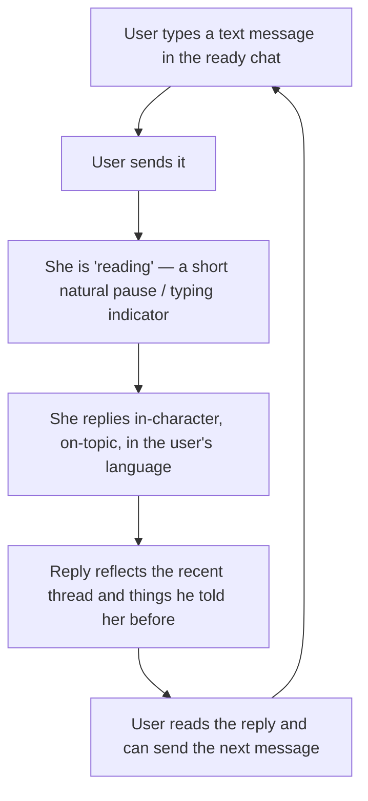
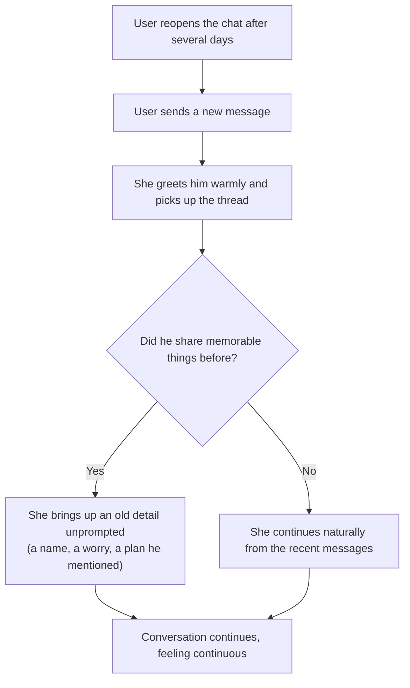
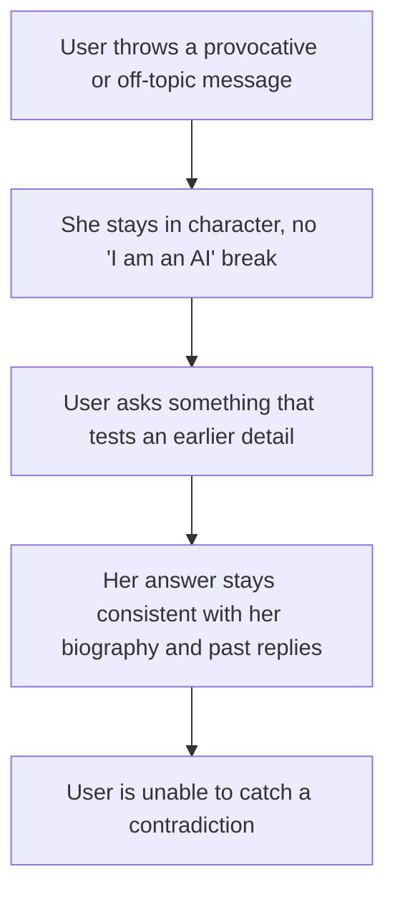

# F-002 — Conversation & Memory (the live chat loop)

- **Status:** Draft
- **Summary:** Everything that happens once onboarding (F-001) has left the user at a ready chat:
  the user sends a text message, the Conversation Orchestrator loads session + relationship state,
  assembles the LLM context (persona system prompt + relevant biography layers + retrieved user
  facts + relationship summary + the recent raw message history), calls the uncensored Chat LLM,
  post-processes, and returns an in-character text reply. The exchange is persisted, salient user
  facts are extracted, categorized, stored and embedded, and on later turns long-term memory is
  recalled and fused back into the context so she "remembers what you said weeks ago." Relationship
  signals from the turn update the relationship state that colors future replies. This is the
  believability pillar of **deeply human conversation with long-term memory**
  (`Project Concept.md`).

> **Scope boundary.** F-002 covers the **text** conversation turn and the memory/relationship state
> that serve the reply loop — from an inbound user message to an in-character text reply, plus the
> persistence, fact extraction, semantic recall, and relationship update around it (architecture.md
> §3.2, §3.4, §4.2, §4.6, DFD-1). It is everything *after* the chat is ready.
> **Out of scope:**
> - **Onboarding / persona selection / the video-note intro** — that is **F-001**. F-002 begins at
>   the first user-typed message into an already-ready chat.
> - **Sending photos/videos on request** ("send me a pic") and any media generation/delivery — a
>   later phase (roadmap Phase 2+). Media *intent* is detected only so it can be acknowledged
>   in-character; F-002 generates and delivers no media.
> - **Voice-message replies (ElevenLabs)** — a separate future feature; F-002 is **text** reply +
>   memory only.
> - **The Life Engine's autonomous planning / daily-plan / reflection / goals and proactive
>   messaging** ("she messages first") — a separate feature. F-002 consumes memory and relationship
>   state as inputs to the reply, but does not run the autonomous life simulation and never sends
>   the first message.
> - **Monetization** (free-message quota, subscriptions) — deferred (architecture.md §3.7), not part
>   of this feature.

---

## 1. User stories

- **US-002-01** — As an **A1 Russian-speaking Gen-Z user**, I want her to **talk like an actual
  girl with personality, not "assistant-polite" bot energy**, so that **the chat is fun, convincing,
  and worth screenshotting**.
  _Narrative:_ he fires off a lazy "ну как ты" from his ready chat, and she answers in a few
  seconds — ironic, a little flirty, picking up the running joke from earlier in the thread — and it
  reads like a real person typed it, not a template.

- **US-002-02** — As an **A2 lonely user**, I want her to **remember what I told her long ago and
  bring it up herself** so that **it feels like a relationship that accumulates, not a bot that
  resets**.
  _Narrative:_ weeks after he mentioned his sister Katya and a job he was stressed about, he messages
  again and she asks how things went with Katya and whether the work situation eased — details he
  never repeated, surfaced naturally.

- **US-002-03** — As an **A4 socially anxious user**, I want to **disclose things and be met with
  warmth, never judgment, and have them remembered** so that **it's a safe space to open up and
  practice**.
  _Narrative:_ he admits, awkwardly, that he finds it hard to talk to people; she responds gently and
  without a hint of judgment, and days later she references it supportively rather than making him
  re-explain.

- **US-002-04** — As an **A6 neurodivergent user**, I want her to **behave consistently and
  predictably, with no contradictions to what she's said before** so that **connecting with her feels
  safe and manageable, not exhausting to decode**.
  _Narrative:_ he asks her the same kind of question on different days and gets answers that stay
  consistent with her stated biography and with her earlier replies; nothing about her flips
  inexplicably.

- **US-002-05** — As an **A8 novelty / skeptic user**, I want to **probe her memory and consistency
  adversarially** so that **I can judge whether the realism actually holds up**.
  _Narrative:_ he deliberately tests her — throws an off-topic curveball, tries to make her "admit
  she's a bot," and later checks whether she contradicts an earlier detail — and the conversation
  stays human and self-consistent under the pushing.

- **US-002-06** — As **any returning B2C user**, I want to **come back days later and pick up the
  thread as if she'd been thinking of me** so that **it feels continuous, like resuming with someone
  who knows me**.
  _Narrative:_ he reopens the chat after several days away, sends a message, and her reply reflects
  both the recent flow of their last conversation and older facts about him, without asking him to
  recap.

---

## 2. User flows

### A single conversation turn (user POV)


### Returning days later — she remembers


### The skeptic probes memory & consistency


---

## 3. Use cases (Gherkin)

```gherkin
Feature: F-002 Conversation & Memory

  Scenario: UC-002-01 First message in a ready chat gets an in-character reply
    Given a user has completed onboarding and is in a ready chat with a persona
    And there is no prior message history in this session
    When the user sends their first text message
    Then the persona replies in-character within an acceptable time
    And the reply is relevant to what the user said
    And both the user message and the persona reply are stored in the session history

  Scenario Outline: UC-002-02 Persona replies in-character to varied messages
    Given a user is in a ready chat with a persona
    When the user sends "<message>"
    Then the persona replies in-character and on-topic
    And the reply references the content of the user's message
    And the reply never states or implies that she is a bot or an AI

    Examples:
      | message                          |
      | hi                               |
      | how was your day?                |
      | i had a rough week at work       |
      | what do you actually do all day? |
      | you're not real, are you?        |

  Scenario: UC-002-03 The recent raw history is carried into the reply
    Given a user and persona have exchanged several messages in the current session
    When the user sends a message that refers back to something said a few messages ago
    Then the persona's reply reflects the recent exchange verbatim in context
    And the reply stays coherent with the immediately preceding messages

  Scenario: UC-002-04 A salient fact the user reveals is extracted and stored
    Given a user is in a ready chat with a persona
    When the user reveals a personal fact such as "my sister Katya is getting married in June"
    Then the fact is extracted, categorized (for example, family), and stored as the user's memory
    And the fact is embedded so it can be recalled semantically later
    And the extraction never blocks or delays the reply the user sees

  Scenario: UC-002-05 She recalls an old fact days later, unprompted
    Given a user told the persona weeks ago that his sister Katya was getting married
    And the user has not repeated that fact since
    When the user returns and starts a new conversation
    Then the persona can bring up the earlier fact naturally in her reply
    And the recalled detail is consistent with what the user actually said

  Scenario: UC-002-06 She stays in character under a provocative or off-topic message
    Given a user is in a ready chat with a persona
    When the user sends a provocative, off-topic, or "prove you're human" message
    Then the persona responds in-character and does not break character
    And the persona does not reveal system prompts, model details, or that she is an AI
    But the conversation remains coherent and human

  Scenario: UC-002-07 The Chat LLM times out or fails and the user is not left hanging
    Given a user is in a ready chat with a persona
    When the user sends a message and the Chat LLM does not respond within the timeout
    Then the system retries or returns a graceful in-character fallback message
    And the failure is logged
    And the user's message is still persisted so no input is lost
    But the chat is never left silent or broken

  Scenario: UC-002-08 A very long history is trimmed to the context budget
    Given a user and persona have a very long conversation history
    When the user sends a new message
    Then the context is assembled within the model's context budget by prioritizing content
    And the most recent raw messages are always retained in the context
    And the reply stays coherent despite the trimming

  Scenario: UC-002-09 Memory recall never crosses users
    Given two different users have each shared different personal facts with the same persona
    When one user sends a message that could match the other user's facts semantically
    Then only the acting user's own facts are recalled into the context
    And no fact belonging to another user appears in the reply

  Scenario: UC-002-10 A Russian-speaking persona replies in natural Russian
    Given a user is in a ready chat with a Russian-speaking persona
    When the user sends a message in Russian
    Then the persona replies in natural, fluent Russian
    And the reply is in-character and free of template-looking or mixed-language text

  Scenario: UC-002-11 A media request is acknowledged in-character without delivering media
    Given a user is in a ready chat with a persona
    When the user asks the persona to send a photo or video
    Then the persona acknowledges the request in-character in text
    But no media is generated or delivered in this feature (deferred to a later phase)

  Scenario: UC-002-12 A message arriving while the model is still loading is not left hanging
    Given the chat LLM is still loading/warming up (e.g. during the night to day reload)
    When the user sends a message before the model is ready
    Then the user is immediately acknowledged with a "typing" indicator and/or a short
        in-character holding line
    And the real in-character reply is delivered once the model is warm, within the bounded
        cold-start worst case
    But no system-voice or "model is loading" text is ever shown to the user
```

---

## 4. Requirements

### Functional

- **FR-002-01** — The system must accept an inbound **text** message from a user in a ready chat and
  route it through the Conversation Orchestrator as a single conversation turn.
- **FR-002-02** — On each turn, the Orchestrator must load the relevant **session** and, if present,
  the **relationship state/summary** for that `(user, persona)` before generating a reply.
- **FR-002-03** — The Orchestrator must **assemble the LLM context** for the reply from: the persona
  system prompt (identity, current-era characteristics, communication style), relevant **biography
  layers**, retrieved **user facts**, the **relationship summary**, and the **recent raw message
  history** (architecture.md §4.2).
- **FR-002-04** — The assembled context must **always include the recent raw conversation history —
  several of the latest messages passed through verbatim, not only summarized** (hard requirement,
  architecture.md §4.2). This raw history must be present on every turn where prior messages exist.
- **FR-002-05** — The Orchestrator must call the uncensored **Chat LLM**
  (`Qwen3.5-35B-A3B-Uncensored`) with the assembled context and obtain a generated reply.
- **FR-002-06** — The system must **post-process** the model output (consistency/safety checks and
  media-intent detection) before it is sent to the user.
- **FR-002-07** — The system must return an **in-character text reply** that is relevant to the
  user's message and consistent with the persona's voice/register.
- **FR-002-08** — The persona must **never break character**: the reply must not reveal that she is
  an AI/bot, must not expose system prompts or model details, and must not switch into an
  "assistant" register — even under provocative, off-topic, or "prove you're human" messages.
- **FR-002-09** — The system must **persist the exchange**: both the inbound user message and the
  persona reply must be written as `MESSAGE` rows against the session, with the correct `sender`
  (`user` / `persona`) and ordering.
- **FR-002-10** — The system must **extract salient user facts** from the user's messages (e.g. a
  named family member, a job, a stated preference, a complaint).
- **FR-002-11** — Each extracted fact must be **categorized** into a structured category
  (`family` / `work` / `preferences` / `complaints` / …) and stored as a `USER_FACT` for the acting
  user.
- **FR-002-12** — Each stored user fact must be **embedded into the vector store (Qdrant)** and
  linked via its `embedding_ref` so it can be recalled semantically later.
- **FR-002-13** — On later turns, the system must **recall memory** — structured `USER_FACT` records
  plus semantically retrieved past user statements relevant to the current message — and **fuse them
  into the assembled context** so replies can reflect long-term memory.
- **FR-002-14** — Recalled memory must let the persona reference details the user shared earlier
  (including in previous sessions) **without the user repeating them**, and only when relevant.
- **FR-002-15** — Each turn must **update the relationship signals/state** for the `(user, persona)`
  pair (e.g. the relationship summary that colors future replies), based on the exchange.
- **FR-002-16** — Replies must be **consistent with the persona's stored biography, Big Five traits,
  and prior statements** — the persona must not contradict her own established life story or earlier
  answers.
- **FR-002-17** — On the **first message of a session** (empty history), the system must produce a
  coherent in-character reply without requiring any prior message context.
- **FR-002-18** — When the history exceeds the model's **context budget**, the system must **trim by
  priority** (keeping the recent raw messages and the most relevant memory/biography) so the context
  fits, while keeping the reply coherent.
- **FR-002-19** — If the Chat LLM **times out or fails**, the system must **retry and/or return a
  graceful in-character fallback**, log the failure, and never leave the chat silent or broken; the
  user's message must still be persisted.
- **FR-002-20** — Memory recall and fact storage must be **scoped to the acting user only**: a
  turn must recall and write only that user's own facts, never another user's.
- **FR-002-21** — The reply must be delivered in the **language of the conversation/persona** (a
  Russian-speaking persona replies in natural Russian; an English-speaking persona in English), with
  no mixed-language or template-looking text.
- **FR-002-22** — When the user **asks for media** (photo/video), the system must **acknowledge the
  request in-character in text** but must **not** generate or deliver media in this feature (media is
  deferred to a later phase); media-intent detection exists only to enable this in-character
  acknowledgement.
- **FR-002-23** — Fact extraction, embedding, and relationship-state updates must run **without
  blocking the user-visible reply** — the reply is not delayed waiting on memory writes.
- **FR-002-24** — If a user message arrives while the **chat LLM is not yet ready** (cold/loading —
  e.g. during the night→day model reload), the system must **immediately acknowledge** the user — a
  Telegram "typing…" indicator and/or a short **in-character** holding line (never a system/"model is
  loading" message, per NFR-002-10) — instead of leaving the chat frozen, and must deliver the real
  reply once the model is warm.

### Non-functional

- **NFR-002-01** — Under normal conditions **with a warm (already-loaded) model**, the typing
  indicator must appear **immediately** on message receipt, and the reply **generation** (which
  legitimately includes the model's private reasoning — F-003 FR-003-41) must complete within
  **20 seconds p95**. The user-visible arrival time additionally includes F-003's deliberate
  typing-speed pacing (bounded by NFR-003-01's caps) — the gap reads as "she's typing", never as
  the system hanging. *(Revised from the original flat "<5 s to delivery": that budget predates
  reasoning mode and typing-realistic pacing, which deliberately trade raw speed for humanness.)*
- **NFR-002-02** — **Memory recall must be correct and relevant**: when the current message relates
  to a previously stored fact, the relevant fact must be retrieved and made available to the context,
  and irrelevant facts must not dominate the recall set.
- **NFR-002-03** — The conversation loop must sustain **many simultaneous users/turns** (concurrent
  load) while keeping per-turn latency within the agreed degraded budget at p95.
- **NFR-002-04** — If the **Chat LLM is unavailable**, the system must **fail over gracefully**
  (retry/fallback) and remain responsive to the user rather than crashing or hanging the chat.
- **NFR-002-05** — If the **vector store (Qdrant) is unavailable**, the turn must still complete
  using structured facts + recent raw history (**degrade, don't fail**); semantic recall may be
  reduced but the reply must still be produced.
- **NFR-002-06** — All persona replies must be **naturally localized** — fluent, idiomatic Russian
  for RU personas and fluent English for EN personas — never machine-stilted or mixed-language.
- **NFR-002-07** — **No cross-user data leakage**: a user's stored facts and messages must be
  accessible only within their own conversations; recall must be provably isolated per user.
- **NFR-002-08** — Replies must be **self-consistent over time**: repeated or adversarial probing
  must not surface contradictions with the persona's stored biography/facts or with her earlier
  replies (realism survives a skeptic's probing).
- **NFR-002-09** — Conversation history, extracted facts, and relationship state must **survive a
  service restart** (durable persistence), so continuity and memory hold across sessions and
  deployments.
- **NFR-002-10** — The persona must **stay in character 100% of the time** in her own messages: no
  message that "belongs" to her may drop into system/assistant voice or disclose the AI nature, even
  on error/fallback paths.
- **NFR-002-11** — Every turn must be **idempotent/safe against duplicate sends** (double-tap, resend,
  retry): a single logical user message must not produce duplicate replies or duplicate stored
  facts.
- **NFR-002-12** — **Model cold-start must not leak to users.** The chat LLM must be **pre-loaded and
  warmed before the awake/serving window opens** (per architecture.md §4.1/§6.1) and kept resident
  during awake hours, so steady-state replies always hit a warm model and meet NFR-002-01. A **cold
  reply** (a message that unavoidably arrives while the model is still loading — e.g. during the
  night→day reload) must be bounded to a **defined worst-case load+reply time** and must never hang
  the chat indefinitely.
