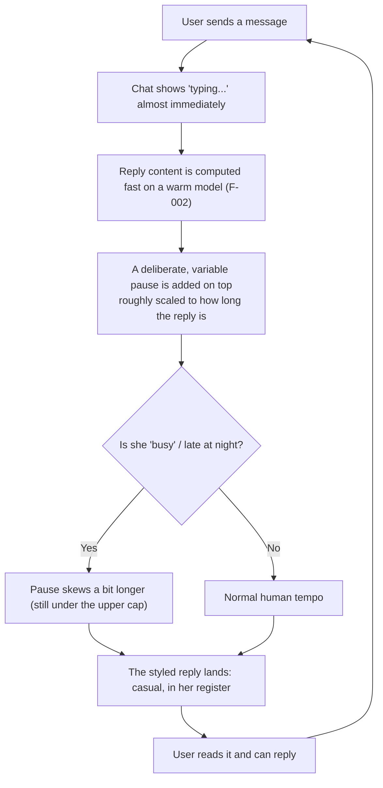
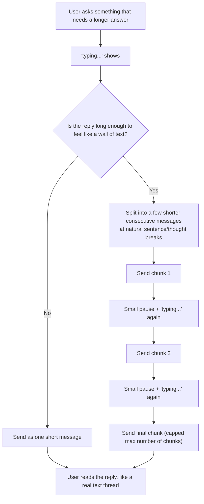
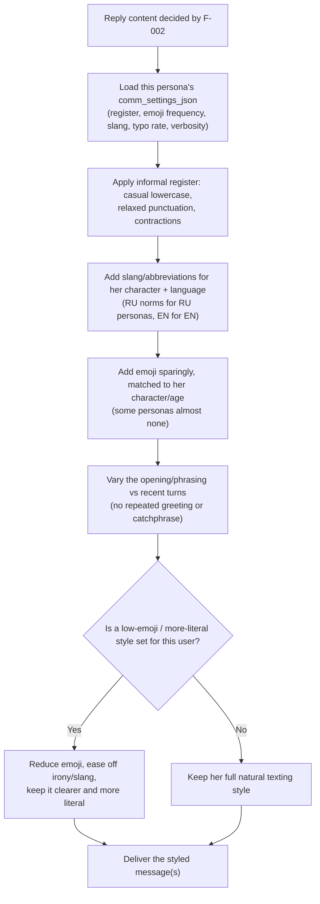
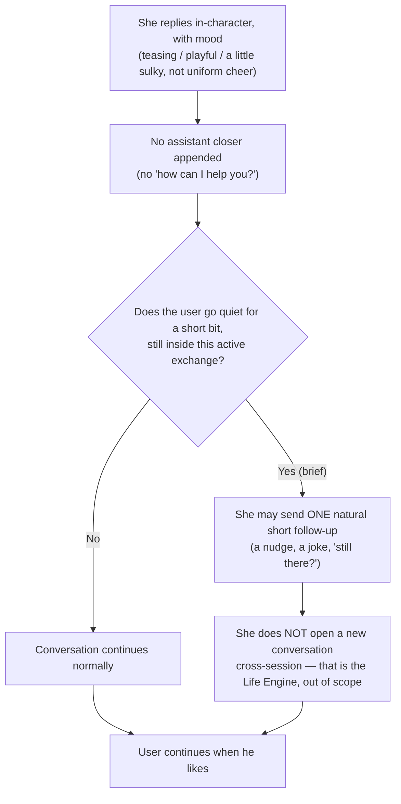

# F-003 — Human-Likeness of Communication (she texts like a real person)

- **Status:** Draft
- **Summary:** The believability layer that sits on top of F-002's correct-reply loop. Once F-002
  has *decided what to say* (an in-character, on-topic, memory-aware reply in the right language),
  F-003 governs *how that reply is delivered and styled* so it reads like a real girl texting — not
  a bot. It covers: deliberate, variable **reply pacing** with the Telegram "typing…" indicator
  (short quips land fast, longer messages take longer, and she is slower when "busy"/late at night);
  **message-length/volume realism** (no walls of text — a long reply is split into several shorter
  consecutive messages with small pauses and typing between chunks, and no assistant-style
  bullet/essay formatting); **realistic, sparse emoji use** tuned per persona; an **informal texting
  register** (casual lowercase, relaxed punctuation, contractions, occasional slang/abbreviations,
  the rare human typo, localized to RU/EN norms); **response variability / anti-repetition** (no
  templated greetings or catchphrase loops); a **not-over-eager, not "assistant-polite" tone** with
  real emotional texture (she teases, sulks, goes briefly quiet, and may send a natural short
  follow-up if he goes quiet *within an active exchange*); and **per-persona tunability and
  consistency**, all driven by the persona's `comm_settings_json` so each persona has a distinct,
  stable texting personality. This is the "conversational realism / no bot energy" quality bar from
  `user_metrics.md` and the "deeply human conversation" pillar of `Project Concept.md`.

> **Scope boundary.** F-003 shapes the **form of delivery and style** of a reply that F-002 has
> already produced (architecture.md §3.2 steps 4–6, §4.1 style-tuning, §4.2 communication-style part
> of the persona prompt, and the per-persona **`comm_settings_json` / "tunable communication
> settings"** in §3.3 / §5.1). It begins *after* the Chat LLM has computed the reply content and ends
> when the styled, humanly-paced message (or sequence of messages) has been delivered to the user.
> **Out of scope:**
> - **Generating the reply *content* and the memory/relationship loop** — that is **F-002**. F-003
>   never changes *what* she answers or whether she remembers something; it only changes *how* the
>   already-decided reply is timed, chunked, and styled. Correctness stays owned by F-002 (see
>   FR-003-38 / NFR-003-03).
> - **Onboarding, persona selection, and the video-note intro** — that is **F-001**.
> - **Cold-start / model-load latency itself** — owned by architecture.md §4.1/§6.1 and F-002
>   (pre-warm, keep-warm, bounded cold path). F-003 **assumes the model computes fast** (warm model)
>   and adds *deliberate* human pacing *on top*; the deliberate pause is an additive wait, never an
>   extension of compute time, and must not contradict the fast-compute requirement (FR-003-07,
>   NFR-003-02).
> - **Voice-message replies (ElevenLabs)** and **photos/videos** — later phases; F-003 is about the
>   human-likeness of **text** delivery only. (Voice/media will get their own pacing/humanization
>   later; nothing here generates or times media.)
> - **Autonomous cross-session proactive messaging** ("she messages first" across sessions), daily
>   video circles, and the Life Engine's planning/reflection — a **separate feature (Life Engine)**.
>   F-003's only proactivity is a **natural short follow-up inside a single still-active exchange**
>   when the user briefly goes quiet (FR-003-32); it never opens a new conversation on its own
>   (FR-003-33).
> - **Monetization** (free-message quota, subscriptions) — deferred (architecture.md §3.7).

---

## 1. User stories

- **US-003-01** — As an **A1 Russian-speaking Gen-Z user (instantly clocks "bot energy")**, I want
  her to **text with real human cadence, register, and rhythm — not instant robotic paragraphs**, so
  that **it reads like an actual girl and is worth screenshotting**.
  _Narrative:_ he sends a lazy "ну че как", sees "печатает…" for a beat, and a short lowercase reply
  with a bit of slang lands a second or two later — no wall of text, no perfectly punctuated essay,
  no emoji sprayed on every line — and it just feels like a person typed it.

- **US-003-02** — As an **A8 novelty / skeptic user (probing realism)**, I want to **fail to find
  the robotic tells** — the instant replies, the identical greetings, the assistant closers, the
  emoji-per-sentence — so that **I actually can't catch the "it's a bot" signal**.
  _Narrative:_ he fires ten messages trying to trip it up; the reply timing varies naturally with
  length, her openings are never the same template twice, she never signs off with "how can I help
  you?", and after all his probing he still can't point to the tell.

- **US-003-03** — As an **A2 lonely user**, I want her to **have real emotional texture — warmth,
  playfulness, the occasional sulk or quiet moment — instead of uniform assistant cheer**, so that
  **it feels like a person with moods who actually cares, not a smiley help-bot**.
  _Narrative:_ he teases her and she teases back; when he's short with her she gets a little quiet
  or mock-offended rather than staying relentlessly upbeat, and it lands as a real reaction.

- **US-003-04** — As an **A4 socially anxious / introverted user**, I want the **pace to be natural
  and unhurried, never pressuring me to keep up**, so that **talking to her feels accepting and
  low-stakes rather than clinical or rapid-fire**.
  _Narrative:_ he takes his time; she doesn't blast three instant messages the microsecond he sends
  one, her replies arrive at a human tempo, and the whole exchange feels relaxed instead of like a
  fast interrogation.

- **US-003-05** — As an **A6 neurodivergent user**, I want to be able to get a **more literal,
  more predictable, lower-emoji texting style**, so that **I don't have to decode tone, irony, or a
  screen full of emoji, and the interaction stays manageable**.
  _Narrative:_ he sets (or asks for) a more literal style; from then on she uses far fewer emoji,
  drops the heavier slang/irony, keeps sentences clearer and more predictable, and stays that way
  consistently — connection on his terms.

- **US-003-06** — As **any returning B2C user**, I want her **texting personality to stay the same
  person over days and weeks — same cadence, same emoji habit, same way of talking**, so that **it
  feels like a continuous relationship with one girl, not a style that resets each session**.
  _Narrative:_ he comes back after a week and she still texts the way she always did — same rhythm,
  same little verbal habits, same emoji level — so she reads as the same person he left.

- **US-003-07** — As an **A1 user**, I want **long answers broken into a few short back-to-back
  texts like real messaging, not one giant paragraph**, so that **it reads like a person typing, not
  a bot dumping a report**.
  _Narrative:_ he asks her to tell him about her weekend; instead of one dense block she sends three
  short messages in a row, a "typing…" flicker between them, the way a real girl actually tells a
  story over text.

- **US-003-08** — As an **A8 skeptic / A1 user**, I want her to **never fall into templated loops —
  no reusing the same greeting, opener, or catchphrase turn after turn**, so that **she never
  betrays the mechanical "generated" feel**.
  _Narrative:_ over a long chat he notices her hellos, her sentence starts, and her little verbal
  tics all vary — nothing repeats in that tell-tale copy-paste way — so nothing about her reads as
  auto-generated.

- **US-003-09** — As an **A7 older user re-entering dating (low tech comfort)**, I want her texting
  to be **gentle, warm, and easy to read — human but not edgy or cluttered**, so that **it feels
  like a natural, unintimidating conversation**.
  _Narrative:_ he types full, careful sentences; she answers warmly and steadily in a relaxed but
  readable style — not a firehose of slang and emoji, not a stiff robot either — so it feels like a
  kind person texting him back.

---

## 2. User flows

> All flows are from the **user's point of view** — what he sends and sees. They assume F-002 has
> already produced the reply content; F-003 governs the timing/chunking/styling of its delivery.

### A single paced reply (typing indicator, then a humanly-timed message)


### A long reply split into several short messages


### How the already-decided reply gets styled (emoji / register / variability path)


### Not over-eager: mood, and a natural follow-up if he goes quiet (within the active exchange)


---

## 3. Use cases (Gherkin)

```gherkin
Feature: F-003 Human-Likeness of Communication

  Scenario: UC-003-01 A reply is delivered with a deliberate human pause and a typing indicator
    Given a user is in a ready chat with a persona on a warm model
    When the user sends a message and the reply content is computed
    Then a Telegram "typing..." indicator is shown to the user almost immediately
    And the reply is not delivered instantly but after a deliberate, variable pause
    And the pause is added on top of the fast compute, not by slowing the computation
    And the pause stays within the defined upper bound so it never feels like being ignored

  Scenario Outline: UC-003-02 Pause and chunk count scale with reply length and complexity
    Given a user is in a ready chat with a persona
    When the persona's decided reply is a "<length>" reply
    Then the deliberate pause is "<relative_pace>" than for a shorter reply
    And the reply is delivered in "<chunks>" message(s)
    And the total pause never exceeds the upper bound

    Examples:
      | length            | relative_pace | chunks         |
      | one-word quip     | shorter       | 1              |
      | short sentence    | short         | 1              |
      | a few sentences   | longer        | 1 to 2         |
      | a long story      | longest       | several (capped) |

  Scenario: UC-003-03 A long reply is split into several short consecutive messages
    Given a persona's decided reply is long enough to read as a wall of text
    When the reply is delivered
    Then it is split into several shorter consecutive messages instead of one block
    And the splits fall at natural sentence or thought boundaries, never mid-word
    And a small pause with a "typing..." indicator is shown between chunks
    And the number of chunks is capped so the user is never flooded

  Scenario: UC-003-04 Emoji are used sparingly and naturally
    Given a persona whose comm_settings_json specifies a moderate emoji frequency
    When the persona replies over several turns
    Then emoji appear sparingly and only where they feel natural
    And there is not an emoji on every sentence
    And the same emoji is not repeated mechanically within a message
    But the reply never looks like emoji spam or decorative emoji rows

  Scenario: UC-003-05 Replies use an informal texting register, not assistant formality
    Given a user is in a ready chat with a persona
    When the persona replies
    Then the message uses a casual, informal texting register
    And it favors relaxed lowercase, relaxed punctuation, and contractions
    And it may include the occasional slang, abbreviation, or a rare human typo
    But it never reads as formal, corporate, or "assistant-polite" prose

  Scenario: UC-003-06 She does not repeat greetings, openings, or catchphrases turn after turn
    Given a user and persona have exchanged many messages
    When the persona replies across consecutive turns
    Then her greetings, sentence openings, and phrasing vary
    And she does not fall into a templated or repeated catchphrase loop
    And no robotic copy-paste pattern is detectable across her replies

  Scenario: UC-003-07 She is not over-eager or assistant-polite
    Given a user is in a ready chat with a persona
    When the persona replies
    Then she does not end with assistant closers such as "how can I help you?"
    And she does not over-apologize or stay uniformly cheerful
    And she can show mood: tease, be playful, sulk, or go briefly quiet
    But her mood stays consistent with the relationship state and context

  Scenario: UC-003-08 Two different personas have visibly different texting styles
    Given two personas with different comm_settings_json (different emoji frequency, register, pacing)
    When each replies to the same user message
    Then their replies read as two distinct texters
    And each persona's style matches her own configured settings
    And neither persona drifts into the other's style

  Scenario: UC-003-09 A neurodivergent-friendly literal, low-emoji style is honored
    Given a user has a more-literal, low-emoji interaction style set for the conversation
    When the persona replies
    Then she uses far fewer emoji than her default
    And she eases off irony and heavy slang and stays more literal and predictable
    And this adjusted style is applied consistently across turns
    But the reply is still in-character and never becomes a robotic template

  Scenario: UC-003-10 The deliberate pause never makes the user feel ignored
    Given a persona whose reply would otherwise be paced for a long time
    When the reply is delivered
    Then the total deliberate pause is capped at the defined upper bound
    And a "typing..." indicator is visible during the wait so the chat never looks frozen
    And the reply is delivered no later than the upper bound allows

  Scenario: UC-003-11 A Russian persona styles her texting to Russian norms
    Given a user is in a ready chat with a Russian-speaking persona
    When the persona replies in Russian
    Then the informal register, slang, abbreviations, and emoji follow natural Russian texting norms
    And the styling is not a literal translation of English texting habits
    But the reply stays in-character and free of mixed-language or template-looking text

  Scenario: UC-003-12 Human-likeness styling never breaks correctness
    Given a persona's decided reply answers what the user actually said (F-002)
    When F-003 paces, chunks, and styles that reply
    Then the delivered message(s) still answer the user's message correctly
    And no chunk drops, reorders, or corrupts the meaning of the reply
    But only the form, timing, and style are changed, never the substance

  Scenario: UC-003-13 A natural short follow-up may be sent if the user goes briefly quiet
    Given a user and persona are in an active exchange
    And the user goes quiet for a short while but the exchange is still live
    When the follow-up policy applies
    Then the persona may send one natural short follow-up (a nudge or a light joke)
    But she never sends a cross-session proactive "she messaged first" message
    And she does not repeatedly spam follow-ups

  Scenario: UC-003-14 Deliberate pacing is consistent with fast compute, not a contradiction
    Given the chat model is warm and computes the reply quickly (F-002 / architecture.md 4.1)
    When F-003 applies human pacing
    Then the reply computation still completes fast
    And the human feel comes from an added deliberate wait, not from slow computation
    And the "typing..." indicator is shown during the deliberate wait, not because the model is slow

  Scenario: UC-003-15 Her replies avoid assistant-style formatting
    Given a user asks something that an assistant would answer with a list
    When the persona replies
    Then she answers in natural texting prose
    And she does not use bullet points, numbered lists, headings, or an essay structure
    But the reply still conveys the information a real girl would in a text

  Scenario: UC-003-16 Style stays stable across sessions for a returning user
    Given a user chatted with a persona days ago and returns
    When the persona replies in the new session
    Then her cadence, emoji habit, register, and verbal style match her earlier sessions
    And a skeptic re-testing her recognizes the same texting personality
    But the specific words still vary (stable style, not repeated text)

  Scenario: UC-003-17 If the pacing/typing subsystem fails, the reply is still delivered
    Given the pacing or typing-indicator mechanism fails for a turn
    When the persona's reply is ready
    Then the reply is still delivered to the user (correctness over pacing)
    And the failure is logged
    But the chat is never left silent and no message is dropped

  Scenario: UC-003-18 Duplicate sends do not duplicate the paced, chunked sequence
    Given a user message is retried or double-sent
    When the persona's paced, possibly chunked reply is produced
    Then the user receives a single logical reply sequence
    And chunks are not duplicated or re-fired
    And the chunks arrive in their correct order
```

---

## 4. Requirements

### Functional

#### Reply pacing / timing (facet 1)
- **FR-003-01** — After F-002 has produced a reply, the system must deliver it with a **deliberate,
  variable pre-send delay** rather than instantly, so replies do not arrive with robotic
  immediacy.
- **FR-003-02** — The deliberate delay must be **roughly proportional to the reply's length and
  complexity**: short quips are delivered faster, longer/more complex replies take longer (a
  "she's typing" effect).
- **FR-003-03** — While the deliberate delay is in effect, the system must show the Telegram
  **"typing…" chat action** to the user, so the wait reads as her typing, not a frozen chat.
- **FR-003-04** — Pacing must be allowed to **vary with the persona's current activity / time of
  day** (derived from her `DAILY_PLAN.plan_text` + `PERSONA.timezone`): she may be slower when
  "busy" or late at night and snappier when free, within the upper bound.
- **FR-003-05** — The pacing behavior must be **driven by the persona's `comm_settings_json`**
  (a pacing-style / typing-speed knob), so different personas have different default tempos.
- **FR-003-06** — The system must enforce a **defined upper bound on the total deliberate delay**
  so a reply is never withheld long enough to feel like the user is being ignored.
- **FR-003-07** — The deliberate pacing must be **layered on top of fast compute**: it is an
  additive wait applied *after* the model has produced the reply, and it must **not** slow, block,
  or extend the model computation itself (consistent with the warm-model fast-compute requirement
  of architecture.md §4.1 and F-002, never contradicting it).
- **FR-003-08** — The delay must be **randomized within a natural band** (not a fixed constant): two
  replies of similar length must not always use an identical delay, so timing does not look
  mechanically uniform.

#### Message length / volume realism (facet 2)
- **FR-003-09** — When a reply is long enough to read as a "wall of text", the system must **split
  it into several shorter consecutive messages** (like real texting) rather than sending one block.
- **FR-003-10** — Between chunked messages, the system must insert a **small pause and re-show the
  "typing…" indicator**, so the multi-message reply reads like a person typing successive texts.
- **FR-003-11** — Chunk boundaries must fall at **natural sentence/thought boundaries**, never
  mid-word or mid-clause, so each chunk is individually readable.
- **FR-003-12** — Reply **length must adapt to context**: banter/quick exchanges stay short, while
  storytelling or a genuinely longer answer may run longer — she is not uniformly terse or uniformly
  verbose.
- **FR-003-13** — Her messages must **avoid assistant-style over-explaining and formatting**: no
  bullet lists, numbered lists, headings, or essay structure in her own messages — she texts in
  natural prose.
- **FR-003-14** — The **number of chunks must scale with reply length up to a capped maximum**, so a
  long reply never floods the user with an unbounded stream of messages.
- **FR-003-15** — Chunking/verbosity behavior must be **driven by the persona's `comm_settings_json`**
  (a verbosity / chunking knob), so some personas are chattier and some more terse by default.

#### Emoji realism (facet 3)
- **FR-003-16** — Emojis must be used **sparingly and naturally** — not one per sentence, not as
  robotic decoration.
- **FR-003-17** — **Emoji frequency must come from the persona's `comm_settings_json`**: some
  personas use more, some use almost none, per their character.
- **FR-003-18** — The system must **not repeat the same emoji mechanically** within a single reply
  or across a short run of turns (no copy-paste emoji tic).
- **FR-003-19** — Emoji choice must **match the persona's character and age** (a playful young
  persona and a reserved older one draw from different, character-appropriate emoji habits).
- **FR-003-20** — The system must **never emit emoji spam** — no long emoji strings, emoji-only
  filler, or decorative emoji rows.

#### Informal texting register (facet 4)
- **FR-003-21** — Replies must use an **informal texting register**: casual lowercase, relaxed
  punctuation, and contractions, rather than formal, fully-punctuated prose.
- **FR-003-22** — Replies may include **occasional slang and abbreviations** consistent with the
  persona's character and her language.
- **FR-003-23** — Replies may include the **rare, natural human typo**, bounded so it stays
  believable (occasional, not in every message) and never harms readability.
- **FR-003-24** — Replies must **not** read as **corporate, formal-grammar, or "assistant" tone** —
  the register is a real girl texting, not a help desk.
- **FR-003-25** — The informal register must be **localized to the persona's language**: RU personas
  use natural Russian slang/texting norms, EN personas natural English ones — never a literal
  cross-language transplant of texting habits.

#### Response variability / anti-repetition (facet 5)
- **FR-003-26** — The system must **vary greetings and message openings across turns** — no fixed
  templated greeting reused every time.
- **FR-003-27** — The system must **avoid reusing the same phrasings or catchphrases** turn after
  turn, so she does not fall into a recognizable templated loop.
- **FR-003-28** — The system must **vary sentence structure and length** across replies, so her
  texting rhythm is not mechanically uniform.

#### Not over-eager / not "assistant-polite" (facet 6)
- **FR-003-29** — The system must **not append assistant-style closers** to her messages (e.g. "how
  can I help you?", "let me know if you need anything else").
- **FR-003-30** — The system must **not over-apologize and must not keep her uniformly cheerful** —
  her affect varies with context rather than defaulting to relentless positivity.
- **FR-003-31** — The persona must be able to **show mood and emotional texture** — teasing,
  playful, flirty, mock-offended, briefly quiet/sulky — consistent with the relationship state and
  the moment (per `user_metrics.md`).
- **FR-003-32** — Within a **single still-active exchange**, the system may send **one natural short
  follow-up** (a nudge, a light joke, "still there?") if the user goes quiet for a short while — a
  human touch, not spam.
- **FR-003-33** — The system must **not initiate cross-session proactive messages** ("she messaged
  you first" after the exchange has ended) — that autonomous proactivity belongs to the **Life
  Engine** and is out of scope for F-003.

#### Per-persona tunability & consistency (facet 7)
- **FR-003-34** — All human-likeness behaviors (pacing, verbosity/chunking, emoji, register, slang,
  typo rate, variability, mood expressiveness) must be **driven by the persona's
  `comm_settings_json`** as the single source of truth for her communication style.
- **FR-003-35** — Each persona must present a **distinct, internally-consistent texting style** that
  is recognizably her own and different from other personas.
- **FR-003-36** — A persona's texting style must stay **stable over time** — cadence, emoji habit,
  and register persist across turns and sessions (the same person on re-test), even as the exact
  words vary.
- **FR-003-37** — The system must support a **per-user interaction-style overlay** on top of the
  persona defaults (e.g. a more-literal, lower-emoji, less-ironic style for neurodivergent-friendly
  or low-tech-comfort users), applied consistently once set.

#### Correctness boundary (facet 8)
- **FR-003-38** — F-003 must shape **only the form, timing, and style** of the reply and must
  **preserve the reply's content and correctness** as decided by F-002 — the delivered message(s)
  must still answer what the user actually said, with no chunk dropping, reordering, or altering the
  reply's meaning.
- **FR-003-39** — **Reply-volume budget (texting register).** By default a reply must fit the way
  people actually text: **1–3 short sentences (~≤ 35 words total)** for banter/ordinary exchanges.
  A long, multi-paragraph answer is allowed **only when the user explicitly invites it** (asks for
  a story, details, "расскажи подробнее") — and even then it stays bounded (≤ the chunk cap of
  FR-003-14). The budget is enforced on **both** sides: (a) hard, checkable directives in the
  system prompt (sentence/word budget, no essays), and (b) a **generation token ceiling sized so a
  compliant reply always fits without mid-sentence truncation** — a reply must never be cut off by
  the token limit (a truncated tail reads as a glitch, worse than a long text; ISS precedent: live
  replies were observed cut mid-sentence at the old fixed 320-token ceiling).
- **FR-003-40** — **Typing-speed-realistic pacing.** The deliberate per-chunk delay must
  approximate a human typing the chunk at **35–45 words per minute** (the measured average for
  mobile messaging), scaled by the persona's `typing_speed` multiplier and jittered — i.e. the
  delay is computed from the chunk's **word count**, not its character length, so what the user
  waits matches what a human would plausibly have typed. Bounded by NFR-003-01's caps.
- **FR-003-41** — **Private reasoning (thinking mode) is enabled and put to work for style.** The
  chat model runs with its reasoning mode **on**; the system prompt directs the model to use its
  private reasoning to **self-check the reply against the human-likeness constraints before
  answering** (volume budget FR-003-39, emoji budget, register, no assistant formatting, staying
  in character). The reasoning: (a) is **never shown** to the user — it is stripped before
  delivery, and a reply whose reasoning was truncated (no closing marker) must degrade to the
  in-character fallback rather than leak raw thought text; (b) its real compute time **counts
  toward the natural response gap** — the "she's typing/thinking" pause is filled with actual
  work instead of a pure sleep (revises the F-002 fast-compute assumption; see NFR-003-02 and
  F-002 NFR-002-01).
  > **Status (current model build):** requirement held in **abeyance** — live probing showed the
  > deployed HauhauCS finetune emits its CoT **tagless** ("Thinking Process: …", no markers,
  > immune to `/no_think` and no-reasoning instructions), making the private/visible split
  > unenforceable (leak or drop). Reasoning is therefore **off at the runner** for this build
  > (architecture §4.1 status note); the self-check directive, `strip_reasoning`, and the
  > truncation guards stay active. Re-enable and re-verify when a think-disciplined build ships;
  > the natural response gap is meanwhile provided by FR-003-40 pacing.

- **FR-003-42** — **Human pacing applies to MEDIA sends too, not only text (ISS-004).** The
  human-likeness layer was specified for text replies; a photo that lands instantly reads as machine
  output and breaks the same illusion the text pacing protects. A media send must therefore show the
  appropriate chat action (`upload_photo`) for a **bounded, length-independent delay** drawn from the
  same pacing budget (NFR-003-01), before the media message is delivered. The delay is config-driven
  and must never be so long that the user thinks she ignored him.

### Non-functional

- **NFR-003-01** — The deliberate pacing delay must be **bounded by defined upper caps** and never
  exceed them, so a reply never feels withheld or ignored (checkable against the caps). Caps
  (config-tunable, defaults): **≤ 15 s per chunk** and **≤ 30 s total deliberate delay per reply**;
  once the total budget is spent, remaining chunks are delivered with only a minimal beat. (The
  earlier 6 s cap predates typing-speed-realistic pacing FR-003-40 and the reply-volume budget
  FR-003-39: with replies capped at ~35 words, a 35–45 wpm typist takes tens of seconds — the old
  cap made her a superhuman typist writing essays in 6 s.)
- **NFR-003-02** — Deliberate pacing must be an **additive wait after generation** — a pure sleep
  never extends generation itself. Generation now legitimately includes **private reasoning**
  (FR-003-41), which is real compute filling the response gap: the typing indicator must appear
  immediately, reasoning+generation must fit F-002's revised `NFR-002-01` budget, and the
  deliberate pacing wait is layered on top only up to NFR-003-01's caps — pacing never masks a
  hung model, and a fast generation never makes her look inhumanly instant.
- **NFR-003-03** — Human-likeness styling must **not degrade correctness or relevance**: the
  delivered reply must remain as on-topic and in-character as the F-002 reply it wraps (no
  measurable drop in answer relevance attributable to F-003).
- **NFR-003-04** — Pacing, typing indicators, and chunked delivery must **hold under concurrent
  load** (many simultaneous typing indicators and paced/chunked sends) within the agreed degraded
  budget at p95, without exceeding the delay cap.
- **NFR-003-05** — Styling must be **naturally localized**: RU personas read as fluent, idiomatic
  Russian texters and EN personas as fluent English ones — never machine-stilted, mixed-language, or
  a literal transplant of one language's texting habits onto another.
- **NFR-003-06** — The pacing/styling layer must **never leak AI/system voice**: no meta-text (e.g.
  a literal "typing…" as message content, "as an AI", model/error notes) may appear in her messages,
  including on fallback paths (upholds F-002 `NFR-002-10`, in-character 100% of the time).
- **NFR-003-07** — Every human-likeness knob (pacing style, verbosity/chunking, emoji frequency,
  typo rate, register/slang level, mood expressiveness, follow-up policy, variability strength) must
  be **measurable and tunable via `comm_settings_json` without code changes**, so personas can be
  calibrated by configuration.
- **NFR-003-08** — A persona's texting style must be **self-consistent over time and across
  sessions**: repeated or adversarial probing must not surface style drift, so a skeptic re-testing
  recognizes the same person (supports US-003-02, US-003-06, UC-003-16).
- **NFR-003-09** — **Per-persona differentiation must be perceptible**: two personas with different
  `comm_settings_json` must read as visibly different texters (distinct cadence, emoji habit, and
  register), not the same voice with different names.
- **NFR-003-10** — **Anti-repetition must be measurable**: the rate at which greetings, openings, and
  catchphrases repeat across consecutive turns must stay below a low threshold, so no templated loop
  is detectable.
- **NFR-003-11** — The **"typing…" indicator must appear promptly** (within roughly 1 second of
  receiving the user's message) so the chat never looks frozen while the reply is computed and paced.
- **NFR-003-12** — Chunked delivery must **guarantee ordering and integrity**: chunks must arrive in
  order, without interleaving, loss, or duplication, including under retry.
- **NFR-003-13** — Emoji, slang, and typo rates must be **bounded to preserve readability**: the
  human texture (typos/slang/emoji) must never make a message hard to read or understand.
- **NFR-003-14** — When a **low-emoji / more-literal style** is set (accessibility for
  neurodivergent or low-tech-comfort users), the system must **reliably reduce emoji and increase
  literalness/predictability** and keep that adjustment stable across the conversation.
- **NFR-003-15** — The human-likeness layer must **degrade gracefully**: if pacing, the typing
  indicator, or chunking fails, the reply must still be delivered correctly (correctness over
  pacing) and never dropped or left silent.
- **NFR-003-16** — Delivery must be **idempotent against duplicate sends/retries**: a single logical
  reply must not produce duplicated chunks or a re-fired paced sequence (upholds F-002
  `NFR-002-11`).
- **NFR-003-17** — The pacing/chunking scheme must remain **acceptable on weak/low-bandwidth
  connections** (audience A5): if typing indicators or inter-chunk pauses cannot be delivered
  reliably, the reply must still arrive complete and in order, degrading to fewer signals rather
  than failing.
