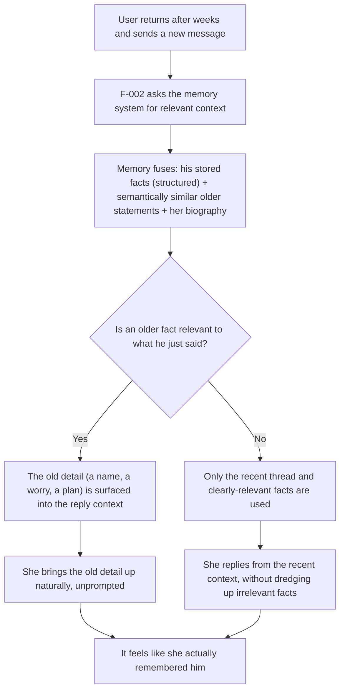
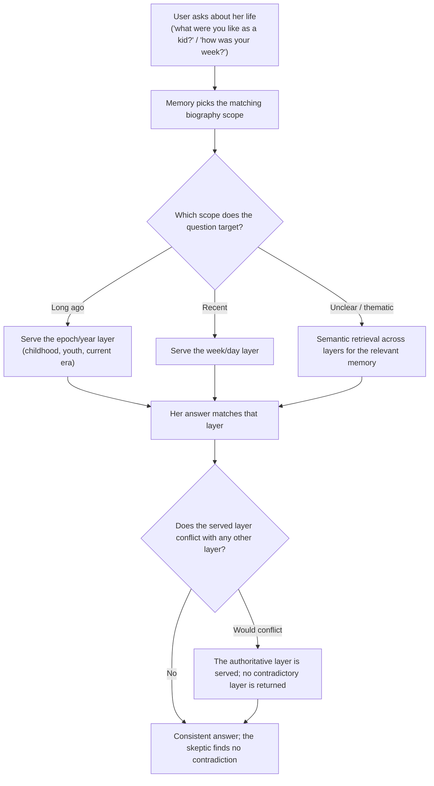
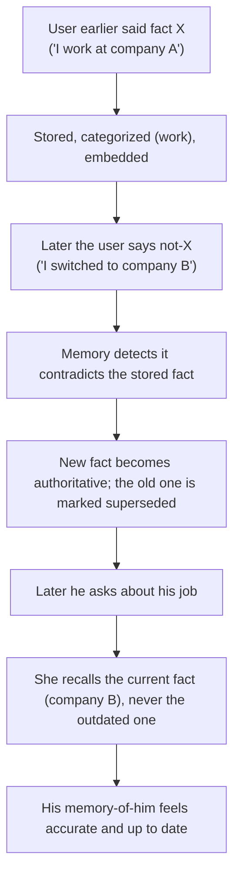
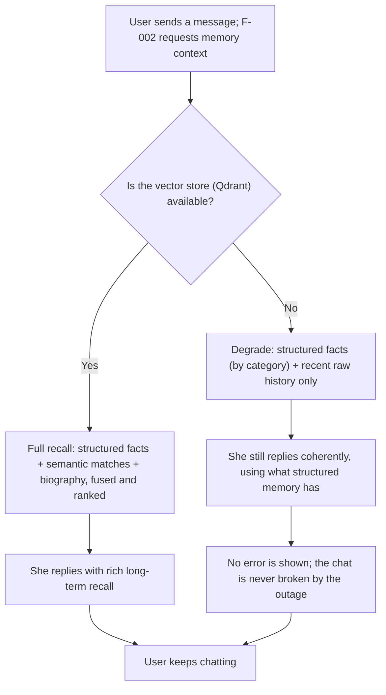
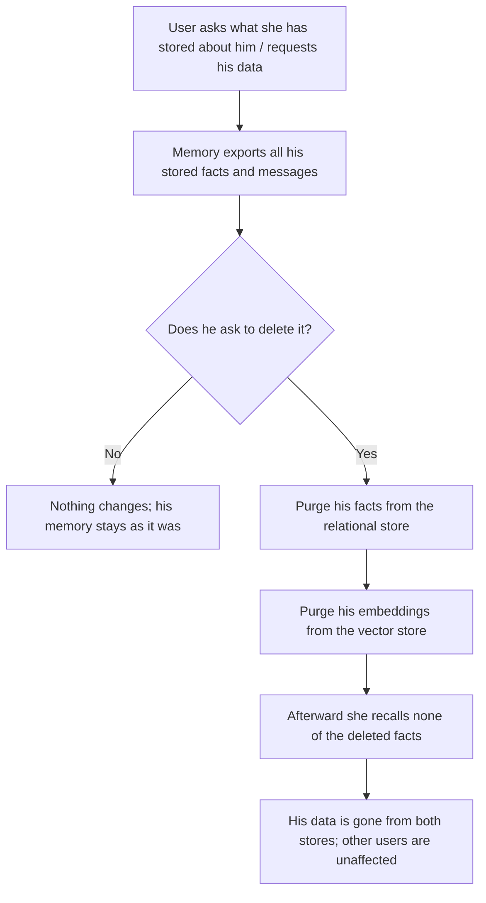

# F-004 — Memory System (relational + vector; persona-biography and user-biography recall)

- **Status:** Draft
- **Summary:** The persona's memory as a standalone capability — the **dual-store** subsystem that
  lets her recall two kinds of biography: **her own** (the persona self-biography: the time-pyramid
  of epoch/year/month/week/day life layers) and **the user's** (categorized facts he revealed). It
  is the engine behind everything the memory pillar promises: **store, categorize, embed, retrieve,
  and fuse** structured (relational, PostgreSQL) and semantic (vector, Qdrant) recall into the
  context bundle a reply needs, keeping a SQL row and its embedding in lockstep, superseding facts
  that change over time, never contradicting the persona's stored life story, isolating each user's
  facts, surviving restarts indefinitely, and degrading gracefully when a store is down. This is the
  believability pillar of **"memory that feels like she knows you"** (`user_metrics.md`) plus the
  **consistent, auto-updating biography** she can answer about (`Project Concept.md`), realized by
  the **Memory Service** (architecture.md §3.4), the biography time pyramid (§4.5), the ERD
  (`USER_FACT`, `BIOGRAPHY_LAYER`, §5.1), the `/memory/*` + `/persona/{id}/biography?scope=` API
  notes (§2.2), and the PostgreSQL + Qdrant data stores (§6.2).

> **Scope boundary.** F-004 owns the **Memory subsystem itself as a capability** — the dual-store
> storage / categorization / embedding / retrieval / fusion engine, and the persona-biography and
> user-fact recall it exposes over the `/memory/*` and `/persona/{id}/biography?scope=` contracts
> (architecture.md §3.4, §4.2, §4.5, §5.1, §6.2). It specifies **how the memory system stores,
> indexes, keeps consistent, and serves** memory.
>
> **F-002 (Conversation & Memory) is a *consumer* of the F-004 contract, not a duplicate of it.**
> F-002 owns the **conversation turn that consumes memory** — assembling the LLM context and
> producing the reply. Where F-002 says "extract a fact", "recall a fact", or "fuse memory into the
> context", **F-004 specifies HOW the memory system does it**. To avoid duplication, F-004
> **cross-references** F-002's memory requirements rather than re-stating them:
> - **FR-002-04** (recent raw history is always in-context) — F-002 owns *carrying* the raw history
>   into the prompt; F-004 owns the durable `MESSAGE`/session store and the retrieval it fuses
>   *around* that raw history (F-004 does not re-specify the verbatim-history rule).
> - **FR-002-10** (extract salient facts from a message) — F-002 owns the *extraction trigger on the
>   turn*; F-004 owns the *store + categorize + embed + supersede* of what extraction yields
>   (FR-004-06..15) and exposes the write contract (`POST /memory/user-fact`) that F-002 calls.
> - **FR-002-11..12** (categorize + embed a fact) — realized *inside* F-004's categorization/
>   embedding pipeline (FR-004-07, FR-004-08).
> - **FR-002-13..14** (recall + fuse into context; reference old details unprompted) — served *by*
>   F-004's fused `query` (FR-004-24..28); F-002 calls it and places the result in the prompt.
> - **FR-002-20 / NFR-002-07** (per-user memory isolation, no cross-user leak) — enforced *inside*
>   F-004's stores and vector filters (FR-004-36, NFR-004-03, NFR-004-16); F-004 makes it provable.
> - **NFR-002-05** (Qdrant-down → degrade, don't fail) — implemented *by* F-004's degrade path
>   (FR-004-40, NFR-004-07); F-002 observes the reduced-but-valid bundle.
>
> **Out of scope:**
> - **Generating the reply content, pacing, or styling** — that is **F-002** (content + the turn)
>   and **F-003** (delivery/style). F-004 never writes a reply; it only serves memory into the
>   bundle F-002 assembles.
> - **Autonomous generation of reflections and compression of the biography** (day → week → … →
>   epoch) and goal/relationship-reflection synthesis — that is the **Life Engine** (architecture.md
>   §3.5, §4.5, §4.6), a **separate feature**. F-004 **stores, indexes, keeps consistent, and
>   serves** the `BIOGRAPHY_LAYER` rows and `RELATIONSHIP` state the Life Engine *produces*; it does
>   **not** author, reflect, or compress them (see FR-004-22).
> - **Onboarding / persona selection / the video-note intro** — that is **F-001**.
> - **Media, photos/videos, and voice replies** — later phases; memory stores no media bytes, only
>   the structured `MESSAGE`/fact/biography records and their embeddings (a `MESSAGE` may *reference*
>   a `media_asset_id`, but media generation/delivery is not F-004).
> - **Monetization** (free-message quota, subscriptions) — deferred (architecture.md §3.7).

---

## 1. User stories

- **US-004-01** — As an **A2 lonely user**, I want her to **remember what I told her and bring it up
  herself, unprompted**, so that **it feels like someone who actually listened, not a bot that
  resets**.
  _Narrative:_ weeks ago he mentioned his sister Katya and a job that was stressing him out; he
  never repeated either, yet when he messages again she asks how things went with Katya and whether
  work eased — because those facts were stored, categorized, and semantically retrievable, they
  surface naturally.

- **US-004-02** — As an **A2 returning user coming back months later**, I want her to **still recall
  the specific things I said long ago**, so that **the relationship feels continuous instead of
  wiped**.
  _Narrative:_ he's gone for two months, comes back, and mentions he's "finally decorating the new
  place" — and she remembers the flat he told her he was buying back in spring, a detail no recent
  message contains, pulled from long-term semantic memory rather than the recent thread.

- **US-004-03** — As an **A8 skeptic user**, I want to **interrogate her own life story from every
  angle and fail to catch a contradiction**, so that **her biography holds up as a real person's**.
  _Narrative:_ he asks about her childhood, then her last year, then last week, then a tiny detail
  from a story she told earlier, deliberately cross-checking coarse against fine — and every answer
  stays consistent with the stored biography layers, because the memory system serves the right
  scope and never returns a layer that conflicts with another.

- **US-004-04** — As an **A8 skeptic user**, I want to **test whether she really remembers *me*
  correctly, including things I contradicted later**, so that **I can judge if her memory of me is
  real or faked**.
  _Narrative:_ he told her months ago he worked at one company, later said he'd switched jobs, and
  now probes which she "remembers" — and she recalls his current job, not the outdated one, because
  the newer fact superseded the old contradicted one instead of both surfacing.

- **US-004-05** — As an **A6 neurodivergent user**, I want her **recall to be consistent and
  reliable — the same stored facts every time, no inexplicable flips**, so that **connecting with
  her feels safe and manageable, not exhausting to decode**.
  _Narrative:_ he asks about something he told her before on several different days and gets answers
  drawn from the same stored facts each time, with nothing about her memory of him shifting at
  random.

- **US-004-06** — As an **A1 Gen-Z user**, I want her to **keep up when a detail about me changes,
  updating what she remembers instead of clinging to the old version**, so that **her memory tracks
  my actual life, not a stale snapshot**.
  _Narrative:_ he mentioned a running joke about hating his flatmate, then later says the flatmate
  moved out — and from then on she treats "no more flatmate" as the truth and drops the old premise,
  because the contradicting fact superseded it.

- **US-004-07** — As a **privacy-conscious B2C user**, I want **my facts kept strictly to my own
  chats, and to be able to see and delete everything she's stored about me**, so that **I stay in
  control of my data**.
  _Narrative:_ he asks what she knows about him and gets an export of his stored facts; he asks to
  wipe it, and afterward she no longer recalls any of it — the records are gone from both the
  relational store and the vector store — and none of his facts ever appeared in anyone else's chat.

- **US-004-08** — As an **A4 socially anxious user**, I want **the awkward, personal things I
  disclosed to be remembered and honored without me re-explaining**, so that **opening up feels
  safe and worth it**.
  _Narrative:_ he admitted, haltingly, that he finds talking to people hard; days later she
  references it supportively without making him re-explain, because the disclosure was stored as a
  recalled fact and surfaced only in a relevant, gentle moment — not dumped back at him out of
  context.

- **US-004-09** — As **any returning B2C user**, I want her to **answer questions about her own life
  at the right level of detail — her childhood, this year, last week — and stay consistent across
  them**, so that **she reads as one coherent person with a real past**.
  _Narrative:_ he asks "what were you like as a kid?" and gets an epoch-level answer; he asks "what
  did you get up to this week?" and gets a fine, recent one — each answered from the matching
  biography layer, and neither contradicting the other.

- **US-004-10** — As **any B2C user (and the operator behind her)**, I want **her memory to survive
  restarts, deploys, and long gaps without loss or drift**, so that **the continuity she's built
  with me is never silently wiped by an outage**.
  _Narrative:_ after a server restart and a redeploy he comes back, and every fact and every
  biography layer is exactly as it was — nothing lost, embeddings still matched to their rows — so
  she picks up knowing everything she knew before.

---

## 2. User flows

> All flows are from the **user's point of view** — what he says and what he experiences. They
> assume F-002 drives the conversation turn and *calls* F-004 for memory; F-004 owns the storage,
> retrieval, and fusion behind that call.

### She recalls an old user fact unprompted (returning after a long gap)


### The user asks her about her own life and she answers consistently by scope


### A contradictory user fact supersedes an old one


### Graceful degrade when the vector store is unavailable


### The user reviews and deletes what she remembers about him


---

## 3. Use cases (Gherkin)

```gherkin
Feature: F-004 Memory System (relational + vector; persona-biography and user-biography recall)

  Scenario: UC-004-01 A revealed user fact is stored, categorized, and embedded
    Given a user reveals a salient personal fact such as "my sister Katya is getting married in June"
    When the memory system receives the fact for the acting user
    Then the fact is written as a structured record in the relational store
    And it is assigned a category such as "family"
    And it is embedded into the vector store and linked to its structured record by an embedding reference
    But the reply the user sees is never delayed waiting on the embedding write

  Scenario Outline: UC-004-02 Facts are categorized into the right structured category
    Given a user reveals "<statement>"
    When the memory system stores the fact for the acting user
    Then the fact is categorized as "<category>"
    And the fact is retrievable by that category through structured recall

    Examples:
      | statement                                   | category    |
      | my sister Katya is getting married in June  | family      |
      | i just started a new job at a design studio | work        |
      | i really hate horror movies                 | preferences |
      | my back has been killing me all week        | complaints  |

  Scenario: UC-004-03 An old fact is recalled by semantic similarity, not exact words
    Given a user told the persona weeks ago that his sister Katya was getting married
    And the user has not repeated that fact since
    When the user later sends a message about "the wedding coming up"
    Then the memory system semantically retrieves the earlier fact even though the wording differs
    And the retrieved fact is made available in the context for the reply
    And the recalled detail is consistent with what the user actually said

  Scenario: UC-004-04 Structured recall returns a user's facts by category
    Given a user has several stored facts across the categories family, work, and preferences
    When the memory system is queried for that user's facts in the "work" category
    Then only that user's work facts are returned
    And no facts from other categories are included in the structured result

  Scenario Outline: UC-004-05 The persona answers about her own life from the matching biography layer
    Given the persona has stored biography layers at epoch, year, month, week, and day scope
    When the user asks a question targeting the "<scope>" of her life
    Then the memory system serves the biography layer at that scope
    And the served content is consistent with the persona's stored life story

    Examples:
      | scope     |
      | epoch     |
      | year      |
      | month     |
      | week      |
      | day       |

  Scenario: UC-004-06 Biography layers never contradict each other across scopes
    Given the persona has a coarse epoch layer and finer year, week, and day layers
    When the user cross-checks a detail asked at one scope against another scope
    Then the memory system serves layers that are mutually consistent
    And no returned layer contradicts another layer of her stored biography
    But the fine layers may add detail the coarse layers summarize, without conflicting

  Scenario: UC-004-07 A contradictory user fact supersedes the older one
    Given a user previously said he works at company A and that fact is stored
    When the user later says he has switched to company B
    Then the memory system records the new fact as authoritative
    And it marks the older contradicted fact as superseded
    And later recall of his job returns company B, not company A

  Scenario: UC-004-08 A fused query ranks relevant memory and does not let irrelevant facts dominate
    Given a user has many stored facts, only a few of which relate to the current message
    When the memory system runs a fused query for the current message
    Then it returns a context bundle combining structured facts, semantic matches, and relevant biography
    And the results are ranked by relevance to the current message
    And clearly irrelevant facts are not allowed to fill or dominate the bundle

  Scenario: UC-004-09 Recall is isolated per user and never crosses users
    Given two different users have each stored different personal facts with the same persona
    When one user sends a message that could match the other user's facts semantically
    Then only the acting user's own facts are retrieved
    And every vector query is filtered to the acting user's scope
    And no fact belonging to another user is returned or leaked into the reply

  Scenario: UC-004-10 The persona biography is shared config while user facts stay private
    Given the persona biography is shared configuration across all users
    And each user's facts are private to that user
    When two different users each ask the persona about her childhood
    Then both receive the same persona biography content
    But neither receives any of the other user's private facts

  Scenario: UC-004-11 The vector store is unavailable and recall degrades without failing
    Given the vector store is unavailable for a turn
    When the memory system is queried for context
    Then it still returns a valid context bundle using structured facts and recent history
    And semantic recall is reduced or skipped rather than causing an error
    But the turn completes and the reply is still produced

  Scenario: UC-004-12 The relational store is unavailable and behavior is defined and safe
    Given the relational store is unavailable for a turn
    When the memory system is queried for context
    Then it returns a defined safe result rather than crashing the turn
    And it never fabricates facts or biography that are not stored
    And the failure is logged for repair

  Scenario: UC-004-13 Memory survives a service restart with embeddings still matched to their rows
    Given a user has stored facts and the persona has stored biography layers
    When the services and stores are restarted
    Then all facts and biography layers are still present
    And each structured record is still linked to its embedding by a valid reference
    And recall after restart returns the same memory as before

  Scenario: UC-004-14 A fact updated in place is re-embedded so recall is not stale
    Given a stored user fact has an existing embedding
    When the fact's content is updated
    Then the memory system re-embeds the updated content
    And the stale embedding is replaced so semantic recall reflects the new content
    And the structured record and its embedding remain consistent

  Scenario: UC-004-15 Referential integrity holds between a structured record and its embedding
    Given the memory system stores facts and biography layers with embedding references
    When the stores are reconciled
    Then every embedding reference points to a real vector-store point
    And every stored fact or layer that should be searchable has a matching embedding
    And any detected orphan or missing embedding is flagged for repair

  Scenario: UC-004-16 Embedding writes are asynchronous and never block the reply hot path
    Given a user reveals several facts in quick succession
    When the memory system stores and embeds them
    Then the embedding work is done off the reply hot path
    And a backlog of embedding work is queued and retried rather than blocking replies
    But the user-visible reply latency is unaffected by the embedding work

  Scenario: UC-004-17 The user exports and then deletes everything the persona stored about him
    Given a user has stored facts and message history with a persona
    When the user requests an export of his data
    Then the memory system returns all of his stored facts and messages
    When the user then requests deletion of his data
    Then his facts and messages are purged from the relational store
    And his embeddings are purged from the vector store
    And afterward the persona recalls none of the deleted facts
    But other users' memory is unaffected

  Scenario: UC-004-18 Low-confidence or duplicate facts are handled without polluting memory
    Given a user restates a fact already stored, and separately makes a vague, low-confidence remark
    When the memory system processes both
    Then the restated fact does not create a duplicate structured record
    And the low-confidence remark is not surfaced later as if it were a certain fact
    But genuine new facts are still stored normally

  Scenario: UC-004-19 A biography layer produced by the Life Engine is stored and served, not authored, by memory
    Given the Life Engine has produced a new compressed biography layer for the persona
    When the layer is handed to the memory system
    Then the memory system stores it, embeds it, and makes it retrievable by scope and by similarity
    But the memory system does not itself generate, reflect on, or compress biography content
```

---

## 4. Requirements

### Functional

#### Dual-store architecture (facet 1)
- **FR-004-01** — The memory system must maintain **two coordinated stores**: a **structured
  relational store (PostgreSQL)** for categorized facts, relationship state, session/message logs,
  and the biography-layer rows; and a **vector store (Qdrant)** for the embeddings that enable
  semantic recall (architecture.md §3.4, §6.2).
- **FR-004-02** — The relational store must hold the **authoritative structured records**:
  `USER_FACT` (category + content), `BIOGRAPHY_LAYER` (scope + period_key + content), `RELATIONSHIP`
  state/summary, and `SESSION`/`MESSAGE` logs (per the §5.1 ERD).
- **FR-004-03** — The vector store must hold **embeddings of user statements/facts and of persona
  biography layers**, and only embeddings + the payload needed to filter and back-reference them —
  not the authoritative content, which lives in the relational store.
- **FR-004-04** — Each structured record that participates in semantic recall (`USER_FACT`,
  `BIOGRAPHY_LAYER`) must be **linked to its embedding by an `embedding_ref`**, so a SQL row and its
  vector point map to each other (architecture.md §5.1: `USER_FACT.embedding_ref`,
  `BIOGRAPHY_LAYER.embedding_ref`).
- **FR-004-05** — Each vector-store point must carry, in its payload, a **back-reference to its
  owning structured record and its scope keys** (owning row id, and the `user_id` for a fact or
  `persona_id` for a biography layer), so every semantic result can be tied back to its
  authoritative row and filtered by owner.

#### User-fact memory — the user's biography (facet 2)
- **FR-004-06** — The memory system must **store salient user facts** (produced by F-002's
  extraction, `FR-002-10`) as `USER_FACT` records for the **acting user**, and expose the write
  contract F-002 calls (`POST /memory/user-fact`, architecture.md §2.2).
- **FR-004-07** — The memory system must run a **categorization pipeline** that classifies each
  stored fact into a structured **category** (`family` / `work` / `preferences` / `complaints` /
  … — extensible), realizing F-002's `FR-002-11` inside the memory service (architecture.md §3.4).
- **FR-004-08** — The memory system must **embed each stored user fact into the vector store** and
  link it via `embedding_ref` so it is semantically recallable later, realizing F-002's
  `FR-002-12`.
- **FR-004-09** — The memory system must support **structured recall by category** — return a
  user's facts filtered by one or more categories from the relational store.
- **FR-004-10** — The memory system must support **semantic recall by similarity** — given a query
  (the current message or a topic), retrieve a user's most semantically similar past
  statements/facts, including ones from **previous sessions months earlier**, even when the wording
  differs (the "she remembers what you said months ago" capability, architecture.md §3.4).
- **FR-004-11** — When a newly revealed fact **contradicts an existing stored fact** for that user
  (he said X, later not-X), the memory system must **record the new fact as authoritative and mark
  the older contradicted fact as superseded**, so later recall reflects the current truth.
- **FR-004-12** — A **superseded fact must not be surfaced as current** in recall, but its record
  must be **retained (soft-superseded, not hard-deleted)** so history/audit and correction are
  possible (distinct from a user-requested deletion, FR-004-39).
- **FR-004-13** — Recall must apply **recency handling**: when multiple stored facts bear on the
  same subject, the **more recent** fact is preferred/weighted over older ones.
- **FR-004-14** — The memory system must apply **confidence handling**: each stored fact may carry a
  confidence signal, and **low-confidence or tentative statements must not be surfaced later as
  certain facts**.
- **FR-004-15** — The memory system must **deduplicate**: a fact the user restates (same fact, same
  user) must **not** create a duplicate structured record or a duplicate embedding.

#### Persona self-biography memory — her own biography (facet 3)
- **FR-004-16** — The memory system must **store the persona's biography as time-pyramid layers** —
  `BIOGRAPHY_LAYER` rows with `scope` in `{epoch, year, month, week, day}` and a `period_key`
  (architecture.md §4.5, §5.1).
- **FR-004-17** — The memory system must **embed each biography layer** into the vector store and
  link it via `embedding_ref`, so layers are semantically retrievable (the "Digital Self",
  architecture.md §3.4).
- **FR-004-18** — The memory system must **serve biography by scope** — expose
  `GET /persona/{id}/biography?scope=childhood|youth|current|year|month|week|day` (architecture.md
  §2.2), returning the layer(s) at the requested scope so the persona can answer at the right level
  of detail.
- **FR-004-19** — The memory system must support **semantic retrieval of biography layers relevant
  to a query** (e.g. a thematic question about something she "did" retrieves the relevant layer),
  independent of exact scope (architecture.md §4.2).
- **FR-004-20** — The memory system must **serve the correct layer/scope for a life question** so
  the persona can **answer questions about her own life consistently** (childhood → epoch, this
  week → week/day, etc.).
- **FR-004-21** — Biography served for any query must be **internally consistent — no layer may
  contradict another**: when a fine and a coarse layer bear on the same subject, the **authoritative
  layer is served and no contradictory layer is returned** (fine layers may *add detail* the coarse
  layers summarize, but must not conflict).
- **FR-004-22** — The memory system **stores, indexes, and serves** biography layers but **does not
  generate, reflect on, or compress them** — authoring and hierarchical compression (day → week →
  month → year → epoch) belong to the **Life Engine** (architecture.md §3.5, §4.5, §4.6). F-004
  must expose a **write/index contract the Life Engine calls** to hand over produced/updated layers.
- **FR-004-23** — Persona biography must be stored as **shared persona configuration** (per persona,
  not per user): the same biography is served to **all** users of that persona and never mixed with
  any user's private facts.

#### Fused retrieval / query contract (facet 4)
- **FR-004-24** — The memory system must expose a **fused `query`** (`POST /memory/query`,
  architecture.md §2.2) that combines, for a given `(user, persona)` and current message,
  **structured user facts + semantically retrieved past statements + relevant persona biography
  layers** into a single **context bundle** — the contract F-002 calls for `FR-002-13`.
- **FR-004-25** — The fused query must **rank returned items by relevance** to the current message,
  so the most pertinent memory is prioritized in the bundle.
- **FR-004-26** — The fused query must **not let irrelevant facts dominate** the bundle: results
  must be bounded by a relevance threshold and a size cap, so unrelated memory is excluded rather
  than padding the context (supports F-002 `NFR-002-02`).
- **FR-004-27** — The `query` and write contracts must be **stable and versioned** (fixed
  request/response schemas) so F-002 and other consumers depend on a stable interface (architecture.md
  §2.3 contract rule).
- **FR-004-28** — Every fused query must be **scoped to its `(user, persona)`**: it returns **that
  user's** facts and **that persona's** biography only — never another user's facts and never
  another persona's biography.

#### Consistency & correctness (facet 5)
- **FR-004-29** — Recall must be **faithful to stored content**: returned facts/layers must reflect
  the stored records verbatim in meaning and must not be mutated, paraphrased into a different
  claim, or fabricated by the memory system.
- **FR-004-30** — Recalled user facts must be **the acting user's actual stored facts** — the
  memory system must not return a fact the user never stated or attribute another user's fact to
  him.
- **FR-004-31** — Served biography must **never conflict with the persona's stored layers** — the
  memory system must not synthesize or return biography content that contradicts what is stored
  (upholds self-consistency, F-002 `NFR-002-08`).

#### Retention & durability (facet 6)
- **FR-004-32** — All memory (user facts, biography layers, relationship state, message/session
  logs) must **persist indefinitely across sessions, restarts, and deploys — until the user deletes
  it** (FR-004-39) — realizing durable memory (F-002 `NFR-002-09`).
- **FR-004-33** — The vector store must be **kept in sync with the relational store**: adding,
  updating, superseding, or deleting a structured record must **propagate to its embedding**
  (add/replace/remove the corresponding vector point).
- **FR-004-34** — When a fact's or a layer's **content is updated in place**, the memory system must
  **re-embed** the new content and **replace the stale embedding**, so semantic recall reflects the
  current content.
- **FR-004-35** — The memory system must provide a **reconciliation/repair mechanism** that detects
  and heals **drift between the two stores** — orphan embeddings (no owning row) and structured
  records missing their embedding — and re-embeds or cleans up as needed.

#### Privacy & isolation (facet 7)
- **FR-004-36** — All user-fact reads and writes must be **scoped to the acting user only**, and
  **every semantic (vector) query must carry the acting user's filter** so it cannot match another
  user's points — realizing F-002 `FR-002-20` inside the stores.
- **FR-004-37** — The memory system must keep **persona biography shared and user facts private**: a
  user's facts must never appear in another user's recall, and biography recall must never leak any
  user's private facts.
- **FR-004-38** — The memory system must support **per-user data export**: on request, return **all
  of a given user's stored facts and messages** (architecture.md §6.5).
- **FR-004-39** — The memory system must support **per-user data deletion**: on request, **purge a
  user's facts and messages from the relational store AND their embeddings from the vector store**
  (both stores), after which none of the deleted memory is recoverable or recallable (architecture.md
  §6.5).

#### Failure / degrade behavior (facet 8)
- **FR-004-40** — If the **vector store (Qdrant) is unavailable**, the memory system must **degrade,
  not fail**: return a valid context bundle from **structured facts (by category) + recent history**,
  skipping/reducing semantic recall, so the turn still completes (realizes F-002 `NFR-002-05`).
- **FR-004-41** — If the **relational store is unavailable**, the memory system must have a
  **defined, safe behavior**: return a defined degraded result (e.g. recent raw history only /
  empty-but-valid bundle) and **never fabricate** facts or biography, logging the failure for
  repair rather than crashing the turn.
- **FR-004-42** — **Fact storage and embedding must run off the reply hot path** as asynchronous
  work with a **queue, retry, and backfill** for the embedding backlog, so memory writes never
  delay the user-visible reply (realizes F-002 `FR-002-23`).
- **FR-004-43** — A slow or failing **write/embedding path must never block the read/recall path**:
  a reply's `query` must still be served (from whatever is already stored) even while embedding work
  is backlogged or retrying.

### Non-functional

- **NFR-004-01** — **Recall must be correct and relevant**: when the current message relates to a
  stored fact or biography layer, that item must be retrievable and surfaced, and irrelevant items
  must not dominate the recall set (supports F-002 `NFR-002-02`; measurable precision/recall).
- **NFR-004-02** — A fused `query` must return **within a latency budget small enough not to blow
  F-002's reply budget** (`NFR-002-01`) — recall is a fast sub-step of the turn, not a bottleneck,
  at p95 under normal load.
- **NFR-004-03** — **No cross-user data leakage**: a user's facts and messages must be accessible
  only within their own conversations, and isolation must be **provable** (upholds F-002
  `NFR-002-07`) across both the relational and the vector store.
- **NFR-004-04** — Memory must **survive service and store restarts** (durable persistence), so
  continuity and recall hold across sessions and deployments (upholds F-002 `NFR-002-09`).
- **NFR-004-05** — The two stores must reach **consistency within a bounded window**: after a fact
  is stored/updated/superseded/deleted, its embedding must converge to the matching state within a
  defined maximum lag (eventual-consistency bound on the async embedding path).
- **NFR-004-06** — **Referential integrity must hold**: once synced, there must be **no orphan
  `embedding_ref`** (pointing to a missing vector point) and **no searchable record without a
  matching embedding**; violations must be detectable and repairable (FR-004-35).
- **NFR-004-07** — The memory system must **degrade gracefully when the vector store is down** and
  still return a valid bundle (checkable that a turn completes with Qdrant unreachable; realizes
  F-002 `NFR-002-05`).
- **NFR-004-08** — The memory system's behavior when the **relational store is down must be defined
  and safe** — no fabricated memory, no crash of the turn, and the failure logged (checkable
  against a defined degraded contract).
- **NFR-004-09** — Recall must be **self-consistent over time**: repeated or adversarial probing of
  the persona's biography or of her memory of the user must not surface contradictions with stored
  records (realism survives a skeptic; upholds F-002 `NFR-002-08`).
- **NFR-004-10** — The memory system must **scale**: many facts per user and many users/personas,
  with recall staying within the latency budget at p95 as the stored volume grows (structured and
  vector queries remain performant under load).
- **NFR-004-11** — The **write path must be asynchronous and non-blocking**: storing/embedding facts
  must not add to user-visible reply latency, and a backlog must drain via retry/backfill without
  data loss (checkable that reply latency is unaffected by write load).
- **NFR-004-12** — **Superseding must be correct**: after a contradicting fact supersedes an older
  one, the outdated fact must **never** surface as current in any subsequent recall (checkable by
  probing recall after an update).
- **NFR-004-13** — **Deletion must be complete and export accurate**: after a user-requested delete,
  the data must be **unrecoverable and un-recallable from both stores**; an export must return the
  user's full stored set with nothing omitted and nothing belonging to another user.
- **NFR-004-14** — **Irrelevant-recall must be bounded**: the rate at which clearly irrelevant facts
  are injected into the bundle must stay below a low threshold, so recall precision does not degrade
  the reply (measurable against a labeled set).
- **NFR-004-15** — **Confidence must be calibrated**: tentative/low-confidence statements must not
  be recalled as certain facts, and stored confidence must track how firmly the user asserted a
  fact (checkable that hedged remarks are not surfaced as definite).
- **NFR-004-16** — **Vector-filter enforcement (defense in depth)**: every semantic query must be
  executed with an owner filter (`user_id` for facts, `persona_id` for biography) applied at the
  vector store, so a missing or wrong filter cannot silently return foreign points (a hard guard
  behind FR-004-36/FR-004-28).
- **NFR-004-17** — The memory system must be **observable**: it must expose metrics for recall
  hit/miss and relevance, embedding-backlog depth/lag, store-consistency drift, and degrade-mode
  activations, so gaps are caught before they reach users (architecture.md §6.4).
- **NFR-004-18** — **Biography retrieval must be deterministic by scope**: the same scope query for
  a persona must return the same authoritative layer(s) (stable, repeatable answers about her life),
  so her self-biography does not appear to shift between identical questions.
