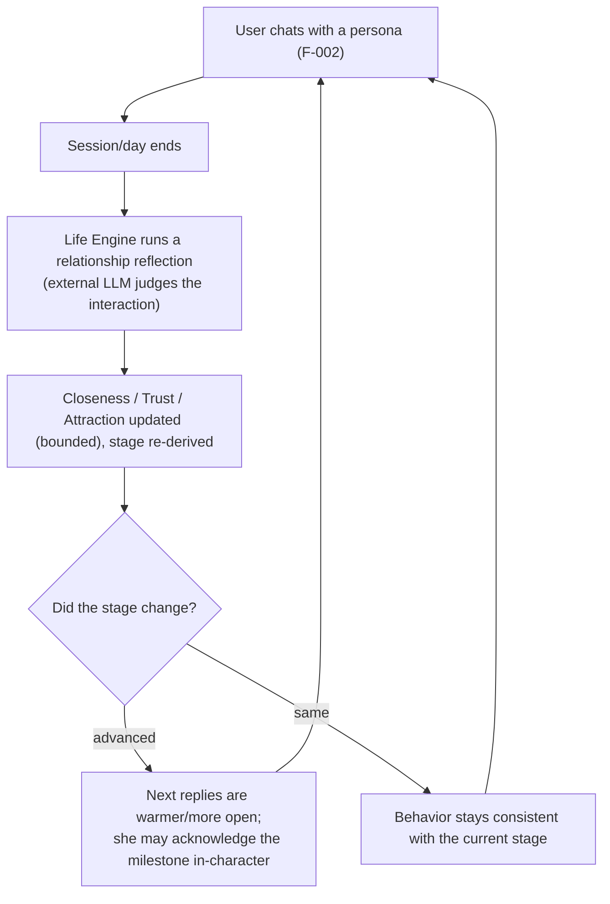
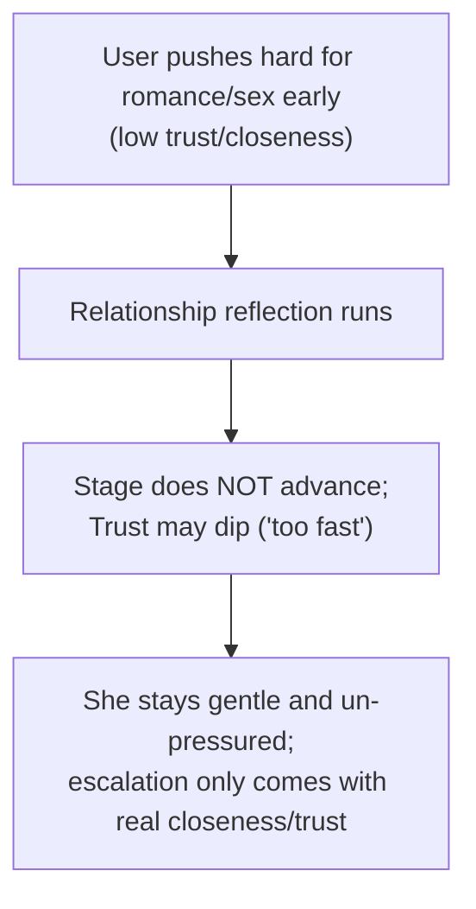
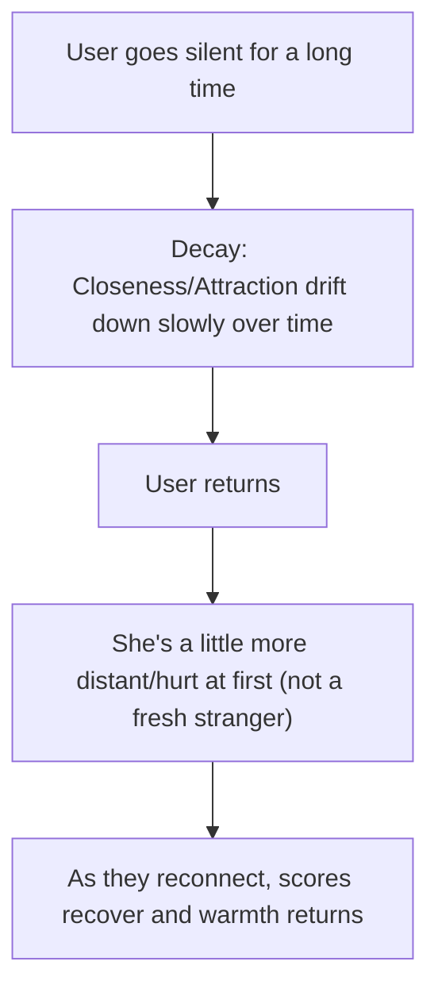

# F-005 — Relationship System (how the bond with each user evolves)

- **Status:** Draft
- **Summary:** A per-`(user, persona)` **relationship** that **evolves over time** so the user
  *feels* the bond deepen — from stranger to friend to flirt to love. It is modelled as **three
  continuous dimensions** (Closeness, Trust, Attraction, each 0–100) plus a **derived discrete
  stage** (a legible ladder). After interactions, the **Life Engine** runs a **relationship
  reflection** — it hands the external LLM (ChatGPT) the current state + the recent conversation +
  hard signals and asks "how did this change things?"; the returned deltas update the dimensions,
  the stage is re-derived, and a short summary + a reflection log are stored. That state is fed into
  every reply's context (F-002), so the persona's warmth, openness, flirtiness, and what she is
  willing to do are **gated by the current stage** — a stranger is reserved, a lover is warm and
  initiates. The whole point: the relationship **accumulates** and reads as a real, gradually
  deepening connection, not a chatbot that resets.

> **Scope boundary.** F-005 owns the **relationship model and its evolution**: the three dimensions,
> the derived stage, the relationship-reflection update loop (the external-LLM call + applying its
> result), the dynamics/guardrails (bounded change, decay, asymmetry, pacing/consent, hysteresis),
> milestones, and **exposing** the current state so replies can be gated by it. It does **not**:
> - **Generate the reply itself** — that is **F-002** (F-005 feeds it the relationship state as
>   context input; F-002 owns turning it into a reply). Where F-002 says "relationship state colors
>   the reply", **F-005 specifies what that state is and how it changes.**
> - **Store the data** — the `RELATIONSHIP` / `RELATIONSHIP_REFLECTION` rows live in the Memory
>   subsystem (**F-004**); F-005 *authors* the updates and hands them to Memory (like the Life
>   Engine hands it biography layers).
> - **Own the persona's *own* inner life** — the daily plan, her end-of-day **self**-reflection, the
>   biography time-pyramid, and goals are the sibling **Life Engine** feature (F-006). Both share the
>   same "prompt the external LLM → store the output" mechanism (architecture.md §3.5/§4.6); F-005 is
>   the **relationship** reflection specifically.
> - **Gate intimate media by payment** — relationship stage gates *whether she is willing* (she
>   won't sext a stranger); the paywall/entitlement gate is separate and deferred (billing, §3.7).

---

## 0. Design model (the concrete relationship metric — architecture.md §4.6 "design deliverable")

### 0.1 Three dimensions (each an integer 0–100)
| Dimension | Meaning | Raised by | Lowered by |
|-----------|---------|-----------|------------|
| **Closeness** | Emotional attachment / how significant he is to her ("значимость") | frequent contact, self-disclosure, warmth, being remembered/referenced, shared vulnerability, consistency over time | long neglect/silence, coldness, disappearing |
| **Trust** | How safe & open she feels with him ("доверие") | reliability, honesty, respecting her pace, keeping "promises", gentleness | rudeness, pushing too fast, contradictions, crossing boundaries |
| **Attraction** | Romantic + physical desire / spark ("влечение") | reciprocated flirting, charm, tension, compliments she likes, chemistry | being creepy/pushy (backfires), total absence of spark, neglect |

> The product owner suggested "significance / trust / a third (intention?)". This design keeps
> significance→**Closeness** and **Trust**, and chooses **Attraction** as the third (a better fit
> for the flirt→love arc and the product's intimate endgame than a vague "intention"). All three,
> the stage gates, and the dynamics below are **configurable** (Life Engine config).

### 0.2 Derived stage (the ladder the user feels)
Stage is **derived from the three dimensions** (never set directly). It is the **highest** stage
whose gate is fully satisfied. Default gates (configurable):

| # | Stage | Gate (all conditions) |
|---|-------|-----------------------|
| 0 | **Stranger** | (default; just met) |
| 1 | **Acquaintance** | Closeness ≥ 15 |
| 2 | **Friend** | Closeness ≥ 40 **and** Trust ≥ 35 |
| 3 | **Flirting** | Attraction ≥ 45 **and** Closeness ≥ 30 |
| 4 | **Romance** | Closeness ≥ 60 **and** Attraction ≥ 55 **and** Trust ≥ 50 |
| 5 | **Love** | Closeness ≥ 80 **and** Attraction ≥ 70 **and** Trust ≥ 70 |
| 6 | **Devoted** | Closeness ≥ 90 **and** Trust ≥ 85 **and** Attraction ≥ 80, sustained over time |

**Hysteresis:** to *advance* a stage the gate must be crossed; to *regress* the dimensions must fall
a configurable margin (default 8 pts) **below** the gate — so the stage never flip-flops on small
noise.

### 0.3 Update loop — the relationship reflection
1. **Trigger** (configurable): end of a chat session, and/or end of day, and/or every N messages —
   whichever fires first. Runs **off the hot path** (never blocks a reply).
2. **Inputs to the external LLM:** persona identity/traits + the **current** relationship state
   (stage + the 3 scores + prior summary) + the **recent conversation** (raw or summarized) + **hard
   signals** (days since last contact, message count/frequency in the window, coldness/warmth cues).
3. **Prompt (shape):** *"You are {persona}, {traits}. Here is where your relationship with {user}
   stands (stage, closeness/trust/attraction, summary) and your recent conversation with him. Judge
   honestly how this changed things. Return a delta for each dimension (−N…+N with a one-line
   reason) and a rewritten one-paragraph summary of where you two stand."*
4. **Apply:** parse the deltas → clamp each dimension to 0–100 with a **bounded per-reflection change
   cap** → re-derive the stage (with hysteresis) → store the new state + a `RELATIONSHIP_REFLECTION`
   log entry (so every change is auditable/explainable).

### 0.4 Dynamics / guardrails (what makes it believable)
- **Gradual:** per-reflection change is capped (default ±10 per dimension) — relationships don't
  jump from stranger to love in one chat.
- **Decay on neglect:** with no contact, Closeness and Attraction **drift down slowly** over time
  (she feels distance); Trust decays slowest.
- **Asymmetric:** Trust builds slowly but drops faster on a real breach (rudeness, boundary-crossing).
- **Pacing / consent:** pushing hard for romance/sex while Trust/Closeness are low **does not**
  advance the stage and can **lower Trust** ("too fast") — she stays patient and un-pressured (this
  is the A4 anxious-user safety and the believability guard, not prudishness).
- **Regression is possible but gentle** — no cliff drops except a genuine breach.

### 0.5 How it pays off (exposure to the reply loop)
Every reply's context (F-002 §4.2) includes the **current stage + scores + summary**. The persona's
behavior is **gated by stage**: reserved/polite as a stranger; playful/flirty once Flirting; warm,
open, initiating, willing to be intimate and say "I love you" at Love/Devoted. Crossing a stage is a
**felt milestone** she may acknowledge in-character ("honestly… I feel like we've gotten really
close 🥹"). This is what makes the progression *felt* rather than invisible.

---

## 1. User stories

- **US-005-01** — As an **A2 lonely user**, I want the **relationship to deepen over weeks**, so
  that **it feels like a real bond that accumulates, not a bot that resets each time**.
  _Narrative:_ over a month she goes from politely friendly to genuinely close — remembering, caring,
  warmer — and he can feel that they've grown closer, because she treats him differently than on day
  one.

- **US-005-02** — As an **A1 Gen-Z user**, I want to **feel it "going somewhere"** — from banter to
  flirting to something more — so that **there's a reason to keep coming back**.
  _Narrative:_ his flirting starts landing, she flirts back more, and after a while it tips into
  clearly romantic — the "she's into me now" arc that keeps him hooked.

- **US-005-03** — As an **A4 socially anxious user**, I want her to **never be pressured or rushed,
  and to not reward me pushing too fast**, so that **it stays safe and low-stakes**.
  _Narrative:_ if he lunges too fast she stays gentle and things *don't* magically escalate; the
  bond grows at a human pace, which makes it feel real and un-pressuring.

- **US-005-04** — As an **A8 skeptic user**, I want the relationship to **change believably and
  consistently, not randomly or instantly**, so that **I can't catch it "gaming" me**.
  _Narrative:_ he tries to speed-run to "I love you"; it doesn't work — the progression is gradual,
  consistent with how he's actually treated her, and survives his probing.

- **US-005-05** — As a **returning user**, I want to **pick up exactly where our relationship was**,
  so that **continuity holds across days/weeks and restarts**.
  _Narrative:_ he comes back after a week; she's not a stranger again — she's at the same closeness
  they'd reached, maybe having missed him a little.

- **US-005-06** — As an **A3 high-value user**, I want the relationship to be able to reach a
  **deep, exclusive-feeling place**, so that **it feels special and reserved for me**.
  _Narrative:_ over time she reaches a devoted stage — warm, intimate, clearly attached — that reads
  as a real, exclusive relationship.

- **US-005-07** — As **any user who drifts away**, I want that **neglect to have a natural
  consequence** (she cools a bit), so that **the relationship feels alive and reciprocal, not
  static**.
  _Narrative:_ he ghosts for two weeks; when he returns she's a touch more distant/hurt, and warms
  back up as they reconnect — like a real person would.

- **US-005-08** — As an **A2/A1 user**, I want **crossing a milestone to be a moment she notices**,
  so that **the progress is emotionally rewarding, not invisible**.
  _Narrative:_ when they cross from friends into something more, she says something about it — it
  lands as a real relationship beat, not a silent number changing.

---

## 2. User flows

> From the user's point of view — he never sees numbers/stages; he *feels* them through how she
> behaves. The mechanics run behind the scenes (Life Engine).

### The bond deepening over time


### Pushing too fast (pacing/consent guard)


### Neglect then return


---

## 3. Use cases (Gherkin)

```gherkin
Feature: F-005 Relationship System

  Scenario: UC-005-01 A new user starts at the Stranger stage
    Given a user and persona have never interacted
    When their relationship is first created
    Then the stage is "Stranger" and all three dimensions start at their configured baseline
    And the persona behaves reserved/polite, not intimate

  Scenario: UC-005-02 A positive interaction nudges the relationship up
    Given an existing relationship with recent warm, reciprocated conversation
    When the relationship reflection runs after the session
    Then Closeness/Trust/Attraction move up by a bounded amount with recorded reasons
    And the summary is rewritten to reflect the new state

  Scenario Outline: UC-005-03 Stage is derived from the dimensions
    Given a relationship with Closeness "<c>", Trust "<t>", Attraction "<a>"
    When the stage is derived
    Then the stage is "<stage>"

    Examples:
      | c  | t  | a  | stage        |
      | 5  | 5  | 5  | Stranger     |
      | 20 | 10 | 10 | Acquaintance |
      | 45 | 40 | 20 | Friend       |
      | 35 | 30 | 50 | Flirting     |
      | 65 | 55 | 60 | Romance      |
      | 85 | 75 | 75 | Love         |

  Scenario: UC-005-04 Change per reflection is bounded (no instant jumps)
    Given any relationship state
    When a single relationship reflection is applied
    Then no dimension changes by more than the configured per-reflection cap
    And the stage advances at most gradually, never stranger-to-love in one step

  Scenario: UC-005-05 Pushing too fast does not advance the stage and may lower trust
    Given a relationship at low Trust/Closeness
    When the user pushes hard for romance/sex
    Then the stage does not advance to Romance/Love
    And Trust may decrease ("too fast"), and she stays gentle and un-pressured

  Scenario: UC-005-06 Neglect causes gradual cooling
    Given a relationship that has had no contact for a long period
    When decay is applied over time
    Then Closeness and Attraction drift down slowly (Trust slowest)
    But the relationship never resets to Stranger from a single gap

  Scenario: UC-005-07 Returning user resumes at the same relationship state
    Given a relationship that had reached the Friend stage
    When the user returns after a break (and after any decay)
    Then the relationship resumes near where it was, not reset to Stranger

  Scenario: UC-005-08 Stage gates behavior and gets fed into replies
    Given a relationship at a given stage
    When the reply context is assembled (F-002)
    Then the current stage + dimensions + summary are included
    And the persona's openness/flirtiness/intimacy is consistent with that stage

  Scenario: UC-005-09 Crossing a stage is a felt milestone
    Given a reflection advances the relationship across a stage boundary
    When the next reply is produced
    Then the persona may acknowledge the change in-character
    But she does not narrate numbers or mechanics

  Scenario: UC-005-10 Regression is possible but gentle (except a real breach)
    Given a relationship at Friend
    When the user is repeatedly cold/dismissive over time
    Then the relationship can slip back a stage gradually
    But a single bad message does not cause a cliff drop (only a genuine breach drops Trust sharply)

  Scenario: UC-005-11 Per-user isolation
    Given the same persona talks to users A and B
    When each relationship evolves
    Then A's stage/scores never affect or leak into B's, and vice versa

  Scenario: UC-005-12 The reflection LLM call fails
    Given the external LLM is unavailable when a reflection is due
    When the reflection cannot complete
    Then the last known relationship state is preserved (no corruption, no reset)
    And the reflection is retried later; replies keep using the last good state

  Scenario: UC-005-13 Every change is auditable
    Given a relationship reflection has been applied
    When the relationship history is inspected
    Then a RELATIONSHIP_REFLECTION entry records the deltas, reasons, and resulting stage
```

---

## 4. Requirements

### Functional

#### Model & state
- **FR-005-01** — The system must maintain, per `(user, persona)`, a `RELATIONSHIP` with three
  integer dimensions **Closeness**, **Trust**, **Attraction** (each 0–100) and a **derived stage**.
- **FR-005-02** — A relationship must be **created on first interaction** at the **Stranger** stage
  with each dimension at its configured baseline (default low).
- **FR-005-03** — The **stage must be derived** from the three dimensions (the highest stage whose
  configured gate is fully satisfied) — it must **never be set directly**.
- **FR-005-04** — Stage transitions must use **hysteresis**: advancing requires crossing the gate;
  regressing requires falling a configured margin below it, so the stage does not oscillate on noise.
- **FR-005-05** — The relationship must also record a short **summary** (one paragraph, her view of
  where they stand) and the **last-interaction timestamp**.

#### Update loop (relationship reflection)
- **FR-005-06** — After interactions, the **Life Engine must run a relationship reflection** by
  calling the **external LLM** with the persona, the **current** relationship state, the **recent
  conversation**, and **hard signals** (days since last contact, message frequency, warmth/coldness).
- **FR-005-07** — The reflection trigger must be **configurable** (end of session / end of day /
  every N messages) and must run **off the reply hot path** (asynchronously; never blocking a reply).
- **FR-005-08** — The reflection must return, and the system must apply, a **delta per dimension**
  (with a recorded reason per delta) and a **rewritten summary**.
- **FR-005-09** — After applying deltas, the system must **re-derive the stage** (with hysteresis)
  and **persist** the new state.
- **FR-005-10** — Each applied reflection must write a **`RELATIONSHIP_REFLECTION` log entry**
  (deltas, reasons, resulting stage, timestamp) so every change is auditable/explainable.
- **FR-005-11** — Reflection **prompts must be versioned assets** under the Life Engine's prompt
  directory (architecture.md §4.6), not hard-coded.

#### Dynamics / guardrails
- **FR-005-12** — Every dimension must be **clamped to 0–100** at all times.
- **FR-005-13** — A single reflection must not change any dimension by more than a **configured
  per-reflection cap** (default ±10) — relationships evolve **gradually**, never in one jump.
- **FR-005-14** — The system must apply **decay on neglect**: with no contact, Closeness and
  Attraction drift **down** over time (Trust decays slowest), at configurable rates.
- **FR-005-15** — Decay and regression must **never reset a relationship to Stranger** from a single
  gap; only sustained neglect can lower the stage, and only gradually.
- **FR-005-16** — Trust must be **asymmetric**: it rises slowly but a **genuine breach** (rudeness,
  boundary-crossing) can drop it faster (subject still to the per-reflection cap unless a configured
  "breach" path allows a larger drop).
- **FR-005-17** — **Pacing/consent guard:** pushing for romance/sex while Trust/Closeness are below
  the Romance gate must **not advance** the stage and **may lower Trust**; the persona must stay
  gentle and un-pressured.
- **FR-005-18** — Regression must be possible (the stage can slip back) but **gradual** — no cliff
  drops except the explicit breach path (FR-005-16).

#### Exposure to the reply loop
- **FR-005-19** — The current relationship state (**stage + three dimensions + summary**) must be
  **exposed** to the conversation Orchestrator so it can be included in the reply context (F-002
  §4.2) — F-005 provides it; F-002 consumes it.
- **FR-005-20** — The **stage must gate persona behavior**: openness, warmth, flirtiness, initiative,
  vulnerability, willingness to be intimate / say "I love you" must be **consistent with the current
  stage** (reserved when Stranger; intimate only at high stages).
- **FR-005-21** — Relationship-stage gating of intimate behavior is **separate from** the (deferred)
  billing paywall — the stage governs *whether she is willing*, not *whether he has paid*
  (architecture.md §3.7).

#### Milestones
- **FR-005-22** — When a reflection **crosses a stage boundary**, the system must mark a **milestone**
  the persona may **acknowledge in-character** on a subsequent reply.
- **FR-005-23** — Milestone acknowledgement must **never narrate the mechanics** (no numbers, no
  "stage", no "score") — it stays fully in-character (upholds F-002/F-003 no-system-voice).

#### Persistence, isolation, config
- **FR-005-24** — Relationship state and reflection logs must be **stored in the Memory subsystem**
  (`RELATIONSHIP` / `RELATIONSHIP_REFLECTION`, F-004) — F-005 authors, Memory stores; state must
  **survive restarts**.
- **FR-005-25** — Relationships must be **strictly per-user isolated**: one user's stage/scores must
  never affect, mix with, or leak into another user's relationship with the same persona.
- **FR-005-26** — All tunables — dimension baselines, stage gates, hysteresis margin, per-reflection
  cap, decay rates, trigger cadence, stage→behavior mapping — must be **configurable without code
  changes** (Life Engine config / prompt assets).
- **FR-005-27** — On a **failed reflection** (external LLM error/timeout), the system must **preserve
  the last known good state** (no corruption, no partial apply, no reset) and **retry later**;
  replies keep using the last good state.
- **FR-005-28** — The relationship reflection must operate only on **that user's own** conversation
  history and relationship (never another user's) when judging change.

### Non-functional

- **NFR-005-01** — **Believable gradualism:** across a realistic interaction history, stage
  progression must be smooth and monotonic-when-earned — measurably impossible to go Stranger→Love
  in a single reflection (bounded by the cap).
- **NFR-005-02** — **Consistency under probing:** an adversarial user cannot make the relationship
  jump, oscillate, or behave inconsistently with how he actually treated her (supports US-005-04).
- **NFR-005-03** — **Off the hot path:** a due reflection must never add latency to the user's reply;
  the reply loop reads the last persisted state and does not wait on a reflection.
- **NFR-005-04** — **Reliability / degrade:** if the external LLM is down, relationship state remains
  intact and replies continue on the last good state; reflections resume when it recovers.
- **NFR-005-05** — **Per-user isolation is provable:** tests demonstrate no cross-user contamination
  of stage/scores/summary.
- **NFR-005-06** — **Bounded & valid always:** dimensions are always within 0–100 and the stage is
  always a valid, correctly-derived value (no illegal states, even after crashes/partial writes).
- **NFR-005-07** — **Auditability:** every change to a relationship is traceable to a
  `RELATIONSHIP_REFLECTION` entry with deltas + reasons (no unexplained state changes).
- **NFR-005-08** — **Persistence:** relationship state and history survive service restarts and
  deployments (continuity across sessions/weeks).
- **NFR-005-09** — **Configurable, no redeploy:** changing gates/caps/decay/cadence takes effect via
  config, verified without code changes.
- **NFR-005-10** — **In-character exposure:** nothing about the mechanics (numbers, stage names,
  "reflection") ever surfaces to the user in the persona's messages (localized RU/EN milestone copy
  reads natural).
- **NFR-005-11** — **Pacing safety:** across many trials, pushing fast at low trust never yields
  escalation — the guard holds statistically, not just in the happy path (supports US-005-03).
- **NFR-005-12** — **Scales per user:** reflections for many `(user, persona)` pairs run within the
  Life Engine's scheduled budget without starving the reply path or each other.
- **NFR-005-13** — **Deterministic application:** given the same reflection output and prior state,
  applying it yields the same new state (clamping/cap/hysteresis are deterministic), so behavior is
  reproducible and testable.
