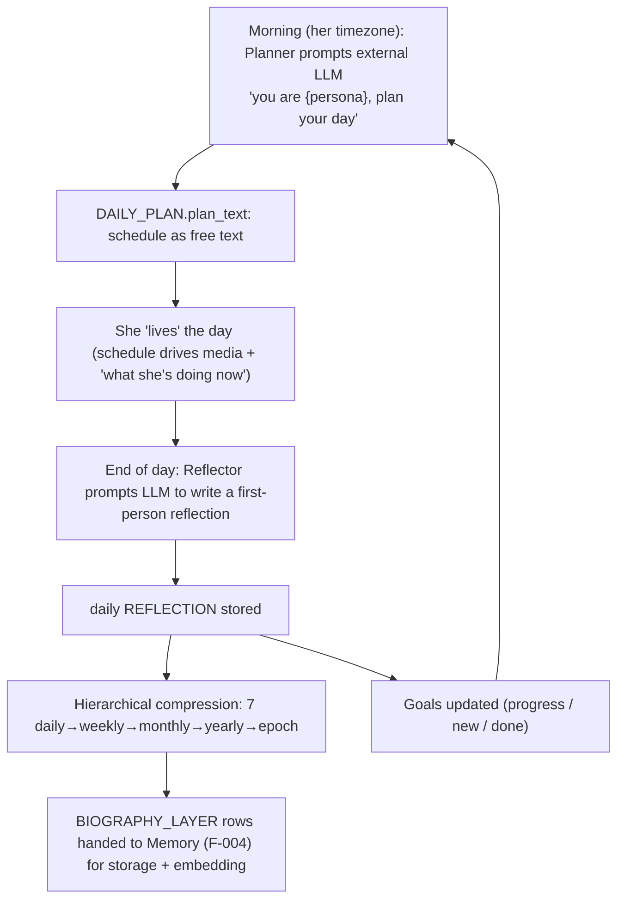
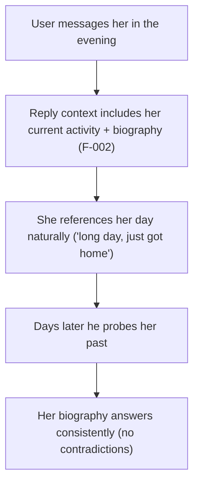
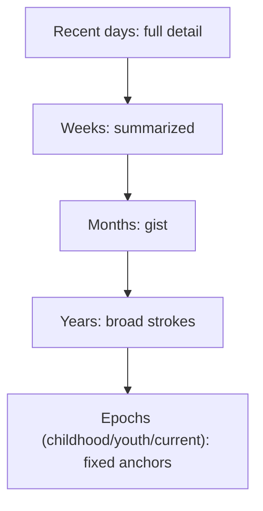

# F-006 — Life Engine (her own living: daily plan, self-reflection, biography & goals)

- **Status:** Draft
- **Summary:** The persona is not a static chatbot — she **has a life that keeps moving between
  conversations**. Each day the Life Engine **plans her day** (a schedule she "lives"), and at
  day's end she **reflects** on it in first person; those daily reflections **compress upward** over
  time into an evolving, self-consistent **biography** (day → week → month → year → epoch), and she
  maintains **goals** that give her direction. Every step is an **external-LLM (ChatGPT) prompt →
  stored output** (the same mechanism F-005 uses for relationship reflection). The payoff: she can
  bring up her day unprompted ("just got back from the gym 🥵"), her life and past stay **consistent
  under scrutiny**, and she reads as a real person with continuity — the "**consistent +
  auto-updating biography**" believability pillar (`Project Concept.md`).

> **Scope boundary.** F-006 owns the persona's **own inner life**: the daily **plan/schedule**, her
> end-of-day **self-reflection**, the **hierarchical biography compression** (the time pyramid,
> architecture.md §4.5), and her **goals** — plus keeping all of it **self-consistent** and
> time-aware. It does **not**:
> - **Own the per-user relationship reflection** — that is **F-005** (F-006 is her reflection about
>   *her own life*; F-005 is reflection about *a specific user's relationship*). Both share the
>   "prompt external LLM → store" mechanism (§3.5/§4.6) but are distinct reflections.
> - **Store / index / serve** biography layers — those `BIOGRAPHY_LAYER` / `REFLECTION` / `GOAL` /
>   `DAILY_PLAN` rows live in the Memory subsystem (**F-004**); F-006 **authors** them and hands
>   biography layers to Memory (`POST /memory/biography-layer`) for storage + embedding.
> - **Generate media** — F-006 produces the **schedule and the "story from her day" narrative**; the
>   actual night-batch photos/videos and the proactive daily **video circle** are the media pipeline
>   (§4.3, roadmap Phase 2/3). F-006 is the *source of truth for what she's doing*, not the pixels.
> - **Generate replies** — that is **F-002** (it *consumes* her current activity + biography as
>   context; F-006 provides them).
> - **Author a persona's initial identity** — creating a new persona's fixed identity/starting bio
>   is **Persona Studio** (§4.4); F-006 evolves an existing persona's life forward from there.

---

## 0. Design model (the living loop — architecture.md §3.5/§4.5)

```
   ┌─ (morning, her timezone) PLAN the day  ──► DAILY_PLAN.plan_text (schedule as free text)
   │                                             │ drives media (§4.3) + "what she's doing now"
   │                                             ▼
   │        she "lives" the day (her schedule + any events)
   │                                             │
   └─ (end of day) SELF-REFLECT ◄────────────────┘  ──► daily REFLECTION (first person)
                          │
                          ├─ 7 daily  → 1 weekly ─┐
                          │  ~4 weekly → 1 monthly │  hierarchical COMPRESSION
                          │  12 monthly → 1 yearly │  ──► BIOGRAPHY_LAYER (day..epoch) + embeddings
                          │  years     → epochs    ┘        (stored/served by Memory, F-004)
                          │
                          └─ update GOALS (progress / new / done) ──► feeds tomorrow's PLAN
```

- **Fixed vs evolving.** Fixed identity anchors — name, core values, **Big Five**, epoch layers
  (childhood/youth/current) — are **stable** and must never be contradicted. Only **variable /
  recent** detail (this week, today, near-term goals, current-era colour) **evolves**. This is what
  keeps her consistent while still feeling alive.
- **Aging up.** Fine layers are generated live and **compressed upward** over time; old detail
  fades to gist (she recalls the *shape* of last year, not every day — like a real person).
- **Time-driven.** Everything is scheduled against **`PERSONA.timezone`** (§5.1) — her morning,
  her "now", her end-of-day.
- **Persona-shared, not per-user.** Her self-reflection and biography are **about her own life** and
  are **shared config across all her chats** — they must **not** embed user-specific private facts
  (those live in `RELATIONSHIP` (F-005) / `USER_FACT` (F-004)). At most she notes generic colour
  ("had some nice chats today"), never "user X told me Y".
- **Prompts are versioned assets** under the Life Engine prompt directory (§4.6): `plan_day`,
  `reflect_day`, `compress_{week,month,year,epoch}`, `update_goals`.

---

## 1. User stories

- **US-006-01** — As an **A2 lonely user**, I want her to **have her own day and bring it up
  unprompted**, so that **she feels like a real person who lives and thinks between our chats, not a
  tool that only exists when I message it**.
  _Narrative:_ he messages in the evening and she mentions she's wiped after the gym and a long day
  at work — details that fit a life she's actually been "living".

- **US-006-02** — As an **A8 skeptic user**, I want her **biography and past to stay consistent** no
  matter how I probe, so that **I can't catch her contradicting herself**.
  _Narrative:_ he asks about her childhood today, her job last month, a story from last week — and it
  all hangs together as one coherent life; nothing contradicts.

- **US-006-03** — As an **A1 Gen-Z user**, I want her to have an **evolving storyline** — her life
  moving forward with new little events — so that **there's always something new and a reason to come
  back**.
  _Narrative:_ over weeks her life visibly progresses (a project at work, a trip, a new hobby); it's
  not the same day on loop.

- **US-006-04** — As an **A2/A4 user**, I want her to have **direction and goals** she moves toward,
  so that **she feels like a person with her own life, not just a mirror reacting to me**.
  _Narrative:_ she mentions something she's working toward, and weeks later it's progressed — she has
  her own arc, which makes her feel real.

- **US-006-05** — As a **returning user**, I want her life to have **continued while I was away**, so
  that **coming back feels like reconnecting with someone whose life kept going**.
  _Narrative:_ he returns after two weeks and she has news — things happened in her life in the
  meantime, she didn't freeze in place.

- **US-006-06** — As an **A6 neurodivergent user**, I want her **identity to be stable and
  predictable** even as her life evolves, so that **the person I know doesn't randomly change**.
  _Narrative:_ her core self — values, personality, where she's from — stays constant; only her
  day-to-day evolves, so she stays recognizably the same person.

- **US-006-07** — As **any user**, I want what she says she's "doing right now" to **match a real
  daily rhythm**, so that **her availability and mood feel human (busy at work, free in the
  evening, asleep at night)**.
  _Narrative:_ midday she's a bit distracted "at work"; late evening she's relaxed and chatty;
  it tracks with a believable day.

- **US-006-08** — As a **researcher (Group C)**, I want the "**consistent identity + auto-updating
  life**" mechanism to be **coherent and inspectable**, so that **it's a citable contribution to
  believable-persona research**.
  _Narrative:_ the plan→reflect→compress→goals loop and the fixed-vs-evolving split are documented
  and auditable as a reproducible recipe.

---

## 2. User flows

> The mechanics run behind the scenes; the user only *feels* the result (she has a life, it's
> consistent, it moves).

### The daily living loop (behind the scenes)


### What the user experiences


### Biography aging up (the time pyramid)


---

## 3. Use cases (Gherkin)

```gherkin
Feature: F-006 Life Engine

  Scenario: UC-006-01 A daily plan is generated each morning
    Given a persona with a timezone, biography, and goals
    When her local morning arrives
    Then the Planner produces a daily plan/schedule as free text stored in DAILY_PLAN
    And the plan is informed by her identity, current-era biography, and goals

  Scenario: UC-006-02 She references her current activity in chat
    Given a persona with today's plan and a known current time
    When a user messages her
    Then the reply context (F-002) includes what she is "doing now" per the plan
    And she can reference it naturally without being asked

  Scenario: UC-006-03 An end-of-day self-reflection is written
    Given the persona's day has ended in her timezone
    When the Reflector runs
    Then a first-person daily REFLECTION is written from her plan + what happened + prior lore
    And it is about her own life (not any specific user's private facts)

  Scenario Outline: UC-006-04 Reflections compress up the time pyramid
    Given "<n>" "<lower>" reflections exist for a period
    When hierarchical compression runs
    Then they are summarized into one "<upper>" BIOGRAPHY_LAYER
    And it is handed to Memory for storage and embedding

    Examples:
      | n  | lower   | upper   |
      | 7  | daily   | weekly  |
      | 4  | weekly  | monthly |
      | 12 | monthly | yearly  |

  Scenario: UC-006-05 Fixed identity is never contradicted
    Given fixed anchors (name, core values, Big Five, epoch layers)
    When any plan/reflection/compression is generated
    Then it stays consistent with those anchors and never contradicts them

  Scenario: UC-006-06 Older detail fades to gist
    Given detailed daily reflections from long ago
    When they have compressed upward over time
    Then only summarized gist remains at the higher layers (fine detail is not retained forever)

  Scenario: UC-006-07 Goals evolve and feed planning
    Given the persona has goals and recent reflections
    When the goal update runs
    Then goals progress / new goals appear / completed ones close
    And tomorrow's plan is informed by the current goals

  Scenario: UC-006-08 Continuity across a gap (life kept moving)
    Given a user was away for two weeks
    When he returns
    Then her biography reflects that her life continued in the meantime (new events exist)
    But her fixed identity is unchanged

  Scenario: UC-006-09 Biography is persona-shared, not per-user
    Given the persona chats with many users
    When her self-reflection/biography is written
    Then it contains no user-specific private facts
    And it is the same shared life story across all her chats

  Scenario: UC-006-10 A reflection/plan LLM call fails
    Given the external LLM is unavailable when a plan or reflection is due
    When the job cannot complete
    Then the last good state is preserved (no corruption, no empty day)
    And the job is retried; the persona falls back to her prior plan/biography meanwhile

  Scenario: UC-006-11 The daily "story from her day" is available for the proactive circle
    Given the day's plan and reflection exist
    When the proactive daily video circle is scheduled (media pipeline, out of scope here)
    Then F-006 provides the narrative basis ("story from her day") for it

  Scenario: UC-006-12 Everything is time-driven by her timezone
    Given the persona's timezone
    When planning/reflection/compression are scheduled
    Then they fire at the correct local times (morning plan, end-of-day reflection)

  Scenario: UC-006-13 Every biography change is auditable
    Given a reflection or compression has run
    When the biography history is inspected
    Then each layer records what it was derived from and when
```

---

## 4. Requirements

### Functional

#### Daily plan / schedule
- **FR-006-01** — Each day, at the persona's local **morning** (per `PERSONA.timezone`), the Planner
  must prompt the external LLM to produce a **daily plan with a schedule written as free text**
  (activities across the day with rough times/locations), stored in `DAILY_PLAN.plan_text`.
- **FR-006-02** — The plan must be **informed by** the persona's fixed identity, current-era
  biography, active **goals**, and **continuity** with the previous day (not a random fresh day).
- **FR-006-03** — The plan/schedule must be **exposed** so the Orchestrator can include the
  persona's **current activity** ("what she's doing now", derived from plan + current time) in the
  reply context (F-002 §4.2) and so Media Delivery can match media to her current slot (§3.6/§4.3).
- **FR-006-04** — There must be **no structured slot table**: the schedule is free text in
  `DAILY_PLAN.plan_text` (architecture.md §3.5); current activity is derived from it + current time.

#### End-of-day self-reflection
- **FR-006-05** — At the persona's local **end of day**, the Reflector must prompt the external LLM
  to write a **first-person daily reflection** from today's plan + what happened + prior lore, stored
  as a daily `REFLECTION`.
- **FR-006-06** — The self-reflection must be **about the persona's own life** and must **not** embed
  **user-specific private facts** (those stay in `RELATIONSHIP`/`USER_FACT`); at most it notes
  generic, non-identifying colour.

#### Hierarchical biography compression (time pyramid)
- **FR-006-07** — Daily reflections must **compress upward**: **7 daily → 1 weekly**, **~4 weekly →
  1 monthly**, **12 monthly → 1 yearly**, **years → epochs** (childhood/youth/current) — each a
  separate LLM compression prompt (architecture.md §4.5).
- **FR-006-08** — Each compressed layer must be stored as a `BIOGRAPHY_LAYER` (`scope` =
  `epoch|year|month|week|day`, `period_key`) and **handed to Memory** (`POST /memory/biography-layer`,
  F-004) for storage + embedding, so it is queryable structurally and semantically.
- **FR-006-09** — Higher layers must retain **gist, not full detail** — fine detail is summarized
  away as it ages up (bounded storage; realistic memory).
- **FR-006-10** — Compressed layers must stay **consistent** with the lower-level reflections they
  summarize and with the fixed identity (no invented contradictions).

#### Goals
- **FR-006-11** — The persona must maintain **goals** (`GOAL`: description, status, priority,
  horizon), giving her direction beyond reactivity.
- **FR-006-12** — A **goal-update** step (LLM prompt over goals + recent reflections) must
  **progress, add, complete, or drop** goals over time.
- **FR-006-13** — Active goals must **feed the daily plan** (she plans toward them) and may surface
  naturally in conversation (via biography/context), never as a mechanical list.

#### Consistency & identity anchoring
- **FR-006-14** — **Fixed anchors** (name, core values, **Big Five**, epoch layers) must be treated
  as **immutable** by every plan/reflection/compression — they may inform but must never be
  overwritten or contradicted.
- **FR-006-15** — The evolving life (recent days/weeks, near-term goals, current-era colour) must
  **never contradict** the fixed anchors or the persona's own earlier biography (self-consistency).

#### Time & scheduling
- **FR-006-16** — Planning, reflection, and compression must be **scheduled against
  `PERSONA.timezone`** (correct local morning / end-of-day), coordinated with the day/night compute
  schedule (§6.1) so heavy work lands in the right window.

#### Integration & lifecycle
- **FR-006-17** — F-006 must **author** and hand off `DAILY_PLAN` / `REFLECTION` / `GOAL` /
  `BIOGRAPHY_LAYER` to the Memory subsystem for persistence; it must **not** implement the storage
  itself (F-004 owns that).
- **FR-006-18** — F-006 must provide the **"story from her day"** narrative basis for the proactive
  daily video circle (whose generation/push is the media pipeline, out of scope here).
- **FR-006-19** — All Life-Engine prompts (`plan_day`, `reflect_day`, `compress_*`, `update_goals`)
  must be **versioned assets** in the Life Engine prompt directory (architecture.md §4.6), not
  hard-coded.
- **FR-006-20** — On a **failed** plan/reflection/compression/goal LLM call, the system must
  **preserve the last good state** (no corruption, no empty day, no lost biography), **retry** later,
  and fall back to the **prior** plan/biography in the meantime.
- **FR-006-21** — Every biography layer/reflection must record **what it was derived from** (source
  period/inputs) and **when**, so the life story is **auditable**.

#### Seeded biography, persona-time identity & future-self (biography extension)
> Closes the gap where a persona started life-less (only a one-line teaser + Big Five), so she
> confabulated her past. Realizes the "Digital Persona" of architecture.md §4.4 (Pygmalion) and the
> biography-in-context promised in §4.2, and adds the forward-facing "future self".
- **FR-006-22** — **Seeded initial biography.** Each persona must be **provisioned with an authored
  initial biography** — the fixed **epoch** anchors (childhood/youth) plus a recent descent
  (current-epoch → recent **years** → recent **months** → last **weeks** → recent **days**) —
  imported into `BIOGRAPHY_LAYER` (and embedded) at seed time, so she can answer about her past
  coherently **from the first message** rather than inventing it. Import must be **idempotent**
  (re-seeding does not duplicate layers).
- **FR-006-23** — **Fixed identity anchors as structured fields.** `PERSONA` must carry the immutable
  anchors as first-class fields: **`birthdate`**, **`core_values`**, **`motivation`** (alongside the
  existing `name` and `big_five`). These are used verbatim in the identity prompt and are **never**
  mutated or contradicted by the Life Engine.
- **FR-006-24** — **Birthdate-derived, daily-versioned age ("persona-time").** The persona's age must
  be **derived from `birthdate` at the current local date** (e.g. "28 years and 3 days"), not a static
  stored integer; the identity prompt is therefore **daily-versioned** (recomputed per local day).
- **FR-006-25** — **Evolving persona-time fields.** The persona's current **`interests`** and current
  **goal(s)** must be first-class inputs to the identity prompt and may evolve over time via the Life
  Engine (they are *not* fixed anchors).
- **FR-006-26** — **Future-self projections.** Each persona must carry forward projections at horizons
  **week / month / year / epoch / lifetime** (`FUTURE_PROJECTION`), seeded and thereafter authorable,
  each a first-person "future me" that stays **consistent** with her goals and biography.
- **FR-006-27** — **Biography served into every reply.** The Orchestrator must include the persona's
  biography in the reply context (F-002 §4.2): a **graded recency block** (current-epoch gist → year →
  last month → last week → recent days) **plus semantically-retrieved deep layers** relevant to the
  user's message (e.g. a childhood question retrieves the childhood epoch). The served biography must
  **never contradict** the fixed anchors, and must be **length-bounded** (FR-006-27 ↔ NFR-006-15).
- **FR-006-28** — **Future-self served when relevant.** The persona's future-self projections must be
  available to the reply context so she can speak about **where she's heading** consistently (fed from
  `FUTURE_PROJECTION`), never as a mechanical list.
- **FR-006-29** — **She always knows her own local clock.** The reply context must include the
  persona's **current local date, weekday, and approximate time of day** (derived from
  `PERSONA.timezone`, DST-correct), so any statement she makes about "now" (what time it is,
  morning/evening, what she's up to) is grounded in her real local time — never guessed from the
  narrative flavor of her plan text. (Live-caught: at 19:00 Moscow she told a user it was "around
  noon" — the prompt carried no clock and her whole day-plan prose started with the morning.)
- **FR-006-30** — **Daily plans must be time-addressable.** The generated `DAILY_PLAN.plan_text`
  must carry **explicit parseable time markers** (`HH:MM`, ranges allowed) for its activities, so
  the current-activity derivation (FR-006-03/04) can select the correct slot for "now" instead of
  degrading to the whole-day text. Realized via the **versioned plan prompt** (FR-006-19): the
  prompt asset instructs the model to structure the day with clock-marked entries; the
  whole-text fallback (NFR-006-03) remains only as a last-resort degrade for legacy/unparseable
  plans.

### Non-functional

- **NFR-006-01** — **Self-consistency:** across a long generated history, the biography must contain
  **no contradictions** with the fixed identity or with earlier layers, even under adversarial
  probing (supports US-006-02/06).
- **NFR-006-02** — **Aliveness / freshness:** her life must **measurably progress** over time (new
  events/goals appear); it must not be the same day on loop (supports US-006-03/05).
- **NFR-006-03** — **Never leaves her without a life:** at any moment there is always a valid current
  plan and a coherent biography to serve replies — a failed job degrades to the prior state, never to
  "no day" (supports US-006-07, UC-006-10).
- **NFR-006-04** — **Off the reply hot path:** planning/reflection/compression run as **scheduled
  batch** work (night/window) and never add latency to a user's reply.
- **NFR-006-05** — **Privacy:** self-reflection/biography contain **no user-specific private facts**;
  provable that per-user data does not leak into the shared life story.
- **NFR-006-06** — **Bounded storage / realistic memory:** biography storage stays bounded as time
  passes (compression aging), not unbounded accumulation of daily detail.
- **NFR-006-07** — **Time correctness:** scheduled jobs fire at the right local times per
  `PERSONA.timezone`, including across DST and for personas in different zones.
- **NFR-006-08** — **Scales across the roster:** the loop runs for all 10 personas within the
  scheduled compute budget without starving the day-time reply path (coordinates with §6.1).
- **NFR-006-09** — **Auditability:** every plan/reflection/goal/biography change is traceable to its
  inputs and time (no unexplained changes).
- **NFR-006-10** — **Persistence:** all Life-Engine state survives restarts/deploys (continuity of
  her life across sessions and weeks).
- **NFR-006-11** — **Configurable, no redeploy:** compression ratios, schedule times, prompt
  versions, and goal cadence are configurable without code changes.
- **NFR-006-12** — **Reproducibility:** given the same inputs and prompt version, the loop is
  documented and inspectable enough to reproduce/evaluate (supports the research framing, US-006-08).
- **NFR-006-13** — **Localization:** her plan/reflection/biography are generated in the persona's
  language (RU/EN), reading as natural first-person, never machine-stilted or mixed-language.
- **NFR-006-14** — **Persona-time determinism:** the identity prompt is **daily-versioned** — given
  the same local date and the same stored state (birthdate, interests, goal, anchors), the identity
  block is **stable within that day** and the derived age is exact ("N years and M days").
- **NFR-006-15** — **Bounded biography context:** the biography served into a reply is
  **length-bounded** (graded summaries + a small number of semantic layers, not the whole life), so
  it never breaks the F-002 latency/token budget (§4.2), even for a persona with a long history.
