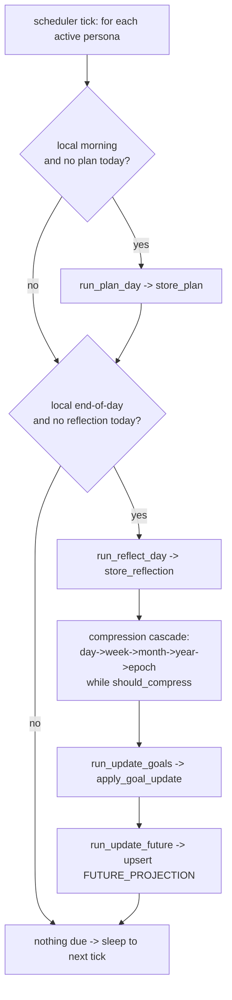
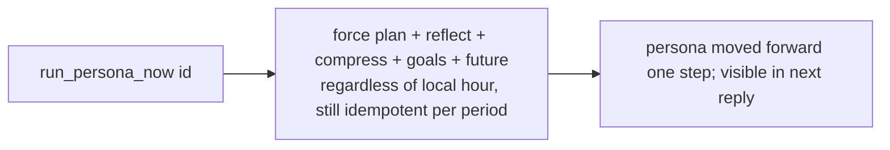

# F-007 — Life Engine Scheduler (the loop actually runs — autonomous plan/reflect/compress/goals/future)

> **Why this feature exists.** F-006 built every step of "her own living" — `run_plan_day`,
> `run_reflect_day`, `run_compress`, `run_update_goals` — plus the timezone-correct scheduling
> predicates (`is_local_morning`, `is_local_end_of_day`, `should_compress`). But **nothing called
> them**: there was no driver, so a persona's plan, current activity, daily reflections, biography
> layers, goals, and future-self were all **frozen** after seeding. Only her age (derived) advanced.
> F-007 is the missing **driver + scheduler**: it runs the F-006 loop autonomously on a cadence so
> her life actually moves forward day to day. It also adds the one missing authoring step —
> **future-self update** (F-006 seeded projections but never re-authored them).

## Scope boundary

- **F-007 owns:** the autonomous run loop (a per-persona **tick** that runs the *due* F-006 steps),
  the **scheduler** that fires ticks on a cadence, the **compression cascade** orchestration, the
  **future-self authoring** step, on-demand "run now" for ops/testing, and coordination that keeps
  this off the user-reply hot path.
- **F-006 owns** (consumed here): the individual step semantics — plan/reflect/compress/goal
  content, fixed-vs-evolving anchoring, aging-up, provenance/auditability, degrade-on-failure. F-007
  **calls** those; it does not re-implement them.
- **F-004** stores/embeds the layers; **F-002** consumes the resulting current-activity/biography in
  replies. Media generation (video circles from her day) stays out of scope (media phase).
- **Out of scope:** production cron/orchestration infra and GPU day/night arbitration at scale
  (architecture.md §6.1) — F-007 specifies the loop and ships a **dev in-process scheduler**; the
  prod deployment target (separate scheduled worker) is noted but not built here.

## 1. User stories

- **US-007-01** — As an **A2/A3 user**, I want her life to **advance on its own every day** (she
  plans a new day, lives it, reflects at night), so that **when I come back there's genuinely
  something new**, not the same seeded snapshot forever.
- **US-007-02** — As an **A8 skeptic**, I want the progression to be **consistent and gradual** — her
  biography compresses and her goals move without contradictions — so that **it reads like a real
  life, not random regeneration**.
- **US-007-03** — As **any user**, I want "**what she's doing right now**" to reflect a **freshly
  planned day**, so that her availability/mood tracks a believable rhythm rather than an empty plan.
- **US-007-04** — As a **product owner**, I want her **goals and future-self to update over time**
  from what she's been "living", so that **she has a moving arc** and the future isn't a static
  brochure.
- **US-007-05** — As an **operator/developer**, I want to **trigger her loop on demand** for one
  persona (without waiting for the scheduled hour), so that **I can test/seed her forward and demo
  the living behavior**.
- **US-007-06** — As an **operator**, I want the loop to run **unattended, off the reply path, and
  survive restarts**, so that **it never slows a live conversation and never loses her accumulated
  life**.

## 2. User flows

### The scheduled tick (per persona, behind the scenes)

### On-demand run (ops/testing)

## 3. Use cases (Gherkin)

- **UC-007-01 — Morning plan fires once.** Given it is the persona's local morning and she has no
  plan for today; When a tick runs; Then a new `DAILY_PLAN` is authored and stored, and a second
  tick the same morning does not create another.
- **UC-007-02 — End-of-day reflection + cascade.** Given it is her local end-of-day with today's
  plan present and no reflection yet; When a tick runs; Then a daily `REFLECTION` is stored and, if
  7 daily reflections have accrued, they compress into a weekly `BIOGRAPHY_LAYER` (and so on up).
- **UC-007-03 — Goals move.** Given recent reflections; When the goal-update step runs; Then goals
  are progressed/added/completed/dropped per the LLM's structured output.
- **UC-007-04 — Future-self is re-authored.** Given her latest biography + goals; When the
  future-update step runs; Then her week/month/year/epoch/lifetime projections are rewritten (no
  longer the seeded snapshot) and stay consistent with her goals.
- **UC-007-05 — Nothing due.** Given it is mid-afternoon (neither morning nor end-of-day); When a
  tick runs; Then no LLM call is made and nothing changes.
- **UC-007-06 — Degrade on failure.** Given the LLM is unavailable; When a tick runs; Then the step
  returns nothing, the last good state is preserved, no partial/corrupt row is written, and the tick
  does not raise.
- **UC-007-07 — On-demand.** Given an operator runs the persona now; When invoked; Then all steps run
  regardless of the local hour, still idempotent per period, moving her forward for a demo/test.
- **UC-007-08 — Off the hot path.** Given a scheduled tick is running; When a user sends a message;
  Then the reply is produced without waiting on the tick.

## 4. Requirements

### Functional
- **FR-007-01** — A **scheduler** must run the Life Engine loop **autonomously on a cadence**, with
  **no manual trigger** required (an in-process async loop for dev; a separate scheduled worker in
  prod — the interface is the per-persona tick).
- **FR-007-02** — Each **tick** must run only the steps that are **due** for that persona at her
  **current local time** (morning ⇒ plan; end-of-day ⇒ reflect, then compress, goals, future),
  timezone/DST-correct via F-006's predicates.
- **FR-007-03** — Every step must be **idempotent per period**: at most one plan and one reflection
  per persona per local day; re-running a tick in the same window must not duplicate.
- **FR-007-04** — After a daily reflection, the tick must run the **compression cascade**
  day→week→month→year→epoch, invoking F-006 compression whenever `should_compress` is met and
  storing+embedding each resulting `BIOGRAPHY_LAYER`.
- **FR-007-05** — The tick must run the **goal-update** step on cadence and **apply** its
  progress/add/complete/drop to the persona's goals.
- **FR-007-06** — The tick must run a **future-self update** step that **re-authors** her
  `FUTURE_PROJECTION` rows (week/month/year/epoch/lifetime) from her latest biography + goals, so the
  future evolves instead of staying the seeded snapshot. (Adds the missing F-006 authoring step for
  FR-006-26.)
- **FR-007-07** — The loop must run **off the user-reply hot path** — a running tick must never block
  or delay a reply (NFR-006-04).
- **FR-007-08** — On any step's LLM failure, the tick must **preserve the last good state**, write no
  partial/corrupt data, and **not raise** (delegates to F-006 FR-006-20).
- **FR-007-09** — The scheduler must run across the **whole active persona roster**, each on **its
  own** timezone.
- **FR-007-10** — Every autonomous change must remain **auditable** (provenance + time), reusing
  F-006's `source_period`/`prompt_version` recording (FR-006-21).
- **FR-007-11** — Cadence and behavior must be **config-driven** (tick interval, schedule hours,
  prompt versions, goal/future cadence) **without code changes** (extends `LifeEngineConfig`).
- **FR-007-12** — An **on-demand** entrypoint must run a single persona's full loop **now**
  (regardless of local hour, still idempotent per period) for ops/testing/demo.

### Non-functional
- **NFR-007-01** — **No reply starvation:** scheduled work must not measurably slow the user-reply
  path (it runs as a background task / separate worker, not inline).
- **NFR-007-02** — **Timezone/DST correctness:** due-detection uses the persona's local time and is
  correct across DST and across personas in different zones.
- **NFR-007-03** — **Bounded work per tick:** a tick does a small, bounded amount of work (a handful
  of LLM calls at most), so the loop is predictable and never runaway.
- **NFR-007-04** — **Idempotent & safe under repeats:** repeated ticks (crash/restart/overlap)
  converge to the same state — no duplicate plans/reflections, no double-applied goal changes for the
  same period.
- **NFR-007-05** — **Survives restart:** all progression is persisted (F-004), so a restart resumes
  cleanly and never loses her accumulated life.
- **NFR-007-06** — **Degrade, don't crash:** a failing tick for one persona must not stop the loop
  for the others; the scheduler keeps running.
- **NFR-007-07** — **Observability:** each tick's actions (what ran, what was skipped, failures) are
  logged so the autonomous behavior is inspectable.
- **NFR-007-08** — **Config without redeploy:** interval/hours/cadence are tunable via config/env,
  consistent with F-006 NFR-006-11.
