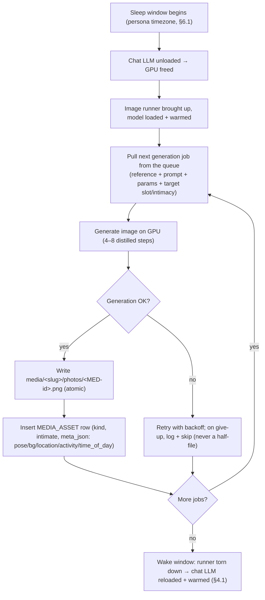
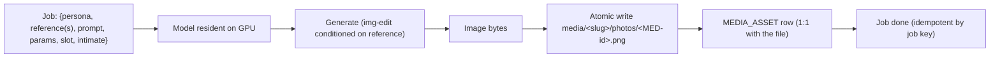

# F-008 — Image Generation Runner (self-hosted batch engine)

- **Status:** Draft
- **Summary:** The **engine** that turns a *generation request* into a stored, hyper-realistic
  photo of a specific persona. It is a **self-hosted image-model runner** (its own isolated
  environment behind a fixed network/job API — architecture.md §6.2c), consuming jobs from the queue
  during the persona's **sleep window** (the night half of the day/night GPU schedule, §6.1) and
  writing finished assets to the external `media/` library + a `MEDIA_ASSET` row with metadata
  (§5.1, §6.3). It is **persona-agnostic** and **model-swappable** behind the fixed interface — the
  A/B candidate (Rapid-AIO vs Qwen-Image-Edit + Lightning) is chosen by benchmark and plugged in
  without touching callers. This feature owns **the engine and its job lifecycle only**: *how a
  request becomes a saved, tagged image on the GPU, reliably, off the hot path.*

> **Scope boundary.** F-008 is the **image-generation service/runner** (architecture.md §3.9 Image
> Generation Service, §4.3 image model, DFD-3 night media generation). It owns: the isolated runner
> + fixed job API, night-batch job consumption, the GPU day/night handoff with the chat LLM (§6.1),
> turning a `(reference, prompt, params)` request into image bytes, and persisting them as a
> `media/<slug>/photos/<MED-id>.png` file + a `MEDIA_ASSET` row with its metadata. It does **not**:
> - **Decide *what* to generate** — the per-slot **generation prompts** (from her schedule + current
>   time + biography) are authored by **F-010**; F-008 just executes a prompt it is handed.
> - **Guarantee identity/appearance consistency** — the reference-conditioning policy that makes it
>   "unmistakably the same girl" is **F-009** (F-008 accepts reference images and passes them to the
>   model; F-009 specifies which references and how).
> - **Plan the day's photo set** (which slots, how many angles) — that is the **Daily SFW Photo
>   Batch** (**F-011**) which *enqueues* the jobs F-008 runs.
> - **Serve media to users** — reading the archive and sending it on request is **Media Delivery**
>   (**F-012**); F-008 only *writes* the archive, never reads it for a user, never runs on the reply
>   hot path.
> - **Own intimate-content gating / adult verification** — that is **F-014** / Media Delivery; F-008
>   will generate an intimate asset if a job asks for one, tagging its `intimate`/`intimacy_level`,
>   but the *willingness/entitlement* decision is not here.
> - **Generate video** — Wan 2.2 / HunyuanVideo-Avatar are the separate **Video Generation Service**
>   (later phases); F-008 is images only. (F-015 uses F-008 to make video *keyframes*.)
> - **Monetization** — deferred (architecture.md §3.7).

---

## 1. User stories

- **US-008-01** — As a **B2-operator running personas at scale**, I want a **reliable batch engine
  that pre-produces the day's photos overnight**, so that **media is ready to send instantly by day
  without any real-time GPU cost**.
  _Narrative:_ every night the engine drains its job queue, produces the next day's photos for each
  persona, and by morning the archive is full — daytime chats serve pre-made images with zero
  generation latency.

- **US-008-02** — As an **A3 premium user**, I want photos to arrive **instantly and in premium
  quality** when I ask, so that **it feels bespoke and high-end, never like I'm waiting on a render**.
  _Narrative:_ he asks for a pic and it lands at once — because F-008 already generated it overnight;
  he never sees a "generating…" delay.

- **US-008-03** — As an **A8 skeptic user**, I want the photos to **survive close scrutiny** (zoom
  into hands, skin, background), so that **I can't catch them as AI-generated**.
  _Narrative:_ he zooms in looking for tell-tale artifacts; the engine's output (at the chosen model
  + step count) holds up as a real phone photo.

- **US-008-04** — As the **platform operator**, I want the engine to **never leave a persona with an
  empty archive** and to **recover from a failed generation**, so that **she always has media for the
  day and one bad job doesn't cascade**.
  _Narrative:_ a job fails mid-batch; the engine retries it, keeps the rest of the batch going, and
  never publishes a half-written file — the morning archive is complete and valid.

- **US-008-05** — As a **B4 platform/engine integrator**, I want the image model to be **swappable
  behind a fixed job API**, so that **I can adopt the benchmark-winning model (or a future one)
  without changing any caller**.
  _Narrative:_ the A/B benchmark picks a model; the operator points the runner at it; Media Delivery,
  the batch planner, and the queue are all unchanged because the job contract is fixed.

- **US-008-06** — As the **infra operator on one GPU**, I want image generation to **only run when
  the chat LLM is unloaded**, so that **the two heavy models never fight for the 48 GB GPU**.
  _Narrative:_ at sleep time the chat model is unloaded, the image runner is brought up for the batch,
  and at wake time it's torn down and the chat model reloaded+warmed — a clean single-owner handoff.

---

## 2. User flows

> The end user never sees the engine; they feel its result (instant, real photos). These flows are
> the system's, per DFD-3 (architecture.md §5.2).

### The night batch (engine point of view)


### One generation job (request → asset)


---

## 3. Use cases (Gherkin)

```gherkin
Feature: F-008 Image Generation Runner

  Scenario: UC-008-01 A generation job produces a stored asset
    Given the image runner is up with a model loaded
    And a generation job with a persona reference, a prompt, and params
    When the runner processes the job
    Then an image is generated on the GPU
    And it is written to media/<slug>/photos/<MED-id>.png
    And a MEDIA_ASSET row is created with kind=photo and its metadata

  Scenario: UC-008-02 The file and the DB row map 1:1 by MED-id
    Given a completed generation job
    When the asset is stored
    Then the file name equals the MEDIA_ASSET.id (scheme MED-<persona>-<nnnnn>)
    And exactly one file exists for exactly one row

  Scenario: UC-008-03 A job carries its slot/activity/intimacy metadata onto the asset
    Given a job targeting the "gym, 7am" slot at intimacy level 0
    When the asset is produced
    Then MEDIA_ASSET.meta_json records pose/background/location/activity/time_of_day
    And intimate=false and intimacy_level reflect the job

  Scenario: UC-008-04 A failed generation is retried and never writes a half-file
    Given a job whose generation errors once
    When the runner processes it
    Then it retries with backoff
    And no partial/corrupt file is left in the archive
    And on eventual success exactly one valid asset is written

  Scenario: UC-008-05 Re-running the same job is idempotent
    Given a job that already produced an asset
    When the same job key is processed again
    Then no duplicate asset is created

  Scenario: UC-008-06 The model is swappable behind the fixed job API
    Given the runner is configured for model A
    When it is reconfigured for model B
    Then the same job contract produces assets without any caller change

  Scenario: UC-008-07 Only one heavy model owns the GPU at a time
    Given the chat LLM is loaded during awake hours
    When the sleep window begins
    Then the chat LLM is unloaded before the image runner loads its model
    And at wake the image runner is torn down before the chat LLM is reloaded and warmed

  Scenario: UC-008-08 The night batch completes the day's archive
    Given a queue of the day's generation jobs
    When the batch runs overnight
    Then all jobs are consumed and the archive is complete by the wake window
    But if a job fails permanently it is logged and skipped without blocking the rest

  Scenario: UC-008-09 The runner never runs on the reply hot path
    Given a user asks for a photo during the day
    When the reply turn runs
    Then no image generation occurs inline; Media Delivery serves a pre-generated asset

  Scenario: UC-008-10 Generation is conditioned on the persona's reference
    Given a job with the persona's reference image(s)
    When the image is generated
    Then the reference is supplied to the model as identity conditioning (F-009 owns which/how)
```

---

## 4. Requirements

### Functional

#### Runner & isolation
- **FR-008-01** — The image generation service must be a **self-hosted, isolated runner** with its
  own environment and its own model weights, exposing a **fixed job API** (enqueue → generate →
  write archive) that callers use without importing model code (architecture.md §6.2c, §3.9).
- **FR-008-02** — The runner must be **persona-agnostic**: it generates for any persona from the job
  payload (reference(s) + prompt + params + target persona), with no persona hard-coded.
- **FR-008-03** — The image **model must be swappable behind the fixed job API** — the A/B candidate
  (Rapid-AIO v23 vs Qwen-Image-Edit-2511 + Lightning) or any future model is selected by config and
  plugged in without changing the queue, the batch planner, or Media Delivery (architecture.md §4.3,
  §4.8).

#### Generation
- **FR-008-04** — Given a job `{persona, reference(s), prompt, params}`, the runner must **generate
  an image on the GPU** at the model's recommended **low step count (4–8 distilled steps)**
  (architecture.md §4.3), accelerated per the chosen model (LightX2V / distilled checkpoint).
- **FR-008-05** — The runner must **pass the persona's reference image(s) to the model as
  conditioning** for identity consistency (the *which/how* is F-009; F-008 must accept and forward
  them). **All supplied references must be fed, not just the first**: the serving node accepts up to
  **3** images (`image1/image2/image3` → `Picture 1/2/3`, architecture.md §4.3b), so a job carrying
  a face anchor **and** a full-body anchor must reach the model with **both** bound in order.
  Silently dropping references past the first is a defect (it discards F-009's anatomy anchor).
- **FR-008-06** — Generation **parameters** (steps, guidance/CFG, resolution, seed, negative prompt)
  must be **part of the job / config**, not hard-coded, so quality/speed can be tuned per model.

#### Storage & metadata (hand-off to the media library)
- **FR-008-07** — Each finished image must be written to the external **`media/<persona_slug>/photos/`**
  library, named by its **`MEDIA_ASSET.id`** (scheme **`MED-<persona>-<nnnnn>`**), so a DB row and a
  file map **1:1** (architecture.md §5.1, §6.3).
- **FR-008-08** — For each asset the runner must insert a **`MEDIA_ASSET` row** with `persona_id`,
  `kind=photo`, `intimate` bool, `intimacy_level`, `storage_ref` (relative media path), and
  **`meta_json`** carrying **pose / background / location / activity / time_of_day** (architecture.md
  §5.1, §4.3) — the metadata Media Delivery and sexting-continuity need.
- **FR-008-09** — File writes must be **atomic** (write-temp-then-rename or equivalent): a partially
  generated/failed image must **never** appear in the archive as if it were a finished asset.
- **FR-008-10** — The runner must **only write** the archive — it must never read/serve assets for a
  user (that is Media Delivery, F-012) and never generate on the reply hot path (architecture.md
  §3.6, §3.2).

#### Job lifecycle (queue, night batch)
- **FR-008-11** — The runner must **consume generation jobs from the queue** and run them as a
  **scheduled night batch** during the persona's sleep window (architecture.md §6.1, DFD-3), never
  during awake/serving hours.
- **FR-008-12** — Job processing must be **idempotent** by a job key: re-processing the same job
  (retry, redelivery) must **not** create a duplicate asset.
- **FR-008-13** — On a **failed generation** (model error, OOM, timeout), the runner must **retry
  with backoff**, and on final give-up **log + skip** the job without leaving a partial file and
  without blocking the rest of the batch (architecture.md §6.4).
- **FR-008-14** — The batch must be **resumable**: if interrupted (crash, window end), remaining jobs
  are picked up on the next run so the archive still completes.

#### GPU day/night ownership
- **FR-008-15** — The runner must **only hold the GPU when the chat LLM is unloaded** — coordinated
  by the day/night scheduler so exactly **one heavy model owns the 48 GB GPU at a time** (architecture.md
  §6.1, §6.2c). At sleep: chat unloaded → image runner up. At wake: image runner torn down → chat
  reloaded + warmed (F-002 pre-warm, §4.1).
- **FR-008-16** — The runner must be **brought up and torn down cleanly** each night (start model,
  process batch, release GPU), leaving no leaked GPU memory that would starve the daytime chat model.
- **FR-008-17** — **Output-validity gate (measured 2026-07-22).** A "successful" model run is NOT
  proof of a usable image: distilled AIO checkpoints occasionally emit a **NaN latent → an
  all-black frame** that the serving backend still reports as success. The runner must **validate
  the produced image** and treat an invalid frame (all-black / NaN) as a **retryable generation
  failure** (FR-008-13 path) — it must **never store a black frame as a MEDIA_ASSET**. A "done" job
  always means a *valid, non-black* image on disk (ties NFR-008-01 realism, NFR-008-05 integrity).
- **FR-008-18** — **Seed jitter on retry.** Because a black frame can be **seed-deterministic** (the
  same seed re-rolls the same NaN), each retry of a failed generation must use a **different seed**
  (offset by the attempt count), so a bad seed self-heals instead of looping to give-up. Same-seed
  reproducibility (FR-008-06 / TC-FR-008-06-03) still holds for the *first* attempt.

- **FR-008-19** — **Persist the scene description (ISS-008).** `MEDIA_ASSET.meta_json` must carry
  F-010's `scene_description` alongside the five slot fields, so Media Delivery (F-012), the
  conversation context (F-002 FR-002-25) and archive matching (F-021 FR-021-11) all read the same
  human description of what the frame shows. Storing a field that merely echoes another (today's
  `background` duplicates `location`) does not satisfy this requirement.

### Non-functional

- **NFR-008-01** — **Realism:** at the chosen model + step count, output must read as a real phone
  photo under scrutiny (believable skin, hands, background; no tell-tale AI artifacts) — the
  hyper-realism bar of `user_metrics.md` (measured by the F-008-benchmark + human acceptance).
- **NFR-008-02** — **Throughput / fits the window:** the night batch must produce a persona's full
  day archive **within the sleep window** on the target GPU (accelerated to 4–8 steps), so the
  archive is ready by wake (architecture.md §4.3, §6.1).
- **NFR-008-03** — **Never an empty archive:** a persona must never wake with **no media** for the
  day; a failed batch degrades to the **prior day's** archive rather than nothing, and observability
  **alerts on an empty archive** (architecture.md §6.4).
- **NFR-008-04** — **Off the hot path:** image generation must add **zero latency** to any user
  reply; it is scheduled batch work only (architecture.md §3.2, §3.6).
- **NFR-008-05** — **Referential integrity:** every `MEDIA_ASSET` row must have its file and every
  archived file its row (1:1); no orphan rows, no orphan files (architecture.md §5.1).
- **NFR-008-06** — **Durability:** generated assets and their rows survive restarts/redeploys (the
  archive is persistent object storage / the `media/` tree, §6.2).
- **NFR-008-07** — **Isolation of environments:** the image runner's dependencies (torch/CUDA/
  diffusers/ComfyUI/LightX2V) must not conflict with the chat or video runners — separate env/image
  (architecture.md §6.2c).
- **NFR-008-08** — **Observability:** the runner must expose metrics — jobs done/failed, per-image
  latency, batch completion vs window, GPU memory, empty-archive + not-torn-down alerts
  (architecture.md §6.4).
- **NFR-008-09** — **Swappability without regression:** switching the model behind the fixed API
  must not change the job contract or the stored `MEDIA_ASSET` schema (checkable by running the same
  jobs against A and B — F-008-benchmark).
- **NFR-008-10** — **Config-driven, no redeploy:** model choice, step count, params, batch window,
  and paths are configurable without code changes (architecture.md §4.8).
