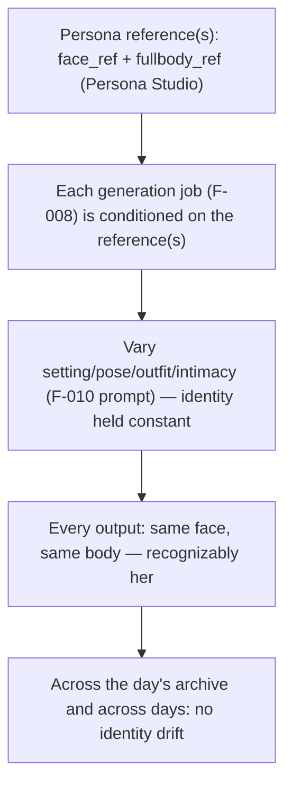
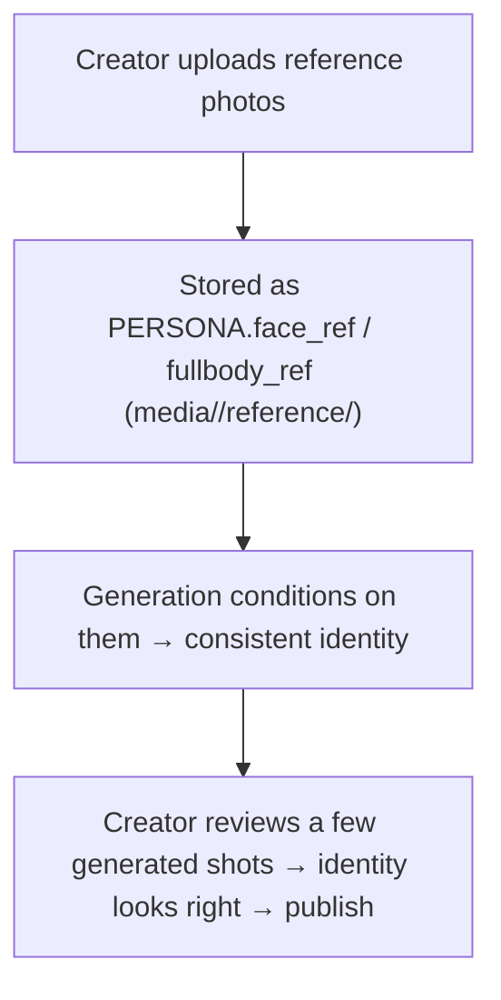

# F-009 — Appearance & Identity Consistency

- **Status:** Draft
- **Summary:** The policy that makes every generated image **unmistakably the same girl** — the same
  face, body, and look across every pose, background, outfit, time of day, and intimacy level, and
  across days/weeks. Each persona has **reference image(s)** (a face anchor and a full-body anchor —
  `PERSONA.face_ref` / `fullbody_ref`, §5.1) authored via **Persona Studio** (§3.8/§4.4). Image
  generation (**F-008**) is **conditioned on those references** using the img-edit model's
  character-consistency capability (Qwen-Image-Edit-2511 is tuned specifically for character
  consistency across edits — §4.3). This feature owns **the identity-conditioning policy and its
  guarantee**: *which references are used, how, and the requirement that output never drifts off the
  persona's real appearance.* It is the "**consistent imagery**" believability pillar
  (`Project Concept.md`, `user_metrics.md`).

> **Scope boundary.** F-009 owns **appearance identity**: the persona reference images, the
> conditioning policy (which ref(s) per shot, how strongly), and the *guarantee* that generated
> images are the same recognizable person. It does **not**:
> - **Run the model / store the asset** — that is the engine **F-008** (F-009 says *how* to condition;
>   F-008 executes it and saves the result).
> - **Decide the scene/pose/outfit** — the *content* prompt is authored by **F-010** (F-009 keeps the
>   *identity* constant while F-010 varies the *setting*).
> - **Author the reference images themselves** — capturing/uploading a persona's reference photos is
>   **Persona Studio** (§3.8/§4.4); F-009 consumes and applies them.
> - **Own realism in general** — overall photo realism (skin, lighting, no artifacts) is the engine's
>   output quality (**F-008** NFR-008-01); F-009 is specifically about *identity* fidelity (is it the
>   same person), which is one facet of that.
> - **Voice/text identity** — appearance only; her texting voice is F-002/F-003.

---

## 1. User stories

- **US-009-01** — As an **A8 skeptic user**, I want **every photo to be recognizably the same woman**
  no matter the setting, so that **I can't catch it as "a different AI face each time"**.
  _Narrative:_ he compares her gym selfie, her cafe photo, and a later intimate shot — same face,
  same body, same girl; nothing about her look drifts between images.

- **US-009-02** — As an **A3 premium user**, I want her to look like **one specific, consistent
  person who is *mine***, so that **it feels like a real girl I know, not a random generator**.
  _Narrative:_ over weeks her face and figure stay exactly consistent; she is unmistakably the same
  person he's been talking to since day one.

- **US-009-03** — As a **B1 solo creator**, I want to **define a persona's look by uploading a few
  reference photos** and have the engine hold that identity rock-solid, so that **I can spin up a
  believable, consistent persona through configuration alone**.
  _Narrative:_ he uploads a face and full-body reference in Persona Studio; from then on every
  generated image is that exact woman, with no per-image drift.

- **US-009-04** — As the **platform operator**, I want **identity consistency to hold across the whole
  10-persona roster**, so that **no two personas blur together and each stays herself**.
  _Narrative:_ across all personas and all their daily archives, each woman remains distinctly and
  consistently herself.

- **US-009-05** — As an **A3/A8 user requesting intimate photos**, I want the **intimate shots to be
  the same girl** as her SFW photos, so that **the intimacy feels like it's actually her, not a
  body-double**.
  _Narrative:_ her intimate photos have the same face and body as her everyday ones — continuity of
  the same person across the SFW↔intimate boundary.

---

## 2. User flows

### Identity held across a day's varied shots (system view)


### Creating a persona's look (authoring, Persona Studio)


---

## 3. Use cases (Gherkin)

```gherkin
Feature: F-009 Appearance & Identity Consistency

  Scenario: UC-009-01 Generation is conditioned on the persona's reference
    Given a persona with a face and full-body reference
    When an image is generated
    Then the reference(s) are supplied to the model as identity conditioning
    And the output depicts that same person

  Scenario: UC-009-02 Identity holds across different settings
    Given the same persona
    When images are generated for gym, cafe, and home settings
    Then all depict the same recognizable face and body

  Scenario: UC-009-03 Identity holds across the SFW↔intimate boundary
    Given the same persona
    When an SFW and an intimate image are generated
    Then both depict the same person (same face and body)

  Scenario: UC-009-04 Identity holds across days/weeks
    Given the same persona over many days of archives
    When images are compared across days
    Then her appearance is stable — no drift over time

  Scenario: UC-009-05 Reference selection per shot type
    Given a face-focused selfie vs a full-body shot
    When each is generated
    Then the appropriate reference (face vs full-body) conditions the shot per the policy

  Scenario: UC-009-06 A persona with no reference degrades safely
    Given a persona without reference images yet
    When generation is attempted
    Then behavior is defined (skip/placeholder per config), never a wrong-identity image published

  Scenario: UC-009-07 Two personas never blur together
    Given two different personas each with their own references
    When both are generated
    Then each persona's images depict only her own identity, never mixed

  Scenario: UC-009-08 Reference images are authored via Persona Studio
    Given a creator uploads reference photos
    When the persona is provisioned
    Then face_ref/fullbody_ref point to media/<slug>/reference/ and drive conditioning
```

---

## 4. Requirements

### Functional

- **FR-009-01** — Each persona must have **reference image(s)** — at minimum a **face anchor**
  (`PERSONA.face_ref`) and optionally a **full-body anchor** (`PERSONA.fullbody_ref`) — stored under
  `media/<persona_slug>/reference/` (architecture.md §5.1, §6.3, §4.4).
- **FR-009-02** — Every image generation must be **conditioned on the persona's reference(s)** so the
  output is the **same recognizable person** (architecture.md §4.3 character consistency). F-009
  defines the conditioning; F-008 applies it.
- **FR-009-03** — The **conditioning policy** must select the appropriate reference per shot type
  (e.g. face anchor for face-focused selfies, full-body anchor for full-figure shots) and be
  **configurable** (which ref(s), conditioning strength) without code changes.
- **FR-009-04** — Identity must hold **across varied settings/poses/outfits** within a day — a gym
  selfie, a cafe photo, and a home shot must all be the **same** face and body.
- **FR-009-05** — Identity must hold **across the SFW↔intimate boundary** — intimate shots (F-014)
  depict the **same** person as her SFW photos (same face and body), never a body-double.
- **FR-009-06** — Identity must hold **across days/weeks** — her appearance is **stable over time**,
  the appearance analogue of F-006's fixed identity anchors (no gradual drift).
- **FR-009-07** — Identity must be **strictly per-persona isolated** — one persona's references and
  identity must never bleed into another's generated images (no blurring across the roster).
- **FR-009-08** — If a persona has **no reference** yet, behavior must be **defined and safe**: skip
  generation or use a config-defined placeholder — but **never publish a wrong-identity image** as
  if it were her.
- **FR-009-09** — Reference images must be **authored via Persona Studio** (§3.8/§4.4): a creator
  uploads them; they are stored and wired to `face_ref`/`fullbody_ref`. F-009 consumes them; it does
  not capture them.
- **FR-009-10** — The conditioning must be applied through the **fixed F-008 job contract** (the
  reference is part of the job payload), so identity conditioning does not couple to a specific
  model and survives an A→B model swap.

### Non-functional

- **NFR-009-01** — **Identity fidelity (CRITICAL):** across a labeled set of generated images, the
  depicted person must be judged the **same** as the reference at a high rate (face + body match) —
  measured by human acceptance and/or a face-similarity metric; drift below the target threshold.
- **NFR-009-02** — **Consistency across settings:** the same-person judgement must hold across
  varied backgrounds/poses/outfits (not just the easy frontal case).
- **NFR-009-03** — **Consistency over time:** across many days of archives the identity must not
  drift (stable appearance, checkable across dated assets).
- **NFR-009-04** — **Per-persona isolation is provable:** no cross-persona identity contamination in
  generated images (checkable across the roster).
- **NFR-009-05** — **Model-agnostic:** the conditioning policy holds across a model swap (A↔B) —
  identity is driven by the reference through the fixed job contract, not by model-specific glue.
- **NFR-009-06** — **Realism preserved:** conditioning on the reference must not degrade overall
  realism (identity fidelity and phone-photo realism hold together — ties F-008 NFR-008-01).
- **NFR-009-07** — **Config-driven:** reference selection and conditioning strength are tunable
  without code changes (architecture.md §4.8).

---

## 5. Coverage note
Tested in the mirror spec `developer files/tests/F-009-appearance-identity-consistency.md`: the
conditioning policy (reference selection, forwarded through the job), per-persona isolation, the
no-reference safe path, and the config-driven selection are automatable; **identity fidelity across
settings / over time / SFW↔intimate** is judged by human acceptance + a face-similarity metric on
generated images (GPU/benchmark), marked as such. 5 US / 8 UC / 10 FR / 7 NFR.
