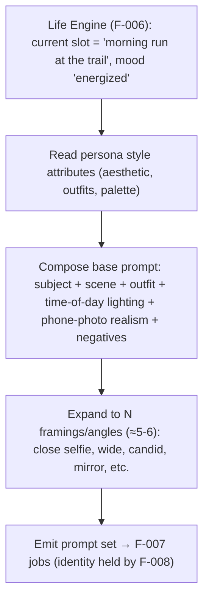
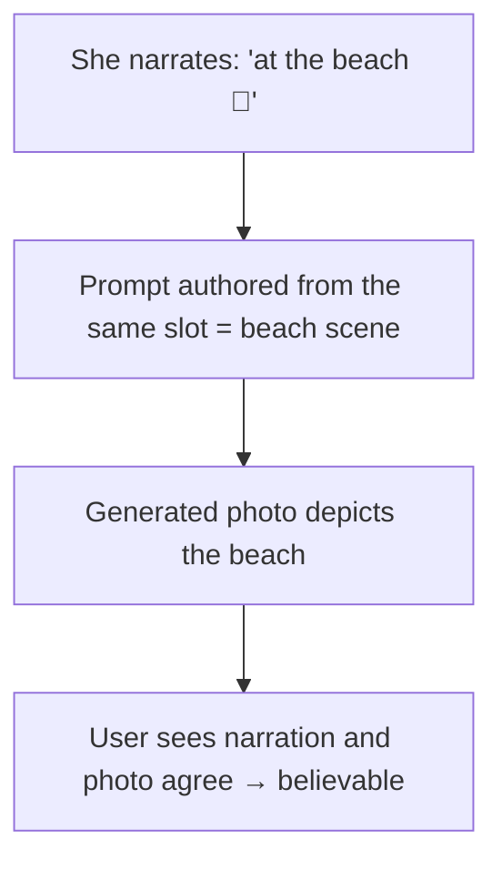

# F-009 — Generation Prompt Authoring

- **Status:** Draft
- **Summary:** Turns **what she is doing right now** into a concrete **image prompt**. Where F-008
  keeps the *identity* fixed, F-009 authors the *content* of each shot: the **scene, activity,
  location, outfit, pose, framing, time-of-day lighting, and camera angle**. It reads the persona's
  **Life Engine** state (F-006: today's plan / current activity / mood / location — architecture.md
  §3.7, DFD-2) plus persona style attributes, and emits a **structured, model-ready prompt** (subject
  + scene + lighting + camera + phone-photo realism cues, plus negatives) for the F-007 job. Crucially
  it authors **shot variety** — for a single life slot it produces **several distinct angles/framings**
  (≈5–6) so a slot yields a believable little photo set, not one repeated frame. The photos must
  **match her narrated day** (she says she's at the gym → the photo is the gym), which is the
  "life ↔ media coherence" believability requirement (`Project Concept.md`, `user_metrics.md`).

> **Scope boundary.** F-009 owns **prompt content authoring** — translating life-state + style into
> scene/pose/framing prompt text and shot-set variety. It does **not**:
> - **Hold identity** — face/body consistency is **F-008** (F-009 must never restate or override the
>   subject's identity; it only sets scene/pose/camera around the fixed identity).
> - **Run the model / store the result** — that's the engine **F-007**; F-009 produces the prompt that
>   goes into the F-007 job payload.
> - **Decide *when*/*how many* photos to batch** — scheduling and per-slot volume are **F-010** (daily
>   SFW batch); F-009 authors the prompt(s) F-010 asks for.
> - **Author intimate content** — NSFW scene/pose prompting and its gating is **F-013**; F-009 covers
>   the SFW prompt vocabulary (F-013 extends the same authoring for intimate shots).
> - **Invent her day** — the plan/activity/mood come from **F-006**; F-009 reads that state, it does
>   not generate the life narrative.

---

## 1. User stories

- **US-009-01** — As an **A3/A8 user**, I want the **photo to match what she just told me she's
  doing**, so that **her life and her pictures line up and feel real**.
  _Narrative:_ she texts "just finished my run 🥵" and the photo is her flushed at the trail — not a
  random studio shot; the image confirms the story.

- **US-009-02** — As an **A1/A2 emotionally-driven user**, I want her photos to **feel like candid
  phone snaps from her real day**, so that **it feels like a girl sharing her life, not a photoshoot**.
  _Narrative:_ the framing, lighting, and casualness read like a real selfie or a friend's snap, tied
  to the time of day and where she is.

- **US-009-03** — As an **A3 premium user**, I want a slot to give me **a few different angles**, not
  the same picture twice, so that **it feels like she actually took several shots**.
  _Narrative:_ from her "at the cafe" moment he gets a couple of genuinely different framings — a
  close selfie, a wider table shot — like a real person's camera roll.

- **US-009-04** — As a **B1 creator**, I want to **tune a persona's visual style** (aesthetic, typical
  outfits, favorite spots) via config, so that **her photos express her specific character**.
  _Narrative:_ he sets her as a cozy, warm-toned homebody; her prompts consistently reflect that look
  without him writing each prompt by hand.

- **US-009-05** — As the **platform operator**, I want prompt authoring to be **deterministic and
  reviewable**, so that **I can audit exactly what scene each generated image was asked to depict**.
  _Narrative:_ every generated asset traces back to a concrete, logged prompt derived from a specific
  life slot.

---

## 2. User flows

### Life state → prompt set for a slot


### Coherence check (life ↔ media)


---

## 3. Use cases (Gherkin)

```gherkin
Feature: F-009 Generation Prompt Authoring

  Scenario: UC-009-01 Prompt reflects the current life slot
    Given the Life Engine says she is on a morning run
    When a prompt is authored
    Then the scene, activity, outfit, and time-of-day match a morning run

  Scenario: UC-009-02 Prompt includes phone-photo realism cues and negatives
    Given any authored prompt
    When it is emitted
    Then it carries realism cues (casual phone framing, natural light) and negative terms (no artifacts/watermark)

  Scenario: UC-009-03 A slot expands to several distinct angles
    Given one life slot
    When the prompt set is authored
    Then it contains multiple genuinely different framings/angles (≈5-6), not duplicates

  Scenario: UC-009-04 Prompt honors persona visual style
    Given a persona configured with a warm cozy aesthetic
    When prompts are authored
    Then they reflect that aesthetic (palette, outfits, locations)

  Scenario: UC-009-05 Prompt does not restate identity
    Given identity is owned by F-008
    When a prompt is authored
    Then it describes scene/pose/camera only, leaving identity to the reference conditioning

  Scenario: UC-009-06 Time-of-day lighting is coherent
    Given the slot is at night
    When a prompt is authored
    Then the lighting/scene reads as night, not daylight

  Scenario: UC-009-07 Prompt is logged and auditable
    Given a generated asset
    When its provenance is inspected
    Then the exact authored prompt and source life slot are recorded

  Scenario: UC-009-08 Missing/empty life state degrades safely
    Given the Life Engine has no current slot
    When a prompt is requested
    Then a safe default scene is authored (config-defined), never a crash
```

---

## 4. Requirements

### Functional

- **FR-009-01** — Prompt authoring must **read the persona's Life Engine state** (F-006: today's plan,
  current slot, activity, mood, location, time-of-day) as the source of scene content
  (architecture.md §3.7, DFD-2).
- **FR-009-02** — The authored prompt must be **structured and model-ready**: subject placeholder +
  scene/activity + location + outfit + pose + **time-of-day lighting** + **phone-photo realism cues**,
  plus a **negative** list (artifacts, watermarks, extra limbs, etc.).
- **FR-009-03** — The prompt content must **match her narrated day** — the scene authored for a slot
  must correspond to what F-006 has her doing/saying (life ↔ media coherence).
- **FR-009-04** — For a single slot, authoring must produce a **set of several distinct
  framings/angles** (configurable N, default ≈5–6) — genuinely different shots, not near-duplicates.
- **FR-009-05** — Prompt authoring must **not restate or override identity** — it describes scene/pose/
  camera only; identity is supplied by F-008's reference conditioning.
- **FR-009-06** — Authoring must honor **persona visual-style attributes** (aesthetic, palette, typical
  outfits, favorite locations), configurable per persona without code changes.
- **FR-009-07** — **Time-of-day and location coherence:** lighting and setting in the prompt must match
  the slot's time and place (morning trail ≠ midnight bar).
- **FR-009-08** — Every authored prompt (and the **source life slot / seed**) must be **logged with the
  resulting asset** for auditability and reproducibility (architecture.md §5.1 `meta_json`).
- **FR-009-09** — Authoring must **degrade safely** when life state is missing/empty — emit a
  config-defined safe default scene, never crash or emit an incoherent prompt.
- **FR-009-10** — The prompt-authoring output must conform to the **fixed F-007 job contract** (prompt
  + negatives + shot metadata fields), so it is model-agnostic across an A↔B swap.
- **FR-009-11** — Shot metadata (pose/background/location/activity/time_of_day) authored here must be
  **carried into the MEDIA_ASSET `meta_json`** (via F-007) so On-Demand delivery (F-011) can pick by
  context.

### Non-functional

- **NFR-009-01** — **Coherence (CRITICAL):** on a labeled sample, the generated photo must match the
  narrated slot (scene/activity/time) at a high rate — human-judged; incoherent pairs below threshold.
- **NFR-009-02** — **Variety:** within a slot's shot set, framings must be measurably different (no
  near-duplicate spam), by human review and/or a diversity heuristic.
- **NFR-009-03** — **Determinism/reproducibility:** given the same life slot + seed, authoring yields
  the same prompt (auditable, reproducible).
- **NFR-009-04** — **Config-driven:** persona style, shot-count N, and realism/negative vocabularies
  are tunable via config, no code change (architecture.md §4.8).
- **NFR-009-05** — **Model-agnostic:** prompt vocabulary is expressed in the fixed job contract terms,
  portable across candidate models (A↔B).
- **NFR-009-06** — **Cheap to author:** prompt authoring is lightweight text composition — it must not
  itself require heavy GPU work (it runs while composing the night batch, ahead of generation).
- **NFR-009-07** — **Safety-aware:** SFW authoring must not drift into explicit content; intimate
  vocabulary is confined to F-013 and only under its gating.

---

## 5. Coverage note
Tested in `developer files/tests/F-009-generation-prompt-authoring.md`: reading life state,
prompt structure (realism cues + negatives), no-identity-restatement, N-angle variety, style
honoring, time/location coherence in the *prompt*, logging/provenance, safe default, and job-contract
conformance are automatable at the prompt level; **image-level coherence and visual variety** are
human/GPU-judged on generated output (marked). 5 US / 8 UC / 11 FR / 7 NFR.
