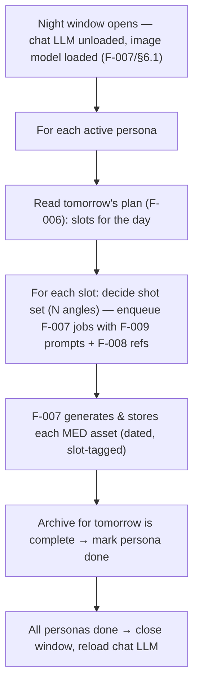
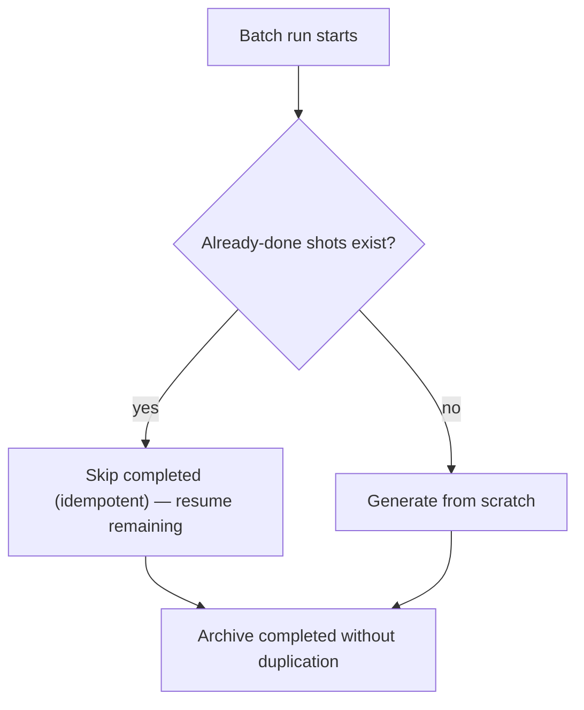

# F-010 — Daily SFW Photo Batch

- **Status:** Draft
- **Summary:** The **nightly planner** that fills each persona's **next-day photo archive**. Every
  night (during the GPU's media window — architecture.md §6.1, DFD-3), for each active persona, it
  reads **tomorrow's Life Engine plan** (F-006: the day's slots — waking, gym, work, cafe, home,
  night), and for each slot commissions a **set of SFW photos** (via F-009 prompt authoring →
  F-007 generation → F-008 identity), producing **many photos per day spread across the day's slots**
  (≈5–6 angles per slot). The result is a **ready, dated archive** of believable candid photos of her
  living tomorrow's day, so that during the day On-Demand delivery (F-011) and Dynamic Presentation
  (F-012) can serve a **fresh, context-appropriate** shot instantly with **no hot-path generation**.
  This is the batch-consumer side of the "**image/video generation is a scheduled night job**"
  architecture decision (§3.9, §6.1).

> **Scope boundary.** F-010 owns **batch planning & orchestration for SFW photos**: deciding *which*
> shots to make for tomorrow, *how many* per slot, dispatching them, and guaranteeing the archive is
> ready. It does **not**:
> - **Generate or store a single image** — that's the engine **F-007** (F-010 enqueues jobs, F-007
>   executes/persists them).
> - **Author the individual prompt** — that's **F-009** (F-010 decides the *set*; F-009 writes each
>   prompt's text).
> - **Hold identity** — **F-008**.
> - **Deliver photos to the user** — pulling from the archive at chat time is **F-011**; the greeting
>   card is **F-012**. F-010 only *fills* the archive.
> - **Intimate content** — the SFW day archive only; intimate generation/gating is **F-013**.
> - **Invent the day** — the plan comes from **F-006**; F-010 reads it.

---

## 1. User stories

- **US-010-01** — As an **A3/A8 user**, I want her to have **fresh photos from *today* every day**, so
  that **she never recycles the same handful of pictures and feels genuinely alive**.
  _Narrative:_ each day her camera roll is new — today's gym, today's coffee — not last week's stock.

- **US-010-02** — As an **A1/A2 user**, I want her photos to **cover her whole day** (morning to
  night), so that **whenever I talk to her there's a shot that fits the moment**.
  _Narrative:_ he messages her at 8am and again at 11pm; both times there's a photo that fits that
  time of day.

- **US-010-03** — As the **platform operator**, I want photo generation to happen **overnight in a
  batch on the freed GPU**, so that **daytime chat latency is never hit by image work and the single
  GPU is shared cleanly with the chat model**.
  _Narrative:_ heavy generation runs at night when the chat LLM is unloaded; by morning the archive is
  ready and the chat model is back up.

- **US-010-04** — As the **platform operator**, I want the batch to be **resumable and idempotent**, so
  that **a crash mid-batch doesn't corrupt the archive or double-bill GPU time**.
  _Narrative:_ if the box reboots at 3am, the next run resumes the unfinished personas without
  regenerating what's already done.

- **US-010-05** — As a **B1 creator**, I want to **configure how many shots per slot / which slots**,
  so that **I can trade off archive richness against GPU budget per persona**.
  _Narrative:_ he sets a lightweight persona to 3 shots/slot and a flagship to 6.

---

## 2. User flows

### Nightly batch fill


### Resume after interruption


---

## 3. Use cases (Gherkin)

```gherkin
Feature: F-010 Daily SFW Photo Batch

  Scenario: UC-010-01 Nightly batch fills tomorrow's archive
    Given the night window and tomorrow's plan
    When the batch runs
    Then each slot gets its configured set of SFW photos, dated and slot-tagged

  Scenario: UC-010-02 Coverage spans the whole day
    Given the plan's slots from morning to night
    When the batch completes
    Then every slot has photos so any time-of-day has a fitting shot

  Scenario: UC-010-03 Batch runs only in the media window
    Given the chat LLM day window
    When it is daytime
    Then the batch does not run and does not contend for the GPU

  Scenario: UC-010-04 Batch is idempotent on resume
    Given a batch interrupted mid-run
    When it restarts
    Then completed shots are not regenerated and the archive is completed

  Scenario: UC-010-05 Per-persona shot budget is configurable
    Given a persona configured for 3 shots/slot
    When the batch runs
    Then it generates 3 per slot for her

  Scenario: UC-010-06 A generation failure degrades gracefully
    Given one shot fails to generate
    When the batch continues
    Then the rest still complete and the failure is logged/retried, not fatal

  Scenario: UC-010-07 Archive is ready before morning
    Given the batch finished overnight
    When the user chats in the morning
    Then a fresh same-day photo is already available (no hot-path generation)

  Scenario: UC-010-08 Empty/again-run day does not duplicate
    Given the archive for tomorrow already exists
    When the batch runs again
    Then it does not create duplicate assets for the same slot/plan
```

---

## 4. Requirements

### Functional

- **FR-010-01** — A **nightly batch** must run per active persona during the **media window** (chat LLM
  unloaded — architecture.md §6.1, §3.9, DFD-3), never during the chat-serving day window.
- **FR-010-02** — The batch must read **tomorrow's Life Engine plan** (F-006) and derive the **day's
  slots** to cover (morning → night).
- **FR-010-03** — For each slot, the batch must commission a **configurable set of SFW photos**
  (default ≈5–6 angles), producing **many photos per persona per day** across all slots.
- **FR-010-04** — Each commissioned shot must be dispatched through **F-009 (prompt) → F-007
  (generate+store) with F-008 (identity)**; F-010 orchestrates, it does not itself render.
- **FR-010-05** — Each stored asset must be **dated and slot-tagged** (time_of_day/activity/location in
  `meta_json`) so F-011/F-012 can select by context.
- **FR-010-06** — The batch must be **idempotent and resumable** — a re-run or a crash-restart must not
  regenerate already-completed shots or create duplicates for the same slot/plan.
- **FR-010-07** — The batch must **degrade gracefully** on a single-shot failure — log/retry that shot
  and continue the rest; one failure must not abort the persona's whole archive.
- **FR-010-08** — The batch must **complete before the day window** so a fresh same-day archive is
  ready by morning with **no daytime hot-path generation** (ties F-007 NFR-007-02).
- **FR-010-09** — Per-persona **shot budget** (shots/slot, which slots, priority order) must be
  **configurable** without code changes (architecture.md §4.8).
- **FR-010-10** — The batch must **coordinate the GPU handoff** with the chat model (request unload
  before / signal reload after) via the same day/night mechanism F-007 uses (§6.1) — it must never run
  the image model while the chat model is resident.
- **FR-010-11** — Batch progress/outcome per persona (planned/queued/done/failed counts) must be
  **observable/logged** for the operator (architecture.md §6.4).

### Non-functional

- **NFR-010-01** — **Freshness:** the served archive is **same-day** — no recycling of prior days'
  photos as if new (checkable via asset dates).
- **NFR-010-02** — **Coverage:** every planned slot has ≥ its configured minimum shots after a
  successful batch (no empty slots for the day).
- **NFR-010-03** — **GPU exclusivity (CRITICAL):** the batch never runs the image model concurrently
  with the chat model on the single GPU (§6.1); provable via the handoff mechanism.
- **NFR-010-04** — **Resumability:** interrupted runs resume without duplication or corruption
  (idempotency key per slot/plan).
- **NFR-010-05** — **Throughput within the window:** the batch must finish the roster's archives within
  the nightly window budget (measured; scales with distilled 4–8-step generation, F-007).
- **NFR-010-06** — **Config-driven:** slot/shot budgets tunable per persona without code change.
- **NFR-010-07** — **Isolation:** a failure for one persona must not block others' archives.
- **NFR-010-08** — **Observability:** per-run metrics (counts, durations, failures) are logged.

---

## 5. Coverage note
Tested in `developer files/tests/F-010-daily-sfw-photo-batch.md`: slot derivation from the plan,
per-slot shot-set commissioning, dating/slot-tagging, idempotency/resume, per-shot failure degrade,
config-driven budgets, handoff gating, and observability are automatable with a fake F-007 engine;
**window throughput** and **real end-to-end freshness/coverage** are GPU/benchmark-measured (marked).
5 US / 8 UC / 11 FR / 8 NFR.
