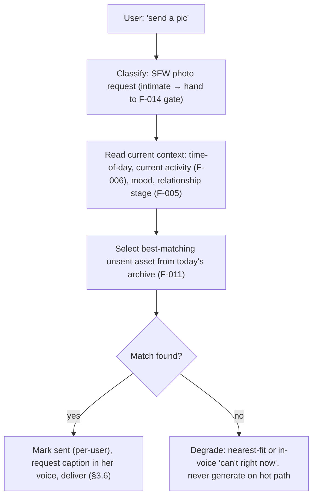
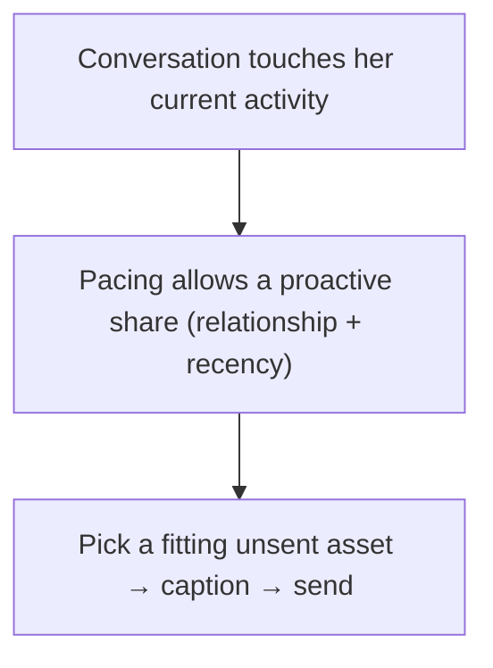

# F-012 — On-Demand Photo Delivery

- **Status:** Implemented (branch feature/f-012-photo-delivery)
- **Summary:** Serves a photo **into the live chat** — the consumer side of the day archive. When the
  user asks ("send a pic", "what are you up to?") or when she **proactively** shares one, F-012 picks
  the **right already-generated** photo from today's archive (F-011) — matched to **the current moment**
  (time-of-day, what she just said she's doing via F-006, her mood) — **marks it as sent so it is never
  repeated** to that user, attaches a short caption **in her voice** (F-002/F-003), and delivers it via
  the Media Delivery path (architecture.md §3.6). It **never generates on the reply hot path** — it only
  selects and sends a pre-made asset, so photo delivery is instant. It also respects **relationship
  gating** (F-005): how freely/often she shares, and whether a request is in-bounds, depends on the
  bond stage. This is the "**she sends me a real, fitting photo right now**" moment
  (`user_metrics.md` engagement / believability).

> **Scope boundary.** F-012 owns **selecting and sending an SFW photo into an ongoing chat**, tracking
> per-user sent history, and pacing/gating by relationship. It does **not**:
> - **Generate images** — it only picks from the F-011 archive (built by F-008/F-009/F-010). If nothing
>   fits, it degrades (see FR); it does not render on demand.
> - **Fill the archive** — that's **F-011**.
> - **Do the first-selection greeting card** — the persona-selection welcome photo+message is **F-013**
>   (a distinct entry moment); F-012 is mid-conversation delivery.
> - **Deliver intimate content** — intimate photo requests/gating/delivery are **F-014**; F-012 is SFW
>   delivery (it hands intimate requests to F-014's gate).
> - **Own the relationship model** — stage/affinity come from **F-005**; F-012 only *reads* them to pace
>   sharing.
> - **Write her conversational text** — the caption voice is F-002/F-003; F-012 requests a caption, it
>   doesn't author persona voice.

---

## 1. User stories

- **US-012-01** — As an **A3/A8 user**, when I ask her for a photo, I want her to **actually send a
  fitting one right away**, so that **she feels like a real person with a camera roll, not a bot that
  dodges**.
  _Narrative:_ "send a selfie?" → seconds later a photo that matches what she said she's doing, with a
  playful caption.

- **US-012-02** — As an **A1/A2 user**, I want her to **sometimes share a photo on her own** when it
  fits the conversation, so that **it feels like she's living her day and thought of me**.
  _Narrative:_ mid-chat she drops "look at this sunset 🌅" with a photo, unprompted.

- **US-012-03** — As an **A8 skeptic user**, I want her to **never resend the same photo**, so that
  **I can't catch her recycling a stock image**.
  _Narrative:_ every photo he's received is unique; nothing repeats.

- **US-012-04** — As an **A3 premium user**, I want the photo to **match the time and what she's
  doing**, so that **her pictures and her words always agree**.
  _Narrative:_ at 11pm the photo is an evening-at-home shot, not a bright noon gym pic.

- **US-012-05** — As the **platform operator**, I want photo delivery to be **instant (no hot-path
  generation)** and **paced by the relationship**, so that **latency stays low and sharing feels
  earned, not spammy**.
  _Narrative:_ a brand-new user isn't flooded with intimate-adjacent selfies; a bonded user gets more
  freely — all served from the pre-built archive.

---

## 2. User flows

### On request


### Proactive share (fits the moment)


---

## 3. Use cases (Gherkin)

```gherkin
Feature: F-012 On-Demand Photo Delivery

  Scenario: UC-012-01 Deliver a fitting photo on request
    Given today's archive has unsent shots for the current slot
    When the user asks for a photo
    Then a matching unsent asset is selected, marked sent, captioned in her voice, and delivered

  Scenario: UC-012-02 Never repeat a photo to the same user
    Given a user has already received asset X
    When another photo is requested
    Then asset X is excluded from selection

  Scenario: UC-012-03 Selection matches current time/activity
    Given it is late evening and she's home
    When a photo is selected
    Then an evening/home-tagged asset is chosen over a morning/gym one

  Scenario: UC-012-04 Delivery never generates on the hot path
    Given a photo request
    When it is served
    Then only a pre-built asset is selected; no image generation occurs inline

  Scenario: UC-012-05 Relationship gates sharing pace
    Given a brand-new relationship
    When photos are requested rapidly
    Then sharing is paced per the bond stage (F-005), not unlimited

  Scenario: UC-012-06 Intimate request is handed to the gate
    Given the user asks for an intimate photo
    When classified
    Then it is routed to F-014's gating, not served from the SFW archive

  Scenario: UC-012-07 No fitting asset degrades in voice
    Given no unsent asset fits and the archive is exhausted
    When a photo is requested
    Then she responds in-voice (nearest-fit or a natural deflection), never an error or a repeat

  Scenario: UC-012-08 Proactive share fits the moment
    Given the conversation matches her current activity and pacing allows
    When she shares proactively
    Then a fitting unsent asset is sent with an in-voice caption

  Scenario: UC-012-09 A delivered photo hands its metadata back to the caller
    Given a photo is selected and delivered
    When the delivery result is returned
    Then it carries the asset's background/location/activity/pose/time-of-day metadata
    And the caller can feed that scene into the conversation context (F-002 FR-002-25)

  Scenario: UC-012-10 Recent sends are retrievable, bounded and per-user
    Given a user has received several photos over the last days
    When the recent-sends lookup runs for that (user, persona)
    Then it returns the newest first, capped by the configured count and recency window
    And another user's sends never appear
```

---

## 4. Requirements

### Functional

- **FR-012-01** — On an SFW photo request, F-012 must **select an asset from today's archive** (F-011)
  matched to the **current context** (time-of-day, current activity/location from F-006, mood).
- **FR-012-02** — F-012 must **track per-user sent history** and **never resend** an asset the user has
  already received (no repeats).
- **FR-012-03** — Selection must **prefer the closest slot match** (time-of-day/activity/location tags
  in `meta_json`) and fall back sensibly when an exact match is unavailable.
- **FR-012-04** — Delivery must **never generate on the reply hot path** — only pre-built assets are
  served (ties F-008 NFR-008-02); generation is exclusively the night batch.
- **FR-012-05** — Each delivered photo must carry a **short caption in her voice** (requested from
  F-002/F-003), not a bare image.
- **FR-012-06** — Sharing must be **paced/gated by the relationship stage** (F-005) — request
  in-bounds check and frequency limits depend on the bond; a new user is not flooded.
- **FR-012-07** — **Intimate requests** must be **classified and routed to F-014's gate**, not served
  from the SFW archive.
- **FR-012-08** — When **no fitting/unsent asset** exists, F-012 must **degrade in-voice** (nearest-fit
  or a natural deflection), never surface an error, a placeholder, or a repeat.
- **FR-012-09** — F-012 must support **proactive sharing**: when the conversation matches her current
  activity and pacing allows, she may send a fitting unsent asset unprompted.
- **FR-012-10** — Delivery must go through the **Media Delivery path** (architecture.md §3.6) and record
  the send (which user, which asset, when) for history and audit.
- **FR-012-12** — **The caption must be written in the persona's own language (ISS-003).** The
  caption request must pass `PERSONA.language` (and honour her comm settings) so the caption matches
  the language she speaks in the conversation. An English caption under a Russian-speaking persona's
  photo is a defect — it breaks the single-voice illusion as hard as an out-of-character line.
- **FR-012-13** — **A delivered photo must be paced like a human send (ISS-004).** "Instant" in
  NFR-012-01 means **no generation on the hot path**, NOT instant to the user. Before the photo
  lands the user must see the `upload_photo` action for a **believable, bounded delay** (a real
  person takes a moment to pick/take and send a photo), reusing the F-003 pacing budget
  (F-003 FR-003-42). Caption and photo arrive as one message, after that delay.
- **FR-012-14** — **Delivery must return the delivered asset's metadata to the caller (ISS-006).**
  A delivered result must carry the asset's stored **slot metadata** — `background`, `location`,
  `activity`, `pose`, `time_of_day` (from `MEDIA_ASSET.meta_json`, F-008 FR-008-08) — alongside the
  asset id and the caption, so the turn pipeline can feed **what she just showed him** back into the
  conversation context (F-002 FR-002-25). This is the architecture's Media Delivery contract
  (architecture.md §2 `POST /media/request`, §3.6, §4.2: "returns the media **plus its metadata** …
  so the Orchestrator/LLM can sext consistently — 'knows what she sent'"). Non-delivered outcomes
  (deflected / paced / routed-to-gate) carry **no** metadata. Only the five slot fields are exposed —
  generation provenance (`prompt`, `seed`) must never leave the delivery boundary.
- **FR-012-15** — **F-012 must expose a bounded recent-sends lookup (ISS-006).** Given a
  `(user, persona)` pair, it must return the **most recent sends first**, each with its asset id,
  `sent_at`, and the same five slot fields, limited to a configurable **count** and **recency
  window**. It reads only `MediaSend` joined to `MEDIA_ASSET` — one cheap query, strictly per-user
  (NFR-012-06), no generation and no LLM call (FR-012-04).
- **FR-012-11** — Selection/pacing/caption behavior must be **config-driven** (match weighting,
  per-stage frequency caps, **recent-sends count/window for context**) without code changes.

### Non-functional

- **NFR-012-01** — **Instant delivery (CRITICAL):** photo delivery adds no generation latency — it is a
  DB/asset lookup + send; p95 well under the chat reply budget (ties F-008 NFR-008-02).
- **NFR-012-02** — **No repeats (CRITICAL):** provably no asset is sent twice to the same user.
- **NFR-012-03** — **Context fit:** on a labeled sample, the delivered photo matches the current
  time/activity at a high rate (human-judged).
- **NFR-012-04** — **Pacing correctness:** per-stage frequency caps are honored (a new user cannot
  extract unlimited photos).
- **NFR-012-05** — **Graceful exhaustion:** an exhausted archive degrades in-voice, never errors.
- **NFR-012-06** — **Per-user isolation:** one user's sent-history/pacing never affects another's
  selection.
- **NFR-012-07** — **Config-driven:** weighting and caps tunable without code change.
- **NFR-012-08** — **Safety:** SFW path never serves intimate assets; the classifier defaults to the
  SFW/gate-routed side on ambiguity.
- **NFR-012-09** — **Metadata is served, not just stored (ISS-006):** every code path that delivers a
  photo must hand its slot metadata back to the caller, and the recent-sends lookup must stay
  **bounded** (count + window) so consuming it can never grow the prompt without limit. A stored
  `meta_json` that nothing reads is a defect, not a feature.

---

## 5. Coverage note
Tested in `developer files/tests/F-012-on-demand-photo-delivery.md`: context-matched selection,
per-user no-repeat, slot-preference fallback, hot-path-free delivery, in-voice caption request,
relationship pacing/gating, intimate routing, graceful exhaustion, proactive-share pacing, send
recording, returned asset metadata (ISS-006), the bounded recent-sends lookup, and config-driven
weighting are all automatable with fakes; **real context-fit quality** is human-judged (marked).
5 US / 8 UC / 15 FR / 9 NFR.
