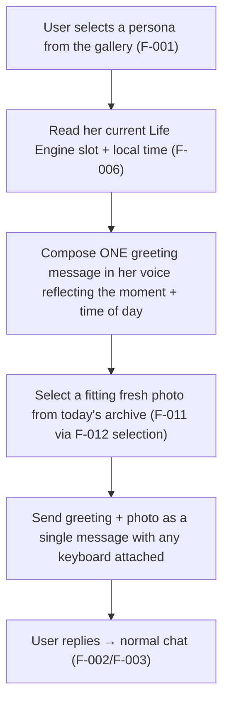
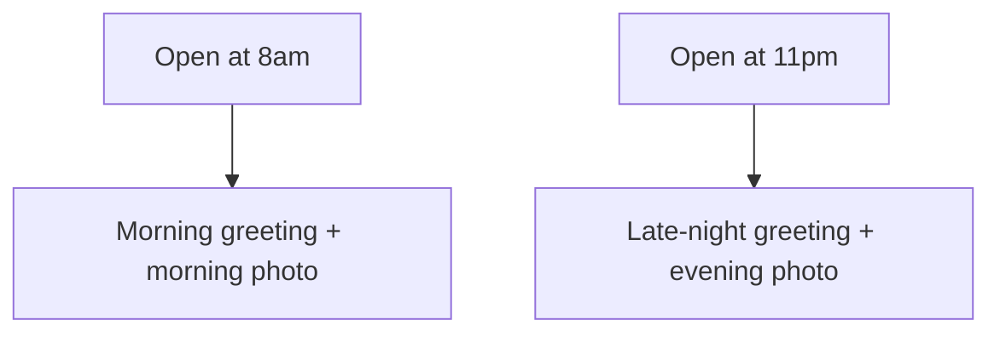

# F-013 — Dynamic Persona Presentation

- **Status:** Implemented
- **Summary:** The **first impression** when a user opens or selects a persona. Instead of a static
  bio card, F-013 greets with a **live, context- and time-aware welcome**: a greeting **message in her
  voice** that reflects **what she's doing right now** (her current Life Engine slot — F-006) and
  **the time of day**, paired with a **fresh, fitting photo** pulled from today's archive (F-011) via
  the delivery path (F-012 selection). Opening her at 8am shows a morning her ("just woke up ☀️" + a
  sleepy morning shot); at midnight, a late-night her — and it's **different each time**, not a fixed
  promo image. This is the gallery→persona entry moment in the UX flow (architecture.md §1, after the
  Start-screen removal that made `/start` open the gallery directly), and it's the hook that converts
  a browse into a conversation (`user_metrics.md` first-session engagement).

> **Scope boundary.** F-013 owns the **persona-selection presentation moment**: composing the
> time/context-aware greeting + choosing the accompanying photo the instant a persona is opened. It
> does **not**:
> - **Render the gallery / handle onboarding navigation** — the gallery, selection UX, and screen
>   order are **F-001** (architecture.md §1); F-013 provides the *content* shown once a persona is
>   picked.
> - **Generate images** — the photo comes from the F-011 archive via F-012-style selection; no hot-path
>   generation.
> - **Own the ongoing conversation** — after the greeting, normal chat is F-002/F-003; F-013 is only
>   the opening beat.
> - **Own her day** — current activity/time come from **F-006**.
> - **Intimate content** — the welcome photo is always SFW regardless of persona.
> - **Two stacked nudges** — per project feedback, the greeting is **one** message with any needed
>   markup attached, not an intro line followed by a separate "say something" prompt.

---

## 1. User stories

- **US-013-01** — As a **first-time visitor**, when I open a persona, I want her to feel **alive and
  present right now**, so that **I'm pulled into talking to her instead of just reading a profile**.
  _Narrative:_ he taps her card at lunchtime; she greets "ugh finally a break, just grabbed a coffee ☕
  what's up?" with a fresh cafe photo — he replies immediately.

- **US-013-02** — As an **A1/A2 emotionally-driven user**, I want the greeting to **match the time of
  day**, so that **she feels like a real person on a real schedule, not a script**.
  _Narrative:_ opening her late at night gets a cozy, winding-down greeting and photo, not a chirpy
  morning one.

- **US-013-03** — As a **returning user**, I want the presentation to **feel different each time**, so
  that **she never feels like a frozen promo card**.
  _Narrative:_ he reopens her the next day and it's a new moment, new photo — she's moved on with her
  life.

- **US-013-04** — As an **A8 skeptic user**, I want the welcome photo to be **consistent with her and
  with her narrated moment**, so that **the first image already passes as real**.
  _Narrative:_ the greeting says "at the beach 🌊" and the photo is her at the beach — same girl as
  everywhere else.

- **US-013-05** — As a **B1 creator**, I want each persona's welcome to **express her character**, so
  that **the roster feels like distinct people from the first tap**.
  _Narrative:_ a shy bookish persona opens differently from a bubbly party one.

---

## 2. User flows

### Persona opened → live greeting card


### Time-of-day variation


---

## 3. Use cases (Gherkin)

```gherkin
Feature: F-013 Dynamic Persona Presentation

  Scenario: UC-013-01 Greeting reflects her current activity and time
    Given her Life Engine slot is "lunch break at a cafe" and it is midday
    When the persona is opened
    Then the greeting is in her voice about that moment and a fitting cafe photo is attached

  Scenario: UC-013-02 Time-of-day changes the greeting
    Given the persona is opened late at night
    When the card is composed
    Then the greeting and photo read as night, not morning

  Scenario: UC-013-03 Presentation varies across opens
    Given the persona is opened on different occasions
    When cards are composed
    Then the greeting/photo differ (not a fixed promo)

  Scenario: UC-013-04 Welcome photo is consistent and coherent
    Given the greeting mentions a place
    When the photo is chosen
    Then it is the same girl (F-009) and matches the mentioned moment (F-010/F-011 tags)

  Scenario: UC-013-05 Single combined message (no double nudge)
    Given the greeting is sent
    When delivered
    Then it is one message with photo and any keyboard attached, not an intro plus a separate prompt

  Scenario: UC-013-06 Welcome photo is always SFW
    Given any persona
    When the welcome photo is chosen
    Then it is SFW regardless of the persona

  Scenario: UC-013-07 No hot-path generation for the welcome
    Given a persona is opened
    When the card is built
    Then the photo is selected from the pre-built archive, not generated inline

  Scenario: UC-013-08 Empty archive degrades gracefully
    Given no archive photo is available yet
    When the persona is opened
    Then a graceful fallback greeting is shown (config default), never an error or a broken image
```

---

## 4. Requirements

### Functional

- **FR-013-01** — On persona selection, F-013 must compose a **greeting message in her voice** that
  reflects her **current Life Engine slot** (F-006) and the **local time of day**.
- **FR-013-02** — The greeting must be paired with a **fresh, fitting photo** selected from today's
  archive (F-011) using F-012-style context matching (time/activity tags).
- **FR-013-03** — The greeting + photo must be delivered as **one combined message** with any keyboard/
  markup attached — **never** an intro line followed by a separate "say something" prompt (project
  feedback 2026-07-12).
- **FR-013-04** — The presentation must **vary across opens** (different time/activity → different
  greeting + photo); it must not be a fixed promo card.
- **FR-013-05** — The welcome photo must be **identity-consistent** (F-009) and **coherent** with the
  greeting's narrated moment (F-010/F-011 tags).
- **FR-013-06** — The welcome photo must always be **SFW**, regardless of persona or user.
- **FR-013-07** — The welcome must **never generate on the hot path** — the photo is selected from the
  pre-built archive (ties F-008 NFR-008-02 / F-012 FR-012-04).
- **FR-013-08** — Presentation must **degrade gracefully** when no archive photo exists yet — a
  config-default greeting (optionally text-only), never an error or a broken image.
- **FR-013-09** — The greeting content/tone must **honor per-persona character** (configurable voice/
  style), so the roster feels like distinct people from the first tap.
- **FR-013-10** — F-013 provides only the **content** of the selection moment; gallery rendering,
  selection UX, and screen order remain **F-001** (architecture.md §1). It must slot into the
  post-selection step without owning navigation.
- **FR-013-11** — After the greeting, control must **hand off to normal chat** (F-002/F-003) — F-013
  does not manage the ongoing conversation.

- **FR-013-12** — **Source the gallery card photo from the persona's generated archive (ISS-002).**
  The nightly batch (F-011) already produces a per-persona archive; provisioning must promote a
  suitable **SFW, identity-consistent** frame to `PERSONA.gallery_photo_ref` so the S2 card
  (F-001 FR-001-25) always has a photo. Selection prefers a neutral, face-clear shot; it is refreshed
  when the archive is regenerated, and never uses an intimate asset.

### Non-functional

- **NFR-013-01** — **Instant (CRITICAL):** the greeting card is composed and sent with no generation
  latency — it is a lookup + text compose (ties F-012 NFR-012-01).
- **NFR-013-02** — **Freshness/variety:** across opens the card visibly varies (time/activity/photo),
  measurable over repeated opens.
- **NFR-013-03** — **Coherence:** greeting text and photo agree (same moment), human-judged on a
  sample.
- **NFR-013-04** — **Identity:** the welcome photo is unmistakably her (F-009), human/metric-judged.
- **NFR-013-05** — **Single-message UX:** exactly one outbound message for the greeting (no double
  nudge) — assertable.
- **NFR-013-06** — **Graceful fallback:** archive-empty path never errors or shows a broken image.
- **NFR-013-07** — **Config-driven:** greeting style/tone per persona tunable without code change.
- **NFR-013-08** — **Safety:** welcome photo is always SFW; never an intimate asset at the entry
  moment.

---

## 5. Coverage note
Tested in `developer files/tests/F-013-dynamic-persona-presentation.md`: time/activity-aware greeting
composition, archive photo selection, single-combined-message delivery, cross-open variation,
SFW-only, hot-path-free, graceful empty-archive fallback, per-persona voice, and the F-001 boundary
are automatable with fakes; **greeting↔photo coherence and identity** are human/GPU-judged (marked).
5 US / 8 UC / 11 FR / 8 NFR.
