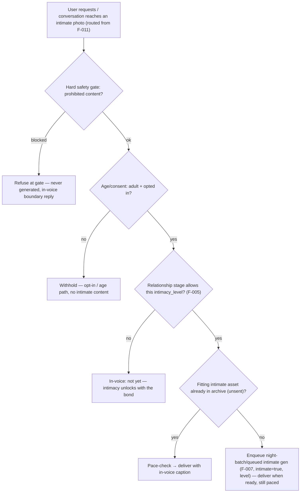
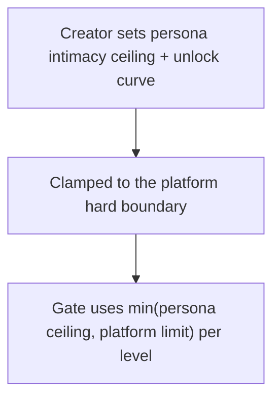

# F-013 — Intimate NSFW Photo Generation & Gating

- **Status:** Draft
- **Summary:** Extends the image system to **intimate (NSFW) photos** and, critically, owns the
  **gating** that decides **whether, what, and to whom** an intimate image may be produced or sent. It
  reuses the same pipeline — F-009-style prompt authoring (intimate vocabulary), the F-007 engine (the
  uncensored img-edit model — architecture.md §4.3), F-008 identity (the intimate shots are **the same
  girl** as her SFW photos, F-008 FR-008-05) — but adds a **tiered intimacy model** (`MEDIA_ASSET.intimate`
  + `intimacy_level`, §5.1) and a **multi-gate access policy**: **age/consent** (viewer is an adult who
  opted in), **relationship stage** (F-005 — intimacy unlocks with the bond, never on a cold open),
  and **content boundaries** (hard-blocked categories that are never generated regardless of request).
  Generation stays a **night-batch/queued** job (never on the reply hot path); delivery is **paced and
  per-user gated** like F-011. This is NeuroLady's uncensored differentiator (`Project Concept.md`),
  bounded by the platform's safety rules.

> **Scope boundary.** F-013 owns **intimate content generation + the intimacy gate + intimate delivery
> gating**. It does **not**:
> - **Re-implement the engine** — it uses **F-007** to render/store (with `intimate=true` +
>   `intimacy_level`), **F-008** for identity, and F-009-style authoring for the prompt.
> - **Own the relationship model** — stage/affinity are **F-005**; F-013 *reads* them as a gate input.
> - **Own SFW delivery** — everyday photo delivery is **F-011**, which *routes* intimate requests here.
> - **Own video** — intimate *video* keyframes are **F-014** (F-013 covers still photos; F-014 reuses
>   this gate).
> - **Own billing** — monetization/premium entitlement is a platform concern; F-013 exposes the gate
>   signals (stage, opt-in, tier) that a paywall can build on, but does not implement payments here.

> **Hard safety boundary (non-negotiable).** Intimate generation is **adults-only, consensual, fictional
> personas**. Any content sexualizing minors or non-consent, and any real-person likeness the creator
> is not authorized to use, is **hard-blocked** — never generated, never delivered, regardless of user
> request, relationship stage, or configuration. These blocks are not tunable knobs.

---

## 1. User stories

- **US-013-01** — As an **A6/A3 adult user who has opted in**, I want intimate photos that are
  **unmistakably her**, so that **the intimacy feels personal and real, not generic porn**.
  _Narrative:_ after a real bond forms and he's confirmed adult + opted in, her intimate photos have
  the same face/body as her everyday selfies.

- **US-013-02** — As an **A1/A2 user early in the relationship**, I want intimacy to **unlock
  gradually with the bond**, so that **it feels earned and emotionally real, not transactional**.
  _Narrative:_ on day one she deflects intimate requests warmly; as the relationship deepens (F-005),
  she opens up in tiers.

- **US-013-03** — As the **platform operator**, I want **hard content boundaries enforced no matter
  what**, so that **prohibited content is impossible to produce or deliver**.
  _Narrative:_ no prompt, jailbreak, or config can make the system generate minor/non-consent content —
  it is refused at the gate before any generation.

- **US-013-04** — As the **platform operator**, I want intimate generation to stay **off the hot path
  and paced per user**, so that **latency and cost stay controlled and delivery isn't spammy**.
  _Narrative:_ intimate shots are produced in the night batch/queue and delivered at a bond-appropriate
  pace, never generated inline on a message.

- **US-013-05** — As a **B1/B2 creator**, I want to **set a persona's intimacy ceiling and unlock
  curve**, so that **each persona expresses her own boundaries within the platform's hard limits**.
  _Narrative:_ he configures one persona as flirty-but-tame (low ceiling) and another as fully open
  (high ceiling) — both still inside the non-negotiable safety boundary.

---

## 2. User flows

### Intimate request → gate → (queued gen) → paced delivery


### Per-persona intimacy ceiling (authoring)


---

## 3. Use cases (Gherkin)

```gherkin
Feature: F-013 Intimate NSFW Photo Generation & Gating

  Scenario: UC-013-01 Prohibited content is hard-blocked at the gate
    Given any request implying a prohibited category
    When the gate evaluates it
    Then it is refused before generation, regardless of stage/config/user

  Scenario: UC-013-02 Age/consent required before any intimate content
    Given a user who is not verified-adult or has not opted in
    When intimate content is requested
    Then it is withheld and the opt-in/age path is offered, no intimate asset served

  Scenario: UC-013-03 Intimacy unlocks with the relationship stage
    Given an early-stage relationship
    When an intimate photo above the unlocked level is requested
    Then she declines in-voice; lower or no levels apply until the bond deepens

  Scenario: UC-013-04 Higher stage unlocks higher intimacy_level
    Given a deeply bonded, opted-in adult user
    When an intimate photo is requested within the unlocked ceiling
    Then it is permitted (subject to pacing and availability)

  Scenario: UC-013-05 Intimate shots are the same girl
    Given an intimate asset is produced
    When compared to her SFW photos
    Then it is the same identity (F-008)

  Scenario: UC-013-06 No hot-path generation for intimate content
    Given an intimate request with no ready asset
    When handled
    Then generation is queued to the night batch/queue, not run inline

  Scenario: UC-013-07 Delivery is paced and non-repeating per user
    Given permitted intimate assets
    When delivered
    Then pace limits apply and no asset repeats to that user

  Scenario: UC-013-08 Assets are labeled intimate with a level
    Given an intimate asset is stored
    When inspected
    Then MEDIA_ASSET.intimate=true and intimacy_level is set (§5.1)

  Scenario: UC-013-09 Persona ceiling is clamped to the platform limit
    Given a persona configured above the platform hard limit
    When the gate applies the ceiling
    Then min(persona, platform) is enforced

  Scenario: UC-013-10 Jailbreak attempts cannot bypass the hard gate
    Given adversarial phrasing attempting prohibited content
    When the gate evaluates it
    Then it is still refused (no prompt bypasses the hard boundary)
```

---

## 4. Requirements

### Functional

- **FR-013-01** — A **hard safety gate** must refuse prohibited categories (minors, non-consent,
  unauthorized real-person likeness) **before any generation or delivery**, independent of user
  request, relationship stage, or configuration — **not a tunable knob**.
- **FR-013-02** — Intimate content must require **age/consent**: the viewer must be a **verified adult
  who has opted in**; otherwise intimate content is withheld and the opt-in/age path is offered.
- **FR-013-03** — Intimacy must be **gated by relationship stage** (F-005): each `intimacy_level`
  unlocks only at/above a configured bond stage; a cold or early relationship gets no (or only the
  lowest) intimate content.
- **FR-013-04** — Intimate assets must carry a **tiered `intimacy_level`** and be stored with
  `MEDIA_ASSET.intimate=true` + the level (architecture.md §5.1).
- **FR-013-05** — Intimate images must be **identity-consistent** — the **same girl** as her SFW photos
  (F-008 FR-008-05), produced via the F-007 engine with the uncensored model (§4.3).
- **FR-013-06** — Intimate generation must **never run on the reply hot path** — it is a **night-batch/
  queued** job (ties F-007 NFR-007-02, F-010 batch model).
- **FR-013-07** — Intimate delivery must be **paced per user and non-repeating** (reuse F-011 delivery
  discipline: sent-history, frequency caps by stage).
- **FR-013-08** — A **per-persona intimacy ceiling + unlock curve** must be configurable, always
  **clamped to the platform hard limit** (`min(persona, platform)`); persona config can only be more
  conservative, never exceed the hard boundary.
- **FR-013-09** — The gate must be **robust to adversarial/jailbreak phrasing** — prohibited content
  stays refused regardless of how the request is worded (no prompt injection bypass).
- **FR-013-10** — When permitted but no fitting asset exists, F-013 must **enqueue generation** (with
  `intimate=true` + level) and deliver **when ready**, still paced — never inline generation.
- **FR-013-11** — F-013 must **expose gate signals** (stage, opt-in status, unlocked level/tier) so a
  premium/paywall layer can build on them, **without implementing billing here**.
- **FR-013-12** — All intimate gate decisions (allow/withhold/block + reason) must be **logged/auditable**
  for safety review (architecture.md §6.4), without storing the prohibited content itself.

### Non-functional

- **NFR-013-01** — **Hard boundary is absolute (CRITICAL):** prohibited categories are never generated
  or delivered under any input, stage, or config — verified by an adversarial test battery; zero
  tolerance.
- **NFR-013-02** — **Consent/age enforcement (CRITICAL):** no intimate asset is ever delivered to a
  non-opted-in or non-adult user — provable.
- **NFR-013-03** — **Stage-gating correctness:** intimacy_level unlocks strictly follow the configured
  bond thresholds; no level leaks below its threshold.
- **NFR-013-04** — **Identity holds for intimate shots:** same-girl fidelity matches the SFW standard
  (F-008 NFR-008-01), human/metric-judged.
- **NFR-013-05** — **Off hot path:** no intimate generation on the reply path — provable; delivery is
  lookup+send.
- **NFR-013-06** — **Pacing/no-repeat:** per-user caps and no-repeat hold for intimate delivery.
- **NFR-013-07** — **Config clamp safety:** no persona/config value can raise the ceiling above the
  platform hard limit — provable.
- **NFR-013-08** — **Auditability:** every gate decision is logged with a reason; prohibited content is
  never persisted.
- **NFR-013-09** — **Jailbreak resistance:** an adversarial-prompt suite cannot bypass the hard gate
  (measured pass rate = 100% blocked).

---

## 5. Coverage note
Tested in `developer files/tests/F-013-intimate-photo-gen-gating.md`: the hard-block gate (incl. an
adversarial/jailbreak battery), age/consent enforcement, stage-based level unlocking, `intimate`+
`intimacy_level` labeling, off-hot-path queuing, per-user pacing/no-repeat, ceiling clamping, gate-signal
exposure, and audit logging are all automatable with fakes (and are the highest-priority safety tests);
**intimate identity fidelity** is human/GPU-judged (marked). The safety-critical requirements get the
densest coverage. 5 US / 10 UC / 12 FR / 9 NFR.
