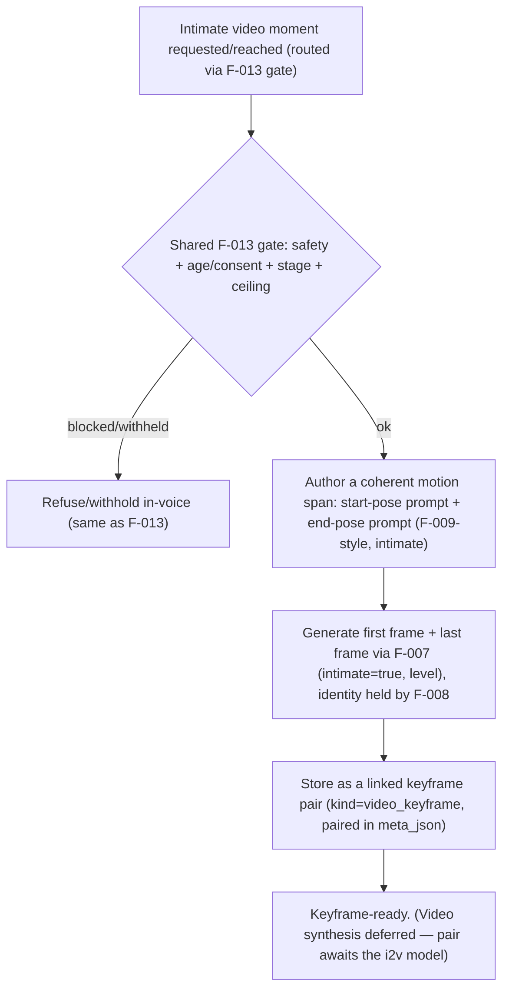

# F-014 — Intimate Video Keyframes

- **Status:** Draft (video generation itself deferred — see scope)
- **Summary:** Produces the **first and last frame** (keyframes) for a short **intimate video** clip.
  Modern image-to-video models (e.g. Wan 2.2 / HunyuanVideo-Avatar — architecture.md §4.3, deferred)
  animate **between a start frame and an end frame**; the believability of the clip is decided by those
  two stills. F-014 owns **authoring and generating that keyframe pair** as intimate images —
  reusing F-013's **gate** (age/consent, relationship stage, hard safety boundary), F-008's **identity**
  (the same girl), and the F-007 **engine** — such that the two frames are **the same person, the same
  scene, and a coherent motion span** (start pose → end pose) the downstream video model can
  interpolate. It stores them as a linked **keyframe pair** (`MEDIA_ASSET`, `kind=video_keyframe`,
  `intimate=true` + `intimacy_level`, paired via `meta_json`). **Actual video synthesis is out of scope
  for now** (models deferred); F-014 makes the system *keyframe-ready* so video can be switched on later
  without redesign.

> **Scope boundary.** F-014 owns the **intimate keyframe pair (first+last frame)** and its metadata/
> pairing. It does **not**:
> - **Synthesize the video** — the image-to-video model (Wan 2.2 / HunyuanVideo-Avatar) and its runner
>   are **deferred** (architecture.md §4.3/§3.9); F-014 only produces the frames it will consume. When
>   video is enabled, the interpolation step is a separate feature that takes F-014's pair as input.
> - **Own the intimacy gate** — it **reuses F-013**'s gate (age/consent, stage, hard boundary) wholesale;
>   the same non-negotiable safety block applies (no minors/non-consent/unauthorized likeness, ever).
> - **Own identity / the engine / prompt vocabulary** — F-008 / F-007 / F-009-style authoring
>   (intimate) as with F-013.
> - **Deliver on the hot path** — like all generation, keyframes are night-batch/queued, never inline.

> **Hard safety boundary (inherited from F-013, non-negotiable).** Keyframe generation is adults-only,
> consensual, fictional personas; prohibited categories are hard-blocked at the shared gate before any
> frame is produced — no request, stage, or config can bypass it.

---

## 1. User stories

- **US-014-01** — As an **A6/A3 opted-in adult, deeply bonded user**, I want short intimate clips that
  are **clearly her and smoothly coherent**, so that **the motion feels real, not a morphing mess**.
  _Narrative:_ when video is enabled, the clip starts and ends on frames that are unmistakably her in
  one continuous moment.

- **US-014-02** — As the **platform operator**, I want intimate video to inherit **exactly the same hard
  gate** as intimate photos, so that **enabling video adds no new safety surface**.
  _Narrative:_ the keyframe pair goes through the identical age/consent/stage/hard-boundary gate as
  F-013 — nothing is looser for video.

- **US-014-03** — As the **platform operator**, I want the system to be **keyframe-ready now and
  video-switchable later**, so that **we can validate the hardest part (believable stills) before
  investing in the video model + GPU budget**.
  _Narrative:_ the pair is produced, paired, and stored today; the interpolation model is dropped in
  later with no schema/redesign churn.

- **US-014-04** — As a **B1/B2 creator**, I want the keyframe pair to respect the persona's **intimacy
  ceiling** (F-013 clamp), so that **video never exceeds a persona's configured boundary**.
  _Narrative:_ a low-ceiling persona simply never gets high-intimacy keyframes.

---

## 2. User flows

### Keyframe pair authoring (gated, queued)


---

## 3. Use cases (Gherkin)

```gherkin
Feature: F-014 Intimate Video Keyframes

  Scenario: UC-014-01 Keyframe pair reuses the F-013 gate
    Given an intimate video keyframe request
    When it is evaluated
    Then it passes through the identical F-013 gate (safety, age/consent, stage, ceiling)

  Scenario: UC-014-02 Prohibited content is hard-blocked before any frame
    Given a prohibited-category request
    When the shared gate runs
    Then no keyframe is generated, regardless of stage/config

  Scenario: UC-014-03 First and last frames are the same girl
    Given a generated keyframe pair
    When compared
    Then both are the same identity (F-008) and the same scene

  Scenario: UC-014-04 Frames form a coherent motion span
    Given the pair
    When inspected
    Then the start and end depict a coherent, interpolatable motion (same setting/outfit, plausible pose delta)

  Scenario: UC-014-05 Pair is stored linked with intimate labeling
    Given a stored keyframe pair
    When inspected
    Then both rows are kind=video_keyframe, intimate=true + level, and linked via meta_json

  Scenario: UC-014-06 Generation is night-batch/queued, never inline
    Given a keyframe request
    When handled
    Then generation is queued, not on the reply hot path

  Scenario: UC-014-07 Persona ceiling clamps keyframe intimacy
    Given a low-ceiling persona
    When keyframes are requested above the ceiling
    Then they are not produced (clamped, per F-013)

  Scenario: UC-014-08 Video synthesis is deferred but keyframe-ready
    Given the pair is stored
    When the i2v model is later enabled
    Then the pair is consumable with no schema/redesign change
```

---

## 4. Requirements

### Functional

- **FR-014-01** — Keyframe requests must pass through the **identical F-013 gate** (hard safety
  boundary, age/consent, relationship stage, per-persona ceiling clamp) — F-014 adds **no looser**
  path for video.
- **FR-014-02** — F-014 must author a **coherent motion span**: a **start-frame prompt** and an
  **end-frame prompt** (F-009-style intimate authoring) that share setting/outfit and differ by a
  **plausible, interpolatable pose delta**.
- **FR-014-03** — Both frames must be generated via the **F-007 engine** with **F-008 identity** — the
  **same girl** and the **same scene** in both frames.
- **FR-014-04** — The pair must be stored as **linked keyframes**: `MEDIA_ASSET.kind=video_keyframe`,
  `intimate=true` + `intimacy_level`, with the **pairing recorded** (first/last, link id) in
  `meta_json` (architecture.md §5.1).
- **FR-014-05** — Keyframe generation must be **night-batch/queued**, never on the reply hot path
  (ties F-007 NFR-007-02).
- **FR-014-06** — The persona **intimacy ceiling clamp** (F-013 FR-013-08) must apply to keyframes —
  video can never exceed a persona's configured boundary or the platform hard limit.
- **FR-014-07** — F-014 must be **video-model-agnostic and keyframe-ready**: the stored pair must be
  consumable by a future i2v runner (Wan 2.2 / HunyuanVideo-Avatar) **without schema or redesign
  changes** (architecture.md §4.3/§3.9).
- **FR-014-08** — **Video synthesis itself is explicitly out of scope** in this feature; F-014 must not
  block on the (deferred) video model — it produces and stores the pair and stops there.
- **FR-014-09** — All keyframe gate decisions must be **logged/auditable** via the shared F-013 audit
  path; prohibited content is never persisted (inherits F-013 FR-013-12).

### Non-functional

- **NFR-014-01** — **Inherited hard boundary (CRITICAL):** the shared gate blocks prohibited content
  before any frame — verified by the same adversarial battery as F-013; zero tolerance.
- **NFR-014-02** — **Identity across the pair:** both frames are unmistakably the same girl (F-008
  standard), human/metric-judged.
- **NFR-014-03** — **Motion coherence:** the pair reads as one continuous moment (same setting/outfit,
  plausible pose delta) — human-judged; incoherent pairs below threshold.
- **NFR-014-04** — **Off hot path:** keyframe generation is never inline — provable.
- **NFR-014-05** — **Ceiling clamp safety:** keyframe intimacy never exceeds the persona/platform limit
  — provable (inherits F-013).
- **NFR-014-06** — **Keyframe-ready / forward-compatible:** the stored pair is consumable by a future
  i2v model with no schema change (structural test on the pairing contract).
- **NFR-014-07** — **Auditability:** every keyframe gate decision is logged; prohibited content never
  persisted.

---

## 5. Coverage note
Tested in `developer files/tests/F-014-intimate-video-keyframes.md`: reuse of the F-013 gate (incl. the
adversarial hard-block battery), start/end prompt authoring, linked-pair storage with intimate
labeling, off-hot-path queuing, ceiling clamp inheritance, forward-compatible pairing contract, and
audit logging are automatable with fakes; **pair identity and motion coherence** are human/GPU-judged
(marked). Video synthesis is deferred and explicitly not tested here. 4 US / 8 UC / 9 FR / 7 NFR.
