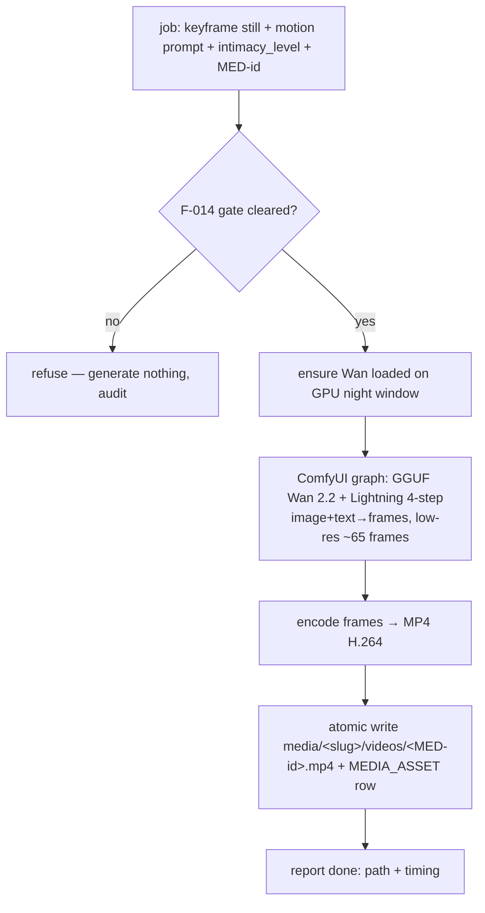
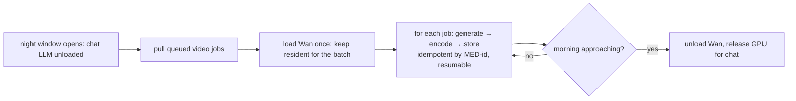

# F-016 — Wan Intimate Video Generation (fast image→video synthesis engine)

- **Status:** Draft
- **Summary:** The **video synthesis engine** for intimate clips: given a gated intimate **keyframe
  still** (from F-015) + a motion prompt, it drives **Wan 2.2** to produce a **short, low-resolution,
  in-character intimate video** and stores it as a `MEDIA_ASSET` (`kind=video`, `intimate=true`).
  It is the video-phase sibling of the F-008 **image** runner: an isolated, model-swappable runner
  behind a **fixed job API**, consuming from the night batch, coordinating the day/night GPU handoff
  with the chat LLM, and **never** running on the reply hot path. Its defining requirement is
  **speed on our own hardware** — a ~4-second clip generated in **≈90 seconds** on the Turing Quadro
  RTX 8000, via **headless ComfyUI + GGUF-quantized Wan 2.2 + the Wan2.2-Lightning 4-step distill
  LoRA** (architecture.md §4.3/§4.3a). Resolution is deliberately low (Telegram-sized), because the
  deliverable is an in-chat video message, not a cinema render.

> **Scope boundary.** F-016 owns the **Wan image→video runner** — model loading/quantization,
> the ComfyUI graph, the fixed job contract, the frame→MP4 encode, the `MEDIA_ASSET` write,
> idempotency/retry/resume/degrade, and the day/night GPU handoff for video.
> **Out of scope (consumed, not owned):**
> - **The hard safety gate + intimacy policy** → **F-014**. F-016 **must not generate anything the
>   F-014 gate has not cleared**; it inherits the non-negotiable never-generate hard boundary.
> - **The keyframe still(s)** it animates → **F-015** (first/last frame pair, same-person identity).
> - **The motion/scene prompt** → **F-010** authoring (F-016 receives a prompt in its job payload).
> - **Appearance identity** across the clip → **F-009** (via the conditioning keyframe).
> - **Delivery into chat / paywall** → **F-012 / monetization** (F-016 only fills the archive).
> - **Talking-head circles** (`HunyuanVideo-Avatar`) and any **audio/voice** → deferred, separate.
> - **The image runner** (F-008) — F-016 reuses its *patterns/runtime* (headless ComfyUI) but is its
>   own isolated runner (`video/`), with **no import coupling** to `services/bot`.

---

## 1. User stories

- **US-016-01** — As an **opted-in, deeply-bonded adult user**, I want the intimate clips she sends
  to be **short, smooth, and unmistakably her**, so that **they feel like a real, personal moment**
  rather than a generic loop.
- **US-016-02** — As the **platform operator**, I want intimate video to **inherit the exact same
  hard safety gate** as intimate images (F-014), so that **no clip can ever be produced outside the
  non-negotiable boundary**, regardless of request, stage, or config.
- **US-016-03** — As the **platform operator**, I want each clip to generate in **≈90 seconds for
  ~4 seconds of video on our own GPU**, so that **a night can pre-produce a whole roster's archive**
  within the sleep window and the economics work self-hosted.
- **US-016-04** — As the **platform operator**, I want the video runner to be a **swappable module
  behind a fixed job API** (like the image runner), so that **the model/quant/steps can change after
  benchmarking without touching any caller**.
- **US-016-05** — As the **platform operator**, I want video generation to **coordinate the GPU with
  the chat LLM** (video only when chat has released the GPU) and to **degrade/retry/resume safely**,
  so that **a failed or interrupted night never corrupts the archive or starves daytime chat**.
- **US-016-06** — As a **developer**, I want a **repeatable bench** that reports clip time / VRAM /
  visual quality across model tiers and quant levels, so that **the 4 s/≈90 s target is a measured
  decision**, not a guess (mirrors the image A/B).

## 2. User flows

### One intimate clip (engine POV)

### Night batch across the roster (with day/night handoff)

## 3. Use cases (Gherkin)

- **UC-016-01 — Clock-in-budget generation.** Given a cleared job at low resolution; When the runner
  generates; Then a ~4 s clip is produced in ≈90 s (± tolerance) and stored as one `MEDIA_ASSET`.
- **UC-016-02 — Hard-boundary refusal.** Given a job the F-014 gate did not clear; When the runner
  receives it; Then **no frames are generated**, nothing is written, and the refusal is audited.
- **UC-016-03 — Identity from the keyframe.** Given a persona keyframe still; When the clip is
  generated; Then the person in the clip is the one in the keyframe (conditioning honored).
- **UC-016-04 — Idempotent resume.** Given a job whose `MED-id` output already exists; When re-run;
  Then it is a no-op (no duplicate, no re-generation) — a crashed night resumes cleanly.
- **UC-016-05 — Degrade on failure.** Given a generation error (OOM, bad graph, encode fail); When it
  happens for one job; Then that job is marked failed and skipped, the batch continues, and no
  partial/corrupt MP4 or half-written row remains.
- **UC-016-06 — GPU handoff.** Given the chat LLM still holds the GPU; When a video job is pulled;
  Then generation waits for the night window / GPU release and never contends with live chat.
- **UC-016-07 — Fixed job contract.** Given a change of model tier or quant; When swapped; Then the
  job request/response schema is unchanged and callers need no change.
- **UC-016-08 — No hot-path coupling.** Given `services/bot`; When inspected; Then it never imports
  the `video/` runner — all coupling is via the queue/job API + `media/` archive.

## 4. Requirements

### Functional
- **FR-016-01** — The runner must accept a **fixed job payload**: conditioning **keyframe still
  path(s)**, **motion prompt** (+negative), **intimacy_level**, target **resolution**, **duration/
  frame count**, **fps**, and the **`MED-id`** to write — and return a structured result
  (output path, timing, status). The schema is stable across model/quant swaps (FR-016-04).
- **FR-016-02** — Generation must use **Wan 2.2 image+text→video** conditioned on the keyframe
  still, at a **low, configurable resolution** (Telegram-sized, e.g. 480×480 / 512×384) and a
  **configurable short duration** (~4 s, ~65 frames at 16 fps).
- **FR-016-03** — Generation must run at a **low step count via the Wan2.2-Lightning 4-step distill
  LoRA** on **GGUF-quantized** weights, served through **headless ComfyUI + ComfyUI-GGUF**, so it
  runs on the **Turing (sm_75) GPU without any FP8 dependency** (architecture.md §4.3a).
- **FR-016-04** — The runner must be **model-swappable behind the fixed job API**: the Wan tier
  (TI2V-5B vs A14B MoE) and GGUF quant level are configuration, changeable without altering the job
  contract or any caller.
- **FR-016-05** — Output frames must be **encoded to a Telegram-friendly MP4** (H.264, yuv420p,
  faststart) at the job's fps, and stored **atomically** at `media/<slug>/videos/<MED-id>.mp4`.
- **FR-016-06** — Each stored clip must create a **`MEDIA_ASSET` row** (`kind=video`,
  `intimate=true`, `intimacy_level`, dimensions, duration, fps, source keyframe reference,
  generation metadata) so Media Delivery (F-012) can serve it.
- **FR-016-07** — **Hard safety gate (inherited from F-014, non-negotiable):** the runner must
  **verify the job carries a valid F-014 clearance and refuse to generate anything without it** — no
  request, intimacy_level, config, or prompt can bypass the never-generate hard boundary. A refused
  job produces **no frames and no files** and is audited.
- **FR-016-08** — Generation must be **idempotent by `MED-id`**: if the target output already exists,
  the job is a no-op — enabling **safe retry and resume** of an interrupted night batch.
- **FR-016-09** — On any generation/encode failure the runner must **degrade cleanly**: mark the job
  failed, leave **no partial MP4 or half-written row**, release VRAM, and continue the batch (one
  bad job never stops the night).
- **FR-016-10** — The runner must **coordinate the GPU day/night handoff** (architecture.md §6.1):
  video runs only when the chat LLM has released the GPU; it loads Wan **once** and keeps it resident
  for the batch, and **unloads to free the GPU** before the awake/serving window.
- **FR-016-11** — The runner must be an **isolated module** (`video/`, own env + weights + ComfyUI
  graph) with **no import coupling** into `services/bot` — all interaction is via the job queue/API
  and the `media/` archive (architecture.md §6.2c).
- **FR-016-12** — A **repeatable benchmark** must measure, per model tier × quant level, the **clip
  generation time, peak VRAM, and produce sample clips**, so the production configuration is a
  **measured choice against the 4 s/≈90 s target** (mirrors the image A/B harness).
- **FR-016-13** — Generation must be **auditable**: model tier, quant, step count, seed, resolution,
  frame count, and timing are recorded with each asset for reproducibility/provenance.

### Non-functional
- **NFR-016-01** — **Speed target:** a ~4 s (≈65-frame @16fps) clip at the configured low resolution
  must generate in **≈90 s (target; hard cap ≤ 150 s)** on the Quadro RTX 8000 — the primary
  acceptance metric.
- **NFR-016-02** — **Fits the GPU:** the loaded Wan pipeline (chosen quant) must fit in the 48 GB
  card with headroom, **without FP8** and without falling back to sequential CPU-offload (the failure
  mode that produced 424 s/img blanks in the image A/B).
- **NFR-016-03** — **Never on the hot path:** no user-reply path may block on or trigger video
  generation; all generation is night-batch/queued.
- **NFR-016-04** — **Isolation provable:** a test asserts `services/bot` does not import `video/`.
- **NFR-016-05** — **Durability/atomicity:** a crash mid-generation leaves the archive consistent —
  either a complete clip + row or nothing for that `MED-id`.
- **NFR-016-06** — **Safety is absolute:** the F-014 hard-boundary refusal (FR-016-07) holds under
  adversarial/malformed job payloads — fail closed (refuse) on any ambiguity, never fail open.
- **NFR-016-07** — **Batch throughput:** the night window must be able to produce a **roster's worth**
  of clips; per-clip time × jobs must fit the configured sleep window (derived from NFR-016-01).
- **NFR-016-08** — **Config without code change:** resolution, duration, fps, model tier, quant,
  step count, and the day/night window are tunable via config/env.
- **NFR-016-09** — **Reproducibility:** a fixed seed + config yields a deterministic-enough clip for
  the bench to compare configurations meaningfully.
