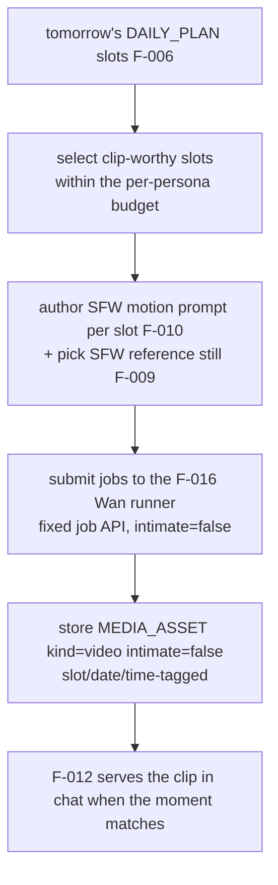

# F-017 — Daily-Life Video Clips (SFW "civilian" video from her day)

- **Status:** Draft
- **Summary:** Short, silent, **SFW slice-of-life video clips** of the persona's day — a gym set, a
  coffee pour, a walk in the park, cooking dinner — generated nightly on the **same Wan 2.2 runner
  F-016 builds** (same fixed job API, same 4-step GGUF stack, same ~4 s/≈90 s budget), conditioned
  on an SFW reference/archive photo so it is unmistakably **her** (F-009). Clips are planned from
  the **Life Engine's day plan slots** (F-006/F-011 pattern): tomorrow's plan says "8:00 пробежка в
  парке" → tonight's batch renders a matching clip, so when she says "только с пробежки" she can
  *show* it. This is the video sibling of the F-011 daily photo batch: photos gave her a camera
  roll; F-017 gives it **motion**.

> **Scope boundary.** F-017 owns the **planning and cataloguing of SFW daily-life clips**: which
> clips to make for tomorrow (slot selection + budgets), the SFW motion-prompt authoring hand-off,
> submitting jobs to the F-016 runner, and the `MEDIA_ASSET` catalog rows (`kind=video`,
> `intimate=false`, slot/time-tagged).
> **Out of scope (consumed, not owned):**
> - **The video engine itself** → **F-016** (F-017 is a *client* of its job API; no second runner).
> - **The day plan** → **F-006** (slots come from `DAILY_PLAN`); **prompt structure** → **F-010**.
> - **Identity conditioning** → **F-009** (SFW reference/archive photo per slot).
> - **Delivery into chat** → **F-012** (serving the right clip at the right moment, no-repeat, in
>   voice — F-017 only fills the archive).
> - **Intimacy of any kind** → **F-016/F-014**. F-017 is strictly SFW: its jobs carry no intimacy
>   flags and never touch the F-014 gate; a prompt that would need clearance is rejected here.
> - **Sound** — all F-017 clips are **silent** (voice circles are F-018).

---

## 1. User stories

- **US-017-01** — As **any user**, I want her to be able to **show a moment of her day in motion**
  ("вот, только с пробежки 🏃‍♀️" + a short clip), so that **her life feels real and continuous**,
  not a stack of stills.
- **US-017-02** — As an **A8 skeptic**, I want the clip to **match what she said she was doing and
  the time of day** (per her plan), so that probing her day against her media finds no seams.
- **US-017-03** — As the **platform operator**, I want daily-life clips produced in the **same
  night batch on the same engine** as intimate clips, so that **no new runner, model, or GPU slot**
  is needed for SFW content.
- **US-017-04** — As the **platform operator**, I want per-persona **clip budgets** (e.g. 2-3
  clips/night), so that the night window stays predictable as the roster grows.
- **US-017-05** — As a **developer**, I want the SFW batch to be **idempotent and resumable** like
  every other night job, so that a crashed night never duplicates or corrupts the archive.

## 2. User flows

### Nightly planning → generation (behind the scenes)

## 3. Use cases (Gherkin)

- **UC-017-01 — Plan-driven clip.** Given tomorrow's plan has "8:00 — пробежка в парке"; When the
  night batch runs; Then a short SFW clip matching that slot exists, tagged with the slot/date.
- **UC-017-02 — Budget respected.** Given a per-persona budget of N clips/night; When planning
  selects slots; Then at most N jobs are submitted and the selection covers distinct slots.
- **UC-017-03 — Identity held.** Given the persona's SFW reference still; When the clip generates;
  Then the person in motion is recognizably her (F-009 conditioning honored).
- **UC-017-04 — Strictly SFW tier.** Given a slot whose authored prompt drifts intimate; When jobs
  are validated; Then the job is rejected at planning (never submitted carrying intimacy).
- **UC-017-05 — Idempotent night.** Given a crashed batch re-run; When it resumes; Then completed
  MED-ids are skipped and the archive has no duplicates.
- **UC-017-06 — Degrade per slot.** Given one slot's generation fails; When the batch continues;
  Then other slots still produce clips and the failure is recorded.
- **UC-017-07 — No new engine.** Given the F-017 pipeline; When inspected; Then it calls only the
  F-016 job API — no second video runner or model load of its own.

## 4. Requirements

### Functional
- **FR-017-01** — A **nightly planner** must select, for each active persona, the **clip-worthy
  slots** of tomorrow's `DAILY_PLAN` (parseable HH:MM slots, F-006 FR-006-30) within a
  **configurable per-persona clip budget**, preferring visually distinct activities/locations.
- **FR-017-02** — For each selected slot the planner must obtain an **SFW motion prompt**
  (scene/action/setting/lighting + negatives) via the F-010 authoring path, tagged with the slot's
  time/activity — and a matching **SFW conditioning still** (an F-009 reference or an F-011 archive
  photo of that slot).
- **FR-017-03** — Jobs must be submitted to the **F-016 runner's fixed job API** unchanged
  (`intimate=false`, no intimacy fields) — F-017 introduces **no second engine** and performs no
  GPU work of its own.
- **FR-017-04** — Every produced clip must be catalogued as a **`MEDIA_ASSET`** row: `kind=video`,
  `intimate=false`, persona, **date + slot/time tags**, activity/location metadata, and the source
  still reference — so F-012 can match a clip to "the moment".
- **FR-017-05** — The pipeline must be **strictly SFW by construction**: job payloads carry no
  intimacy markers; a prompt that fails SFW validation is **rejected at planning time** (never
  "routed" to F-016's gated intimate path from here).
- **FR-017-06** — The batch must be **idempotent and resumable** by MED-id (F-016 FR-016-08
  semantics), so re-running a night skips completed clips.
- **FR-017-07** — A **per-slot failure** must degrade cleanly: record it, skip the slot, continue
  the batch (one bad slot never kills the night) — mirror of F-011's per-shot degrade.
- **FR-017-08** — The planner must be **schedule-aware** (§6.1): it runs inside the night window on
  the batch scheduler's video slot, after the image batch, before chat reloads.
- **FR-017-09** — Planning and results must be **auditable**: which slots were chosen, the prompt,
  the job result, and timing are recorded per clip (provenance chain plan→prompt→job→asset).
- **FR-017-10** — Budgets, slot-selection preferences, clip resolution/duration (inherited into the
  F-016 job), and the batch window must be **config-driven** — no code change to tune volume.

### Non-functional
- **NFR-017-01** — **Throughput fits the window:** budgets × roster × the F-016 per-clip time
  (≈90 s) must fit the configured night video slot; a configuration that cannot fit is refused and
  logged at planning, never discovered by overrunning into the chat window.
- **NFR-017-02** — **No hot-path work:** planning, generation, and cataloguing never run on or
  block a user-reply path.
- **NFR-017-03** — **Consistency:** a clip's tags (slot/time/activity) always match the plan slot
  it was generated for — no orphan or mislabeled clips after crashes (atomic catalog write).
- **NFR-017-04** — **Isolation:** `services/bot` does not import the planner/runner internals; the
  bot sees only `MEDIA_ASSET` rows + files (same boundary as F-011/F-016).
- **NFR-017-05** — **Roster scale:** the planner iterates all active personas; one persona's
  empty/unparseable plan (degrade: skip + log) never stops the others.
