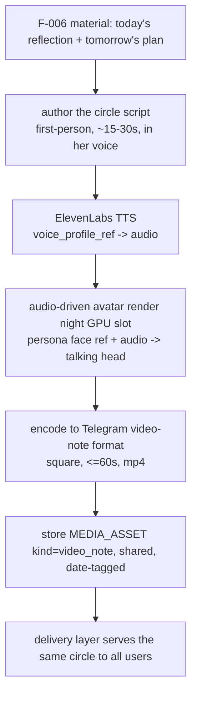
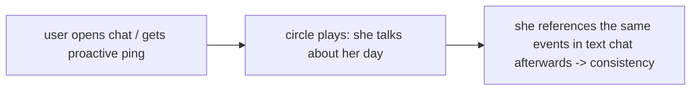

# F-018 — Voice Video Circles (talking-head daily story, voice included)

- **Status:** Draft
- **Summary:** The persona's **talking-head video circles** — Telegram video notes where she speaks
  to the camera with a real voice: the **intro circle** a user meets on Start Chat, and the
  **proactive daily story circle** ("а у меня сегодня такое было…") that pulls users back into the
  conversation. Voice is synthesized with **ElevenLabs** (per-persona `voice_profile_ref`, external
  API — no GPU); the talking head is animated by an **audio-driven avatar model** run in the night
  batch. Circles are **per-persona-per-day, shared across all users** — one nightly render serves
  everyone, so the cost is O(roster), not O(users). The script comes from her own life: the Life
  Engine's day (plan/reflection, F-006) authors what she talks about.

> **Model choice is a bench decision, not a dogma (architecture §4.3).** Wan 2.2's base i2v cannot
> lip-sync to audio — but the Wan family has **`Wan2.2-S2V` (speech-to-video)**, an audio-driven
> variant with community GGUF workflows. So the candidates are:
> **(A) `Wan2.2-S2V`** — stays in the SAME runtime we already serve (ComfyUI + GGUF + our VAE/
> encoder), no second model family, no extra GPU rotation slot beyond the video batch;
> **(B) `HunyuanVideo-Avatar`** — audio-driven emotion + face-aware adapter, likely stronger
> lip-sync/expressiveness, but a second model family and its own night slot.
> The F-018 bench measures lip-sync quality, identity hold, and clip time on our Turing GPU and
> picks the production model; the pipeline is model-agnostic behind the same fixed-job-API pattern.

> **Scope boundary.** F-018 owns: the **daily circle pipeline** (script → voice → talking-head
> render → catalog), the **script authoring hand-off** (from F-006 material), the **ElevenLabs TTS
> integration**, the avatar-model bench + runner config, and the `MEDIA_ASSET` rows
> (`kind=video_note`, shared, date-tagged).
> **Out of scope (consumed, not owned):**
> - **Delivery/scheduling of the circle to users** (when each user receives it, proactive-send
>   policy) → Media Delivery / a later proactive-messaging feature; F-018 fills the archive.
> - **Voice profile creation** (recording/cloning her voice into `voice_profile_ref`) → Persona
>   Studio; F-018 consumes the profile.
> - **Voice replies in chat** (TTS of conversation messages) → a separate voice feature; F-018 is
>   circles only.
> - **Intimacy** — circles are **strictly SFW** talking-head content; no F-014 surface at all.
> - **The night scheduler itself** (§6.1) — F-018 registers a batch job; the rotation is owned
>   by the batch scheduler.

---

## 1. User stories

- **US-018-01** — As a **new user**, I want to be greeted by a **video circle where she speaks to
  me with a real voice**, so that **the "she's real" impression lands in the first ten seconds**.
- **US-018-02** — As a **returning user**, I want her to **drop a daily story circle** about her
  day (matching what she "did" per her plan/reflection), so that **there's a living reason to
  reopen the chat every day**.
- **US-018-03** — As an **A8 skeptic**, I want her lips and voice to **sync convincingly** and her
  face to be **the same girl as her photos**, so that the circle survives frame-by-frame scrutiny.
- **US-018-04** — As the **platform operator**, I want circles rendered **once per persona per
  day** and shared across all users, so that the nightly cost scales with the roster, not the
  user base.
- **US-018-05** — As the **platform operator**, I want the avatar model chosen by a **measured
  bench** (S2V vs Hunyuan) with the pipeline model-agnostic, so that we keep the single-runtime
  option open and can swap on quality without rework.
- **US-018-06** — As a **developer**, I want the circle pipeline to **degrade cleanly** (no circle
  today ≠ broken bot: yesterday's circle or none is served), so that a failed night is invisible.

## 2. User flows

### Nightly circle pipeline (per persona)

### The user meets a circle

## 3. Use cases (Gherkin)

- **UC-018-01 — Daily circle exists by morning.** Given the night batch ran; When a persona's
  pipeline completes; Then a `video_note` asset for today exists, scripted from her F-006 material.
- **UC-018-02 — Shared across users.** Given two different users; When each receives today's
  circle; Then it is the **same** asset (one render, O(roster) cost).
- **UC-018-03 — Voice is hers.** Given the persona's `voice_profile_ref`; When TTS runs; Then the
  audio uses that profile and the script language matches the persona's language.
- **UC-018-04 — Story matches her life.** Given her plan said "утром пробежка"; When the circle
  script is authored; Then the circle's story is consistent with plan/reflection content (no
  contradictions with what she'll say in chat).
- **UC-018-05 — Degrade to yesterday.** Given tonight's render failed; When a user should get a
  circle; Then the system serves the last good circle or none — never a broken/partial file.
- **UC-018-06 — TTS outage degrade.** Given ElevenLabs is down; When the pipeline runs; Then the
  circle step is skipped cleanly (logged), the rest of the night batch proceeds.
- **UC-018-07 — Model swap invisible.** Given the bench picks S2V or Hunyuan; When the production
  model changes; Then the pipeline contract and catalog format are unchanged.
- **UC-018-08 — Telegram format honored.** Given a rendered circle; When encoded; Then it is a
  square video note ≤60 s that Telegram accepts as a `video_note`.

## 4. Requirements

### Functional
- **FR-018-01** — A **nightly circle pipeline** must produce, per active persona per day, **one
  shared talking-head video note**: script → TTS → avatar render → encode → catalog.
- **FR-018-02** — The **script** must be authored from the persona's **own F-006 material**
  (today's reflection / tomorrow's plan), first-person, in her language, ~15–30 s spoken length,
  consistent with what she says in chat (no contradiction with plan/activity answers).
- **FR-018-03** — **Voice must be ElevenLabs** with the persona's `voice_profile_ref`; the audio
  artifact is cached/stored so a render retry does not re-bill TTS.
- **FR-018-04** — The **talking head must be audio-driven** (true lip-sync to the TTS audio),
  conditioned on the persona's face reference (F-009 identity) — not a generic loop with audio
  overlaid.
- **FR-018-05** — The avatar model must sit behind the **same fixed-job-API pattern** as F-016,
  with **two benchable candidates** — `Wan2.2-S2V` (A, same runtime) and `HunyuanVideo-Avatar`
  (B) — swappable by config without pipeline changes.
- **FR-018-06** — A **bench** must measure, per candidate: lip-sync quality, identity hold vs her
  references, render time for a ~20 s circle, and peak VRAM on the Turing GPU — the production
  choice is recorded with evidence (mirror of the image A/B).
- **FR-018-07** — Output must be encoded to the **Telegram video-note format** (square aspect,
  ≤60 s, mp4/H.264) and stored atomically; the catalog row is `MEDIA_ASSET` `kind=video_note`,
  **shared (not per-user)**, date-tagged, with script + audio + model provenance.
- **FR-018-08** — The pipeline must be **idempotent per (persona, date)**: a re-run reuses the
  existing script/audio/render steps that already completed (safe resume, no double TTS billing).
- **FR-018-09** — **Degrade cleanly at every step:** script-LLM failure, TTS outage, render
  failure, or encode failure each skip the persona's circle for the night (logged, audited),
  leaving the **last good circle** in the catalog — never a partial/corrupt asset.
- **FR-018-10** — The render step must run in the **night GPU rotation** (§6.1) via the batch
  scheduler: load once, drain the roster's circle jobs, release VRAM before chat reloads. If the
  bench picks S2V, the render shares the Wan video slot; if Hunyuan, it registers its own slot.
- **FR-018-11** — The **intro circle** (F-001 `intro_videonote_ref`) must be producible by the same
  pipeline as a one-off render (a persona-onboarding artifact, not nightly), so intro and daily
  circles share identity/voice/quality.
- **FR-018-12** — Every circle must be **auditable**: script text, TTS voice/params, model, seed,
  timings, and the F-006 sources it drew from are recorded with the asset.

### Non-functional
- **NFR-018-01** — **Cost scales with roster:** one render + one TTS call per persona per day
  regardless of user count; per-user work is delivery only.
- **NFR-018-02** — **Night-window fit:** roster × (TTS + render + encode) must fit the circle
  batch slot; an overcommitted config is refused at planning, never discovered by overrun.
- **NFR-018-03** — **No hot-path generation:** a user interaction never triggers TTS or a render;
  users are always served from the catalog.
- **NFR-018-04** — **Identity/voice consistency:** the circle's face matches her references and
  the voice matches her profile across days (spot-checkable; bench-verified per model).
- **NFR-018-05** — **External-API resilience:** ElevenLabs failures are retried with backoff
  within the night window and then degrade (FR-018-09); keys live in env/config, never in code.
- **NFR-018-06** — **Isolation:** the circle pipeline is its own module boundary; `services/bot`
  consumes only `MEDIA_ASSET` rows/files (no import coupling into the pipeline/runner).
- **NFR-018-07** — **Config without code change:** script length, TTS params, model candidate,
  resolution/duration, and the batch slot are config-driven.
- **NFR-018-08** — **Privacy:** circle scripts draw only on the persona's own shared life (F-006);
  no user-specific facts ever leak into a shared circle (same rule as FR-006-06).
