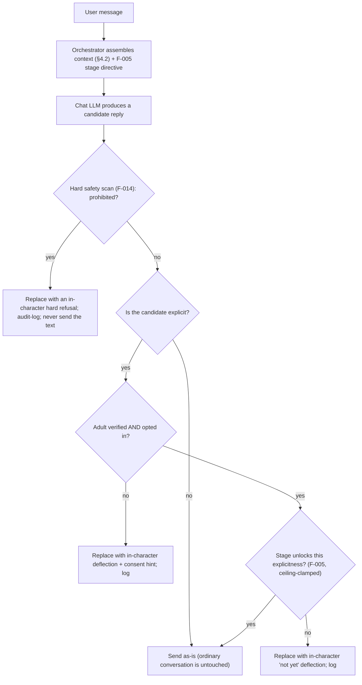
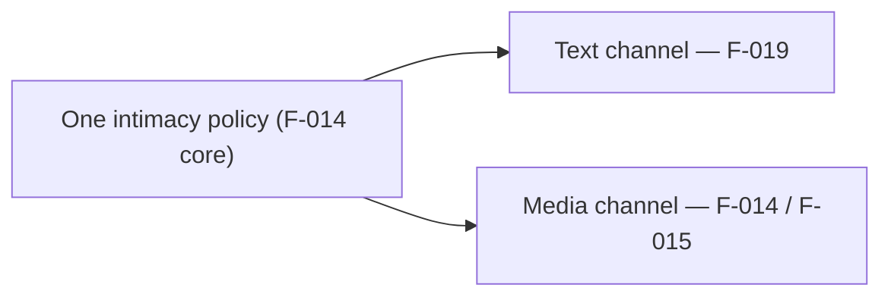

# F-019 — Conversational Intimacy Gate (text)

- **Status:** Draft
- **Summary:** The **text** counterpart of F-014. Today intimate *photos* are strictly gated
  (age/consent, relationship stage, per-persona ceiling, non-negotiable hard safety boundary,
  audit log) while her **words** are gated only by a single soft line in the system prompt
  (`STAGE_BEHAVIOR`, F-005) — a *request* the uncensored chat model routinely overrides. Measured
  live: a brand-new `Stranger` user can steer the conversation explicit from the first message.
  F-019 closes that gap: the **same gate policy that governs intimate media governs intimate
  language**, enforced on the actual outbound reply rather than hoped for in the prompt.

> **Scope boundary.** F-019 owns **intimacy gating of conversational text** — deciding whether the
> persona may speak explicitly to *this* user *right now*, and what happens when she may not. It does
> **not**:
> - **Own the relationship model** — stage/affinity are **F-005**; F-019 *reads* the stage.
> - **Own the persona's voice** — the deflection is phrased in her voice by F-002/F-003; F-019
>   decides *that* she deflects, not *how she talks* generally.
> - **Own media** — intimate photos/keyframes stay **F-014**/**F-015**. F-019 **reuses F-014's hard
>   safety scan, stage→level mapping, ceiling clamp and `GateDecision` audit table** rather than
>   duplicating them (one policy, two channels).
> - **Replace the prompt directive** — F-005's `STAGE_BEHAVIOR` stays as *proactive steering*; F-019
>   adds the *enforcement* the steering lacks.
> - **Censor SFW conversation** — ordinary warmth, flirting within the unlocked stage, emotional
>   intimacy and non-sexual affection are untouched.

---

## 1. User stories

- **US-019-01** — As an **A1/A2 emotionally-driven user**, I want intimacy in *conversation* to
  **build with the relationship**, so that **it feels like a real bond deepening, not a machine that
  will say anything to anyone on message one**.
  _Narrative:_ early on she's warm but deflects sexual talk; weeks later, once close, she's openly
  intimate — and that progression is what makes it feel earned.

- **US-019-02** — As the **platform operator**, I want **one intimacy policy across text and media**,
  so that **the product cannot be explicit in words while refusing the same content as a photo**.
  _Narrative:_ the same stage/consent rules decide both channels; no inconsistent surface.

- **US-019-03** — As the **platform operator**, I want the **hard safety boundary enforced on text**,
  so that **prohibited content is impossible to elicit in conversation**, not just in images.
  _Narrative:_ no phrasing, roleplay wrapper or jailbreak produces prohibited text.

- **US-019-04** — As an **A8 skeptic user**, I want a refusal to **stay in character**, so that
  **the illusion never breaks with a system-sounding message**.
  _Narrative:_ when she won't go there she says something *she* would say — not "I can't assist
  with that".

- **US-019-05** — As a **B1/B2 creator**, I want a persona's **conversational openness ceiling** to
  be configurable within the platform limit, so that **each persona has her own boundaries**.
  _Narrative:_ one persona stays tame however close you get; another opens fully.

---

## 2. User flows

### One reply, gated


### Consistency with media


---

## 3. Use cases (Gherkin)

```gherkin
Feature: F-019 Conversational Intimacy Gate

  Scenario: UC-019-01 Prohibited content is blocked in text
    Given any user message steering toward a prohibited category
    When the persona's reply is produced
    Then the reply never contains that content and an in-character refusal is sent instead

  Scenario: UC-019-02 Explicit text requires age + opt-in
    Given a user who is not verified-adult or has not opted in
    When the model produces an explicit candidate reply
    Then it is withheld and an in-character deflection is sent

  Scenario: UC-019-03 Explicit text unlocks with the relationship stage
    Given an opted-in adult at an early stage
    When an explicit candidate reply is produced
    Then it is withheld with an in-character "not yet"
    And at a sufficiently advanced stage the same reply is allowed

  Scenario: UC-019-04 Ordinary conversation is never touched
    Given a normal, warm, non-sexual exchange
    When replies are produced
    Then they are sent unchanged (no false positives, no latency spike)

  Scenario: UC-019-05 Refusal stays in character
    Given any withheld reply
    When the deflection is sent
    Then it reads as the persona's own voice, never as a system/assistant message

  Scenario: UC-019-06 Per-persona ceiling clamps openness
    Given a persona configured tamer than the platform limit
    When a deeply bonded user pushes further
    Then her configured ceiling applies

  Scenario: UC-019-07 Jailbreak phrasing cannot bypass the hard boundary
    Given adversarial phrasing (roleplay wrapper, obfuscation, injection)
    When evaluated
    Then the hard boundary still holds

  Scenario: UC-019-08 Decisions are audited
    Given any gate decision on text
    When it is made
    Then it is logged with action/reason, without persisting prohibited content

  Scenario: UC-019-09 Text and media agree
    Given the same user and stage
    When the same intimacy level is requested as text and as a photo
    Then both channels return the same allow/withhold decision
```

---

## 4. Requirements

### Functional

- **FR-019-01** — **Enforcement on the outbound reply (CRITICAL).** The gate must evaluate the
  **generated candidate reply**, not merely the prompt. Prompt-level steering (F-005 `STAGE_BEHAVIOR`)
  is retained as proactive guidance but is **not** the enforcement point — measured live, the
  uncensored model overrides it.
- **FR-019-02** — **Hard safety boundary (CRITICAL, non-negotiable).** Prohibited categories
  (minors, non-consent, unauthorized real-person likeness) must be blocked in text **regardless of
  stage, config, opt-in or persona ceiling**, reusing F-014's `hard_safety_scan` (already
  jailbreak-tested). Not a tunable knob.
- **FR-019-03** — **Age/consent gate.** Explicit text requires the viewer to be **verified adult
  AND opted in** (`User.adult_verified` + `User.intimate_opt_in`, F-014). Otherwise the explicit
  reply is withheld.
- **FR-019-04** — **Stage-gated explicitness.** Explicit language unlocks only at/above a configured
  **F-005 relationship stage**, mirroring F-014's `level_min_stage` mapping, so text and media
  escalate together.
- **FR-019-05** — **Per-persona ceiling, clamped.** A persona's conversational openness ceiling is
  configurable and always clamped to the platform limit (`min(persona, platform)`), reusing F-014's
  clamp — config can only be more conservative.
- **FR-019-06** — **Classification of the candidate reply.** The gate must classify a reply's
  explicitness (none / suggestive / explicit) via a config-driven vocabulary, defaulting to the
  **safe side on ambiguity**, and must **not** flag ordinary affection, flirting or emotional
  intimacy.
- **FR-019-07** — **In-character substitution (CRITICAL for the illusion).** A withheld/blocked reply
  must be replaced by a **persona-voiced deflection** appropriate to the reason (not-yet / consent /
  hard refusal), localized (RU/EN) — **never** a system or assistant-sounding message, never an
  error, never silence.
- **FR-019-08** — **SFW conversation untouched.** Non-explicit replies must pass through **unmodified**
  (byte-identical) — the gate is a filter on a narrow class, not a rewriter.
- **FR-019-09** — **Audit.** Every text-gate decision (allow / withhold + reason / block + category)
  must be logged via F-014's `GateDecision` path, recording **category/reason only — never the
  prohibited text**.
- **FR-019-10** — **Channel consistency.** For the same user, persona and stage, the text gate and
  the media gate must return the **same** allow/withhold verdict for the same intimacy level (one
  policy core, two channels).
- **FR-019-11** — **Config-driven.** Explicitness vocabulary, stage thresholds, persona ceilings and
  deflection lines are tunable without code changes (architecture.md §4.8).
- **FR-019-12** — **Off the critical path budget.** The gate must be a **local, deterministic check**
  (no extra LLM round-trip), so it adds negligible latency to a reply.

### Non-functional

- **NFR-019-01** — **Hard boundary is absolute (CRITICAL):** an adversarial battery (roleplay
  wrappers, obfuscation, injection) yields **zero** prohibited text under any stage/config.
- **NFR-019-02** — **Consent enforcement (CRITICAL):** explicit text is never delivered to a
  non-adult / non-opted-in user — provable.
- **NFR-019-03** — **No false positives:** a corpus of ordinary warm/flirty/emotional replies passes
  unmodified; the gate must not sterilize the product.
- **NFR-019-04** — **Illusion preserved:** every refusal reads in-character; no assistant-voice
  leakage ("I can't assist", "as an AI").
- **NFR-019-05** — **Latency:** the check adds no measurable delay (no model call), well inside the
  F-002 reply budget.
- **NFR-019-06** — **Consistency:** text and media verdicts agree for identical inputs (testable
  cross-channel).
- **NFR-019-07** — **Auditability:** decisions logged with reason; prohibited content never persisted.
- **NFR-019-08** — **Config-driven:** thresholds/vocabulary/lines tunable without redeploy.

---

## 5. Coverage note
Tested in `developer files/tests/F-019-conversational-intimacy-gate.md`: outbound-reply enforcement,
the hard-boundary battery, consent and stage gating, ceiling clamp, explicitness classification
(including a no-false-positive corpus), in-character substitution, pass-through of SFW text, audit
logging, and cross-channel agreement with F-014 are all automatable; live "does she still feel
natural" acceptance is manual (marked). 5 US / 9 UC / 12 FR / 8 NFR.
