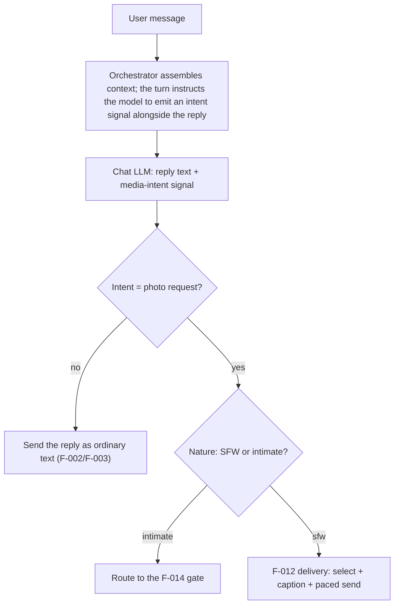

# F-020 — LLM Media-Intent Detection

- **Status:** Draft
- **Summary:** Decide **whether the user is actually asking for a photo** using the **LLM turn**,
  not a keyword list. Today a hardcoded noun×verb matcher sits *in front of* the conversation
  (`looks_like_photo_request`), and it demonstrably misses natural phrasing — measured live,
  *"скинь свою фотку"* worked but *"а может сфоткаешься сидя на диване?"* silently fell through to
  an ordinary text turn (ISS-005). This feature replaces that pre-filter with intent detection where
  architecture.md §3.2 always said it belongs: **post-process of the model turn**, so the same model
  that understands the conversation also decides what the user wanted.

> **Scope boundary.** F-020 owns **intent classification only** — "does this turn call for media,
> and of what kind". It does **not**:
> - **Select or send the photo** — that is **F-012** (delivery), which F-020 hands off to;
> - **Gate intimacy** — SFW-vs-intimate *entitlement* stays **F-014**; F-020 only reports that the
>   request *is* intimate in nature so delivery routes it to the gate;
> - **Generate media** — nothing here touches the F-008 engine;
> - **Own the persona's voice** — the reply text remains F-002/F-003.

---

## 1. User stories

- **US-020-01** — As a **user**, I want her to understand **any natural way I ask for a photo**, so
  that **I don't have to guess magic words**.
  _Narrative:_ "сфоткаешься?", "покажись", "хочу тебя увидеть", "а как ты сейчас выглядишь?" all
  land as photo requests — because a person would understand all of them.

- **US-020-02** — As a **user**, I want her **not** to send a photo when I wasn't asking for one, so
  that **the conversation doesn't get derailed by a random picture**.
  _Narrative:_ "обожаю фотографировать закаты" is a topic, not a request — she just talks about it.

- **US-020-03** — As the **platform operator**, I want intent detection to be **part of the model
  turn**, so that **it understands morphology, paraphrase and context instead of a brittle word
  list I have to keep patching**.

- **US-020-04** — As the **platform operator**, I want detection to **cost no extra round-trip**, so
  that **reply latency is unchanged**.

---

## 2. User flows



---

## 3. Use cases (Gherkin)

```gherkin
Feature: F-020 LLM Media-Intent Detection

  Scenario: UC-020-01 Natural phrasing is understood
    Given the user writes "а может сфоткаешься сидя на диване?"
    When the turn is processed
    Then it is classified as a photo request and delivery runs

  Scenario: UC-020-02 Morphological variants are understood
    Given phrasings like "покажись", "хочу тебя увидеть", "как ты сейчас выглядишь"
    When classified
    Then each is recognized without any keyword being present

  Scenario: UC-020-03 Topic mentions are not requests
    Given "обожаю фотографировать закаты"
    When classified
    Then it is NOT a photo request and the turn stays text

  Scenario: UC-020-04 Intimate requests are reported as such
    Given an explicitly intimate photo request
    When classified
    Then the intent carries the intimate nature and delivery routes it to the F-014 gate

  Scenario: UC-020-05 No extra model round-trip
    Given any turn
    When intent is detected
    Then it rides the existing turn — no second LLM call, no added latency

  Scenario: UC-020-06 Malformed/absent signal degrades safely
    Given the model omits or malforms the intent signal
    When parsed
    Then the turn degrades to "no media intent" (a plain text reply), never a crash

  Scenario: UC-020-07 The reply text is never polluted
    Given the model emits the intent signal
    When the reply is sent
    Then the signal is stripped and never visible to the user
```

---

## 4. Requirements

### Functional

- **FR-020-01** — **Detection happens in the model turn (CRITICAL).** The turn must ask the chat LLM
  to emit a **structured media-intent signal alongside its reply**; the orchestrator parses it in
  post-process (architecture.md §3.2 step 5). The keyword pre-filter is **removed** as the decision
  mechanism.
- **FR-020-02** — **No extra round-trip.** Intent must ride the existing generation (one call per
  turn) — a second LLM request is not acceptable for a hot-path decision (NFR-002 latency budget).
- **FR-020-03** — The signal must carry **(a) whether media is requested**, **(b) its nature**
  (`sfw` | `intimate`) and **(c) its kind** (`photo` | `video`, D6), so F-012 delivers and F-014 gates
  without re-classifying. A missing or unknown nature is **gate-routed, never `sfw`** (D3).
- **FR-020-04** — **The signal must be stripped from the user-visible reply** — never rendered.
- **FR-020-05** — **Safe degrade.** A missing, malformed, or unparsable signal must degrade to
  *no media intent* (plain text reply) — never a crash, never an accidental send.
- **FR-020-06** — **Recall on natural phrasing.** Morphological variants, paraphrases and implicit
  requests ("покажись", "хочу тебя увидеть", "как ты сейчас выглядишь") must be recognized without
  requiring any specific keyword.
- **FR-020-07** — **Precision on topic mentions.** Talking *about* photos/photography without asking
  for one must NOT trigger delivery.
- **FR-020-08** — **Keyword fallback (defence in depth, optional).** If the runner is unavailable or
  the signal is absent/malformed, an explicit keyword match may still trigger delivery, so an obvious
  request ("пришли фото") never goes unanswered. This is a *fallback*, not the decision path: a
  **well-formed signal always wins, including a negative one** (D2).
- **FR-020-09** — **Config-driven.** The instruction wording, signal format, and the fallback
  vocabulary are configurable without code changes; the prompt addition is **versioned** like other
  prompt assets (F-006 FR-006-21 convention).
- **FR-020-10** — Detection must be **language-agnostic across the personas' languages** (RU/EN at
  minimum), since it rides the multilingual model rather than a per-language word list.

### Resolved design decisions

Raised while writing the mirror test spec; fixed here so the tests are falsifiable and the
implementation has no open choices.

- **D1 — Signal format (default).** The model appends **one sentinel line** as the last line of its
  reply: `<<MEDIA:none>>` | `<<MEDIA:photo:sfw>>` | `<<MEDIA:photo:intimate>>` (and the `video:`
  variants, see D6). Parsing is case-insensitive and tolerates surrounding whitespace. The token is
  configurable (FR-020-09) but this is the documented default the tests are written against.
- **D2 — Precedence (FR-020-08).** A **well-formed signal always wins**, including a well-formed
  *negative* signal over an obvious keyword — otherwise the keyword list would silently remain the
  real decision path, which is the defect this feature removes. The keyword fallback applies **only**
  when the signal is absent, malformed, or the runner was unavailable.
- **D3 — `requested=true` with a missing/unknown nature.** Treated as **gate-routed** (never `sfw`),
  same as any other ambiguity (NFR-020-04). Absence is not permission.
- **D4 — Contradictory duplicate signals in one reply.** Parsing is deterministic: the **last**
  well-formed signal is taken; if two well-formed signals disagree on nature, the **gate-routed side
  wins**. (A reply carrying duplicates is itself logged as a malformed-output event.)
- **D5 — Quality targets** for NFR-020-02/03, measured on the corpora of D7:
  **recall ≥ 0.95** on the request corpus, **false-positive rate ≤ 2%** on the topic corpus,
  each corpus **≥ 50 sentences, RU and EN in roughly equal share**.
- **D6 — Media kind is modelled now, but v1 acts on photos only.** The signal carries
  `photo` | `video` so the contract does not have to change when F-016/F-017/F-018 land. In v1 a
  **video request is recognized and answered in-voice** ("not yet / later") rather than silently
  treated as a photo request or ignored — recognizing it is exactly what stops the silent-fallthrough
  defect from reappearing in a new form.
- **D7 — Corpora location.** The labeled request/topic corpora live with the runnable tests at
  `tests/data/media_intent_corpus.jsonl` (fields: `text`, `lang`, `label`), curated by whoever
  changes the intent prompt; the out-of-band benchmarks read them.
- **D8 — Version stamp (FR-020-09 / NFR-020-06).** The intent-prompt asset carries a version in its
  header **and** the version used is recorded per turn in the existing prompt log
  (`PROMPT_LOG_FILE`), so a behaviour change is auditable against a prompt version.

### Non-functional

- **NFR-020-01** — **Latency unchanged:** one model call per turn; no measurable added delay.
- **NFR-020-02** — **Recall (CRITICAL):** on a labeled corpus of natural photo requests (RU+EN,
  including the live-failing case of ISS-005), detection recall must be high — a missed request is
  the defect this feature exists to remove.
- **NFR-020-03** — **Precision:** on a labeled corpus of photo-*topic* sentences, false-positive
  sends must be near zero — an unwanted photo derails the conversation.
- **NFR-020-04** — **Safety:** ambiguity about *nature* resolves to the **gate-routed** side
  (F-012 NFR-012-08 unchanged) — never leak an intimate asset through a misread signal.
- **NFR-020-05** — **Robustness:** malformed model output can never crash a turn or send media by
  accident.
- **NFR-020-06** — **Config/versioned prompt:** tunable without redeploy; the prompt addition is
  version-stamped for auditability.

---

## 5. Coverage note
Tested in `developer files/tests/F-020-llm-media-intent-detection.md`: signal parsing (well-formed,
malformed, absent), stripping from the reply, sfw/intimate routing, safe degrade, the fallback path,
and single-call latency are automatable with a fake chat client; **recall/precision on the labeled
corpora** are measured against the real model out-of-band (marked). 4 US / 7 UC / 10 FR / 6 NFR.
