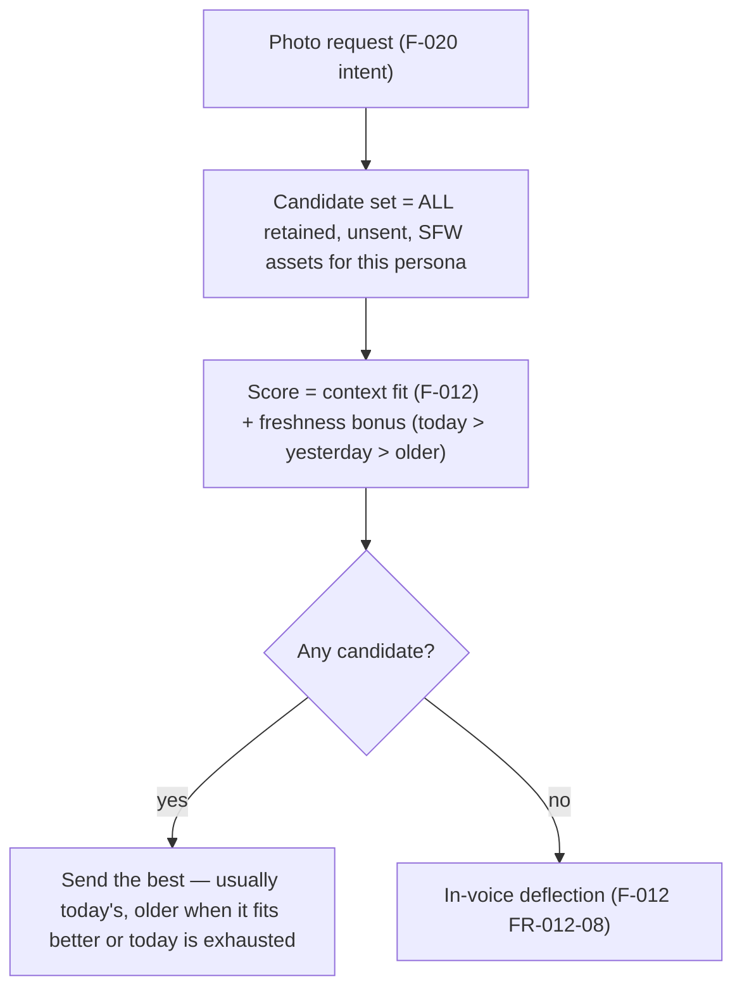
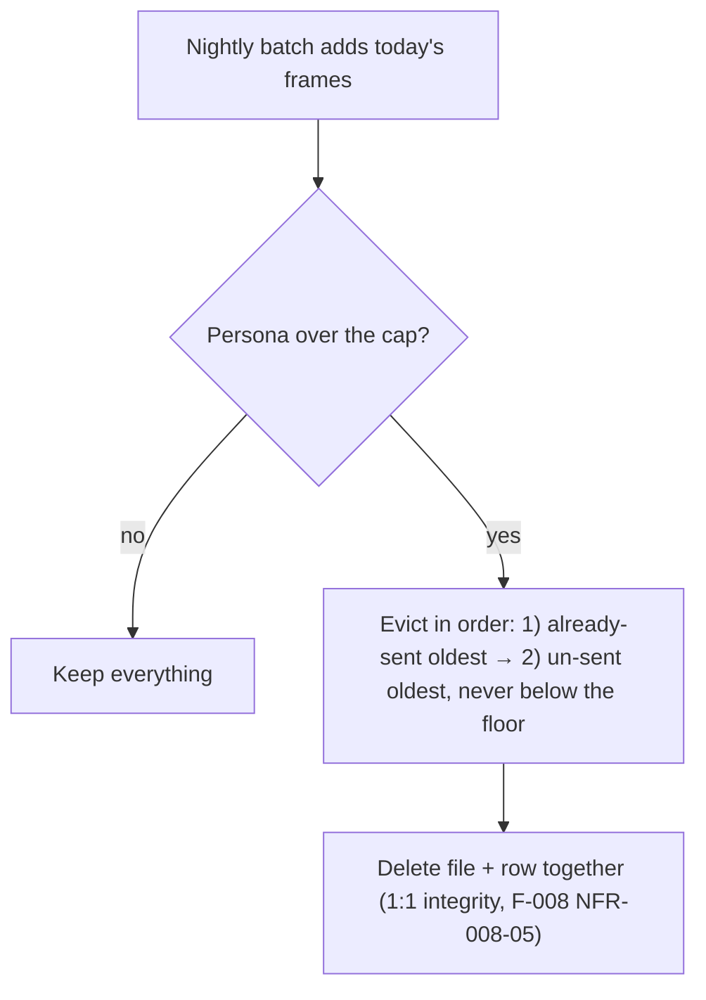

# F-021 — Media Archive Retention & Reuse

- **Status:** Implemented (2026-07-23)
- **Summary:** Turn the photo archive from a **one-day window** into a **living library**. Today the
  nightly batch (F-011) generates a fresh day, delivery (F-012) can only see **one day** —
  `latest_available_assets` returns today's set, or, if today is empty, the most recent prior day —
  and **nothing is ever deleted**. Measured live: Alina has 12 photos across two days and the 6 from
  the earlier day are **already unreachable forever**, because a newer day exists. We pay to store
  variety we never serve, while the user's pool shrinks to one day's worth. F-021 makes **freshness a
  ranking signal instead of a filter** (today's frames rank highest, older ones stay eligible), adds
  a **per-persona cap with an eviction order** that protects un-sent frames, and prepares the archive
  to answer **specific** requests ("покажи, где ты гуляла") by searching the whole retained library.

> **Economics that drive every decision here.** A frame costs **~155 s of GPU** to make and **~1.4 MB**
> to keep. Storage is nearly free (6 shots/day × 10 personas ≈ 8.4 MB/day ≈ 3 GB/year); **generation is
> the expensive resource.** Therefore: never discard a frame the user has not seen — that is a thrown-
> away GPU-hour — and evict on a size cap rather than on age.

> **Scope boundary.** F-021 owns **what stays in the archive and what delivery may draw from**. It does
> **not**:
> - **Generate** anything — F-008 renders, **F-011** plans the day; F-021 only decides lifetime/eligibility;
> - **Own selection scoring** — **F-012** ranks and sends; F-021 widens the candidate set it ranks over
>   and supplies the freshness signal;
> - **Own no-repeat or pacing** — already F-012 (`MediaSend`, per-stage caps);
> - **Own intimacy** — intimate assets follow **F-014**'s gate regardless of age;
> - **Author scene descriptions** — the quality of the metadata that makes old frames findable is
>   **F-010**'s job (see the dependency note below).

> **Dependency worth stating plainly.** Reusing old frames is only as good as their metadata. Today a
> frame carries `background: "home"`, `pose: "high-angle selfie"` — the *generation request*, not a
> description of the rendered image. That is enough to rank by time-of-day/activity, but **not** enough
> to answer "покажи, где ты гуляла". The same gap blocks ISS-006's full fix (she can say *where* she is
> but not *what is behind her*). Richer, human-readable scene descriptions authored at generation time
> (F-010) pay for themselves **twice** — context accuracy *and* archive searchability.

---

## 1. User stories

- **US-021-01** — As a **user**, I want her photos to feel like **her real, growing camera roll**, so
  that **she doesn't run out of pictures after a day and doesn't feel like a 6-photo loop**.
  _Narrative:_ he asks for photos over a week; every one is new to him, and they span her days —
  because nothing she took has been thrown away.

- **US-021-02** — As a **user**, I want today's moments to come **first**, so that **her photos still
  track the day she's actually living**.
  _Narrative:_ at 8pm he gets tonight's evening frame, not a random one from last Tuesday — but if
  tonight's are used up, yesterday's evening frame is far better than nothing.

- **US-021-03** — As the **platform operator**, I want the archive to be **bounded**, so that **disk
  never grows without limit while un-sent GPU work is preserved as long as possible**.

- **US-021-04** — As the **platform operator**, I want eviction to **never delete a frame the user
  hasn't seen** while cheaper candidates exist, so that **we don't throw away paid-for GPU time**.

- **US-021-05** — As a **user**, I want to ask for a **specific kind** of photo and get a fitting one
  from anywhere in her library, so that **"покажи, где ты гуляла" finds the walk, not tonight's sofa**.
  _(Enabled by F-021's widened candidate set; quality depends on the metadata dependency above.)_

---

## 2. User flows

### Selection: freshness ranks, it does not filter


### Retention: cap + eviction order


---

## 3. Use cases (Gherkin)

```gherkin
Feature: F-021 Media Archive Retention & Reuse

  Scenario: UC-021-01 Older frames stay eligible
    Given a persona has frames from today and from earlier days
    When a photo is requested
    Then all retained unsent frames are candidates, not only today's

  Scenario: UC-021-02 Today ranks first
    Given equally fitting frames from today and from three days ago
    When one is selected
    Then today's is chosen

  Scenario: UC-021-03 Better-fitting old frame beats a poorly-fitting new one
    Given tonight's frames are all "at home" and he asks about her walk
    When selection runs
    Then a well-matching older outdoor frame may win over a poorly-matching fresh one

  Scenario: UC-021-04 Today exhausted falls back to older, not to silence
    Given every one of today's frames was already sent to this user
    When he asks again
    Then an unsent older frame is served (subject to pacing), never a repeat and never nothing

  Scenario: UC-021-05 Cap triggers eviction
    Given a persona exceeds her retention cap
    When retention runs
    Then the archive is brought back to the cap

  Scenario: UC-021-06 Eviction prefers already-sent frames
    Given the cap is exceeded and both sent and unsent old frames exist
    When eviction picks victims
    Then already-sent frames go first — un-sent GPU work is preserved

  Scenario: UC-021-07 Eviction never empties the archive
    Given any cap configuration
    When eviction runs
    Then a minimum floor of frames always survives (never an empty archive, F-008 NFR-008-03)

  Scenario: UC-021-08 File and row die together
    Given a frame is evicted
    When it is removed
    Then both the file and its MEDIA_ASSET row are gone — no orphan of either kind

  Scenario: UC-021-09 Intimate assets keep their gate regardless of age
    Given an old intimate frame is the best match
    When it is considered
    Then F-014's gate still governs it exactly as for a fresh one
```

---

## 4. Requirements

### Functional

- **FR-021-01** — **Freshness ranks, it does not filter (CRITICAL).** Delivery's candidate set must be
  **all retained, unsent, eligible assets for the persona**, not a single day.
  `latest_available_assets`' one-day behaviour is replaced; its degrade guarantee (never nothing while
  assets exist) is preserved and strengthened.
- **FR-021-02** — A **freshness bonus** must be added to F-012's context-fit score so that, all else
  equal, **today's frame wins**; the bonus decays with age and is **config-driven** (a large bonus ⇒
  "today only in practice"; a small one ⇒ variety-first).
- **FR-021-03** — A **materially better context fit must be able to beat freshness** (UC-021-03), so
  the day's schedule never forces an obviously wrong photo. The trade-off point is config, not code.
- **FR-021-04** — **Per-persona retention cap** (count-based, config-driven) rather than age-based
  expiry: generation is the expensive resource, storage is not.
- **FR-021-05** — **Eviction order (CRITICAL):** when over the cap, evict **already-sent frames first
  (oldest first)**, and only then **un-sent frames (oldest first)**. An un-sent frame is unconsumed
  GPU work and must outlive a consumed one.
- **FR-021-06** — **Retention floor:** eviction must never take a persona below a configured minimum,
  and must never produce an empty archive (ties F-008 NFR-008-03).
- **FR-021-07** — **Atomic eviction:** the file and its `MEDIA_ASSET` row must be removed together;
  neither an orphan file nor an orphan row may result (ties F-008 NFR-008-05). `MediaSend` history is
  retained for no-repeat accounting even when its asset is gone.
- **FR-021-08** — Retention must run **as a scheduled maintenance step off the reply hot path** (with
  the night batch, F-011), never during a user turn.
- **FR-021-09** — **Intimacy is age-independent:** an old intimate asset is still governed by F-014's
  gate; retention/eligibility must never become a bypass.
- **FR-021-10** — **Per-persona isolation:** eligibility, cap and eviction are computed per persona;
  one persona's archive never affects another's.
- **FR-021-11** — **Specific-request matching (v1 groundwork).** With the widened candidate set,
  delivery must be able to satisfy a *specific* ask by metadata match across the whole retained
  library. Match quality is bounded by metadata quality (see the dependency note); this requirement
  only guarantees that the **whole library is searched**, not that any given phrasing resolves.
- **FR-021-12** — **Observability:** retention runs report kept/evicted counts and the resulting
  archive size per persona (architecture.md §6.4), including any cap left exceeded by D3/D5
  protection and any floor/cap config contradiction (D4).
- **FR-021-13** — **Monotonic asset ids (BLOCKER, D1).** Before any eviction is enabled, `MED-id`
  allocation must be **monotonic per persona** — a retired id is never reissued. Count-based
  allocation is forbidden once deletion exists.
- **FR-021-14** — **Send history outlives its asset (D2).** `MediaSend` must retain the **asset id**
  after the asset is evicted, so per-user no-repeat still excludes it forever. A schema that forces
  the id to null on delete is non-compliant.
- **FR-021-15** — **Context-recency protection (D3).** An asset sent within the F-012 context-recency
  window must never be evicted, so the "what she recently sent" block (F-002 FR-002-25) can never
  lose the photo it describes. This protection **outranks the cap**.

### Resolved design decisions

Raised while writing the mirror test spec and **verified against the code**; fixed here so the tests
are falsifiable and implementation has no open choices. The first three are pre-existing defects that
eviction would *activate* — they must be fixed **before** any deletion ships.

- **D1 — MED-id must become monotonic (BLOCKER, pre-existing defect).** `store.allocate_med_id`
  derives the next id from **`count(*) + 1`** for the persona. That is safe only while nothing is ever
  deleted; the moment eviction removes a row, **ids are reused** — a fresh photo would be born with a
  retired asset's id, and `MediaSend` history would then mark it as "already seen" (or, worse, a user
  could be shown a *new* image the system believes he saw). Fix before enabling eviction: allocate from
  a **monotonic per-persona counter that never goes backwards** (max-suffix-ever or a dedicated
  sequence), so a retired id is never reissued (ties FR-021-07, NFR-021-01).
- **D2 — `MEDIA_SEND.asset_id` FK must not block eviction.** The column is a hard FK to
  `media_assets.id`. FR-021-07 requires the send row to **outlive** its asset (no-repeat accounting
  must survive deletion). Resolution: keep the send row with its **asset id preserved as an immutable
  string**; the referential link becomes `ON DELETE SET NULL` **only if** an id-preserving column is
  added alongside — never null the id we still need. Nulling `asset_id` outright is forbidden: it
  silently breaks NFR-021-01 (the frame becomes re-sendable).
- **D3 — Never evict what her context still needs.** `recent_sends` inner-joins
  `MediaSend ⋈ MediaAsset`; evicting an asset sent an hour ago would silently drop it from her
  conversation context and **reopen ISS-006** (she invents a background for a photo she just sent).
  Resolution: retention must **refuse to evict any asset sent within `context_recency_hours`**
  (F-012 FR-012-15), regardless of the eviction order. Recency protection outranks the cap; if that
  makes the cap unreachable, the cap is exceeded and the run logs it rather than breaking her memory.
- **D4 — Floor outranks cap.** If configuration sets `floor > cap`, the floor wins (never an empty or
  crippled archive, FR-021-06 / NFR-021-05). The contradiction is logged as a config error.
- **D5 — `cap < today's batch`.** Frames younger than a configured grace window are never evicted, so
  a too-small cap cannot delete the batch that was just generated. The cap is then temporarily
  exceeded and reported (FR-021-12) rather than silently discarding fresh GPU work.
- **D6 — "Already sent" means sent to ANY user.** A frame consumed by one user is a weaker eviction
  candidate than one nobody has seen, but it is not protected per-user; per-user no-repeat is
  unaffected because it is tracked in `MediaSend`, not by the asset's presence.
- **D7 — "Materially better fit" (FR-021-03).** Expressed as an **absolute score margin measured in
  the same units as the freshness bonus**: an older frame wins when its context-fit exceeds the
  fresher candidate's by more than the freshness bonus it forfeits. One knob, no second scale.
- **D8 — Retention runs AFTER the night batch** (F-011), so a run never competes with the frames being
  written, and the cap is applied to the archive as it will actually be served.
- **D9 — Freshness decays PROPORTIONALLY, not linearly** (added during implementation). FR-021-02
  promises that a large `freshness_bonus` degenerates to "today only in practice". With a linear
  `max(0, bonus - age*decay)` that is impossible: the gap between two ages is `age*decay` no matter
  how large the bonus is, so the knob would silently do nothing and the documented regime would be
  unreachable. The bonus is therefore `bonus / (1 + age_days * decay)` — strictly non-increasing,
  never negative, and both documented regimes are real (large bonus ⇒ today wins over any fit
  advantage; near-zero ⇒ variety-first; `decay = 0` ⇒ age ignored entirely).
- **D10 — Eviction stages the file, then drops the row, then unlinks** (added during implementation).
  A filesystem is not transactional and the two failure modes pull opposite ways (an undeletable file
  must keep its row; a failed row delete must keep its file). Deleting the row first and rolling back
  on an `OSError` would have rolled back the **whole** run's transaction, undoing evictions that had
  already succeeded. So: `os.replace` the file to `<name>.evicting` (atomic, reversible) → delete the
  row in a SAVEPOINT → unlink. A crash in between leaves a `.evicting` leftover that `reconcile()`
  ignores (it globs `*.png`) and the next run sweeps.
- **D11 — Orphan-row repair is guarded** (added during implementation). Deleting rows whose file is
  missing is right for an interrupted run and catastrophic for an unmounted media root. When *every*
  row is missing its file, nothing is repaired and the anomaly is reported instead.

### Non-functional

- **NFR-021-01** — **No repeats, ever:** widening the pool must not weaken F-012's per-user no-repeat
  guarantee (an evicted asset must not become re-sendable).
- **NFR-021-02** — **Bounded storage:** archive size per persona stays within the cap after a
  retention run.
- **NFR-021-03** — **No un-sent loss while sent frames exist:** provable by the eviction order.
- **NFR-021-04** — **Selection stays cheap:** widening the candidate set must not turn selection into
  a slow query — it remains a bounded, indexed lookup on the reply path (ties F-012 NFR-012-01).
- **NFR-021-05** — **Never an empty archive** after eviction (floor honoured under every config).
- **NFR-021-06** — **Config-driven:** cap, floor, freshness bonus/decay and the run cadence are
  tunable without code changes (architecture.md §4.8).
- **NFR-021-07** — **Integrity:** after any retention run, reconciliation reports zero orphan rows and
  zero orphan files.

---

## 5. Coverage note
Tested in `developer files/tests/F-021-media-archive-retention-and-reuse.md`: widened candidacy,
freshness ranking vs context fit, today-exhausted fallback, cap/floor/eviction order, atomic
file+row removal, no-repeat preservation, per-persona isolation, gate-independence of age, and the
integrity reconciliation are all automatable; "does her camera roll *feel* alive over a week" is a
manual acceptance. 5 US / 9 UC / 12 FR / 7 NFR.
