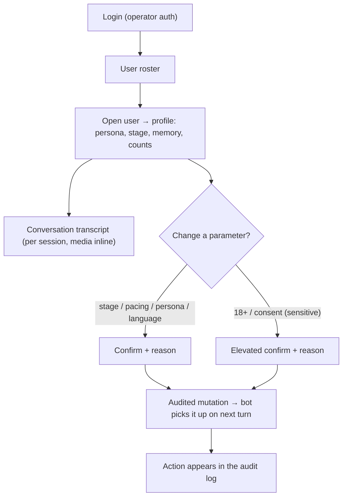
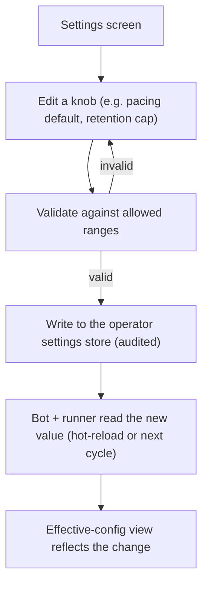

# F-022 — Operator Control Panel (Admin Dashboard)

- **Status:** Draft (specification only — not implemented; scoped for a future build)
- **Owner surface:** a **separate** operator-only web application, distinct from the Telegram bot
  process, reading the same relational store + media library and writing operator actions through an
  audited API. It never runs inside the reply hot path.
- **Summary:** Today every operational lever is a config file, an env var or a raw SQL edit: to see
  what a user is writing you read the SQLite; to lift a user's photo pacing you edit `.env`
  (F-012 FR-012-20 is the first such knob); to change someone's relationship stage or review a gate
  decision there is no surface at all. F-022 gives the operator **one authenticated dashboard** to
  **observe** the running product (users, live conversations, personas, archives, system health,
  metrics) and to **act** on it (per-user overrides, global tuning, persona/archive management,
  safety moderation) — every mutating action **authenticated, authorized and audited**. It is the
  single home for the parameters that F-012/F-014/F-021/F-006 already expose in code.

> **Why this is its own feature, not a bolt-on.** The bot's job is the *conversation*; the panel's
> job is *operating the fleet of conversations*. They have opposite shapes — the bot is a
> latency-critical single-turn loop, the panel is a read-mostly CRUD/analytics surface with a very
> different threat model (it can read intimate chats and flip 18+ status). Mixing them would put an
> admin attack surface on the reply path. They share only the data stores.

> **Adult-product duty of care (drives the whole safety section).** NeuroLady is an adult companion.
> The panel can surface **intimate private conversations** and can set a user's **18+ / consent**
> state. That makes access control, least-privilege, and a tamper-evident audit trail
> **requirements, not niceties** — viewing a private chat or changing an age/consent flag is a
> sensitive action and must be logged with actor, target, timestamp and reason. The panel must never
> be publicly reachable, never impersonate a user to a third party, and never be a route around the
> F-014 safety gate.

---

## 1. User stories

### Operator / admin (primary segment)
- **US-022-01** — As an **operator**, I want a **roster of all users** — id, first seen, last active,
  current persona, bond stage, message/photo counts — so I can see the health of the whole base at a
  glance and drill into anyone.
- **US-022-02** — As an **operator**, I want to **open a user and read their conversation** with a
  persona (per session, chronological, with the media she sent inline), so I can understand what
  people actually write and how the girl responds — the exact thing that is invisible today.
- **US-022-03** — As an **operator**, I want to **change a user's parameters** — relationship stage,
  photo pacing on/off + caps, intimacy opt-in / 18+ verification, assigned persona, language — so I
  can fix a stuck state or tune an individual experience without editing the DB by hand.
- **US-022-04** — As an **operator**, I want a **global settings** surface — pacing defaults,
  retention cap/floor/grace, freshness knobs, generation window, active models — so the parameters
  scattered across env/config are edited in one place and applied without a redeploy.
- **US-022-05** — As an **operator**, I want a **persona management** view — each persona's archive
  size, retention status, reference anchors, comm/voice settings, and a button to trigger or inspect
  a generation batch — so I can curate the girls and their photo libraries.
- **US-022-06** — As an **operator**, I want to **curate an archive** — preview frames, delete a bad
  or off-model one — so a broken frame never reaches a user, with the F-021 integrity guarantees
  preserved (file + row removed together).
- **US-022-07** — As an **operator**, I want **system health at a glance** — chat model up/down, image
  runner day/night state and queue depth, DB, Qdrant, GPU handoff, last night's retention report — so
  I know the machine is healthy before users complain.
- **US-022-08** — As an **operator**, I want **product metrics** — active users, messages/day,
  photos delivered vs deflected, F-020 intent hit rates, F-014 gate decisions — so I can see whether
  the product is working, not just running.

### Safety / moderation
- **US-022-09** — As a **safety reviewer**, I want to **review F-014 gate decisions and flagged
  content** (allow/withhold/block with reason and category), so refusals and escalations are
  auditable and I can spot abuse or a misfiring gate.
- **US-022-10** — As a **safety reviewer**, I want to **verify or revoke a user's 18+/consent state**
  with a recorded reason, so adult content is only ever unlocked for a verified adult and every
  change is on the record.

### Read-only stakeholder
- **US-022-11** — As a **read-only viewer** (e.g. a stakeholder), I want to see **metrics and
  redacted health** without any ability to open private chats or change anything, so oversight
  doesn't require god-mode.

---

## 2. User flows

### Observe → act on a single user


### Global config change (no redeploy)


---

## 3. Use cases (Gherkin)

```gherkin
Feature: F-022 Operator Control Panel

  Scenario: UC-022-01 See the whole user base
    Given operator is authenticated
    When they open the roster
    Then every user is listed with persona, stage, last-active and counts, paged and searchable

  Scenario: UC-022-02 Read a user's conversation
    Given a user with an active session
    When the operator opens that session
    Then the messages render chronologically with any sent photos inline
    And opening a private conversation is written to the audit log

  Scenario: UC-022-03 Change a user's relationship stage
    Given a user at stage "Acquaintance"
    When the operator sets the stage to "Friend" with a reason
    Then the change persists, the bot uses it on the next turn, and the audit log records actor/target/old/new/reason

  Scenario: UC-022-04 Lift a user's photo pacing
    Given a user currently paced
    When the operator disables pacing for that user
    Then the next photo request delivers (F-012 FR-012-20 semantics) and the override is audited

  Scenario: UC-022-05 Change a global default without redeploy
    Given the retention cap is 60
    When the operator sets it to 40 within the allowed range
    Then the next retention run uses 40 and the effective-config view shows 40

  Scenario: UC-022-06 Reject an out-of-range setting
    Given the operator enters a negative cap
    When they save
    Then the change is rejected with a validation message and nothing is applied

  Scenario: UC-022-07 Delete a bad archive frame
    Given an off-model frame in a persona's archive
    When the operator deletes it
    Then its file and MEDIA_ASSET row are removed together (F-021 FR-021-07) and reconcile stays clean

  Scenario: UC-022-08 Sensitive change requires elevation + reason
    Given a user's 18+ state is unverified
    When the operator sets it to verified
    Then an elevated confirmation and a mandatory reason are required, and the action is audited as sensitive

  Scenario: UC-022-09 Read-only viewer cannot open chats or mutate
    Given a viewer-role account
    When they attempt to open a private conversation or change a setting
    Then both are forbidden and the attempt is logged

  Scenario: UC-022-10 Panel outage never affects the bot
    Given the control panel process is down
    When users chat with the bot
    Then the bot serves normally — the panel is not on the reply path
```

---

## 4. Requirements

### Functional — Observe

- **FR-022-01** — **User roster.** List all users with id, first-seen, last-active, assigned/active
  persona, bond stage, and message/photo counts; paged, sortable and searchable. Read-only projection
  over USER/SESSION/RELATIONSHIP/MEDIA_SEND.
- **FR-022-02** — **User profile.** For one user: personas interacted with, current stage per persona,
  memory facts (F-004), recent media sent with scene metadata (F-012 FR-012-14), pacing state, 18+/
  consent state.
- **FR-022-03** — **Conversation transcript.** Render a session's MESSAGE history chronologically,
  with sent photos shown inline, paged for long histories. Opening a transcript is a **sensitive read**
  (FR-022-20).
- **FR-022-04** — **Persona overview.** Per persona: archive size, last retention report
  (kept/evicted/cap-exceeded — F-021 FR-021-12), reference anchors, comm/voice settings (F-003),
  generation-queue depth.
- **FR-022-05** — **System health.** Live status of the chat model (F-002 runner), the image runner
  window + queue (F-008), DB, Qdrant, and the GPU day/night handoff; surfaced without touching the
  reply path.
- **FR-022-06** — **Product metrics.** Active users, messages/day, photos delivered vs deflected vs
  paced, F-020 intent outcomes, F-014 gate decisions, over selectable time ranges.
- **FR-022-07** — **Effective config.** Show the currently-effective value of every operator-tunable
  parameter and where it came from (product default vs global override vs per-user override).

### Functional — Act (all audited, FR-022-19)

- **FR-022-08** — **Per-user overrides.** Set relationship stage, photo pacing on/off + caps,
  assigned persona, and language for a single user; the bot applies them on the next turn.
- **FR-022-09** — **Global settings.** Edit product-wide knobs — pacing defaults (F-012 FR-012-20),
  retention cap/floor/grace/freshness (F-021 NFR-021-06), generation window (F-008), active model
  selection — validated against allowed ranges, applied **without a redeploy** (hot-reload or
  next-cycle pickup), never a value that means "delete everything" or "disable safety".
- **FR-022-10** — **Persona management.** Edit a persona's comm/voice settings and card; trigger or
  inspect a generation batch (F-011); manage reference anchors (F-009).
- **FR-022-11** — **Archive curation.** Preview and delete individual frames, reusing F-021's atomic
  file+row eviction and integrity reconciliation (FR-021-07 / NFR-021-07) — the panel is not a second,
  unsafe deletion path.
- **FR-022-12** — **Safety moderation.** Review F-014 gate decisions and flagged content; the panel
  can tighten but must **never loosen the hard safety floor** (F-014) — it is not a gate bypass.
- **FR-022-13** — **Consent / 18+ administration.** Verify or revoke a user's adult-content eligibility
  as an **elevated, reason-mandatory, audited** action; adult content stays gated on this state.
- **FR-022-14** — **Operational actions.** Trigger a retention run, requeue a stuck generation job,
  or (re)provision a persona's gallery/anchors — each idempotent and audited.

### Functional — Access & audit (cross-cutting, CRITICAL)

- **FR-022-15** — **Authentication.** The panel requires strong operator authentication; it is
  **never anonymously reachable** and never exposed on the public internet without an auth proxy.
- **FR-022-16** — **Role-based authorization.** At least `viewer` (metrics + redacted health, no chat
  reads, no mutations), `operator` (observe + act), `admin` (+ user management, + sensitive/consent
  actions). Every endpoint enforces least privilege server-side, not just in the UI.
- **FR-022-17** — **Separate process / no hot-path coupling.** The panel is a distinct service; a
  panel outage or load spike must have **zero** effect on the Telegram bot (UC-022-10).
- **FR-022-18** — **Safe config application.** A changed global setting is validated and applied
  atomically; a malformed or out-of-range value is rejected and the previous value stands — the bot
  never reads a half-written or destructive config (ties every feature's "broken config degrades to
  defaults" rule).
- **FR-022-19** — **Audit every mutation.** Every state-changing action records actor, role, target,
  before/after, timestamp and (for sensitive actions) a reason, in an append-only, tamper-evident log.
- **FR-022-20** — **Sensitive-read logging.** Opening a private conversation or viewing a user's
  intimate media is itself logged (actor, target, timestamp) — reads of private content are not free.
- **FR-022-21** — **No impersonation.** The panel can trigger a persona action (e.g. provision a
  photo) but must never send a message **as the user** to a third party, and never fabricate a record
  presented as genuine.

### Non-functional

- **NFR-022-01** — **Isolation:** panel and bot share only the data stores; no shared process, no
  shared event loop, no admin code imported into the reply path (FR-022-17).
- **NFR-022-02** — **Read-mostly performance:** roster/transcript/metrics queries are paged and
  index-backed; a big user base never turns a panel query into a full scan, and never locks the bot's
  writes (WAL read path).
- **NFR-022-03** — **Security:** transport encryption, CSRF/session protection, secrets only in
  env/secret store, rate-limited auth, no reflected user content executed as markup.
- **NFR-022-04** — **Privacy & data protection:** private/intimate content is access-controlled and
  audited; the panel supports data-subject actions (export/delete a user) consistent with the
  product's legal obligations; PII is minimized in metrics/aggregate views.
- **NFR-022-05** — **Auditability:** the audit + sensitive-read logs are append-only, queryable, and
  retained per policy; they cannot be edited from within the panel.
- **NFR-022-06** — **Config-safety:** no operator input can set a value that empties an archive,
  disables the F-014 hard floor, or breaks the silence invariant; ranges are enforced server-side.
- **NFR-022-07** — **Availability independence:** the panel can be down for maintenance with no user
  impact; conversely bot maintenance doesn't require the panel.
- **NFR-022-08** — **Localization-neutral operator UI:** operator UI language is independent of the
  personas' languages; transcripts render each message in whatever language it was written.

### Resolved design decisions (to fix before build)

- **D1 — Config store.** Per-user and global overrides live in a dedicated store the bot reads
  (a `settings`/`overrides` table + a reload signal), *not* in `.env` — env stays for secrets and
  boot config. FR-012-20's env switch is the migration seed: the panel supersedes it with a stored,
  per-user-capable override.
- **D2 — Hot reload vs next-cycle.** Per-turn knobs (pacing, stage) take effect on the next turn by
  reading the store; batch knobs (retention, window) take effect on the next cycle. No process
  restart is required (FR-022-09).
- **D3 — Tech shape.** A separate service under `services/admin/` (or a standalone app): a
  read-mostly API over the same DB + media root, plus a thin web UI. Framework choice is open; the
  contract (audited API, RBAC, isolation) is fixed here.
- **D4 — Transcript source of truth.** Transcripts render from MESSAGE rows; the panel never
  re-queries the chat model to "reconstruct" a conversation.
- **D5 — Deletion safety.** Archive curation calls the **existing** F-021 eviction path; it must not
  introduce a second deletion routine, so integrity guarantees are inherited, not re-implemented.

---

## 5. Coverage note
Tested in `developer files/tests/F-022-operator-control-panel.md` (to be written at build time):
RBAC enforcement (each role × each endpoint), audited-mutation completeness, sensitive-read logging,
config validation/range rejection, per-user + global override application by the bot, archive
deletion via the F-021 path with clean reconciliation, and panel/bot isolation (bot serves while the
panel is down). Genuinely human/manual: the UI/UX quality and the operator workflow ergonomics.
Roughly 11 US / 10 UC / 21 FR / 8 NFR — a large, coarse-grained feature; test volume will be
proportionally large and should be split across sub-areas (observe / act / access-audit) when built.
