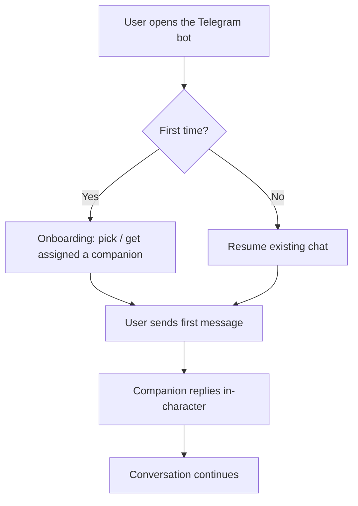
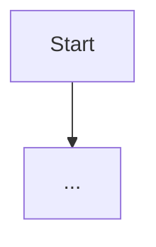
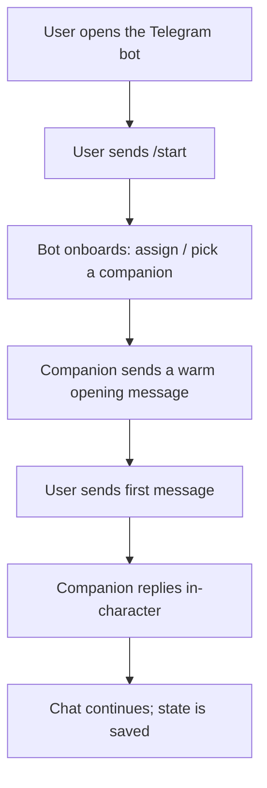
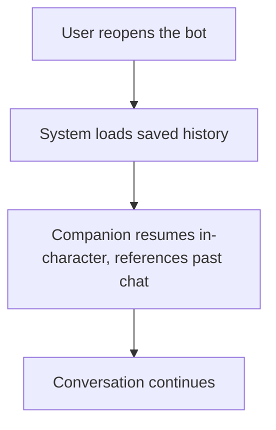

# How to Describe Features — Guide

This folder (`developer files/features/`) holds one Markdown file per product feature. Every
feature file must follow the structure defined in this guide, so that features are consistent,
reviewable, and — importantly — **traceable to tests**. Each requirement gets a unique ID, and
later every requirement will have one or more tests (in the repo's `tests/` folder) that verify it.

Read this guide before writing a new feature file. A copy-paste template and a full worked
example are at the bottom.

---

## 1. Where features live & how files are named

- One feature = one `.md` file in `developer files/features/`.
- File name: `F-<NNN>-<short-slug>.md`, e.g. `F-001-onboarding.md`, `F-002-request-photo.md`.
- `<NNN>` is a zero-padded, ever-increasing feature number (`001`, `002`, …). Never reuse a
  number, even if a feature is removed.
- Everything is written in **English** (project rule).

---

## 2. ID scheme (traceability)

Every artifact inside a feature file has an ID that starts from the feature number, so any test
can point back to exactly what it verifies.

| Artifact | ID pattern | Example |
|----------|-----------|---------|
| Feature | `F-<NNN>` | `F-001` |
| User story | `US-<NNN>-<nn>` | `US-001-01` |
| Use case (scenario) | `UC-<NNN>-<nn>` | `UC-001-03` |
| Functional requirement | `FR-<NNN>-<nn>` | `FR-001-02` |
| Non-functional requirement | `NFR-<NNN>-<nn>` | `NFR-001-01` |

Rules:
- `<nn>` is a two-digit sequence, unique **within its own type inside that feature**.
- IDs are **immutable** once written and referenced. If a requirement is dropped, mark it
  `DEPRECATED` — do not renumber the others and do not reuse the ID.
- Tests reference these IDs (e.g. a test named/annotated `FR-001-02`), which is how we later
  map coverage.

---

## 3. Required structure of a feature file

Each feature file has these sections, in this order:

### 3.0 — Header / metadata
A short block at the top:
- **Feature ID & title**
- **Status**: `Draft` → `Approved` → `In progress` → `Done`
- **One-line summary** of what the feature is.

### 3.1 — User stories
Describe *what* the user wants and *why*, per user category (from `../Audience.md`). A feature
usually has several — write them **per user category**.

Format (classic user story + the concrete "came here / clicked here / got this" narrative):

> **US-<NNN>-<nn>** — As a **[user category]**, I want **[goal]** so that **[benefit]**.
> _Narrative:_ he opens [where], taps/sends [what], and gets [result].

Keep each story small and about one need. If a story is doing too much, split it.

### 3.2 — User flows (diagrams)
For each relevant user category, a diagram of the **user's journey** — the steps the user takes:
enters the app, goes here, sends this, receives that, etc. Prefer a **Mermaid flowchart** (it
renders on GitHub). Write one flow per user where their paths differ.



Focus the diagram on **what the user does and sees**, not internal system architecture.

### 3.3 — Use cases (BDD / Gherkin)
A feature's stories and flows are decomposed into **use cases**, written in **Gherkin** (the
Behavior-Driven Development format). Each scenario describes what happens in the system when the
user wants something, using `Given` / `When` / `Then` and the operators `And` / `But`.

- `Given` — the starting context / preconditions.
- `When` — the action/event the user performs.
- `Then` — the expected, observable outcome.
- `And` / `But` — chain extra steps onto any of the above.
- Use `Scenario Outline` + `Examples` for the same scenario across multiple inputs.

Each scenario is a **use case** and gets a `UC-<NNN>-<nn>` ID (put it in the scenario title).

```gherkin
Feature: F-001 Onboarding

  Scenario: UC-001-01 First-time user starts a conversation
    Given a new user has opened the Telegram bot for the first time
    When the user sends the /start command
    Then the bot assigns or lets the user pick a companion
    And the companion sends a warm, in-character opening message

  Scenario Outline: UC-001-02 User sends their first message
    Given a user has completed onboarding
    When the user sends "<message>"
    Then the companion replies in-character within an acceptable time
    And the reply references the message content

    Examples:
      | message        |
      | hi             |
      | how are you?   |
      | what's your name? |
```

### 3.4 — Requirements (functional & non-functional)
Every use case is backed by concrete requirements. Split them into two lists, each with IDs.

**Functional requirements (`FR-<NNN>-<nn>`)** — *what the system must let the user do / must do*.
- Example: _FR-001-01 — The user must be able to start the bot with the `/start` command and
  receive an opening message from the companion._

**Non-functional requirements (`NFR-<NNN>-<nn>`)** — *quality constraints: performance, security,
reliability, usability, etc.* — must be crisp and checkable.
- Example: _NFR-001-01 — The companion's first reply must be delivered in under 3 seconds._

Write requirements so each one is **atomic** (one testable statement) and **verifiable** (a test
could pass/fail on it). Link each requirement mentally to the use case(s) it supports.

---

## 4. Tips for good Gherkin
- One behavior per scenario; if a scenario has many `When`s, it's probably two scenarios.
- Write from the **user's** point of view and in terms of observable outcomes, not
  implementation details.
- Keep steps declarative ("the companion replies in-character"), not UI-mechanical ("the JSON
  field `reply` is non-null") — save that precision for the requirements/tests.
- Reuse consistent phrasing for the same precondition across scenarios.

## 5. Tips for good requirements
- **Functional** = a capability/behavior ("the user must be able to …", "the system must …").
- **Non-functional** = a measurable quality constraint ("under 3 seconds", "available 24/7",
  "only valid credentials are accepted").
- Each requirement is atomic, unambiguous, and testable, and has a stable ID.
- Avoid vague words ("fast", "nice") — state the checkable condition.

---

## 6. Copy-paste template

> The template is wrapped in `~~~` fences below only so the inner ` ``` ` code blocks display
> correctly. When you copy it into a new feature file, the inner blocks use normal triple
> backticks as shown.

~~~markdown
# F-<NNN> — <Feature title>

- **Status:** Draft
- **Summary:** <one line on what this feature is>

## 1. User stories
- **US-<NNN>-01** — As a **[user category]**, I want **[goal]** so that **[benefit]**.
  _Narrative:_ <opens where, does what, gets what>.
- **US-<NNN>-02** — As a **[user category]**, I want …

## 2. User flows
### [User category A]


## 3. Use cases (Gherkin)
```gherkin
Feature: F-<NNN> <Feature title>

  Scenario: UC-<NNN>-01 <short title>
    Given ...
    When ...
    Then ...
    And ...
```

## 4. Requirements
### Functional
- **FR-<NNN>-01** — <capability the system must provide>.
- **FR-<NNN>-02** — ...

### Non-functional
- **NFR-<NNN>-01** — <measurable quality constraint>.
- **NFR-<NNN>-02** — ...
~~~

---

## 7. Full worked example

Below is a complete, minimal feature file showing every section filled in. (Feature number
`F-000` is reserved as this example and should not be used for a real feature.)

---

# F-000 — Onboarding: first contact with the companion

- **Status:** Draft
- **Summary:** A new user opens the Telegram bot, is onboarded to a companion, and exchanges a
  first message that already feels human and in-character.

## 1. User stories
- **US-000-01** — As a **Gen-Z first-time user**, I want to **start chatting with almost no
  setup** so that **I get to the fun part immediately**.
  _Narrative:_ he opens the bot in Telegram, taps `/start`, and within seconds a girl with an
  actual personality is already messaging him back.
- **US-000-02** — As a **lonely user**, I want the **companion to greet me warmly and remember
  me next time** so that **it feels like a real relationship, not a fresh bot each visit**.
  _Narrative:_ he starts the bot, gets a warm hello, and when he returns tomorrow she picks up
  where they left off.

## 2. User flows
### First-time user


### Returning user


## 3. Use cases (Gherkin)
```gherkin
Feature: F-000 Onboarding

  Scenario: UC-000-01 First-time user starts the bot
    Given a user has never used the bot before
    When the user sends the /start command
    Then the system assigns or lets the user pick a companion
    And the companion sends a warm, in-character opening message

  Scenario: UC-000-02 First message exchange
    Given a user has just completed onboarding
    When the user sends a first message
    Then the companion replies in-character
    And the reply is relevant to what the user said

  Scenario: UC-000-03 Returning user resumes
    Given a user has chatted before and returns later
    When the user reopens the bot and sends a message
    Then the companion resumes in-character
    And the companion can reference details from the earlier conversation
```

## 4. Requirements
### Functional
- **FR-000-01** — The user must be able to start the bot with `/start` and receive an opening
  message from a companion.
- **FR-000-02** — The system must assign a companion (or let the user choose one) during
  onboarding.
- **FR-000-03** — The companion must reply to the user's messages in-character.
- **FR-000-04** — The system must persist conversation history so a returning user's chat
  resumes with continuity.

### Non-functional
- **NFR-000-01** — The opening message after `/start` must be delivered in under 3 seconds.
- **NFR-000-02** — Conversation history must be retained and retrievable across sessions
  indefinitely (until the user deletes it).
- **NFR-000-03** — Onboarding must require no configuration steps beyond `/start` for the user.

---

## 8. Checklist before marking a feature file done
- [ ] Header (ID, title, status, summary) present.
- [ ] User stories per relevant user category, each with an ID and a narrative.
- [ ] A user-flow diagram per user whose path differs.
- [ ] Use cases in Gherkin, each scenario carrying a `UC-` ID.
- [ ] Functional requirements listed, each with an `FR-` ID.
- [ ] Non-functional requirements listed, each with an `NFR-` ID, all crisp and testable.
- [ ] Every ID is unique and will not be reused.
